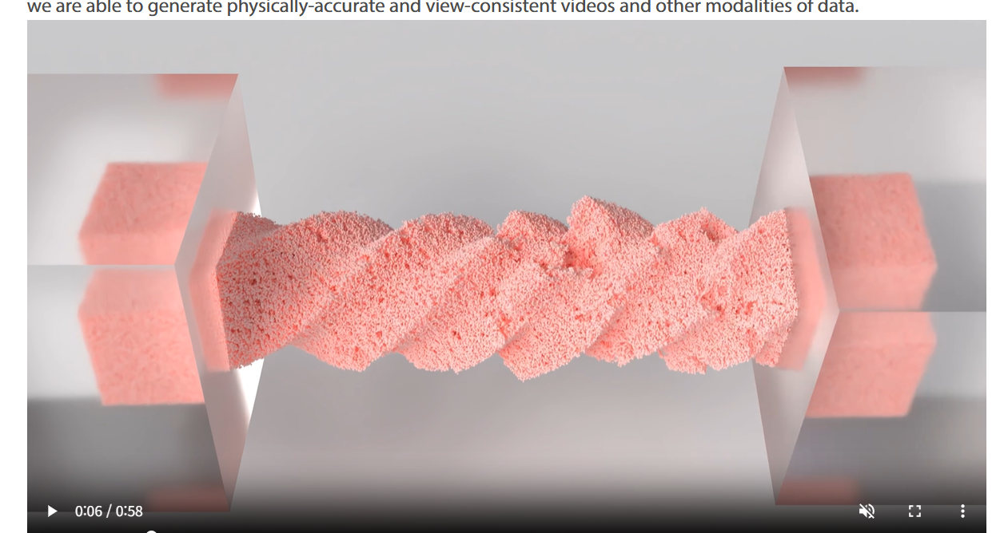

# 0918 면담 요약
### 피드백
```
sandwheel particle 간에 interaction 을 계산하는지 확인

material에 elastic파괴 등 예제

grid_density 이 뭘 의미하는지 0918genesis.md 보강

필요한 부분만 영상 캡쳐
```

----
## ✅Todo-list
```
1. sandwheel particle interaction/calculate 확인

2. elastic destruction 예제 실행 / 분석

3. 0918genesis 피드백 보강


```

## Sandwheel_particle 간 상호작용 확인
```

emitter = scene.add_emitter(
    material=gs.materials.MPM.Sand(),
    max_particles=200000,
    surface=gs.surfaces.Rough(color=(1.0, 0.9, 0.6, 1.0)),
)

```

여기 gs.materials.MPM.Sand() 부분이 MPM 솔버를 사용한 sand 구현인데

### 입자간 상호작용 
* sand particle 각각 질량/속도/변형상태를 가지는 객체임
* sand particle은 MPM 솔버로 계산되는데 particle + grid 방식으로 구현됨
  * 입자 각각의 힘 + 이걸 묶어서 격자로(임시 계산판)계산 
  * step 이 끝나면 particle 객체로 return

### grid(임시계산판) 이란?
* 모래 알갱이(particle)들이 물리량을 주변 격자점에 분산함
* 그래서 각 grid node에는 “주변 입자들의 평균된 물리량”이 저장
* particle 20만개 1:1 계산이 아닌 grid 별 계산 후 각 particle에 return 
MPM 솔버의 계산 방식


## 그럼 이 상호작용 연산 때문에 느려질 수 있는가?
YES  


1. 입자 : 입자가 많을수록 → 각 step마다 P2G(particle to grid), G2P(grid to particle) 연산이 많아짐

2. Grid 해상도 (Grid Density) : 주어진 공간을 몇개의 grid로 쪼개냐  
    * grid_node마다 힘/속도 계산이 필요하기 때문에 메모리와 연산이 크게 늘어남.

3. dt(step) / substep(step을 또 나눠서 수치 안정성 확보)
    * dt(step)과 substeps가 작으면, 실제 1초를 시뮬레이션하기 위해 더 많은 step을 계산해야 합니다.

4. Constitutive model (재료 물리 모델)
    * sand 모델은 무거운 모델: elastic 보다 응력 등 계산 할 물리량이 많음


## Elastic Wheel 실행


tests/test_deformable_physics.py 이거 하라고 하네

test_deformable_parallel 함수


python -m pytest tests/test_deformable_physics.py::test_deformable_parallel -s --show-viewer 실행 코드


----
1. FEM Elastic 재료 예제
기본 FEM 탄성 변형 시뮬레이션: test_deformable_physics.py:180-191

python -m pytest tests/test_deformable_physics.py::test_deformable_parallel -s --show-viewer
이 예제는 gs.materials.FEM.Elastic를 사용하여 stable_neohookean 모델로 큰 변형을 시뮬레이션합니다. test_deformable_physics.py:185-190

FEM 다중 엔티티 변형 예제: test_fem.py:77-92

python -m pytest tests/test_fem.py::test_multiple_fem_entities -s --show-viewer
2. MPM Elastic 재료 예제
MPM 탄성 큐브 시뮬레이션: test_deformable_physics.py:169-177

python -m pytest tests/test_deformable_physics.py::test_deformable_parallel -s --show-viewer
MPM Elasto-Plastic 재료 (찢어짐 효과): elasto_plastic.py:42-61

이 재료는 von Mises 항복 기준을 사용하여 재료가 항복점을 넘으면 소성 변형이 일어나며 찢어지는 효과를 구현합니다. elasto_plastic.py:66-81

3. 근육 재료 변형 예제
FEM/MPM 근육 재료 웜 시뮬레이션: test_deformable_physics.py:48-66

python -m pytest tests/test_deformable_physics.py::test_muscle -s --show-viewer
이 예제는 근육 수축으로 인한 복잡한 변형을 보여줍니다. test_deformable_physics.py:93-104

4. 하이브리드 시뮬레이션
강체-소프트바디 결합 시뮬레이션: test_hybrid.py:51-63

python -m pytest tests/test_hybrid.py::test_rigid_mpm_muscle -s --show-