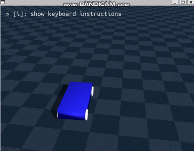

# 0925 면담 요약
### 피드백
```

항상 메모리 생각할 것 -> 계산해서 이게 내 환경에서 돌릴 수 있냐


지금은 URDF 기반으로 Genesis 세계에서 자동차 모델을 간단히 만들고 굴리는 것부터 시작.
Unreal Engine은 나중 단계에서 사용 예정.


10월 중:
Genesis에서 자동차 URDF 생성 및 시뮬레이션
언리얼 엔진 기반 데이터 획득 시뮬레이션까지 연결
이후: 데이터 매핑을 통해 구동계 튜닝, 더 정밀한 자동차 모델링
```

----
## ✅Todo-list
```
자동차 URDF 구현
```
----
## URDF 차체+바퀴+Joint


### URDF 파일 코드
```
<?xml version="1.0" ?>
<robot name="genesis_simple_car"> #이름 정의

  <!-- 차체 -->
  <link name="base_link"> #차체
    <visual> #랜더링용
      <origin xyz="0 0 0.1" rpy="0 0 0"/>
      <geometry>
        <box size="1.0 0.5 0.2"/> # 직육면체 사이즈
      </geometry>
      <material name="blue">
        <color rgba="0 0 1 1"/>
      </material>
    </visual>
    <collision> #히트박스
      <origin xyz="0 0 0.1" rpy="0 0 0"/>
      <geometry>
        <box size="1.0 0.5 0.2"/> #직육면체 사이즈랑 동일 히트박스
      </geometry>
    </collision>
    <inertial> #질량과 관성
      <mass value="10.0"/> #질량 10kg
      <inertia ixx="1" iyy="1" izz="1" ixy="0" ixz="0" iyz="0"/>
      # 
    </inertial>
  </link>


  <!-- 바퀴 (앞왼쪽) -->
  <link name="wheel_fl"> #front-left
    <visual>
      <origin xyz="0 0 0" rpy="1.5708 0 0"/> 
      #rpy: 라디안, 1.5708 = 90도 -> 90도 회전시켜 세워놓음
      <geometry>
        <cylinder length="0.05" radius="0.1"/> 
        # 반지름 0.1m, 두께 0.05m
      </geometry>
      <material name="black"/>
    </visual>

    <collision> #히트박스
      <origin xyz="0 0 0" rpy="1.5708 0 0"/>
      <geometry>
        <cylinder length="0.05" radius="0.1"/> #바퀴와 동일
      </geometry>
    </collision>

    <inertial>
      <mass value="1.0"/> # 무게 1kg
      <inertia ixx="0.01" iyy="0.01" izz="0.01" ixy="0" ixz="0" iyz="0"/>
      # 관성 모멘트
    </inertial>
  </link>


  <!-- 바퀴 (앞오른쪽) -->
  <link name="wheel_fr"> #front-left
    <visual>
      <origin xyz="0 0 0" rpy="1.5708 0 0"/>
      <geometry>
        <cylinder length="0.05" radius="0.1"/>
      </geometry>
      <material name="black"/>
    </visual>

    <collision>
      <origin xyz="0 0 0" rpy="1.5708 0 0"/>
      <geometry>
        <cylinder length="0.05" radius="0.1"/>
      </geometry>
    </collision>

    <inertial>
      <mass value="1.0"/>
      <inertia ixx="0.01" iyy="0.01" izz="0.01" ixy="0" ixz="0" iyz="0"/>
    </inertial>
  </link>


  <!-- 바퀴 (뒤왼쪽) -->
  <link name="wheel_rl">
    <visual>
      <origin xyz="0 0 0" rpy="1.5708 0 0"/>
      <geometry>
        <cylinder length="0.05" radius="0.1"/>
      </geometry>
      <material name="black"/>
    </visual>

    <collision>
      <origin xyz="0 0 0" rpy="1.5708 0 0"/>
      <geometry>
        <cylinder length="0.05" radius="0.1"/>
      </geometry>
    </collision>

    <inertial>
      <mass value="1.0"/>
      <inertia ixx="0.01" iyy="0.01" izz="0.01" ixy="0" ixz="0" iyz="0"/>
    </inertial>
  </link>


  <!-- 바퀴 (뒤오른쪽) -->
  <link name="wheel_rr">
    <visual>
      <origin xyz="0 0 0" rpy="1.5708 0 0"/>
      <geometry>
        <cylinder length="0.05" radius="0.1"/>
      </geometry>
      <material name="black"/>
    </visual>
    <collision>
      <origin xyz="0 0 0" rpy="1.5708 0 0"/>
      <geometry>
        <cylinder length="0.05" radius="0.1"/>
      </geometry>
    </collision>
    <inertial>
      <mass value="1.0"/>
      <inertia ixx="0.01" iyy="0.01" izz="0.01" ixy="0" ixz="0" iyz="0"/>
    </inertial>
  </link>

  <!-- 조인트들 -->
  <joint name="joint_wheel_fl" type="continuous">
    <parent link="base_link"/>
    <child link="wheel_fl"/>
    <origin xyz="0.4 0.25 0.05" rpy="0 0 0"/>
    <axis xyz="0 1 0"/>
  </joint>

  <joint name="joint_wheel_fr" type="continuous">
    <parent link="base_link"/>
    <child link="wheel_fr"/>
    <origin xyz="0.4 -0.25 0.05" rpy="0 0 0"/>
    <axis xyz="0 1 0"/>
  </joint>

  <joint name="joint_wheel_rl" type="continuous">
    <parent link="base_link"/>
    <child link="wheel_rl"/>
    <origin xyz="-0.4 0.25 0.05" rpy="0 0 0"/>
    <axis xyz="0 1 0"/>
  </joint>

  <joint name="joint_wheel_rr" type="continuous">
    <parent link="base_link"/>
    <child link="wheel_rr"/>
    <origin xyz="-0.4 -0.25 0.05" rpy="0 0 0"/>
    <axis xyz="0 1 0"/>
  </joint>

</robot>

```
## 중요 특징 요약
  
urdf 이름: genesis_simple_car
```
<?xml version="1.0" ?>
<robot name="genesis_simple_car">
```
---
차체
```
<link name="base_link"> ... </link>
```
* 몸통 부분
    * visual : 렌더링용(skin 느낌)
    * collision : 충돌 하는 부분(히트박스)
    * inertial : 질량과 관성(무게중심, 회전 특성)
    ```
    <geometry>
    <box size="1.0 0.5 0.2"/>
    </geometry>
    ```
    * 가로 1m, 세로 0.5m, 높이 0.2m  
    ```
    <mass value="10.0"/>
    ```
    * 질량 10kg
    ```
    <inertia ixx="1" iyy="1" izz="1"/>
    ```
    * 관성 모멘트 값(회전할때 얼마나 버티는가?)
        * ixx(inertia를 xx에 대해 미분한 것)
        * iyy(inertia를 yy에 대해 미분한 것)
        * izz(inertia를 zz에 대해 미분한 것)
        ### 이게 왜 필요한가?
        * 직선 주행시 z축 기준으로 회전만 해서 izz만 필요함
        * 하지만 커브 길을 돌때 z축 뿐만 아닌 여러축 회전이 동시에 걸림
            * Yaw : 굴러가는 기준 회전, 위 아래 방향(izz)
            * Roll : 커브 시 원심력 때문에 좌우 바퀴 서스펜션이 눌리며 차체가 옆으로 기울어짐(ixx)
            * pitch : 가속/감속 시 앞 뒤로 들썩거림(iyy)

        ### inertia 이해하기
        ```
        <inertia ixx="5" iyy="5" izz="5"/> 라고 하면
        ```
        
        * τ=I⋅α
        * 토크 = inertia(관성 hessian 행렬) * 각속도 벡터(alpha: angular acceleration)
        * 각속도 = radian / S^2 (초마다 radian &rarr; 속도 라디안으로 정의되어 있음)
 ---
* 바퀴
    ```
    <link name="wheel_fl"> ... </link>   <!-- 앞왼쪽 -->
    <link name="wheel_fr"> ... </link>   <!-- 앞오른쪽 -->
    <link name="wheel_rl"> ... </link>   <!-- 뒤왼쪽 -->
    <link name="wheel_rr"> ... </link>   <!-- 뒤오른쪽 -->
    ```
    * 4개 바퀴

      
    ```
    <geometry>
        <cylinder length="0.05" radius="0.1"/>
    </geometry>
    ```
    * 5cm 두께, 10cm 반지름

    ```
    <origin xyz="0 0 0" rpy="1.5708 0 0"/>
    ```

    * xyz는 위치, rpy=... 은 cylinder를 90도 돌려놓은 형태 라는 뜻(1.5708 rad = 90도)
---
* 조인트
    * 사실상 움직임을 담당하는 연결체
    * 바퀴가 움직이는게 아니라 조인트가 움직여 붙어있는 바퀴가 움직이는 것
    ```
    <joint name="joint_wheel_fl" type="continuous">
        <parent link="base_link"/>
        <child link="wheel_fl"/>
        <origin xyz="0.4 0.25 0.05" rpy="0 0 0"/>
        <axis xyz="0 1 0"/>
    </joint>
    ```
    * type="continuous": 계속 회전할 수 있는 조인트 (바퀴처럼 무한히 굴릴 수 있음)
   
    * parent: base_link (붙이는 곳: 차체 라는 뜻)
    * joint : 연결 (솔버로 움직임 계산, 실제 움직이는 부분)
    * child: wheel_fl (연결 시키는 물체 : 왼쪽 앞 바퀴)
    * origin xyz="0.4 0.25 0.05" → 바퀴의 위치
    * axis xyz="0 1 0" → 바퀴가 어떤 축으로 회전하는지 지정 (여기선 y축 : z축 cylinder를 90도 회전 시켰으니 y축이 맞음)

        ```
        * URDF Joint Types
        1. revolute
        - 특정 축을 기준으로 회전
        - 회전 범위 제한 존재 (예: -90° ~ +90°)
        - 사용 예시: 로봇 팔 관절, 도어 힌지

        2. continuous
        - 특정 축을 기준으로 무한히 회전
        - 회전 범위 제한 없음
        - 사용 예시: 자동차 바퀴, 프로펠러, 톱니바퀴

        3. prismatic
        - 특정 축을 따라 직선 이동
        - 이동 범위 제한 존재 (예: 0.0m ~ 0.2m)
        - 사용 예시: 엘리베이터, 서스펜션, 슬라이더

        4. fixed
        - 두 링크를 고정 (상대적 움직임 없음)
        - 사용 예시: 차체에 고정된 장식, 일체형 부품

        5. floating
        - 6자유도 허용 (x, y, z 이동 + roll, pitch, yaw 회전)
        - 사실상 자유 물체
        - 사용 예시: 공중에 떠 있는 물체, 시뮬레이션 초기 설정용

        6. planar
        - 2차원 평면 내에서만 움직임 허용
        - (x, y 이동 + z축 회전)
        - 사용 예시: 탁자 위에서 미끄러지는 물체
   
        ```
---

  
# car_test.py 
* simulation  



* 키보드 방향키 input 에 따른 주행
    * wasd는 visualizer default 키로 지정되어 있어서 방향키 사용


## main code

```
import genesis as gs
import argparse
import pygame  # ✅ pygame 사용(키보드 manipulation)
import numpy as np


def get_dof_index(joint):
    idx = joint.dof_idx_local
    if isinstance(idx, (list, tuple)):
        return idx[0]
    return idx


def main():
    parser = argparse.ArgumentParser()
    parser.add_argument("-v", "--vis", action="store_true", default=False)
    args = parser.parse_args()

    # 시뮬 초기화
    gs.init(backend=gs.gpu, logging_level="info")

    # 씬 생성
    scene = gs.Scene(
        sim_options=gs.options.SimOptions(dt=2e-3),
        show_viewer=args.vis
    )

    # 🚩 Genesis Plane (버전 0.3.3 → 인자 없음)
    ground = gs.morphs.Plane()
    scene.add_entity(ground)

    # 🚗 자동차 URDF (바닥 위로 0.2m 띄움) 설계도
    car = gs.morphs.URDF(
        file="./simple_car.urdf",
        fixed=False,
        pos=(0, 0, 0.2)  # spawn 높이
    )
    scene.add_entity(car)

    # 씬 빌드
    scene.build() # 엔티티 객체 실제 생성
    
    #-------------------------------
    
    
    # ✅ 빌드 후에 엔티티 얻기
    car_entity = scene.entities[-1]   # car 라는 entity객체 생성 -> joint 생성/제어를 위한 객체
    

    #-------------------------------------
    # 바퀴 fl,fr,rl,rr 로 제어
    # ✅ DOF 인덱스 안전 추출
    fl = get_dof_index(car_entity.joints[0])
    fr = get_dof_index(car_entity.joints[1])
    rl = get_dof_index(car_entity.joints[2])
    rr = get_dof_index(car_entity.joints[3])
    dofs = [fl, fr, rl, rr]
    
    speed = 20.0

    # ✅ pygame 초기화
    pygame.init()
    screen = pygame.display.set_mode((200, 200))
    pygame.display.set_caption("Car Control (방향키)")

    running = True
    while running:
        for event in pygame.event.get():
            if event.type == pygame.QUIT:
                running = False

        keys = pygame.key.get_pressed()
        cmd = np.zeros(len(dofs), dtype=np.float32)

        if keys[pygame.K_UP]:   # ↑ 앞으로
            cmd[:] = speed
        elif keys[pygame.K_DOWN]:  # ↓ 뒤로
            cmd[:] = -speed
        else:
            cmd[:] = 0

        if keys[pygame.K_LEFT]:   # ← 좌회전
            cmd = np.array([-speed, speed, -speed, speed], dtype=np.float32)

        if keys[pygame.K_RIGHT]:  # → 우회전
            cmd = np.array([speed, -speed, speed, -speed], dtype=np.float32)        
        car_entity.control_dofs_velocity(cmd, dofs)
        scene.step()

    pygame.quit()


if __name__ == "__main__":
    main()

```

## 코드 분석

### joint 지정
  ```
  def get_dof_index(joint):
      idx = joint.dof_idx_local
      if isinstance(idx, (list, tuple)):
          return idx[0]
      return idx
  ```
  * continuous 형식의 joint 라서(바퀴는 한방향으로 굴러감) 1 dof   
  &rarr; int면 int 지정, list면 첫번재 값으로 joint 지정해주는 함수

### 시뮬 초기화
  ```
  gs.init(backend=gs.gpu, logging_level="info")
  ```
  * GPU 환경
### Scene 생성
  ```
  scene = gs.Scene(
      sim_options=gs.options.SimOptions(dt=2e-3),
      show_viewer=args.vis
  )
  ```
  * dt = 2e-3 (0.002초)

### Plane(Genesis Plane) + URDF(차체) 추가
  ```
  ground = gs.morphs.Plane()
  scene.add_entity(ground)

  car = gs.morphs.URDF(
      file="./simple_car.urdf",
      fixed=False,
      pos=(0, 0, 0.2)
  )
  scene.add_entity(car)
  ```
  #### 지면 Genesis vs URDF
  URDF : Genesis 엔진은 URDF(plane)를 보고 충돌, 접촉, 마찰 같은 물리법칙을 계산해줌
  * 최적화는 되어있지 않음
  * 구체적인 디테일 하나하나에 특화
  ---
  Genesis: Genesis Plane  무한 평면, 가장 안정적이고 계산이 단순
- Heightfield / Terrain 등 고도 맵(2D grid)을 기반으로 굴곡 있는 지형도 지원해줌
    - 계산은 Genesis가 최적화된 방식으로 해줌.
    - URDF 직접 불러오는 것보다 훨씬 빠르고 안정적.
  * 최적화된 계산
  * 빠름  

**빠른 구현을 위해 Genesis plane 선택, 이후 세부 디테일 필요할 시 URDF 사용할 것**
### Scene build
```
scene.build()
car_entity = scene.entities[-1]
```
* `scene.build()`에서 URDF를 사용한 자동차 생성
* `car_entity = scene.entities[-1]` 는 previous 객체를 car_entity에 저장
  * car_entity 변수는 joint의 위치를 지정해주는데 사용
  * ex) `fl = get_dof_index(car_entity.joints[0])` 

### Joint index 추출
```
fl = get_dof_index(car_entity.joints[0])
fr = get_dof_index(car_entity.joints[1])
rl = get_dof_index(car_entity.joints[2])
rr = get_dof_index(car_entity.joints[3])
dofs = [fl, fr, rl, rr]
```
* URDF의 4개의 joint를 가져옴
* dofs 라는 리스트로 저장
* dofs 리스트로 속도 제어

### 속도 파라미터
```
speed = 20.0
```
* 20 radian (각속도)
  * 위 τ=I⋅α 식 참고(#inertia)

### Pygame 초기화
* 처음엔 리눅스 `import keyboard` 를 통해 하려했으나 오류 발생 & pygame이 더 간단하다는 걸 알게 됨
```
pygame.init()
screen = pygame.display.set_mode((200, 200))
pygame.display.set_caption("Car Control (WASD)")
```
* 작은 pygame 창을 띄워서 이벤트 루프를 돌림(input 받음)
* `pygame.key.get_pressed()`로 키 입력 읽기

### main 루프(자동차 제어)
```
running = True
while running:
    for event in pygame.event.get():
        if event.type == pygame.QUIT:
            running = False

    keys = pygame.key.get_pressed()
    cmd = np.zeros(len(dofs), dtype=np.float32)
```
* 이벤트 루프 실행
* 바퀴 속도 0으로 시작
### 방향키 입력
```
if keys[pygame.K_UP]:      # ↑ 앞으로
    cmd[:] = speed
elif keys[pygame.K_DOWN]:  # ↓ 뒤로
    cmd[:] = -speed
else:
    cmd[:] = 0

if keys[pygame.K_LEFT]:    # ← 좌회전
    cmd = np.array([-speed, speed, -speed, speed], dtype=np.float32)

if keys[pygame.K_RIGHT]:   # → 우회전
    cmd = np.array([speed, -speed, speed, -speed], dtype=np.float32)

```
* ↑,↓,←,→ : 이동 manipulation

### 제어 명령 전달
```
car_entity.control_dofs_velocity(cmd, dofs)
scene.step()
```
* cmd : 바퀴 각속도(radian/sec) 벡터
  * `cmd = [5.0, 5.0, 5.0, 5.0]` 라면 5_radian/sec 속도로 움직임
* dofs : joint 인덱스

### inertia, speed, cmd 관계
* inertia : 관성 모멘트
* speed : 목표 속도
* cmd : 목표 속도를 바퀴 대로 묶은 배열  
  * speed = 20 이었음 &rarr; `cmd = [20,20,20,20]`를 목표
    * `inertia=1` 이라면 무난히 가속 (바퀴가 가벼움)
    * `inertia=10` 이라면 20 rad/s 까지 도달 시간 증가 (바퀴가 무거움)
  * 토크 = 관성 모멘트 * 각속도 &rarr; 관성 모멘트가 늘어나면 해당 속도 도달까지 요구하는 토크(힘)가 늘어남