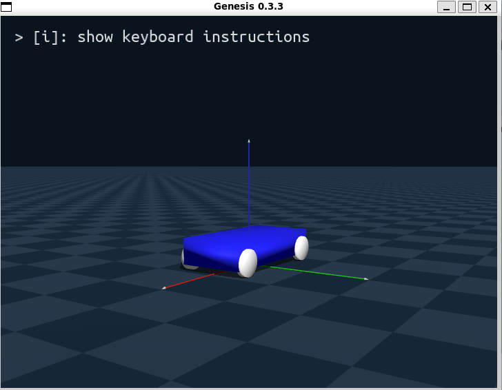
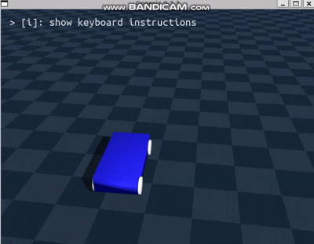

# Blender → Genesis(URDF) 분리/정렬 이슈 (기록)

짧게: Blender에서 모델 찾고(비디오 참고), Genesis로 가져와서 굴리려는데 바퀴가 엇나감. 하나의 rigid body 문제 → 파트 분리 → 좌표/축/스케일 꼬임. 여기 시도 로그와 해결 체크리스트 정리.

---

# 시도 로그

1. 전체 차량 모델을 하나로 업로드
   - 기대: 간단히 로드 후 관절 구성
   - 결과: 하나의 rigid body로 취급되어 차체/바퀴 분리 및 조인트 구성이 불가

2. 차체 + 4개 바퀴로 분리하여 업로드
   - 기대: 각 바퀴를 조인트로 차체에 부착 가능
   - 결과: 좌표/축/URDF를 올바르게 정의했음에도 바퀴 위치가 뒤죽박죽, 일부 깨짐 현상

3. 분리 바퀴 OBJ 좌표를 모두 (0, 0, 0)으로 리셋
   - 기대: URDF에서 `origin (xyz, rpy)`로 정확히 배치
   - 결과: 여전히 올바르지 않은 위치에 부착(오프셋/축 불일치 의심)

4. 좌표/축/URDF 정의 재점검 및 재시도
   - 기대: 정의 재확인으로 문제 해소
   - 결과: 증상 재현(원점/변환/좌표계/스케일 문제 가능성 인지)

5. 문제 기록 및 원인 가설 수립
   - 조치: 본 문서에 현상과 가설, 해결 절차/체크리스트 정리
   - 상태: Blender 재정렬 및 재수출, URDF 단계적 검증 예정

---

## 배경
- Blender에서 차량 모델링
  - 참고: [모델링 비디오(mp4)](./res/car_modeling.mp4)
- 하나의 OBJ로 올리면 통짜 rigid body → 조인트 불가
- 그래서 차체 + 4 휠로 분리했더니 위치/축이 뒤섞임
- 휠 좌표를 (0,0,0)으로 리셋 후 URDF에서 붙이는 전략으로 변경했지만 여전히 오프셋 발생

---

## 현상 요약
- 바퀴 메쉬의 시각적 위치와 URDF에서 지정한 `origin (xyz, rpy)`이 일치하지 않음.
- 일부 바퀴가 비틀리거나 반전된 축으로 나타남.
- 동일한 좌표를 사용해도 바퀴마다 상대 위치가 다르게 적용됨.

---

## 원인 가설 (짧게)
다음이 단일/복합적으로 작용했을 가능성 높음.

- **오브젝트 원점(Origin) 미정렬**: 각 바퀴의 원점이 축 중심이 아니거나, 차체/바퀴마다 원점 기준이 다름.
- **변환 미적용(Scale/Rotation/Location)**: Blender에서 `Ctrl+A`(Apply All Transforms)를 하지 않아 Export 시 내부 변환이 OBJ에 남음.
- **좌표계/축 관례 불일치**:
  - Blender: Z Up, Y Forward(씬에 따라 상이 가능)
  - URDF/ROS: Z Up, X Forward가 일반적
  - OBJ Export 설정(Forward/Up)과 Genesis 로더의 좌표계 해석 불일치로 축 전환 오류 발생 가능
- **단위(Units) 및 스케일**: Blender Scene Scale ≠ URDF/엔진 단위(미터) → 스케일이 암묵적으로 변환되어 위치가 달라짐.
- **미러/음수 스케일 사용**: 좌/우 바퀴를 미러링하며 음수 스케일이 남아 축 반전/노멀 반전 문제 유발.
- **부모-자식(Parenting) 잔여 변환**: 분리 과정에서 부모의 변환이 Bake되지 않거나, Export에 잔존.
- **URDF 정의의 기준 프레임 혼동**: `visual`과 `collision`의 `origin` 불일치, `mesh` 단위/스케일 속성 누락 또는 Genesis 쪽 메쉬 스케일 처리 상이.

---

## 해결 절차 (Blender → OBJ/URDF)

1. **오브젝트 정리(바퀴 4개 + 차체 각각 수행)**
   - Edit Mode에서 메쉬 중심을 축(액슬) 중심으로 정렬.
   - Object Mode: `Object > Set Origin > Origin to Geometry`(혹은 축 중심 Empty에 `Origin to 3D Cursor`).
   - 부모 관계 해제: `Alt+P > Clear Parent (Keep Transform)`.
   - 변환 적용: `Ctrl+A`로 Location/Rotation/Scale 전부 적용(모두 0/0/0, Scale 1.0 확인).

2. **씬 단위/축 기준 정합**
   - `Scene > Units`: Metric, Unit Scale = 1.0, Length = Meters.
   - 모델 크기(바퀴 지름 등)를 실제 스케일로 보정.

3. **좌표계 일치화 전략**
   - URDF는 보통 Z Up, X Forward 가정.
   - Blender OBJ Export 시 권장 설정(일반적인 URDF 호환):
     - Forward: `-Y Forward`
     - Up: `Z Up`
     - Scale: `1.00`
     - Apply Modifiers: On
     - Objects as OBJ Objects: On (오브젝트별 내보내기)
   - Export 직전 다시 `Ctrl+A`로 모든 변환이 0/0/0, Scale 1.0인지 재확인.

4. **OBJ 개별 내보내기**
   - 차체와 각 바퀴를 별도의 OBJ로 내보내되, 파일명과 축 기준을 명확히(예: `fl_wheel.obj`, `fr_wheel.obj`, ...).
   - 좌/우 휠은 미러 복제 대신 실제 회전/배치로 생성하여 음수 스케일 제거.

5. **URDF 설정 점검**
   - `link`마다 `visual`/`collision`의 `origin`을 동일하게 유지.
   - 각 바퀴 `link`는 원점이 바퀴 회전축 중심에 오도록 준비(Blender 단계). URDF에서는 차체 기준 `joint`로 바퀴 위치를 정의.
   - `mesh` 태그에 `scale="1 1 1"`를 명시(스케일 의심 시), 파일 경로/확장자 정확성 확인.
   - 축 방향 확인: 휠 회전축이 URDF에서 Y축(or Z축)인지 엔진 컨벤션에 맞춰 `rpy`로 교정.

6. **검증 루프**
   - URDF에서 차체만 로드 → 기준이 되는 `base_link` 위치/자세 확인.
   - 바퀴 하나만 추가하여 `origin xyz/rpy`가 기대대로 붙는지 확인 → 나머지 3개 반복.
   - 비정상 시, 해당 바퀴 OBJ의 원점/축을 Blender에서 재확인 후 재-Export.

---

## 자산 링크

- 모델/리소스 폴더: [`res/`](res/)
- Blender 파일: [`res/car.blend`](res/car.blend)
- 바퀴 관련 파일들: [`res/*wheel*`](res/)
- 모델링 비디오: [`res/car_modeling.mp4`](res/car_modeling.mp4)
- 테스트 주행 GIF: [`res/car_test_drive.gif`](res/car_test_drive.gif)
- 참조 이미지: [`res/car_img.png`](res/car_img.png)

