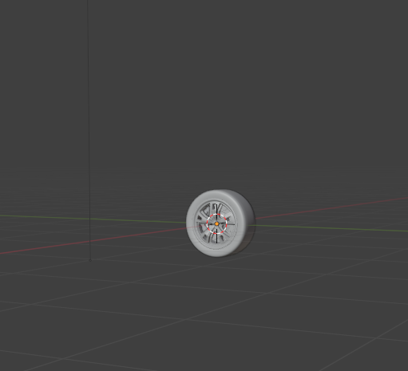

면담
* 비교군을 하나에 보여줘서 대조되게 할것
이름 바꾸기

* waypoint 추가
spline(도로 읽어서) 어느 속도로 달려라
real world data 를 simulation에 어떻게 적용할건가? mlp를 사용하여

* blender 다운로드 -> vehicle blender -> 차체 -> inertia 도 적용
* rigging 하는거 찾아보고
* 한 화면에 몇개씩 보여주는게 맞나? 4/5개
* 어떤함수에서 시간이 오래걸리는지 , network를 통과햇 ㅓaction이 나오는거 forward feeding 이 시간이 오래걸리지 않을까? inference하는게 gpu로 돌아가는건지? real time rendering이 너무 느리다: 사이즈가 작은데도..
* 코드도 올리기(보면서 할 수 있게 - 피드백용)
* memory tracking 하는 api를 사용해서 그래프 보여주기

# Blending

- Blending 에서 모델 불러오기기
   
---
## Genesis Import

`
 car = gs.morphs.URDF(
        file="./car.urdf",
        fixed=False,
        pos=(0, 0, -0.6) #공중 날라감 방지지
    )
    scene.add_entity(car)
`
- 위 코드로 genesis에 import (car_sim.py) 

### 하나의 obj 파일로 업로드
- 하나의 `rigid body` 로 인식
- `joint` 붙일 수 없음
- 바퀴 회전 불가
- 하나의 강체가 이동하는 것 
---

## 해결책 : car_body + 4 wheels
**다섯개의 파트로 분할**

- car.obj : 차량 본체
- flwheel.obj : 앞 왼쪽 바퀴
- frwheel.obj : 앞 오른쪽 바퀴
- blwheel.obj : 뒤 왼쪽 바퀴
- brwheel.obj : 뒤 오른쪽 바퀴

---
## 좌표 불일치 현상 + 공중 날라감 현상

### 문제 요약
- 하나로 올리면 rigid body라 조인트 불가 → 분리해서 올림
- 분리 후에도 바퀴 위치/축이 어긋남(같은 좌표라도 상대 위치 다름)
- 바퀴 mesh(랜더링용 파일)를 (0,0,0)으로 리셋 후 URDF에서 붙여도 offset(치우침/기울어짐) 발생
- 일부 바퀴가 기울거나 반전되어 보임

---

### 원인 가설
- 오브젝트 원점이 축(Axle: 바퀴의 중심을 통과하면서 회전을 지탱하는 막대) 중심이 아님
- Blender 변환 (Location/Rotation/Scale) 미적용 → Export 시 내부 변환 남음  → blender 에서 ctrl+A로 scale reset
- 좌표계/축 세팅팅 차이(Blender vs URDF/엔진) → Forward/Up 불일치
- 단위/스케일 차이(Blender Scene Scale ≠ URDF 미터)
- URDF에서 mesh scale 불일치치

### 해결 방안 
- 원본 mesh파일만 먼저 로드해서 기준 프레임/축 확인
- 앞왼쪽 휠 1개만 추가 → origin xyz/rpy 맞는지 확인 → 나머지 복제
- 휠 회전축이 엔진에서 어떤 **축**인지(Y or Z) 확인 후 rpy로 교정
- 위치가 일관되게 오프셋(치우침)이면 **좌표계/스케일** 문제 의심(Export 설정 재확인)

