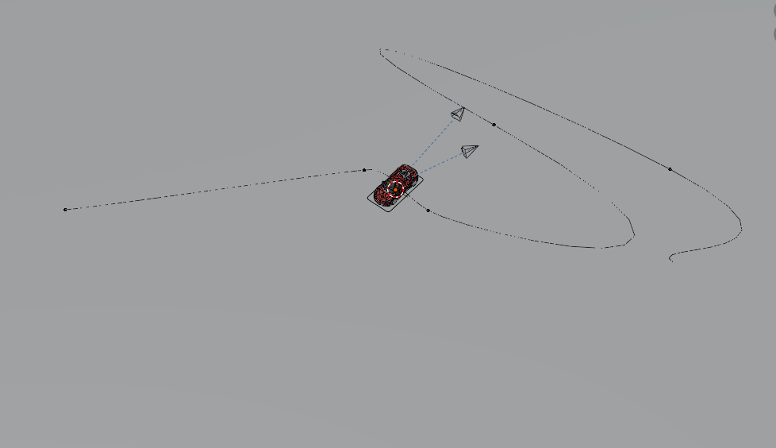
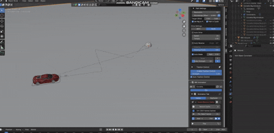
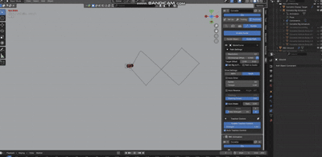
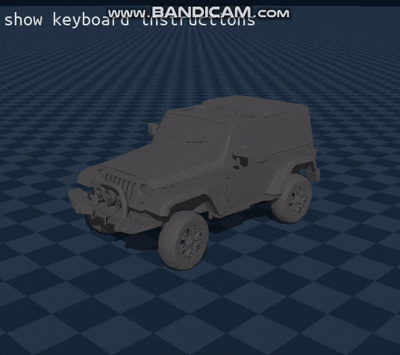

## Blender Drift to Genesis
* RBC Pro 사용

### Youtube 영상 보며 Guide Path 동작 구현
youtube reference: `https://www.youtube.com/watch?v=rrI6wzFquhU` 
* Bezier Curve 를 자동차가 따라가며 auto drive

https://github.com/i1uvmango/Genesis_ai_graphicstudy/issues/9#issue-3669513138

## Blender Script 사용시 문제점 정의
### "핸들러 잔존(Handler Persistence)" 및 "전역 변수 오염(Global State Contamination)" 문제

1. 문제 정의 (Problem Statement)
* 현상: 스크립트를 재실행하거나 다른 .blend 파일을 로드했음에도 불구하고, 이전 시뮬레이션의 움직임 데이터가 출력되거나, 데이터가 비정상적으로 튀는 현상(Ghosting) 발생.

* 사용자 관찰: "이전 파일의 움직임이 그대로 나온다" 혹은 "핸들러 캐시 문제"로 인지됨.

#### 문제 
1. 핸들러의 영속성 (Handler Persistence):

bpy.app.handlers.frame_change_post에 등록된 함수는 사용자가 명시적으로 제거(remove)하거나 블렌더 프로그램을 완전히 끄기 전까지 메모리에 계속 상주합니다.

2. 애플리케이션 메모리 공유:

블렌더 내의 Python 인터프리터는 씬(Scene)이 바뀌어도 메모리를 공유합니다. 다른 파일을 열어도 변수명이 같다면 이전 메모리 주소를 참조할 위험이 있습니다.
스크립트를 다시 실행할 때 이전 핸들러를 제대로 삭제하지 않으면, 똑같은 함수가 2개, 3개 중복되어 등록됩니다.

이 경우, 한 번의 프레임 변경에 스크립트가 여러 번 실행되면서 CSV에 데이터를 중복 기록하거나 덮어쓰게 됩니다.

## Guide Path Driving 영상 (Blender)

* 사각형 auto drive
  
  
* 8자 형태 auto drive

### 8자 모양 drive 학습 후 Genesis 환경 실행
* 8자 drive 학습 후 inference 해서 실행

* 초기 `정지 상태`를 학습하지 못해 움직이지 않음
#### 그렇다면 정지 데이터도 뽑아야 하는가?
* "0인 상태를 추가해서 학습시키는 것"은 절대 비추
* → BC에서 정지 상태는 올바른 Action이 없기 때문
* → 잘못하면 모델이 “0 출력”만 하도록 collapse 됨
* → 실제로 차가 더더욱 안 움직이는 모델로 악화됨
#### 해결 방안
* Kick-start (가속 부스트) → 가장 안전하고 일반적인 해법
    * parameter 무시하고 강제로 차량을 움직이게 함
* Gain/Scale 조정 → Kick-start와 함께 사용하면 매우 효과적
    * SPEED_SCALE은 보통 throttle_norm ([-1, 1])을
바퀴의 목표 angular velocity (rad/s) 로 변환할 때 사용하는 비례 계수 &rarr; 이걸 높임

### 좌회전 편향 문제 (Left Turn Bias)
*   **증상**: 차가 8자를 그리지 않고 계속 좌회전만 함.
*   **원인**:
    *   학습 데이터(`drive_8.csv`)의 평균 Yaw Rate가 0이 아님 (우회전 성향).
    *   정규화 시 `(0 - 음수평균)`이 되어 직진 상태가 "왼쪽 회전"으로 입력됨.
*   **해결**:
    *   `bc_train.py`에서 횡방향 속도 및 회전 속도의 **평균(`state_mean`)을 0.0으로 강제**.
    *   물리적 대칭성을 보장하여 직진 입력이 정확히 0으로 정규화되도록 수정.

* 

* 8자로 달리지 않고 바닥에서 튀면서 이동
* 예상 원인 : throttle 값이 음수로 변하는 부분에서 바퀴가 반대로 굴러가 마찰력에 의해 튕기는 현상
    * 데이터 전처리 과정에서 문제가 있다고 판단 &rarr; 해결중에 있음
    

### 공유 데이터 추출 코드
[shared_data_extracter](../src/shared_data_extracter.py)
* 연구생 공동 사용하는 data_extracting code
### On/Off 할 수 있는 데이터 추출 코드
[button_extract_data](../src/extract_data_blender.py)
* 스크립트 실행시 항상 데이터가 csv 파일에 저장되는걸 방지하기 위해 ON/OFF 로직 추가