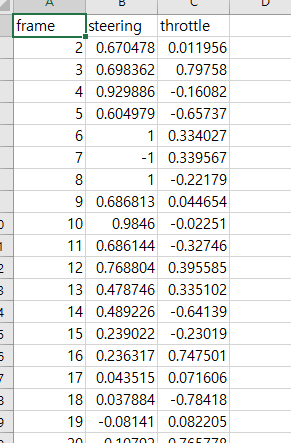
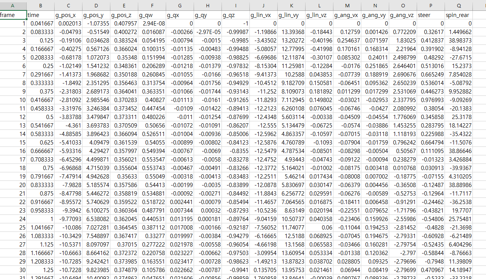

# Steering & Throttle 통일

* 앞바퀴 조향을 하나의 바퀴 기준으로 통일
* Throttle 도 뒷바퀴의 평균값으로 통일  
&rarr; 수치 안정성 확보

### 데이터 추출 코드 : [blender_data_extract](../src/on_off_data_blender_data.py)
* 정규화 `steer_norm`, `throttle_l` 
* 클리핑 `steer_norm = max(-1.0, min(1.0, steer_norm))` 을 통해 outlier 제거
* AI behavior cloning에 유리하도록 함

### 데이터 전처리 오류

* Steering(정상) : FL Wheel 기준으로 steering 통일
* Throttle(오류) : 뒷바퀴의 평균 값 구한 뒤 정규화 (50km 기준)
    * 하지만 csv 파일에서 +,-,+,-가 반복됨
    * 도저히 이유를 찾을 수 없음(다른 학생 코드로 뽑아도 +,- 반복됨)
    


### 오류 원인 예상
1. 왼쪽 바퀴(spin_rl)와 오른쪽 바퀴(spin_rr)를 똑같은 공식으로 계산
    * 왼쪽 +0.5, 오른쪽 -0.5 , 합 0(이러면 모든 구간 0이어야함)
    * 하지만 rig 건드리지 않았고, 다른 연구생들은 이런 현상이 나타나지 않음
2. 쿼터니언의 Double Cover 현상(q,-q 가 동일한 회전을 나타냄)
    * 하지만 이것도 다음 로직으로 부호 통일 시킴
    ```
    if dot_product < 0: # 둘 사이의 각도가 90도(혹은 방향)가 너무 멀면
    curr_rot_corrected = -curr_rot # 부호를 뒤집어서 가까운 쪽(1도)으로 계산해라!
    ```
    * 이게 문제라면 연속적인 throttle 값이 나와야함


---
이상 원인을 찾지 못하였음