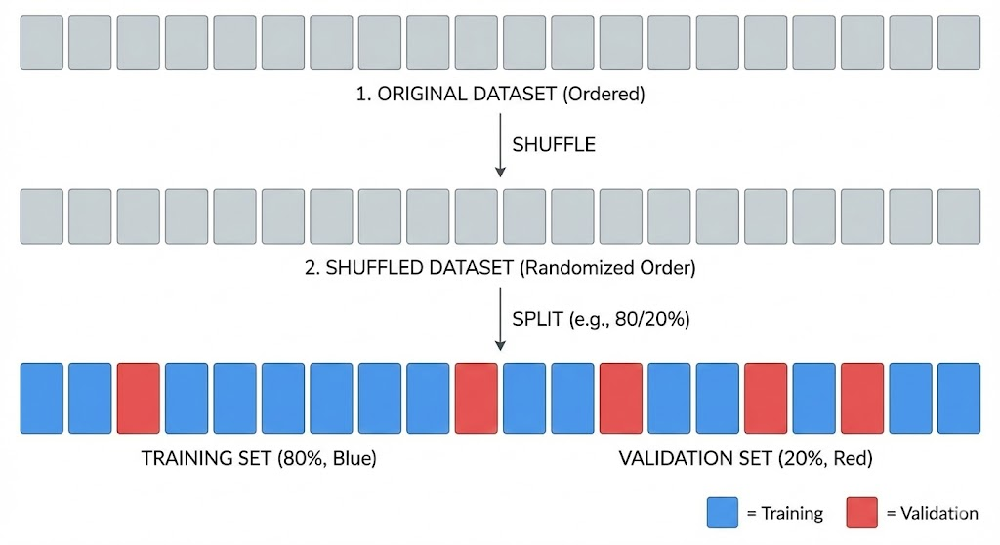
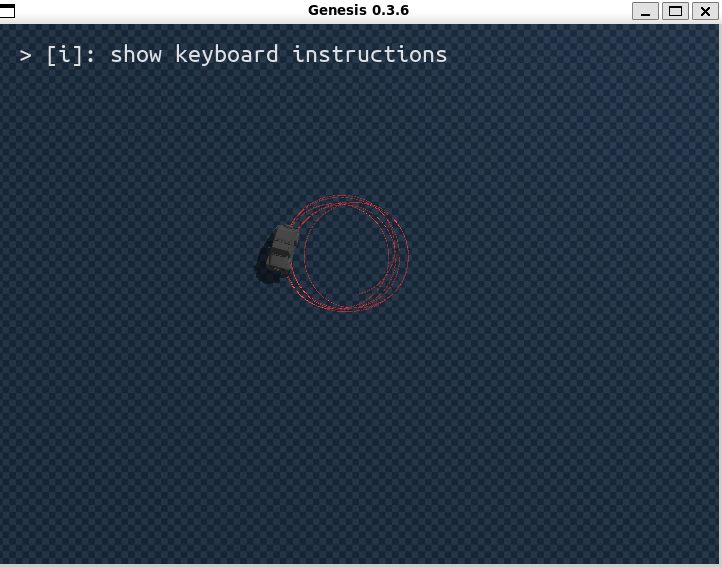
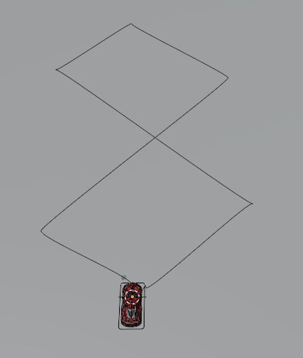
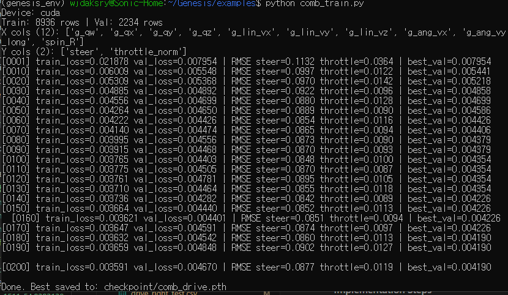
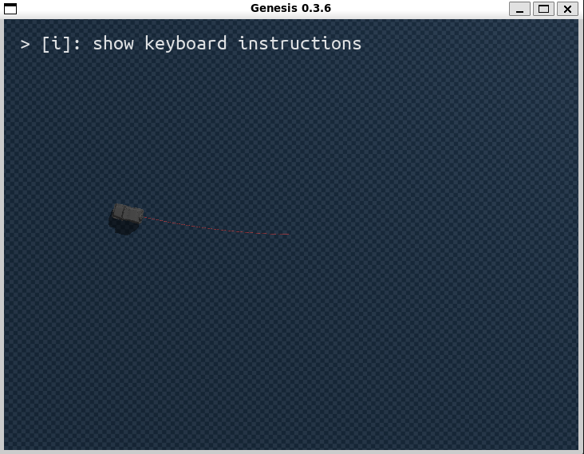
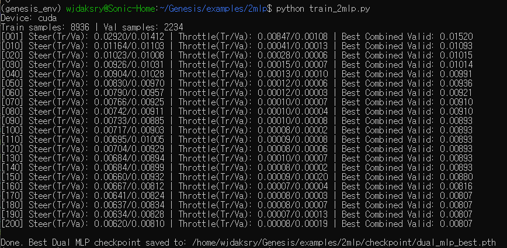

## 미팅 피드백
1. 데이터 편향의 가능성 -> mlp를 하나를 사용해서 전체 input이 2개의 아웃풋을 결정하기 때문에 -> local overfitting 의 가능성
2. genesis 에서 초기 카메라 위치 고정
3. 경로에 선을 그리도록해서 path 확인


## 데이터의 local overfitting 해결해보기
* 현재 train 후 학습 시 차량이 한쪽 방향으로 만 도는 현상이 나타남
* 학습 편향이 일어났다고 생각하고 해결해보고자 함

### shuffle split

1. shuffle split 으로 train/validation 을 같은 종류의 데이터로 train 하고 그걸 평가하는 것
2. 이렇게 해도 되는가? 
    * 해도 된다. 현재까지는 시간의 순서에 따라서 val 데이터 선정
    * Shuffle Split을 통해, Validation Loss 가 암기형 모델이 아닌 일반화 모델로 
    Shuffle Split 
    ```
    Train: 직진 A, 직진 B, 좌회전 C, 우회전 D
    Val:   직진 B, 좌회전 A, 좌회전 D, 우회전 C
    ```
    
    
    ```
    # 시간순 split
    연습: 수학 문제 1~80번
    시험: 81~100번
    ```
    ```
    # shuffle split
    연습: 수학 문제를 섞어서 80문제
    시험: 나머지 20문제
    ```
    * 이렇게 되면 랜덤성을 사용해서 데이터를 섞어서 일반화의 성능을 높임

    <video controls src="../res/20260101-1511-54.9393138.mp4" title="Title"></video>
    * 결과가 별로 좋지 않아 롤백함

### weight decay 강화
* 모델이 너무 복잡해지는 것을 막기 위해 가중치 크기를 의도적으로 줄이는 정규화 방법
    ```
    # 기존
    opt = torch.optim.AdamW(model.parameters(), lr=1e-3, weight_decay=1e-4)

    # 변경: weight_decay 증가
    opt = torch.optim.AdamW(model.parameters(), lr=1e-3, weight_decay=1e-3)
    ```
    
   * 근데 이건 8자에 overfitting 되어서 더 결과가 맞게 나와야하기 때문에 올바르지 않음
   * 마찬가지로 결과가 좋지 않아서 롤백함
    


### 8자 움직임의 곡선이 얽히면 생기는 문제
```
* 차량이 8자의 교차점에 도달했을 때, 첫 번째 랩에서는 왼쪽 대각선으로 가야 하고, 두 번째 랩에서는 오른쪽 대각선으로 가야 할 수 있습니다.
* 하지만 모델 입장에서는 두 경우 모두 위치, 속도, 자세가 거의 비슷해 보임

평균값 출력 문제 (Average Action):
* 데이터셋에 교차점에 대해 좌회전과 우회전이 섞여 있습니다.
* 모델은 에러를 최소화하기 위해 이 둘의 평균값인 직진을 학습해버립니다.
* 결국 교차점에서 멍하니 직진하다가 코스를 이탈하게 됩니다.
```
* 따라서 블렌더 경로를 다음과 같이 수정함

| 기존 | 새로운 경로 |
| --- | --- |
  |  |

### 전체 데이터 통합 학습 후 8자 움직임 Behavior Cloning

| 데이터 파일 | 설명 | 샘플 수 |
| --- | --- | --- |
| drive_8_test.csv | 8자 주행  | 2500 |
| drive_brake_test.csv | 브레이크 | 248 |
| drive_left_test.csv | 좌회전 반복 | 2500 |
| drive_right_test.csv | 우회전 반복 | 2500 |
| drive_stopgo_test.csv | 가다 서다 반복 (Stop & Go) | 1131 |
| drive_straight_test.csv | 직진 주행 | 2500 |
| **합계** | **다양한 속도/상황 포함** | **11376** |



#### 통합 데이터 학습 Epoch 별 훈련 결과

| Epoch | Best Val Loss | 개선폭 | Train Loss | Val Loss | RMSE Steer | RMSE Throttle |
|-------|---------------|--------|------------|----------|------------|---------------|
| 0001  | 0.007954      | -      | 0.021878   | 0.007954 | 0.1132     | 0.0364        |
| 0010  | 0.005441      | ↓ 31.6% | 0.006009   | 0.005548 | 0.0997     | 0.0122        |
| 0020  | 0.005218      | ↓ 4.1%  | 0.005309   | 0.005368 | 0.0970     | 0.0142        |
| 0030  | 0.004858      | ↓ 6.9%  | 0.004885   | 0.004892 | 0.0922     | 0.0096        |
| 0040  | 0.004699      | ↓ 3.3%  | 0.004556   | 0.004699 | 0.0880     | 0.0128        |
| 0050  | 0.004586      | ↓ 2.4%  | 0.004264   | 0.004650 | 0.0889     | 0.0090        |
| 0060  | 0.004426      | ↓ 3.5%  | 0.004222   | 0.004426 | 0.0854     | 0.0116        |
| 0070  | 0.004406      | ↓ 0.5%  | 0.004140   | 0.004474 | 0.0865     | 0.0094        |
| 0080  | 0.004379      | ↓ 0.6%  | 0.003995   | 0.004556 | 0.0873     | 0.0090        |
| 0100  | 0.004354      | ↓ 0.6%  | 0.003765   | 0.004403 | 0.0848     | 0.0100        |
| 0140  | 0.004226      | ↓ 2.9%  | 0.003736   | 0.004282 | 0.0842     | 0.0089        |
| 0180  | **0.004190**  | ↓ 0.9%  | 0.003632   | 0.004542 | 0.0860     | 0.0113        |

**주요 발견사항:**
- **최고 성능**: Epoch 180 (best_val=0.004190)
- **전체 개선**: 0.007954 → 0.004190 (47.3% 개선)
- **과적합 징후**: Epoch 100 이후 train/val gap 증가
- **정체 구간**: Epoch 100~140 사이 개선 없음 (40 epoch)
- **권장사항**: Early stopping (patience=30), 정규화 강화 필요

#### best validation loss 평가 (Epoch 180)

| 지표 | 값 | 평가 |
| --- | --- | --- |
| Best Validation Loss | 0.004190 (Epoch 180) | 우수 |
| RMSE Steering | 0.0860 (8.60%) | 실용 가능 |
| RMSE Throttle | 0.0113 (1.13%) | 매우 우수 |
| 전체 개선율 | 47.3% (0.007954→0.004190) | 큰 폭 개선 |
| 과적합 여부 | Epoch 100 이후 train/val gap 증가 | 정규화 필요 |


* 여전히 경로를 못그림

#### 이유 분석
```
8자 경로가 아닌 이유
학습 데이터: 고속 주행 중 8자 경로 수집
현재 시뮬레이션: 정지 상태에서 시작
Out-of-Distribution 문제: 입력 상태가 학습 데이터와 다름(속도)
```


* 예상 이유는 8자 데이터셋의 속도와 학습된 속도가 달라서 모델이 현 상황을 제대로 읽지 못함
    * 일단 움직임을 뽑아내기 위해 속도를 강제적으로 맞춰줌

* 원하는 움직임을 추론하지 못함

### waypoint 기반 학습

#### 문제 정의
* 현재 모델은 절대 위치 `(g_pos_x, g_pos_y)`를 입력으로 사용하지 않음
* 하지만 8자 경로를 학습했음에도 불구하고 추론 시 경로를 따라가지 못함
* **원인**: 모델이 "어디로 가야 하는지" 모르고, 현재 상태만으로 행동을 결정

#### 해결 방안: 상대 위치 (dx, dy) 입력 추가

**핵심 원리**
```python
dx = 목표점.x - 현재위치.x
dy = 목표점.y - 현재위치.y
```
* 절대 좌표가 아닌 **목표까지의 방향 벡터**를 입력으로 제공
* 모델은 "목표가 어느 방향에 있는지"를 학습

**Location Invariant 특성**
* 절대 위치 사용 시: `위치 (10, 20)에서는 좌회전` → 특정 위치에 과적합
* 상대 위치 사용 시: `목표가 왼쪽 앞(+dx, +dy)이면 좌회전` → 어디서든 적용 가능
* **시작점, 경로 위치와 무관하게 동일한 행동 패턴 학습**

**해결하는 문제**
1. **Out-of-Distribution 문제**: 학습 시와 다른 시작점에서도 작동
2. **일반화 성능**: 다양한 경로에 대해 동일한 모델 사용 가능
3. **경로 추종 실패**: 모델이 목표 방향을 인식하여 해당 포인트로 이동할 수 있는 적절한 steering/throttle 을 학습함(output)

**구현**
* 입력 차원: 12차원 → 14차원 (`dx, dy` 추가)
* 학습 시: 각 프레임에서 N프레임 뒤 위치를 목표로 설정
* 추론 시: 목표 경로에서 현재 위치와 가장 가까운 앞 점을 찾아 `dx, dy` 계산
---

### 통합데이터 + waypoint 기반 학습 결과

* 통합 데이터 + waypoint 기반 학습 인데 `drive_8_test.csv`파일로만 학습한 과적합된 움직임과 거의 동일

| 통합데이터&waypoint | 8자데이터 학습 |
| --- | --- |
|  |  |

* 하나의 움직임으로 수렴

* 사실 8자 움직임 데이터가 잘못된 것이 아닌가
---


### 2개의 mlp를 사용해보기로 함


#### 입력 데이터 (Input): 14차원
두 모델은 **waypoint 방법과 동일한 14차원 상태 벡터**를 입력으로 받습니다.

| 인덱스 | 피처 | 설명 |
| :--- | :--- | :--- |
| 0~3 | `g_qw`, `g_qx`, `g_qy`, `g_qz` | 차량의 방향 (Quaternion) |
| 4~6 | `g_lin_v{x,y,z}` | 차량의 선형 속도 |
| 7~9 | `g_ang_v{x,y,z}` | 차량의 각속도 |
| 10 | `v_long` | 전진 속도 (Longitudinal Velocity) |
| 11 | `spin_R` | 뒷바퀴 회전 속도 |
| **12** | **`dx_local`** | **목표점까지의 상대 X 거리 (Body Frame)** |
| **13** | **`dy_local`** | **목표점까지의 상대 Y 거리 (Body Frame)** |

* `dx_local`, `dy_local`은 `drive_combined_wp.csv` 생성 시 `g_pos_x`, `g_pos_y`를 통해 계산된 값
* 차량이 트랙을 따라가기 위한 "내비게이션" 역할
---



* throttle, steering 각각 mlp중 가장 낮은 loss 의 checkpoint를 `dual_mlp_test.pth`에 저장
* `dual_mlp_test.pth` 에는 steering/throttle의 best checkpoint 모두 있는 것
* 추론 시 `dual_mlp_test.pth`를 로드하여 사용

##### 2mlp결과

  

#### mlp 분리로 인한 효과
* throttle 개선
    * 느린 속도 &rarr; 정상적인 속도로 개선됨
* steering 개선 x
    * 원인 찾는 중

#### 예상 원인들
1. dx_local, dy_local 변환 중 좌표계 계산이 잘못되어 피처로서의 가치가 없음 (상관관계 0).
2. (유력하다고 생각함) 학습 시 g_ang_vz 등 다른 피처에 의존하여 "평균적인 좌회전"만 학습함. (8자 주행은 좌회전/우회전이 섞여있지만 데이터 불균형이나 초기 조건 때문에 한쪽으로 쏠림)
3. 따라서 dx_local, dy_local이 유의미한 피처가 되도록 고치는 것이 핵심입니다.


#### 2mlp 구조도 문서
| 문서 요약 | 링크 |
| --- | --- |
| throttle/steering 을 각각의 mlp로 학습 후 통합 | [1231_dual_mlp](../docs/1231_dual_mlp.md) |


---

### 학습 결과 비교 요약

| 방법 | 설명 | 결과/링크 | 비고 |
| :--- | :--- | :--- | :--- |
| **Shuffle Split** | Train/Val 데이터를 무작위로 섞어 일반화 시도 | <video controls src="../res/20260101-1511-54.9393138.mp4" title="Title"></video> | 암기형 모델 방지 실패 |
| **Weight Decay** | 정규화 강화를 통한 모델 단순화 | | 8자 주행 특화에 부적합 |
| **통합 데이터 학습** | 전체 주행 데이터 통합 학습 (Epoch 180) |  | 여전히 경로 추종 실패 |
| **강제 속도 동기화** | 학습 데이터 속도와 시뮬레이션 속도 강제 일치 |  | 움직임 추론 실패 |
| **Waypoint (dx, dy)** | 상대 위치 기반 14차원 입력 (Location Invariant) |  | 특정 주행(8자) 데이터로 편향 수렴 |
| **Dual MLP** | Throttle/Steering 제어망 분리 학습 |  | Throttle(토크 제어) 대폭 개선, Steering 개선 중 |

