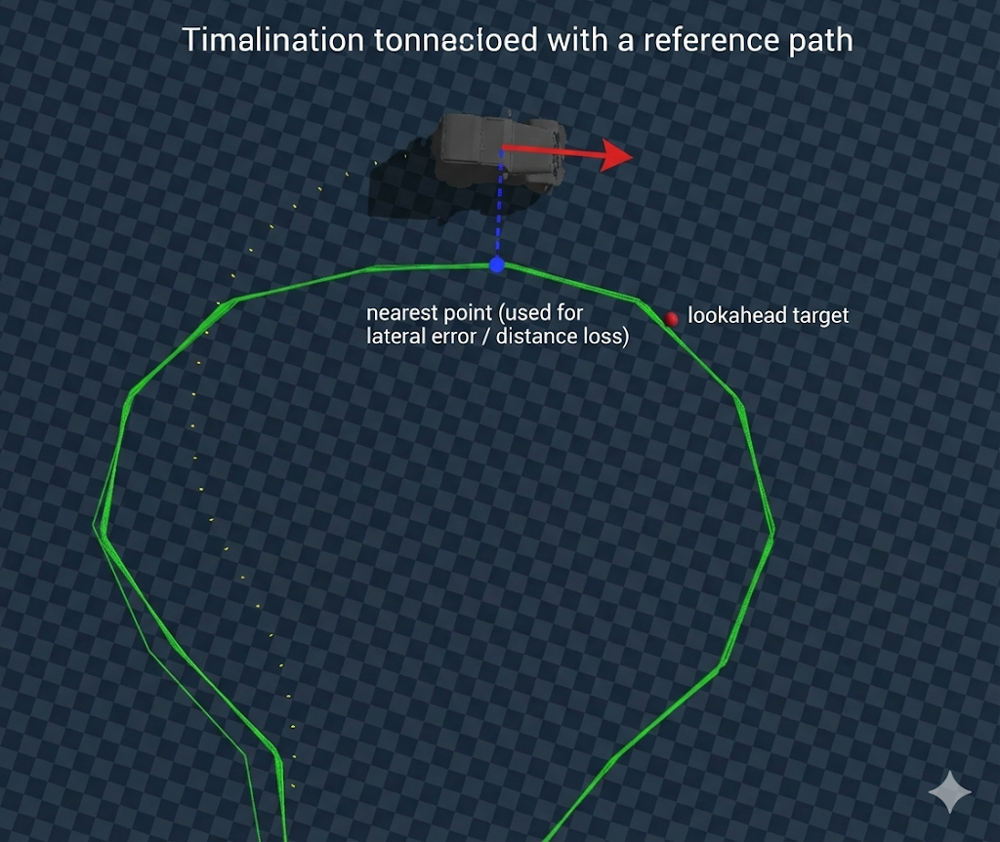
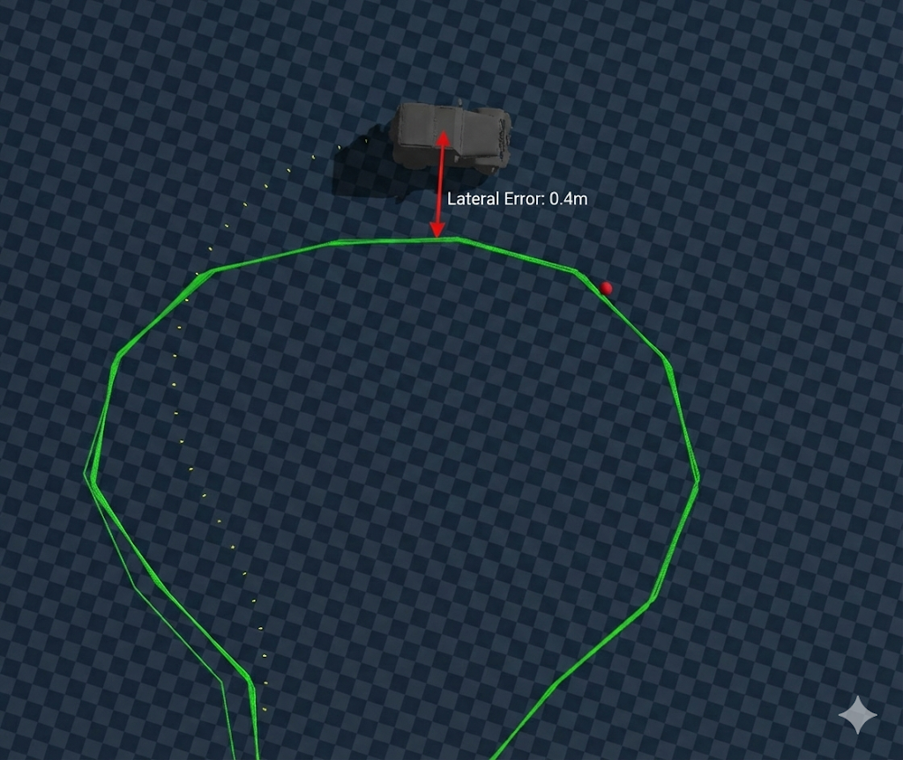
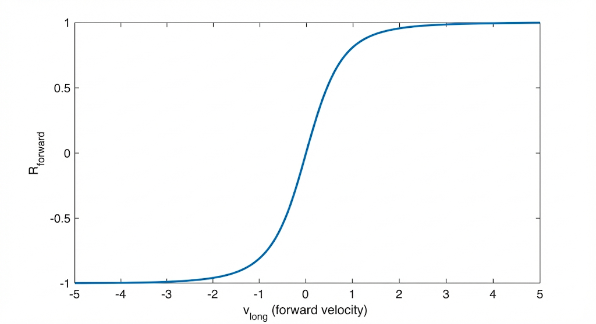

# PPO 보상 함수 설계 

## 개요

PPO Direct Control 시스템에서 사용되는 보상 함수 설계를 정리합니다.

### 설계 철학
- **브레이크는 보상 대상이 아님**: 브레이크는 과속 페널티 및 회복 불가능 상태를 피하기 위한 수단으로 간접적으로 학습됨
- **후진은 금지 상태**: 후진 동작은 목표 행동이 아닌 무효 상태로 처리 (에피소드 종료)

---

## 보상 가중치 (Config)

| 변수 | 값 | 설명 |
|------|------|------|
| `w_track` | **1.5** | 횡방향 오차 (P_lat², with curriculum) |
| `w_progress` | 1.0 | 진행 보상 (v_long > 0일 때만, Projection) |
| `w_arc` | 1.0 | 절대 arc-length 진행 |
| `w_forward` | 0.3 | 전진 보상 (v_long > 0일 때만) |
| `w_steer` | 0.2 | 스티어링 크기 페널티 |
| `w_rate` | 0.1 | 스티어링 변화율 페널티 |
| `w_speed` | 0.3 | 목표 속도 초과 시 페널티 |
| `w_stuck` | 1.0 | 정체 페널티 (v_long < 0.1) |
| `lookahead` | **3.0m** | Arc-length lookahead distance |

---

## 커리큘럼 학습 (CurriculumScheduler)

학습 초기에는 일부 보상/페널티를 비활성화하고, iteration이 진행됨에 따라 점진적으로 활성화합니다.

### 주요 메서드

| 메서드 | 동작 |
|--------|------|
| `get_w_dir(iteration)` | 방향 보상 가중치: `0.1 → 0.3` (100 iteration에 걸쳐) |
| `get_progress_weight(iteration)` | warmup 기간(30 iter) 동안 0, 이후 1.0까지 ramp-up |
| `get_rate_weight(iteration)` | warmup 기간(30 iter) 동안 0, 이후 1.0까지 ramp-up |
| `get_track_weight(iteration)` | **w_track 커리큘럼: `0.5 → 1.0`** |
| `get_brake_multiplier(iteration)` | 브레이크 토크: `0.5 → 1.0` (60 iter에 걸쳐) |

---

## 기준점 convention


* lookahead point : steering 을 lookahead point를 기준으로 미리 조절하여 부드러운 steering 을 만듦
* nearest point : 차량과 가장 가까운 경로 지점


## 총 보상 함수 구조

### `compute_total_reward_batch()` 

```
Total Reward = R_align 
             + w_recover × R_recover 
             + w_progress × R_proj 
             + w_arc × R_arc
             + w_forward × R_forward
             - w_track × P_lat²       ← NEW (squared lateral error)
             - w_steer × P_steer
             - w_rate × P_rate  
             - w_speed × P_speed
             - w_stuck × P_stuck
```

---

## 개별 보상 항목

### 1. Alignment Reward (R_align) - 조향 의도 보상


> **"목표 방향으로 조향하라"**
* target_point(빨간 공)가 있는 방향으로 steering이 일어나는가?


```python
R_align = clamp(target_rel.y × steer, -1.0, 1.0)
```

- `target_rel.y`: Body Frame 기준 목표점의 y 좌표 (좌/우 편차)
- 목표가 왼쪽(y > 0)이면 왼쪽 조향(steer > 0) → 양의 보상
- 목표가 오른쪽(y < 0)이면 오른쪽 조향(steer < 0) → 양의 보상
##### 목표 방향에 맞는 조향을 하면 보상을 줌

---
### 2. Recovery Reward (R_recover) - 횡오차 감소 보상



> **"횡방향 오차(e_lat)를 줄였는가?"**
* 좌우 shift err 줄였는가?
* nearest_point 기준


```python
curr_lat_error = |nearest_rel.y|
R_recover = clamp(prev_lat_error - curr_lat_error, -0.2, 0.2)
```

- **가중치**: `w_recover = 2.0` (고정, 가장 중요)
- 현재 프레임에서 횡방향 오차가 감소하면 양의 보상
- `nearest_rel`: 가장 가까운 경로 지점 기준 (true cross-track error)


---
### 3. Projection Reward (R_proj) - 경로 방향 속도 성분 보상


> **"경로 접선 방향으로 이동하라"**
* nearest_point의 접선 방향으로 차량이 이동하는가?
* 출력/속도 에 대한 보상

```python
proj_speed = v_body.x × tangent.x + v_body.y × tangent.y
R_proj = clamp(proj_speed / target_speed, -0.2, 0.5)
```

- 차량 속도를 경로 접선(tangent) 방향으로 투영
- Curriculum: 초기에는 비활성화, 점진적으로 활성화
    * 학습 안정성을 위해 점진적으로 활성화 하여 페널티로 인한 느린 학습을 방지
---
### 4. Arc-Length Reward (R_arc) - 누적 경로 거리에 따른 보상

> **"정지하지 말고 전진하라"**

```python
R_arc = clamp(s_curr - s_prev, 0, 0.5)
```

- `arc_length[progress_idx]`: 누적 경로 거리
- **정지 방지 핵심 보상**: 실제로 경로상에서 얼마나 진행했는지 측정

#### 이게 왜 필요한가?
`위 보상함수들은 다음 조건만 맞추면 된다`

* R_align: lookahead point 방향으로 조향만 맞추면 OK
* R_recover(e_lat): 붙지 않으면 손해
* R_proj: 접선 방향 속도 성분만 있으면 OK

다음과 같은 로컬 최적해에 도달 할 수 있음(움직이지 않음)
> 보상 정의의 빈틈을 메꿔주는 역할
```
아예 거의 멈춰서
방향만 살짝 맞추고
e_lat 줄이는 게 최고다”
```

* R_arc 를 통해 `앞으로 가지 않으면 보상이 0이다`를 명시해서 차량이 계속 움직이게끔 함(정지상태 거부)


### 5. Forward Reward (R_forward) - 전진 보조

#### 차량이 앞으로 움직이면 R_forward를 통해 보상을 주도록 함
- 전진 속도에 비례하는 보조 보상
- 너무 느린 속도를 방지하기 위함
- 그렇다고 빠른 속도 만으로 보상을 얻으면 안됨 &rarr; tanh 함수 사용



```python
R_forward = tanh(v_long)
```
* `tanh` 를 씌우는 이유는 보상을 위해 무작정 속도(v_long)을 키우는 것을 방지하기 위해 [-1,1]로 스케일링
- 가중치: `w_forward = 0.3`


---

## 페널티 항목

### 1. Steering Penalty (P_steer)

```python
P_steer = steer²
```
- 불필요하게 큰 조향 억제

### 2. Rate Penalty (P_rate)

```python
P_rate = |steer - steer_prev|
```
- 급격한 조향 변화 억제 (부드러운 제어 유도)
- Curriculum: 초기에는 비활성화

### 3. Speed Penalty (P_speed)

```python
P_speed = clamp(v_long - target_speed, 0, ∞)
```
- 목표 속도 초과 시에만 페널티

### 4. Stuck Penalty (P_stuck)

```python
P_stuck = clamp(0.1 - v_long, 0, ∞)
```
- 속도가 0.1 m/s 미만이면 페널티 (정체 방지)

### 5. Lateral Error Penalty (P_lat) - NEW

> **"경로에서 벗어나지 마라"**

```python
lat_err_clamped = clamp(|nearest_rel.y|, 0.0, 2.0)
P_lat = lat_err_clamped ** 2  # 최대 4.0
```

- **제곱 형태**: 작은 오차 관대, 큰 오차 강력 페널티
- **커리큘럼**: w_track × (0.5 → 1.0) 점진적 증가
- `nearest_rel.y`: 가장 가까운 경로 지점 기준 true cross-track error

---

## 에피소드 종료 조건 (Done Conditions)

| 조건 | 기준 |
|------|------|
| **Goal Reached** | `target_idx >= M - 1` |
| **Off-Track** | 경로 최단 거리 > `2.0m` |
| **Reverse Motion** | `v_long < -0.3 m/s` |
| **Irrecoverable** | 횡오차 > threshold AND yaw_rate > threshold (curriculum) |
| **Timeout** | `episode_length >= 500` |

### Irrecoverable Thresholds (Curriculum)

```python
y_max = 5.0 - 2.0 × progress    # 5.0m → 3.0m
omega_max = 3.0 - 1.0 × progress  # 3.0 rad/s → 2.0 rad/s
```
- 학습 초기에는 관대하게, 후반에는 엄격하게 적용

---

## 관찰 공간 (Observation) - 18차원

| 변수 | 차원 | 설명 |
|------|------|------|
| `target_rel` | 3 | Body Frame 기준 목표 waypoint 상대 위치 |
| `v_body` | 3 | Body Frame 기준 속도 (vx, vy, vz) |
| `omega_body` | 3 | Body Frame 기준 각속도 |
| `g_body` | 3 | Body Frame 기준 중력 벡터 |
| `tangent_rel` | 3 | Body Frame 기준 경로 접선 방향 |
| `slip_proxy` | 1 | 슬립 근사값 (throttle_prev - v_norm) |
| `prev_action` | 2 | 이전 액션 (throttle, steer) |

---

## 핵심 설계 포인트 요약

1. **2단계 조향 전략**: R_align (목표 방향) + R_recover (오차 감소)
2. **이중 진행 보상**: R_proj (속도 투영) + R_arc (절대 누적 거리)
3. **P_lat² 페널티**: 제곱 형태 횡오차 → 작은 오차 관대, 큰 오차 강력 억제
4. **Curriculum Learning**: warmup 기간 + 점진적 가중치 증가 (w_track 포함)
5. **Arc-Length Lookahead**: 3.0m 전방 목표점 사용
6. **후진 구조적 차단**: 브레이크는 역토크 생성 불가, 후진 시 에피소드 종료
7. **Idle Creep**: 최소 속도 0.3 m/s 유지로 정지 방지

---
