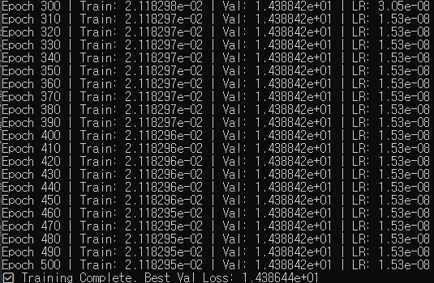
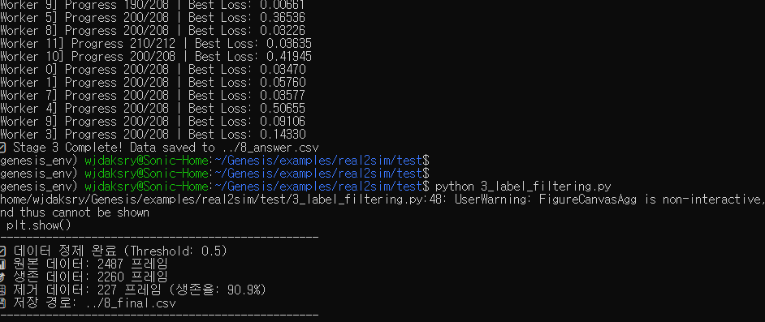
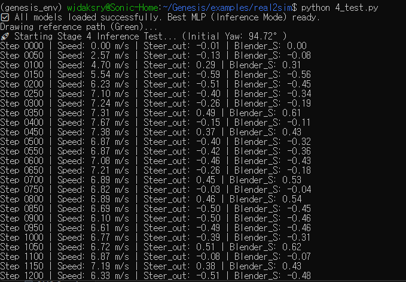
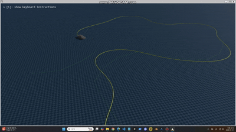
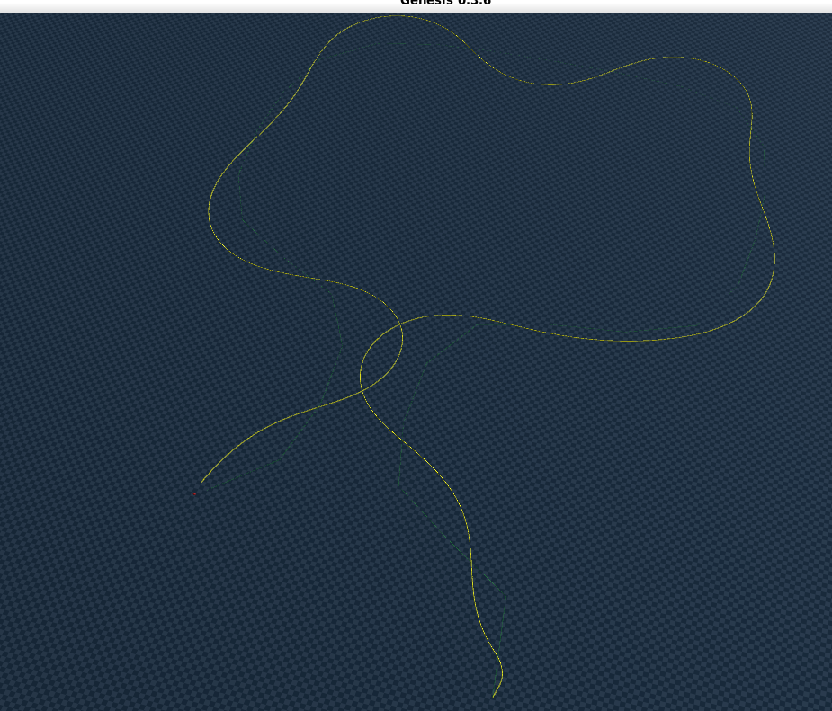
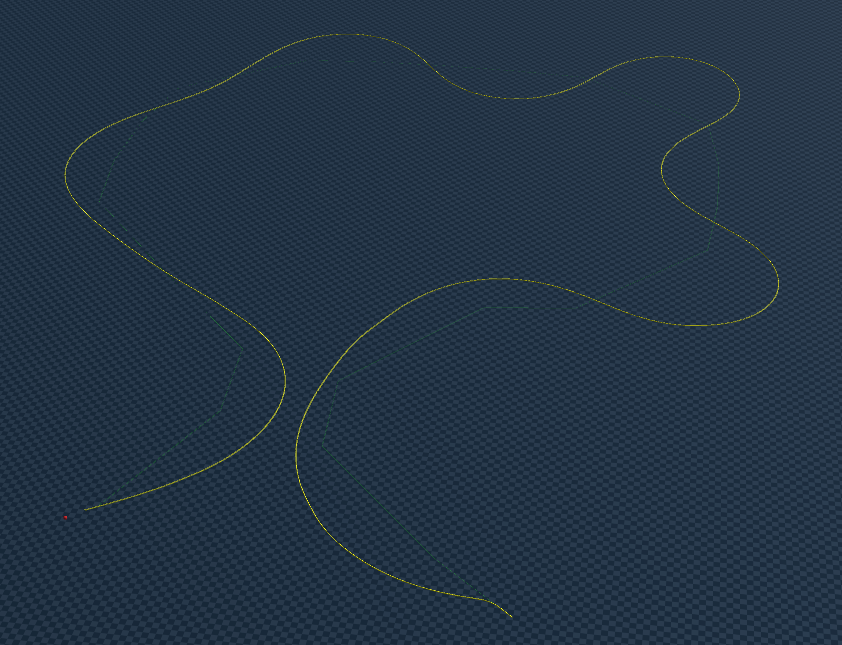

# Supervised Learning with UKMAC(Unicycle Kinematic Model for Acceleration and Curvature)


* **목표:** 속도/조향(Steer)의 목표는 Blender.
* **지도 학습:** 속도 / 조향.
* **현재 이해:** PPO(우리 모델) + Blender 데이터 정답값 -> 지도 학습으로 MLP 생성.
* **솔버 입력:** Blender와 Genesis의 솔버 입력값이 다름 -> 따라서 솔버의 입력은 Blender와 경로가 동일해지는 입력이 필요
* 바퀴 마찰 계수 등 고려 필요.

> "두 솔버(Solver)가 공통으로 해석 가능한 상태(State) 공간이 필요하다."


## Unicycle Kinematic Model for Acceleration and Curvature(UKMAC)


> 두 솔버가 공유하는 state
* solver가 공유하는 state 이므로, (a,k) 기반으로 두 솔버의 입력 state를 동기화해야함
---


## Env Sync (Stage 1)
* Residual Learning (MLP를 통해 환경적 요소를 보정)

> 목적: 시뮬레이션의 기본 물리법칙만으로는 학습되지 않는 `마찰력`, `공기저항`, `중력 방향`, `타이어 슬립` 등 환경적 요소를 Residual Learning 으로 시뮬레이션의 정확도를 높인다.

#### env state 는 차량 state를 통해 만들어짐(로보틱스 표준)
* 쿼터니언 &rarr; 중력 방향 
* v_long 속도 &rarr; 공기저항 (속도의 제곱에 비례)
* v_long 속도 + 이전 step 속도 &rarr; 질량과 회전관성
* v_lat(횡방향 속도) + yaw_rate(회전 각속도) &rarr; 타이어 슬립 
* roll, pitch &rarr; 차량의 자세 변화에 따른 동역학에 주는 영향 학습


### 입력 데이터(Raw Data)
* `v_long`: 차량의 전진 속도 (Longitudinal Velocity)
* `v_lat`: 차량의 횡방향(미끄러짐) 속도 (Lateral Velocity)
* `yaw_rate`: 차량의 회전 각속도 (Yaw Rate)
* `g_qw`, `g_qx`, `g_qy`, `g_qz`: 차량의 자세를 나타내는 쿼터니언(Quaternion) 정보

### mlp 구조
#### input
* car state(5) + env state(6) : 11 dim
#### hidden layer
* `(128, 128, 64)`
#### output 
* delta_v_long: 종방향 속도 보정값 &rarr; 공기저항 고려 속도 차이
* delta_v_lat: 횡방향 속도 보정값 &rarr; 타이어 슬립/마찰력 고려 속도 차이
* delta_yaw_rate: 요(Yaw) 각속도 보정값 &rarr; 회전 관성 고려 각속도 차이


#### 체크포인트로 저장되어 stage3 ground truth 생성에 사용됨
* blender와 genesis의 환경적 편차를 MLP가 학습하고,  이에 따른 ground truth 데이터를 생성함


### 요약
이 코드는 "8.csv"라는 주행 데이터를 입력받아, 차량이 도로 위에서 어떻게 움직이는지 물리 법칙을 스스로 학습한 뒤, 그 정보를 담은 "env_best_8.pth" 파일을 생성합니다.

---

## Dynamics Sync (Stage 2)
* residual dynamics
> stage1 을 적용해본 뒤, 여전히 남아 있는 차량의 움직임 잔차를 학습

Stage 1이 "환경(경사로, 중력)"을 배웠다면, Stage 2는 **"순수한 차량의 고유한 움직임(핸들을 꺾었을 때 얼마나 확 도는지, 타이어가 얼마나 미끄러지는지)"**을 학습하여 시뮬레이션을 완성하는 단계입니다.

> CSV 와 Genesis Solver 의 기본 수식을 비교

```
Input: "지금 속도는 10m/s고, 핸들은 0.5만큼 꺾었어. 차는 2도 정도 기울어져 있고..."

Baseline: "이론상으론 횡방향 속도가 1.2가 나와야 해."

Env Sync: "거기에 환경 저항을 고려하면 1.15가 되겠네."

nn.Linear(14, 32), nn.ReLU(),
nn.Linear(32, 16), nn.ReLU(),
nn.Linear(16, 2)

### 1. 입력 변수 (Input Features - 11차원)
모델이 "지금 상황이 이렇구나!"라고 판단하는 근거입니다. 크게 4가지 그룹으로 나뉩니다.

| 분류 | 변수명 | 설명 | 물리적 의미 및 역할 |
| :--- | :--- | :--- | :--- |
| **운동 상태** | $v$ | Longitudinal Velocity | 전진 속도 (마찰력 및 저항 결정의 핵심) |
| | $v_{lat}$ | Lateral Velocity | 측방 속도 (통제력 상실 여부 판단) |
| | $yaw\_rate$ | Yaw Rate | 수직축 회전 속도 |
| **운전자 의도** | $a$ | Acceleration | 가속도 명령 (엔진 토크 대변) |
| | $k$ | Curvature | 곡률 명령 (스티어링 조향각 대변) |
| **물리 컨텍스트** | $\beta$ | Side Slip Angle | 미끄럼각 (차체 방향과 이동 방향의 차이) |
| | $pitch$ | Pitch Angle | 차량의 앞뒤 기울기 (가감속 시 하중 이동) |
| | $roll$ | Roll Angle | 차량의 좌우 기울기 (코너링 시 하중 이동) |
| | $v^2$ | Velocity Squared | 속도의 제곱 (비선형 공기 저항 및 관성 힌트) |
| **시계열 데이터** | $prev\_v_{lat}$ | Previous Lateral Vel | 직전 타임스텝의 측방 속도 (관성 효과 반영) |
| | $prev\_yaw$ | Previous Yaw Rate | 직전 타임스텝의 요레이트 (관성 효과 반영) |


### 2. 출력 변수 (Output Variables - 2차원)
모델이 "수학 공식(Bicycle)이랑 실제 제네시스(URDF)는 이만큼 다르네!"라고 답하는 결과값입니다.

| 변수명 | 이름 | 물리적 의미 | 모델의 핵심 역할 |
| :--- | :--- | :--- | :--- |
| $\Delta v_{lat}$ | Lateral Velocity Residual | 이론적 측방 속도와 실제 데이터 사이의 차이 | 타이어의 비선형적 코너링 포스(Slip) 모델링 |
| $\Delta \omega$ | Yaw Rate Residual | 이론적 회전량과 실제 회전량 사이의 차이 | 차량의 회전 관성 및 언더/오버스티어 특성 보정 |


### 동일한 변수들을 사용하는데 Stage1 과 어떻게 독립인지?
* Stage 2를 학습할 때 Stage 1 모델은 **Freeze** 됩니다. 즉, Stage 1이 담당하는 영역(중력, 공기 저항)을 뺏어오거나 대신 학습할 수 없도록 설계


* $Actual - (Kinematic + Stage1)$ 로 학습
* Stage 1(env sync)가 설명하지 못한 나머지 에러에 집중


### UKMAC 방법 사용
단순히 속도 자체를 배우는 것이 아니라, 물리적 변화량인 $a$와 $k$를 학습 타겟으로 삼아 모델이 차량의 동역학적 특성을 훨씬 정밀하게 파악하도록 합니다.

```python
# target_a: 가속도, target_k: 곡률 (yaw_rate / v)
target_a = (v_next - v_curr) / dt
target_k = yr_curr / max(abs(v_curr), 0.5) 

# 모델은 기본 물리(Baseline)가 설명 못 하는 '나머지'를 예측
# Output: [delta_v_lat, delta_yaw_rate] -> 실제 a, k를 맞추기 위한 보정치
residual_target = (target_a - base_a, target_k - base_k)
```

---


## Ground Truth (Stage 3)

```
Inverse Dynamics MLP를 학습시키기 위해 Genesis 세계에 맞는 데이터들을 생성해주는 과정
```


* 이전 단계(Stage 1 & 2)에서 학습한 모델들을 사용하여, 원본 데이터의 불완전한 사람 입력을 "시뮬레이터에서 실제로 작동하는 완벽한 정답(Ground Truth)"으로 교정해주는 과정입니다.

> 목표: "Blender 와 똑같은 가속도(a)와 곡률(k)를 내고싶다"

#### a,k 가 blender/genesis 솔버를 잇는 유일한 state 값이므로, 이를 동일하게 하는 input state (T,S)를 찾는 과정
* 수치 최적화(optimization)을 통해서 a,k가 동일해지는 (Throttle, Steer)값을 찾는다
* 이렇게 찾아진 데이터를 ($T_{gt}$, $S_{gt}$)로 정의 : _gt는 ground truth를 의미


### Objective Function
* 단순 computing이 아니라 아래 objective function을 최소화하는 방향으로 최적화(optimization)를 수행


  
$$(T_{gt}, S_{gt}) = \arg\min_{T, S} \left[ \left( a_{genesis}(T, S) - a_{blender}^* \right)^2 + 5 \cdot \left( k_{genesis}(T, S) - k_{blender}^* \right)^2 \right]$$


(단 a*,k* 은 stage1,2 에서 학습된 보정치)


$$ a_{blender}^* = a_{blender} + \text{Residual}_{Env}(a) + \text{Residual}_{Dyn}(a) $$

$$ k_{blender}^* = k_{blender} + \text{Residual}_{Env}(k) + \text{Residual}_{Dyn}(k) $$

* 경로 추종이 더 중요하기 때문에 1:5(weight)로 설정


## Filtering (Stage 3.5)

> Garbage in Garbage out

Ground Truth 를 통해 생성된 데이터를 `물리적인 한계` , `계산상 오류` 등을 다음과 같은 기준으로 필터링

* loss : 
    * Loss < 1.0~2.0: Genesis 솔버가 "이 정도 핸들($S$)과 스로틀($T$)이면 Blender랑 거의 똑같이 움직일 수 있어!"라고 자신 있게 찾아낸 모범 답안입니다.
    * "아무리 밟고 꺾어봐도 Blender처럼 움직일 수가 없어..."라고 포기한 오답입니다.
* 최적화 미수렴 값:
    * 최적화가 수렴하지 않아 튀어버린 값들을 제거하여 학습 데이터의 **S/N비(신호 대 잡음비)**를 높입니다.
* 물리적 불가능성:
    * 가속(`t_opt`)이나 조향(`s_opt`)이 물리적 한계치(99% 이상)에 도달한 데이터는 제외 (제어 모델의 유연성 저하 방지).




* **90%가 들어옴:** 정답 Labeling이 매우 잘됨.
* **정밀도 필터링:** 최적화 과정에서 오차(loss)가 0.5 이상 발생한 불확실한 데이터는 삭제.
* **포화 상태 제거:** 가속(`t_opt`)이나 조향(`s_opt`)이 물리적 한계치(99% 이상)에 도달한 데이터는 제외 (제어 모델의 유연성 저하 방지).
* *참고: "정답지는 정확해야 함."*





---

## Inverse Dynamics MLP (Stage 4)

> Genesis 의 `Rigid Solver`는 `differentiable 하지 않음` 이에 따라 최종 목표인 `Sim2Sim Calibration`을 위해 Genesis의 Simulator를 흉내내는 미분가능한 MLP 모델을 학습

#### 작동 원리
* stage1,2 를 통해 Blender와 Genesis의 `환경` 및 `동역학`을 동기화 시켰고
* 이를 사용해 stage3 에서 GroundTruth 를 통한 지도학습의 정답 label 을 생성
* 정답값은 정확해야 하므로, stage3.5 를 통해 outlier 들을 필터링

### GT-based Supervised Trained Differentiable Inverse Dynamics MLP(policy)
* Differentiable Physics-informed Learning
* Learned Inverse Dynamics Controller
* Neural Inverse Mapping Policy


### Objective Function
```python
# L = (1.0 * L_throttle) + (1.0 * L_steer)
loss = (cfg.throttle_weight * loss_throttle) + (cfg.steer_weight * loss_steer)
```
* *참고: 스티어링(Steering)에 가중치를 주려 했으나 스로틀(Throttle)이 낮아서 오차가 누적됨.*


### Input Features (4 dim)

| 분류 | 변수명 | 설명 |
| :--- | :--- | :--- |
| State | $v_{long}$, $\omega_{yaw}$ | 현재 차량의 속도와 회전 빠르기 |
| Action | $T_{gt}$, $S_{gt}$ | Genesis에 맞게 변환된 Blender 제어량 (Ground Truth) |

### Hidden Layer
* **입력** : $(v_{long}, \omega_{yaw}, T_{gt}, S_{gt})$
* **은닉층 구조:** $128 \rightarrow 128 \rightarrow 64$
* **출력:** $(T^*, S^*)$


### Open Loop & Closed Loop 

### Open Loop


* 오픈 루프는 입력이 출력에 영향을 주지만, 출력이 다시 입력에 영향을 주지 않는 방식
> "일단 명령을 내렸으면 결과가 어떻든 상관하지 않는다"는 쿨한(하지만 위험한) 방식

* **특징:**
    * 피드백(Feedback)이 없습니다.
    * 외부 방해(외란)나 환경 변화에 대응하지 못합니다.
    * 구조가 단순하고 비용이 저렴합니다.

결과 : <video controls src="../res/0119/openloop.mp4" title="Open Loop"></video>
* 차량이 전혀 제어가 안됨 (이유 찾지 못함)

### Closed Loop

* Closed Loop는 출력 결과를 센서로 측정하여 다시 입력으로 보내는(Feedback) 방식입니다. 목표값과 현재값의 차이(오차)를 계산해서 실시간으로 보정합니다.
* **특징:**
    * 피드백 루프가 존재합니다.
    * 오차(Error)를 줄이는 방향으로 계속 수정하므로 정확도가 높습니다.
    * 외부 방해에 강합니다 (예: 바람이 불어도 자동차가 차선을 유지함).
    * 구조가 복잡하고 설계 비용이 높습니다.
> open loop 방식으로는 완벽한 경로 추정이 안되었음

## Closed Loop 방식으로 수정

 MLP input 에 `CTE`, `Heading Error`를 추가하여 Closed Loop 방식으로 수정
### term
 * `CTE` : 차량과 경로 사이의 상대적 오차
 * `Heading Error` : 차량의 회전 각도와 경로의 회전 각도의 차이


> MLP가 매 step `CTE`, `Heading Error`를 입력으로 받아 다음 step 의 `$T^*$`, `$S^*$`를 출력

### Stage 3 Ground Truth 도 CTE , HE 를 계산하도록 해야함
#### 수정된 Ground Truth Output(stage3) 


| 항목 구분 | 컬럼명 (예시) | 의미 | 활용처 |
| :--- | :--- | :--- | :--- |
| **정답 (Labels)** | $t_{opt}, s_{opt}$ | Genesis에서 목표를 달성하기 위한 최적의 조작 | Stage 4의 Target($y$) |
| **상황 (Features)** | $CTE, HE$ | 그 조작을 결정해야 했던 당시의 오차 상황 | Stage 4의 Input($X$) |
| **상황 (Features)** | $la\_cte, la\_he$ | 5스텝 뒤에 발생할 미래의 오차 상황 | Stage 4의 Input($X$) |
| **성적 (Score)** | $loss$ | 이 정답이 얼마나 믿을만한가? (필터링용) | 데이터 정제용 |

#### 수정된 GT Objective Function
$$\mathcal{L} = \underbrace{(a_{gen} - a^*)^2 + 5(k_{gen} - k^*)^2}_{\text{Motion Matching}} + \underbrace{\beta_1 \cdot CTE^2 + \beta_2 \cdot HE^2}_{\text{Path Alignment}} + \underbrace{\beta_3 la\_CTE^2 + \beta_4 la\_HE^2}_{\text{Look-ahead Penalty (미래 대비)}}$$


* `CTE` , `HE` 에 대해 penalty 항을 부여하여 closed loop로 재정의된 목적함수 설계
* `lookahead` step 만큼 뒤에서 벌어질 오차($la\_CTE, la\_HE$)에 대해서도 penalty 를 부여하여 미래 오차에 대한 페널티를 추가
    * 운전자가 바로 앞 범퍼만 보고 운전하는 게 아니라 저 멀리 커브길을 미리 보고 핸들을 돌릴 준비를 하는 것과 같습니다.


### 수정된 Input Features (8 dim)
$$Input = [v_{long}, \omega, T^*, S^*, CTE, HE, la\_CTE, la\_HE]$$

* State : [v_long, \omega]
* Action : [T^*, S^*]
* Feedback : [CTE, HE]
* Future Lookahead : [la\_CTE, la\_HE] (lookahead step 만큼 뒤에서 벌어질 오차)

### MLP Architecture
#### Input
$$Input (8D) = [v_{long}, \omega, T^*, S^*, CTE, HE, la\_CTE, la\_HE]$$
* State : [v_long, \omega]
* Action : [T^*, S^*]
* Feedback : [CTE, HE]
* Future Lookahead : [la\_CTE, la\_HE] (lookahead step 만큼 뒤에서 벌어질 오차)


#### Hidden Layer


$$ H_1 = \text{Dropout}(\text{ReLU}(W_1 X_{in} + b_1), p=0.2) $$
$$ H_2 = \text{Dropout}(\text{ReLU}(W_2 H_1 + b_2), p=0.2) $$
$$ H_3 = \text{Dropout}(\text{ReLU}(W_3 H_2 + b_3), p=0.2) $$
$$ Y_{out} = \text{Tanh}(W_4 H_3 + b_4) = [T^*, S^*] $$


#### Output
$$Output (2D) = [T^*, S^*]$$
* updated (T*,S*)


#### 의문점
> Closed loop로 하는게 잘못된 방법이 아닌지? Inverse Dynamics를 통한 sim2sim Calibration으로 접근해야하는데 cte , he 를넣는 순간 이게 RL에 의한 움직임 제어가 되는건 아닐까?
* 위와 같은 우려가 생김


##### 강화학습과의 차이점
* RL (Reinforcement Learning): 정답이 없는 상태에서 보상(Reward)을 통해 맨땅에 헤딩하며 행동 전략(Policy)을 창조
* 우리의 방식 (Inverse Dynamics): Blender의 궤적이 이미 존재합니다. 우리는 그 궤적을 Genesis 에서 재현하기 위한 **'수학적 변환 함수'**를 학습하는 것입니다. $CTE$를 넣는 것은 모델이 "지금 상황에서 블렌더의 의도를 제네시스 물리로 어떻게 번역해야 가장 정확한지"를 더 잘 이해하게 돕는 **추가 정보(Context)**일 뿐

##### 'Calibration'의 정의: 점(Point)이 아닌 선(Path)의 일치
* 순수 역동역학($f^{-1}$)은 완벽한 모델을 가정하지만, 현실(Sim2Sim)에서는 모델 오차가 반드시 존재합니다. $CTE$와 $HE$는 그 모델 오차를 실시간으로 상쇄하기 위한 파라미터로 작동
* 동적인 상황(Dynamic Context)까지 고려한 더 고차원적인 캘리브레이션

---


## 5. Test/Inference (Stage 5)

### for every step  
* **입력 (8D):** State(`V_long`, `omega`), Action(`$T^*$`, `$S^*$`), Feedback(`CTE`, `HE`), Future Lookahead(`la_CTE`, `la_HE`)
* MLP Model
* **출력 (2D):** `t_opt` (가속), `s_opt` (조향) -> Tanh (-1 ~ 1)를 거쳐 제어(Control)로 입력됨.


$$(T, S)_{final} = \text{MLP}(v, \omega, t_b, s_b, \mathbf{CTE}, \mathbf{HE}, \dots)$$


* GT 값과 비슷하게 mlp 출력값을 뽑아냄


| 구분 | Stage 4 (Training) | Stage 5 (Inference/Testing) |
| :--- | :--- | :--- |
| **데이터 출처** | 이미 저장된 CSV 파일 | Genesis 실시간 센서 |
| **CTE/HE** | 미리 계산된 정적(Static) 값 | 매 스텝 새로 계산되는 동적(Dynamic) 값 |
| **정답(Target)** | 있음 ($T_{gt}, S_{gt}$) | 없음 (모델이 직접 생성) |
| **목표** | 오차와 정답 사이의 패턴 학습 | 성공적인 주행 및 경로 완주 |

### test 결과
 


### 주행 비교

### Parameter Fine Tuning 시도
> Stage 3 Ground Truth 에서 Objective Function 의 Weight 값을 변경하면서 학습

<table>
<colgroup>
<col width="5%" />
<col width="5%" />
<col width="5%" />
<col width="5%" />
<col width="5%" />
<col width="5%" />
<col width="20%" />
<col width="50%" />
</colgroup>
<thead>
<tr>
<th><code>accel_w</code></th>
<th><code>steer_w</code></th>
<th><code>cte</code></th>
<th><code>he</code></th>
<th><code>la_cte</code></th>
<th><code>la_he</code></th>
<th>비고</th>
<th>Result</th>
</tr>
</thead>
<tbody>
<tr>
<td align="center">1</td>
<td align="center">25</td>
<td align="center">0</td>
<td align="center">0</td>
<td align="center">0</td>
<td align="center">0</td>
<td align="center">사실상 open loop</td>
<td align="center"></td>
</tr>
<tr>
<td align="center">1</td>
<td align="center">10.0</td>
<td align="center">1.5</td>
<td align="center">3.5</td>
<td align="center">1.5</td>
<td align="center">1.0</td>
<td align="center">평균 2m/s(5~6m/s 목표)</td>
<td align="center"></td>
</tr>
<tr>
<td align="center">1</td>
<td align="center">10</td>
<td align="center">1.5</td>
<td align="center">2.5</td>
<td align="center">0.8</td>
<td align="center">0.4</td>
<td align="center">oscillation</td>
<td align="center"></td>
</tr>
<tr>
<td align="center">1</td>
<td align="center">5</td>
<td align="center">1.0</td>
<td align="center">4.0</td>
<td align="center">2.0</td>
<td align="center">1.5</td>
<td align="center">개선된 oscillation</td>
<td align="center"></td>
</tr>
<tr>
<td align="center">1</td>
<td align="center">25</td>
<td align="center">1.0</td>
<td align="center">1.0</td>
<td align="center">1.0</td>
<td align="center">1.0</td>
<td align="center">oscillation 심함</td>
<td align="center"></td>
</tr>
<tr>
<td align="center">1</td>
<td align="center">25</td>
<td align="center">1.0</td>
<td align="center">4.0</td>
<td align="center">2.0</td>
<td align="center">1.5</td>
<td align="center">oscillation 심해짐</td>
<td align="center"></td>
</tr>
</tbody>
</table>


### 계속 시도해봤지만 closed loop가 더 낮은 성능을 보였음
* 설계에 문제가 있었다고 판단

### 문제 분석
* 기존 Stage 3 최적화 단계에서 고정된 Lookahead Index와 CTE(Cross Track Error) 기반 페널티를 적용 (`cte`, `he`,`la_cte`, `la_he`)
* 이는 `직선 도로에서는 유효`하나, `곡률`이 존재하는 도로에서는 `심각한 논리적 오류`


## Stage 3 Objective Function 수정
### Pure Pursuit 알고리즘에 영감 받아서 위치 기반 페널티를 적용
* Pure Pursuit(순수 경로 추종) 처럼 차량의 **진행 방향**이나 **접선**에 **무관**하게, 오직 ***경로** 를 따라가도록 penalty 를 부여

#### 기대효과
1. 진동(Oscillation) 제거
2. 자연스러운 조향 제어 &rarr; 곡선 구간에서 부드러운 주행
3. Closed loop 성능 개선을 통한 sim2sim calibration 성능 향상


$$L_{groundtruth}(T^*, S^*) = \underbrace{w_a(a_{gen} - a^*)^2 + w_k(k_{gen} - k^*)^2}_{\text{Motion Matching}} + \underbrace{w_{dist} \cdot \left\| \mathbf{P}_{car} - \mathbf{P}_{la} \right\|^2}_{\text{Pursuit}}$$

$$ a_{blender}^* = a_{blender} + \text{Residual}_{Env}(a) + \text{Residual}_{Dyn}(a) $$

$$ k_{blender}^* = k_{blender} + \text{Residual}_{Env}(k) + \text{Residual}_{Dyn}(k) $$
* $\left\| \mathbf{P}_{car} - \mathbf{P}_{la} \right\|^2$는 차량의 차기 위치와 전방 목표점 사이의 유클리드 거리 제곱

