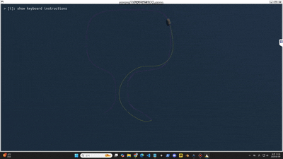
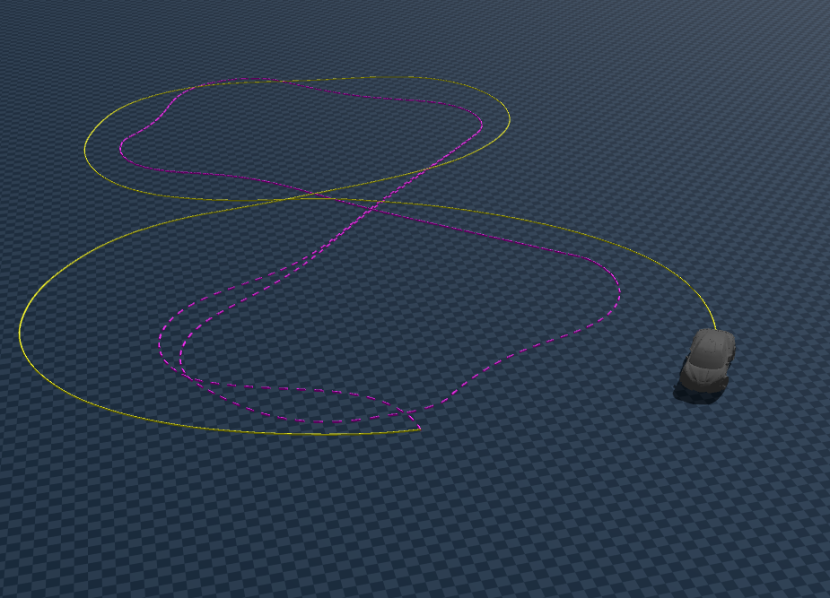
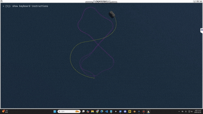
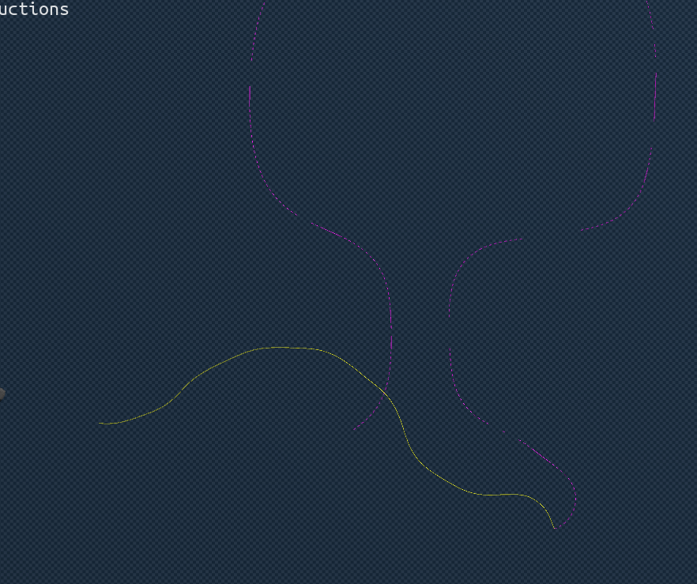
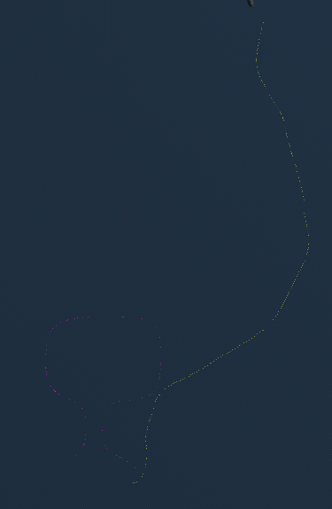
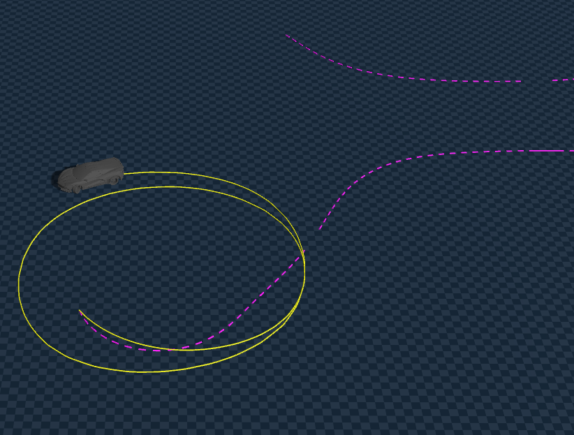

# PID 제어를 활용한 Ground Truth 값
> 목표: blender와 같은 움직임을 genesis 세상에서 구현하는 것

### PID 제어란? 
자동 제어에서 가장 흔하게 사용되는 피드백 제어(Feedback Control) 방식
* P (Proportional, 비례): "현재의 오차에 비례해 핸들을 꺾음"
* I (Integral, 적분): "과거에 누적된 오차를 보고 핸들을 더 꺾음"
* D (Derivative, 미분): "오차가 변하는 속도(미래 예측)를 보고 핸들을 미리 조절함"

PID 제어를 통해서 blender 세상에서 추출한 데이터(a,k) 를 통해서 genesis 세상에서 정확한 움직임 모사
> Unicycle Kinemetics Model Acceleration & Curvature 에 따라 (a,k)는 blender와 genesis 의 공통 변수

### PID 제어를 사용하여 정확한 제어값을 추출
* a,k를 동일하게 만드는 제어값(throttle, steer)을 수학적 계산이 아닌 실제 차량의 움직임을 통해서 추출
* PID 제어를 통해 만들어진 제어값을 mlp 학습에 사용

### PID Feedback to PID FeedForward
> lookahead point(idx)를 통해 10 프레임 미리 (a,k)를 계산하여 feedforward 제어값을 추출
* PID의 사후보정 성격을 극복하고 예측 제어 능력을 확보
* 물리적 지연 시간을 계산에 포함하여 **'미리 행동'**하게 함으로써, 실시간 제어

---
### mlp 학습

#### loss 및 state

| state | 의미 | 정규화 스케일 | 가중치 |
| :--- | :--- | :--- | :--- |
| v_long | 전방 속도 | 1.0 | 1.0 |
| v_lat | 횡방향 속도 | 1.0 | 1.0 |
| yaw_rate | 회전 속도 | 1.0 | 1.0 |
| a | 가속도 / 경로 정보 | 1.0 | 1.0 |
| k | 곡률 / 경로 정보 | 1.0 | 1.0 |
| cte | 횡방향 오차 | 1.0 | 1.0 |
| he | 헤딩 오차 | 1.0 | 1.0 |
* Standard Scaler 사용하여 scale 모두 1로 정규화
    * cte 는 PID 제어라 오차가 적어 표준편차로 나눌 시 inf 로 발산을 막기 위해 1로 나눠줌
#### 데이터 증강
* PID 제어는 오차가 매우 적기 때문에 오류가 일어났을 시 복구 하는 방법을 못 배울 수 있다
> 데이터 증강(Augmentation) 으로 노이즈를 섞어주어 피드백 제어 능력을 학습시킴(robustness)

| 노이즈 주입 | 스케일 | 설명 |
| --- | --- | --- |
| cte_noise_std | 0.1 |  거리 오차에 대해 약 **10cm** 표준편차의 노이즈 |
| he_noise_std | 0.02 |  방향 오차에 대해 약 **1.14도(0.02rad)** 표준편차의 노이즈 |

* 방법: 평균이 0이고 설정된 표준편차를 가진 가우시안(정규) 분포에서 숫자 랜덤 선택
* 의미: 매 학습 단계마다 차가 원래 위치보다 왼쪽이나 오른쪽으로 조금씩 치우쳐 있다고 AI를 속여 복구 능력 학습

#### 제어 가중치
$$S_{target} = S_{original} + (0.3 \cdot \Delta CTE) + (0.2 \cdot \Delta HE)$$

| 제어 항목 | 가중치 | 설명 |
| --- | --- | --- |
| kp_recovery | 0.3 | CTE에 대해 경로 중앙으로 복구하기 위해 핸들을 얼마나 돌리는지 |
| kd_recovery | 0.2 | HE에 대해 적용되지만 CTE 오차를 보정하기 위해 핸들을 돌릴때 너무 꺾지 않도록 조절하는 힘 |

#### 구조

| 구분 | 상세 내용 |
| :--- | :--- |
| **Input** | v_long, v_lat, yaw_rate, a, k, cte, he |
| **Hidden** | 64 -> 32 -> relu |
| **Output** | throttle, steer |

### checkpoint 주행 테스트

| 경로 | 설명 | 영상 |
| - | - | - |
|  | checkpoint 를 통해 **overfitting** 된 경로 주행 |  |
|  | checkpoint 를 통해 **처음보는 경로** 주행 | |

### groundtruth 찾는 중
| 구분 | 영상 | 루프 | 설명 |
|---| --- | --- | --- |
| cpu|  | open-loop | scipy cpu 알고리즘으로 찾은 gt, 미세하게 방향은 틀려도 모양 나옴 |
| gpu|  | open-loop | gpu, 16k개 env 에서 gt, 너무 오차가 큼 |
| cpu |  | closed-loop | 위에서 찾은 gt를 통해서 cte,he 피드백 오차 수정 가능하도록 학습,  cpu_gt 값이 정확하지만 누적오차때문에 벗어났다고 가정, gt 학습한 체크포인트로 추론 |
| gpu | x | closed-loop | gpu_gt 가 정확하다 라고 가정 후 학습 후 체크포인트로 추론(그나마 open 오차가 적었던 cpu도 안돼서 실행해보지 않음)|