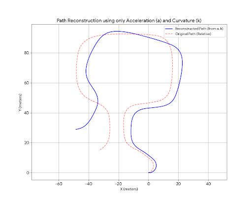
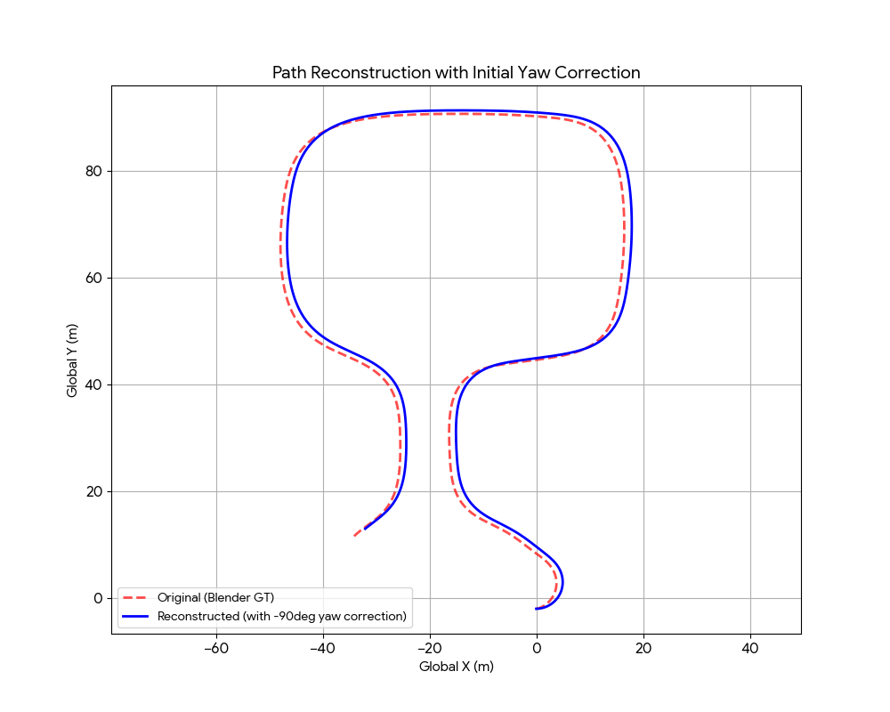
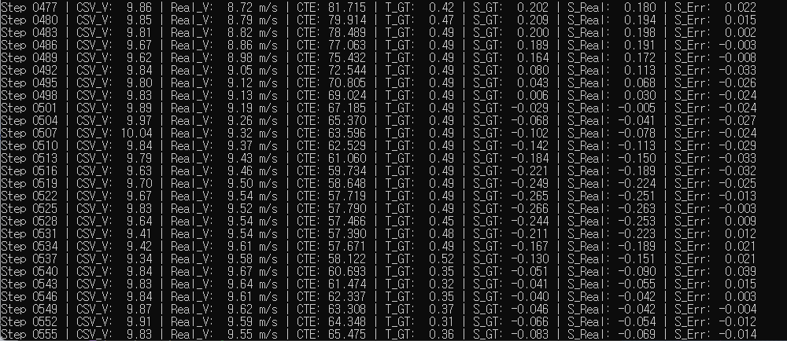
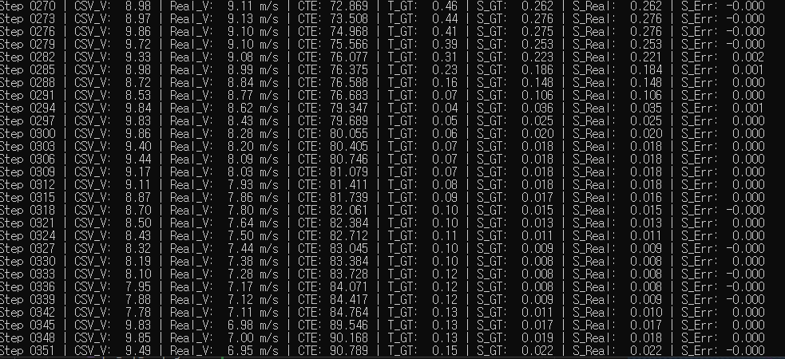
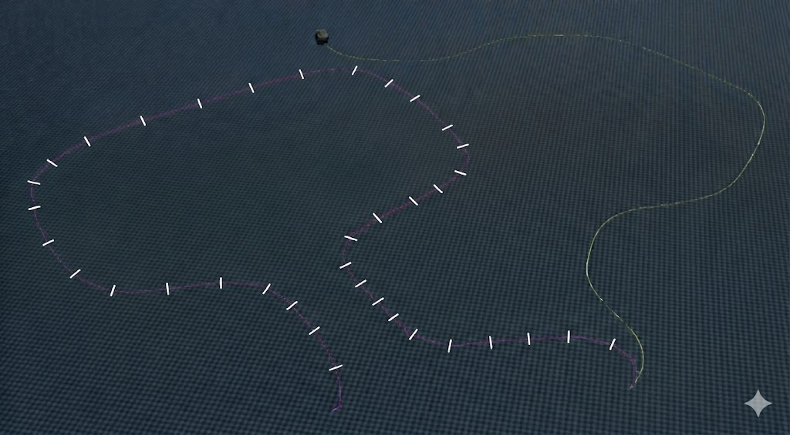

# MPC Optimization
  > Model Predictive Control - Optimization (MPC 최적화)는 차량의 동역학 모델을 기반으로 일정 시간 지평(Horizon) 내의 미래 상태를 예측하고, 최적화된 제어 입력(T, S)을 실시간으로 산출하는 기법이다.

### a,k에 의한 궤적을 완벽하게 동일하게 하라는 피드백 반영
| before | after |
| - | - |
| |  |
| blender 로컬 속도 | blender 글로벌 속도 |

blender 데이터 추출 코드 수정: 차량의 `로컬 속도`를 추출하던걸, `global 속도`로 추출하여 코너에서 `슬립 속도`가 잘 반영되지 않던 것을 해결

---

## MPC 최적화 

### trouble shooting

* 비정상적인 가속도로 출발하는 blender의 차량: 첫 프레임 예외처리해주고 속도를 직접 주입해서 주행하도록 함

> 초반 blender 차량이 물리에 어긋나는 속도로 가속하는 문제 때문에 첫 2프레임은 속도값을 지정하여 최적화 해주었고, genesis 에서 경로 주행할때는 차량 관절속도에 속도를 부여한 상태로 주행 시작했습니다.

* max_torque 120까지 올리니깐 경로 어느정도 추종함

* URDF 파일의 steering effort 를 10000 -> 100000으로 올려서 steering gt 값과 실제 차량에 가해지는 steering 명령을 거의 동일하게 함
(effort 는 관절이 낼 수 있는 최대 힘 N*m)

* blender에서 차량 바퀴 friction 이 2.0 이라 이거에 맞춰 urdf 수정

* test script kp 10000 -> 100000으로 올림

## fine tuning 정리

| window | accel_weight | steer_weight | beta_cte | beta_he | 결과 |
| :--- | :--- | :--- | :--- | :--- | :--- |
| 5| 1.0 | 1.0 | 50.0 | 10.0 |   |
| 5 | 5.0 | 15.0 | 20.0 | 10.0 |  |
| - | - | - | - | - | 아래부터는 타이어 슬립이 원인이라 생각해서 핸들의 반응성 10배 높여줌 |
| 12 | 1.0 | 1.0 | 50.0 | 10.0 |  |
| 12 | 1.0 | 0.1 | 150.0 | 50.0 | 중단 | 조향 우선, 경로 벌점 max &rarr; 진동 발생 |
| 12 | 1.0 | 0.5 | 50.0 | 80.0 | - | 진동줄이기 위해 횡방향 벌점 낮춤   |

### 현재까지 best
 
* 경로의 모양은 나오지만 steering 이 blender만큼 나오지 않음
* steering 이 잘나온다면 경로 추종할 수 있을 것으로 보임
* 90도 돌아가 있는것 처럼 보이는 것도 steering 이 잘 나오지 않아 오차 누적으로 보임

### 차량의 steer 최적화값과 차량의 steer 비교

* steer error 거의 0에 수렴 (s_err 은 s_gt값과 차량의 steering 값의 차이: 마찰 반영된 steer 값) 
  * 슬립이 반영된 타이어 각도와 최적화 값 비교
  * 차이가 거의 0 &rarr; 최적화 값이 올바르지 않다는 뜻

## 이유 분석
 

> 주행구간을 12등분 하여 각각 구간의 시작시엔 정확한 위치에서 시작하는데, 구간의 끝과 다음 구간의 시작에서 계산된 gt값에만 의존하여 주행하기때문에 `구간 0`의 끝에서 오차 누적으로 라인을 벗어났어도 `구간 1`의 시작의 제어값은 정확한 위치에 있다고 가정하고 계산된 gt값이기에 오차가 줄여지지 않음.

### 방법 1: 1개의 worker MPC 최적화
> 1개의 worker로 12 frame 씩 최적화
* 12배 느려짐
* 현재 최적화 4시간 소요(650 frame) &rarr; 48시간 예상

### 방법 2: 병렬 + overlap 
> 12등분을 하되, 각 구간이 시작할 때 이전 구간의 마지막 '오차 상태'를 수동으로 입력해 주는 게 아니라, 앞 구간과 20프레임 정도 겹치게(Overlap) 만듦
* 시간 아낄 수 있음
* 오차 존재

## 시간이 너무 오래 걸려 경로 변경하여 시도중

* 120 frame
* 슬립에 의해 변하지 않아서 거의 100% 일치하는 데이터
  * 빨강은 경로
  * 초록은 차량 경로
  * 파랑은 차량의 슬립한 경로
