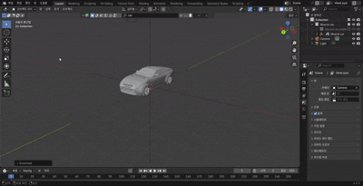
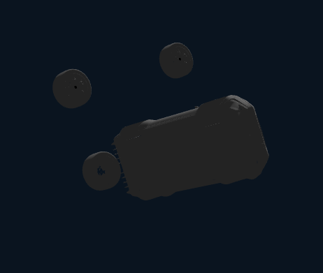

#  Vehicle Modeling & Genesis Integration

## Blending

- Blending 에서 모델 불러오기
- blender size: 14MB ~67.8MB 
- obj size: 11MB ~69MB 
----
## Genesis Import

`
 car = gs.morphs.URDF(
        file="../urdf/car.urdf",
        fixed=False,
        pos=(0, 0, -0.6)  # ✅ 초기 위치 보정 (공중 날림 방지)
    )
    scene.add_entity(car)
`
- 위 코드로 genesis에 import (car_sim.py) 

### 하나의 obj 파일로 업로드
- 하나의 `rigid body` 로 인식
- `joint` 붙일 수 없음
- 바퀴 회전 불가
- 하나의 강체가 이동하는 것 
---

## 해결책 : car_body + 4 wheels
**다섯개의 파트로 분할**


- car.obj : 차량 본체
- flwheel.obj : 앞 왼쪽 바퀴
- frwheel.obj : 앞 오른쪽 바퀴
- blwheel.obj : 뒤 왼쪽 바퀴
- brwheel.obj : 뒤 오른쪽 바퀴

---
## 좌표 불일치 현상




### 문제 요약
- 하나로 올리면 rigid body라 조인트 불가 → 분리해서 올림
- 분리 후에도 바퀴 위치/축이 어긋남(같은 좌표라도 상대 위치 다름)
- 바퀴 mesh(랜더링용 파일)를 (0,0,0)으로 리셋 후 URDF에서 붙여도 offset(치우침/기울어짐) 발생
- 일부 바퀴가 기울거나 반전되어 보임


---

### 원인 가설
- 오브젝트 원점이 축(Axle: 바퀴의 중심을 통과하면서 회전을 지탱하는 막대) 중심이 아님
- Blender 변환 (Location/Rotation/Scale) 미적용 → Export 시 내부 변환 남음  → blender 에서 ctrl+A로 scale reset
- 좌표계/축 세팅팅 차이(Blender vs URDF/엔진) → Forward/Up 불일치
- 단위/스케일 차이(Blender Scene Scale ≠ URDF 미터)
- URDF에서 mesh scale 불일치치


### 해결 방안 
- 원본 mesh파일만 먼저 로드해서 기준 프레임/축 확인
- 앞왼쪽 휠 1개만 추가 → origin xyz/rpy 맞는지 확인 → 나머지 복제
- 휠 회전축이 엔진에서 어떤 **축**인지(Y or Z) 확인 후 rpy로 교정
- 위치가 일관되게 오프셋(치우침)이면 **좌표계/스케일** 문제 의심(Export 설정 재확인)


### 문제 해결 이후 계획
- `genesis_car_urdf.md` 보고서의 `car_test.py` 에 blending 적용
- 좌표 설정 기반 움직임
- **차체 제어 플러그인 Suspension 추가**

### Suspension 
- 위 blender 모델에 서스펜션 존재 x
- brake 만 존재
- URDF로 구현 필요
```
import bpy

# URDF(car.urdf) 기준 링크/조인트 이름 반영
CHASSIS_NAME = "chassis"

# URDF joint origin xyz (chassis 기준) 값을 사용해 각 휠 위치 지정
# <joint name="joint_fl" ... origin xyz="0.12511 2.53016 0.658992"/>
# <joint name="joint_fr" ... origin xyz="2.10912 2.53010 0.657567"/>
# <joint name="joint_bl" ... origin xyz="0.12511 -0.83093 0.658992"/>
# <joint name="joint_br" ... origin xyz="2.10912 -0.83099 0.657567"/>
WHEELS = [
    {"name": "wheel_fl", "pos": (0.12511,  2.53016, 0.658992)},
    {"name": "wheel_fr", "pos": (2.10912,  2.53010, 0.657567)},
    {"name": "wheel_bl", "pos": (0.12511, -0.83093, 0.658992)},
    {"name": "wheel_br", "pos": (2.10912, -0.83099, 0.657567)},
]

chassis = bpy.data.objects.get(CHASSIS_NAME)
assert chassis, "chassis 오브젝트를 찾을 수 없습니다."

def ensure_rigidbody(obj, as_active):
    if obj.rigid_body is None:
        bpy.context.view_layer.objects.active = obj
        bpy.ops.rigidbody.object_add()
    obj.rigid_body.type = 'ACTIVE' if as_active else 'PASSIVE'
    obj.rigid_body.use_deactivation = False

for w in WHEELS:
    wheel = bpy.data.objects.get(w["name"])  # 씬에 존재하는 휠 오브젝트 필요
    if wheel is None:
        print(f"skip: {w['name']} not found")
        continue

    # 차체 Passive, 바퀴 Active로 강체 설정
    ensure_rigidbody(chassis, as_active=False)
    ensure_rigidbody(wheel,   as_active=True)

    # 기존 동일 이름의 Empty 제거
    cons_name = f"suspension_{w['name']}"
    old = bpy.data.objects.get(cons_name)
    if old:
        bpy.data.objects.remove(old, do_unlink=True)

    # 제약용 Empty 생성: URDF joint origin xyz 위치로 배치
    bpy.ops.object.add(type='EMPTY', location=w["pos"])  # 월드 좌표 사용
    empty = bpy.context.active_object
    empty.name = cons_name

    # Generic Spring 제약 추가 (차체 <-> 바퀴)
    bpy.ops.rigidbody.constraint_add()
    c = empty.rigid_body_constraint
    c.type = 'GENERIC_SPRING'
    c.object1 = chassis
    c.object2 = wheel

    # 선형 제약: X/Y/Z 모두 0으로 고정 (축 제약)
    c.use_limit_lin_x = True; c.limit_lin_x_lower = 0.0; c.limit_lin_x_upper = 0.0
    c.use_limit_lin_y = True; c.limit_lin_y_lower = 0.0; c.limit_lin_y_upper = 0.0
    c.use_limit_lin_z = True; c.limit_lin_z_lower = 0.0; c.limit_lin_z_upper = 0.0

    # 스프링(Z) 활성화 및 강성/감쇠 설정 (URDF의 스프링 상수는 직접 매핑 없음 → 설정치로 근사)
    c.use_spring_lin_z = True
    c.spring_stiffness_lin_z = 5000.0  # 권장 3000~10000
    c.spring_damping_lin_z   = 300.0   # 권장 100~1000

    # (선택) 각 자유도 잠금: Blender 내 회전 불필요 시 고정
    c.use_limit_ang_x = True; c.limit_ang_x_lower = 0.0; c.limit_ang_x_upper = 0.0
    c.use_limit_ang_y = True; c.limit_ang_y_lower = 0.0; c.limit_ang_y_upper = 0.0
    c.use_limit_ang_z = True; c.limit_ang_z_lower = 0.0; c.limit_ang_z_upper = 0.0
```

- 간단히: URDF 조인트 위치대로 Empty 만들고 `Generic Spring` 걸어줌.
- X/Y/Z 이동은 0으로 잠그고, Z축만 스프링 켬 → 위아래로 "출렁".
- 바퀴 구동은 URDF에서 처리하니, 블렌더에선 각도 잠가도 OK(필요하면 풀기).