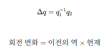
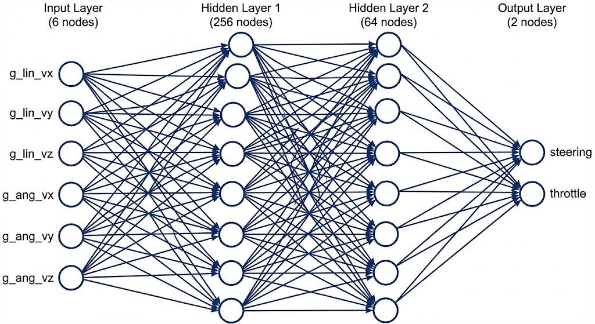
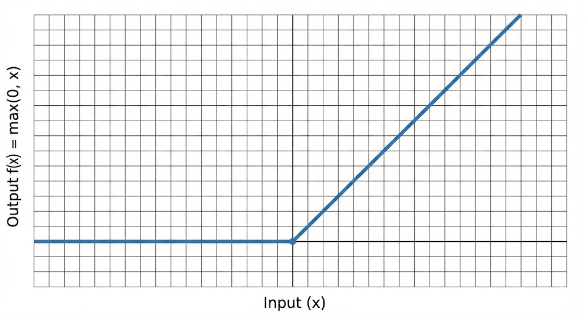
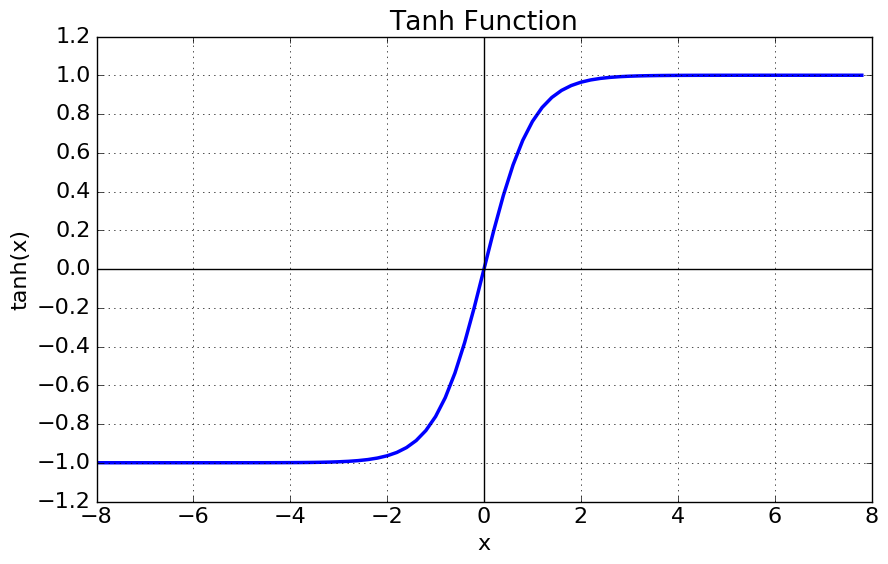
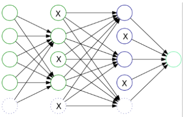

# Adding MLP to Genesis

## State 동기화
* Blender 차량의 데이터를 blender 좌표계에서 추출하려함
* 너무 변수가 많아 학습에 불리함
* car_x,y,z 같이 좌표 데이터는 Behavior Cloning 에 필요가 없음
    * Genesis & Blender 좌표계 다르므로, 오히려 학습을 망침
```
frame	car_x	car_y	car_z	car_yaw	car_vx	car_vy	car_vz	fl_x	fl_y	fl_z	fl_vx	fl_vy	fl_vz	fr_x	fr_y	fr_z	fr_vx	fr_vy	fr_vz	rl_x	rl_y	rl_z	rl_vx	rl_vy	rl_vz	rr_x	rr_y	rr_z	rr_vx	rr_vy	rr_vz
```
* 또한 현재 Blender Rig에 Steering 이 인터페이스로만 제공된다는 걸 확인
  
### 새로운 방법 : 쿼터니안 차분(difference) 기반 state 추출

* **이전회전 state 과 현재회전 state 의 변화를 통해서 회전의 순간적인 속도를 알려주는 3d 벡터를 구함**

#### 쿼터니안이란? : 회전 상태

* x,y,z 는 회전축 방향, w는 1로 정규화 해서 사용 &rarr; 3 dof(4dof 이지만 위치는 정규화화)
* Euler(오일러) 각은 Roll/Pitch/Yaw 의 순서에 따라 결과가 달라짐
    * URDF Mesh 입힐때 바퀴가 오일러각 설정 순서에 따라 바뀐것이 확인됨
* 쿼터니안은 변하지 않음음

### 한 frame 에서 속도 및 조향 상태(state) 구하기
* state = 선속도(가속,감속) + 각속도(조향)
* `선속도`: 위치의 difference 
* `각속도`: 쿼터니언의 difference
* 한 frame 에서의 물리 파라미터를 위 방법으로 구할 수 있다다

### 31 &rarr; 6 parameter (Steering)
* 변수를 줄여 정확한 학습, 압축된 동역학 파라미터
* 6 DoF 로 차량의 움직임 표현 가능
* 3개의 선속도(g_lin_vx, g_lin_vy, g_lin_vz)
* 3개의 각속도(g_ang_vx, g_ang_vy, g_ang_vz) 

* 6dof 의 state &rarr; action(steering angle, throttle)의 mapping 을 학습


### 차량의 움직임은 6 dof 로 표현 가능
* 직진을 위한 선속도 (g_lin_vx, g_lin_vy, g_lin_vz)
* 조향을 위한 각속도 (g_ang_vx, g_ang_vy, g_ang_vz)

### 문제점 발생: 'angular_velocity' 없음 에러
`AttributeError: 'RigidBodyObject' object has no attribute 'angular_velocity'`
* 바퀴 오브젝트가 실제 rigid body가 아니거나
angular_velocity 값이 블렌더에서 제공되지 않는 상태  
### 이유 : rigging 시스템의 바퀴회전은 mesh의 local rotation만 바꾸고, rigid_body의 angular_velocity를 갱신하지 않았음

* bullet 엔진이 바퀴의 실제 동역학을 계산하지 않음 `rig-propagation` 방식
    * 앞바퀴 : steering angle 을 Euler Z 로
    * 뒷바퀴 : 매 프레임 뒷바퀴의 transform 을 Euler rotion에 업데이트
    * angular_velocity 업데이트 x
    
 ### blender 물리 기반이 아니라 rig propagation (pose 기반 kinematic)이라는 뜻
* 하지만 Genesis는 URDF 로딩시 동역학 기반임
* 따라서 동역학 데이터를 추출해서 Genesis에서 Behavior Cloning이 제대로 일어나게 tuning 해줘야함
* state &rarr; action 의 mapping만 일치하면 상관없음

  
  

---
## training: Behavior Cloning
*Blender에서 수집한 expert data(csv)를 읽고

state(6DoF) → action(steering, throttle)를 지도학습으로 직접 학습
    * 6DoF를 바탕으로 action을 예측하도록 학습


### 향후 방향
* 세밀한 움직임
* ppo
## PPO (강화학습 Fine-Tuning) 
* BC로 학습한 정책을 초기 파라미터로 사용하거나
* 완전히 새 Actor-Critic을 만들어 초기화한 뒤
* 시뮬레이터(CarSimulationWrapper)를 실제로 돌리면서 보상 함수를 기준으로 정책을 업데이트함.


### MLP 구조


```
Input (6)
  ↓
Linear(6→64) -- Hidden Lrmfja ayer1 
ReLU -activate f
  ↓
Linear(64→64) -- Hidden Layer2
ReLU -activate f
  ↓
Linear(64→2) -- Output Layer
tanh -activate f
Output (2)
```



#### 1. 입력층 (Input Layer)
* 6 dof 입력(g_lin_vx, g_lin_vy, g_lin_vz, g_ang_vx, g_ang_vy, g_ang_vz)

| Feature  | Meaning    |
| -------- | ---------- |
| g_lin_vx | 전진 속도      |
| g_lin_vy | 측방 속도      |
| g_lin_vz | 상하 속도      |
| g_ang_vx | roll rate  |
| g_ang_vy | pitch rate |
| g_ang_vz | yaw rate   |


##### Hidden Layer 1 (6 &rarr;256 차원)
* 차량이 현재 가속 중인지 감속 중인지 (vx 변화율 패턴)
* 슬립/드리프트가 발생할 가능성 (vy/vx 비율 패턴)
* 급격한 자세 변화(roll/pitch/yaw rate 급등)
* 상하진동(gz)과 조향 안정성의 관계
* 각축 조합 패턴 (예: yaw rate·vx의 조합 → 코너링 강도)
원시 6-DoF 상태에서 다양한 ‘1차적 운동 패턴’을 폭넓게 확장하여 학습

##### ReLu 활성화 함수

* 비선형성 부여 &rarr; 복잡한 물리적 관계를 표현할 수 있도록 함
* 6DoF 를 64차원 feature로 확장
* 64차원의 feature로 아래를 조합할 수 있게 확장
    * 전진/후진 패턴 (vx 정/부호)
    * lateral drift 패턴 (vy 크기)
    * 차체 불안정(roll/pitch/yaw rate)
    * 속도 변화율에 따른 acceleration proxy(대리값)
 
##### Hidden Layer 2(64 &rarr; 64 차원)
* 안정적 주행을 유지하는데 중요한 관측치 조합
* steering 결정에 영향이 큰 동역학 feature
* throttle 결정에 필요한 acceleration feature
* mapping의 develop을 위한 정보 가공/정리 단계

##### ReLu 활성화 함수

* 비선형성 부여 &rarr; 복합적인 의미를 조합을 통해 만듦 

#### 3. 출력층 (Output Layer)

| 출력       | Activation | 최종 범위   |
| -------- | ---------- | ------- |
| steering | tanh       | [-1, 1] |
| throttle | sigmoid    | [0, 1]  |
* [-1,1] 정규화된 조향각
* [0,1] 정규화된 선속도도

### BC 결과 (직진)

(https://github.com/i1uvmango/Genesis_ai_graphicstudy/issues/10#issue-3669645067)

### mlp 보강 방법
* dropout (특정 노드를 없애 일반화 성능 높임)

* batchnorm (학습을 빠르고 안정적이게 하기 위해 각층의 입력 분포 정규화)


---
