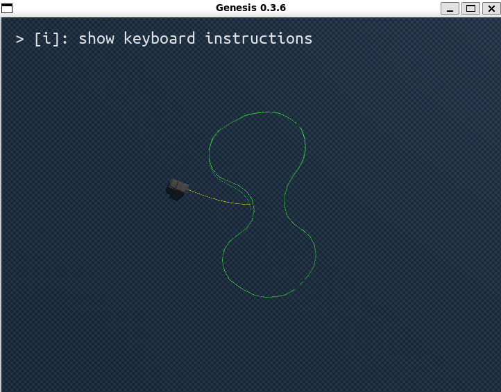
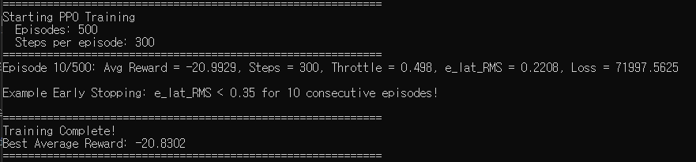
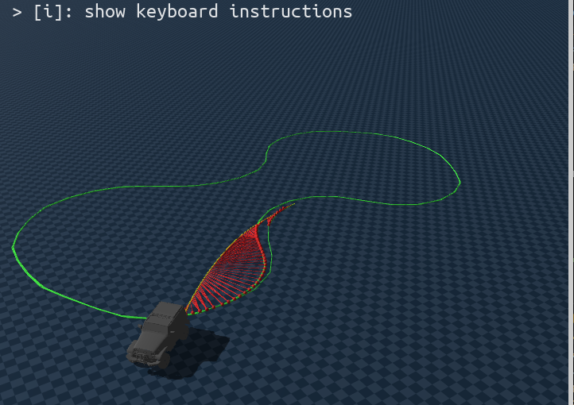
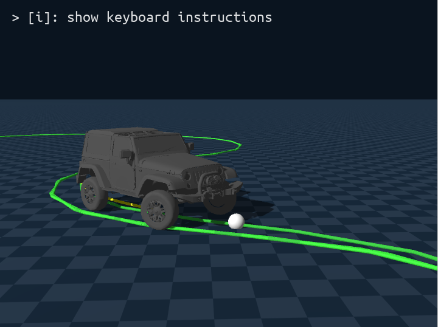
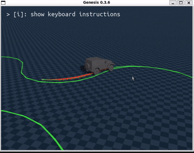

# Waypoint using pure-pursuit algorithm

1. genesis 솔버의 미분가능성에 집중해서 많은 시도를 해봄.
2. 하지만 결론 : 차량 steering/throttle을 컨트롤 하기 위한 rigid solver 는 지원하지 않음
3. 코드위키와 AI 와 계속 discussion 한 결과
    * 코드위키에서 제공한 예제로 실험도 했지만 `RigidSolver.get_qpos()는 gradient tracking을 지원하지 않는 것으로 보입니다.` 라는 결론 내림
4. genesis 의 자체 미분을 통해 gradient descent 로 loss 를 줄이는게 베스트지만 지원되지 않음

```
물리 엔진의 모든 역학을 고려한 최적화
이론적으로 가장 효율적인 학습
```


### Gradient Descent

#### 구현 내용:

* sim_options.requires_grad=True 설정으로 Genesis의 미분 모드 활성화
* gs.from_torch()를 사용하여 PyTorch 모델 출력을 Genesis tensor로 변환
* rigid_solver.get_qpos()를 통해 시뮬레이션 결과를 획득하여 Loss 계산

#### 결과:

* Genesis의 RigidSolver.get_qpos()가 반환하는 tensor의 requires_grad 속성이 False로 확인됨
* 이로 인해 물리 시뮬레이션을 통한 gradient flow가 MLP까지 전달되지 않음
* 동일한 문제가 get_qpos(), get_dofs_velocity() 등 모든 상태 조회 API에서 발생

#### 원인 분석:
* Genesis의 RigidEntity(URDF/MJCF 기반)가 MPMEntity와 달리 미분 가능한 상태 조회를 완전히 지원하지 않는 것으로 추정


### 결론
* genesis 의 rigid solver 미분 가능성 미지원
* **pure-pursuit 알고리즘(제어 알고리즘) + mlp 보정기(residual)** 대안을 사용하기로 함  


## time index 기반 제어의 문제점


* spawn 방향 미정렬 &rarr; 오차가 있는 상태로 시작하여 모델이 차량 방향을 수정해야함 &rarr; 시간이 걸림
* 시간에 따라 목표 point가 움직임 &rarr; 오차 누적


## Spatial index 기반 목표 지점 설정

* 시간에 따라 목표 point가 움직임 &rarr; 오차 누적
* 공간에 따른 목표 point의 변화


| 상황        | Time-based |**Spatial-based**|
| --------- | ---------- | ------------- |
| 차가 느려짐    | 목표는 계속 도망  | 목표도 같이 느려짐    |
| 차가 멈춤     | 목표는 저 멀리   | 목표도 멈춤        |
| 코너에서 미끄러짐 | 오류 폭발      | 오류 제한         |
| 학습 안정성    | 매우 나쁨      | **매우 좋아짐**    |

* 대신 차량이 충분히 빠르지 못할 경우 할당된 프레임이 제한적이라 트랙을 다 못 돌 수도 있음


### 초기 방향 정렬
*   **현상**: 차량이 시작부터 경로의 반대 방향을 보거나, `e_head`(방향 오차)가 매우 큰 값(약 3.14 rad, 180도)으로 고정되어 오차 누적에 의해 제어가 잘 되지 않았음

*   **해결**: 
    *   `train_ppo.py`의 `load_reference` 함수에서 경로점(x, y)의 변화량을 미분(`atan2(dy, dx)`)하여 **접선 방향(Tangent Heading)을 직접 재계산**함.
    *   **결과**: 초기 스폰 시 차량이 경로와 완벽하게 정렬되고 `e_head`가 0에 가까워짐.



* 학습
* pure pursuit 알고리즘 성능이 너무 좋아서 10 에피소드만에 조기종료 &rarr; 조기종료 조건을 높였음


 
* 흰 점: lookpoint 
* 노란 선: 차량 실제 경로
* 초록 선: 목표 경로
* lookpoint 추정은 잘되는데 steering 이 일어나지 않았음

### steering 반응성 향상
*   `train_ppo.py`의 `initialize_simulation` 단계에서 조향 관절에 강력한 PD Gain 적용.
*   **KP (Stiffness)**: `4000.0` (강한 위치 제어)
*   **Force Range**: `±400.0` (충분한 토크)
*   **결과**: 바퀴가 명령에 따라 즉각적으로 회전하며 조향이 물리적으로 반영됨.

### Lookahead 전략 변경
*   **현상**: 코너 진입 시 반응이 느려 경로 안쪽을 파고들거나(Cutting), 늦게 꺾는(Understeer) 현상 발생. 

*   **해결**
    *   **Distance 기반** → **Fixed Frame Offset 기반** 수정
    *   현재 차량 위치(Closest Index)에서 무조건 **5프레임 앞(Index + 5)**을 목표점(Lookahead Point)으로 설정.
    *   **결과**: 속도나 거리에 상관없이 항상 "바로 앞"을 주시하게 되어, 코너 시작과 동시에 핸들을 꺾는 **극도로 민감하고 빠른 반응성** 확보.
    * 로스는 차량 현 위치 기준으로 계산(lookahead, loss 분리)
    *   (참고: 바퀴의 미세한 떨림은 이러한 높은 반응성에 기인한 자연스러운 현상임)

### 결과
*   **주행 안정성**: 차량이 트랙을 이탈하지 않고 고속으로 완주 가능.
*   **시각화**: `test_ppo.py`에 Lookahead Point 와 경로(노란 선) 시각화를 추가하여 제어 의도를 명확히 파악 가능.
*   **PPO 학습 준비 완료**: 이제 PPO를 통해 **스마트한 속도 조절(Throttle Control)**과 **극한의 코너링 보정(Residual Steering)**을 학습할 준비가 됨.
    

    
    * pure pursuit algorithm based control, no ppo training

