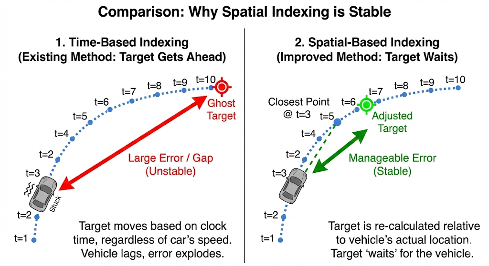
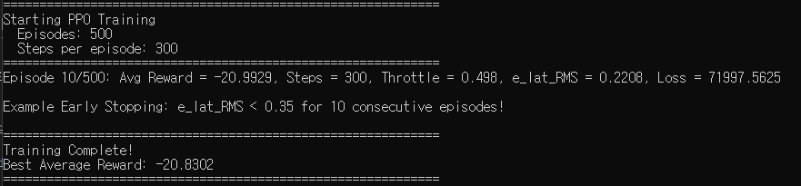
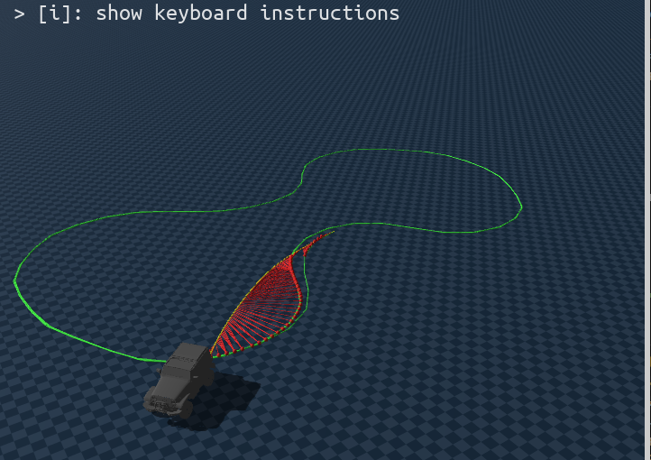
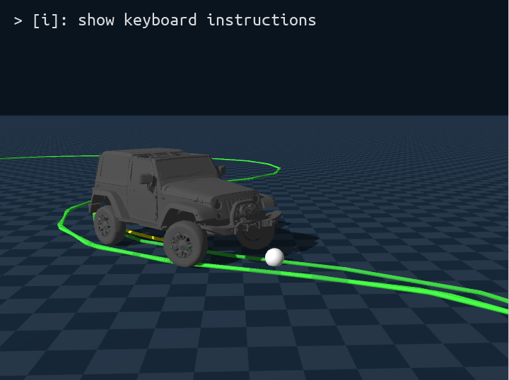
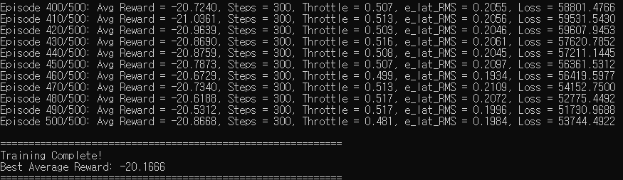

# Waypoint using pure-pursuit algorithm

1. genesis 솔버의 미분가능성에 집중해서 많은 시도를 해봄.
2. 하지만 결론 : 차량 steering/throttle을 컨트롤 하기 위한 rigid solver 는 지원하지 않음
3. 코드위키와 AI 와 계속 discussion 한 결과임
    * 코드위키에서 제공한 예제로 실험도 했지만 `RigidSolver.get_qpos()는 gradient tracking을 지원하지 않는 것으로 보입니다.` 라는 결론 내림
4. genesis 의 자체 미분을 통해 gradient descent 로 loss 를 줄이는게 베스트지만 지원되지 않음

```
물리 엔진의 모든 역학을 고려한 최적화
이론적으로 가장 효율적인 학습
```


## 시도한 접근법: End-to-End Differentiable Training
#### 목표: Genesis 시뮬레이터의 미분 가능한 물리(Differentiable Physics) 기능을 활용하여, 경로 추종 Loss를 직접 역전파하여 MLP 제어기를 학습시키고자 하였다.

#### 구현 내용:

* sim_options.requires_grad=True 설정으로 Genesis의 미분 모드 활성화
* gs.from_torch()를 사용하여 PyTorch 모델 출력을 Genesis tensor로 변환
* rigid_solver.get_qpos()를 통해 시뮬레이션 결과를 획득하여 Loss 계산

#### 결과:

* Genesis의 RigidSolver.get_qpos()가 반환하는 tensor의 requires_grad 속성이 False로 확인됨
* 이로 인해 물리 시뮬레이션을 통한 gradient flow가 MLP까지 전달되지 않음
* 동일한 문제가 get_qpos(), get_dofs_velocity() 등 모든 상태 조회 API에서 발생

#### 원인 분석:
* Genesis의 RigidEntity(URDF/MJCF 기반)가 MPMEntity와 달리 미분 가능한 상태 조회를 완전히 지원하지 않는 것으로 추정

#### 결론: 본 연구에서 시도한 End-to-End Differentiable Training 방식은 Genesis 시뮬레이터의 현재 구현 제약으로 인해 적용이 불가능한 것으로 확인


#### 결론
* genesis 의 rigid solver 미분 가능성 미지원
* **pure-pursuit 알고리즘 + mlp 보정기** 대안을 사용하기로 함  


### 시간 기반 목표 waypoint 지점의 문제점


* spawn 방향 미정렬 &rarr; 오차가 있는 상태로 시작하여 모델이 차량 방향을 수정해야함 &rarr; 시간이 걸림
* 시간에 따라 목표 point가 움직임 &rarr; 오차 누적

### 공간 기반 목표 지점 설정

* 시간에 따라 목표 point가 움직임 &rarr; 오차 누적
* 공간에 따른 목표 point의 변화


| 상황        | Time-based |**Spatial-based**|
| --------- | ---------- | ------------- |
| 차가 느려짐    | 목표는 계속 도망  | 목표도 같이 느려짐    |
| 차가 멈춤     | 목표는 저 멀리   | 목표도 멈춤        |
| 코너에서 미끄러짐 | 오류 폭발      | 오류 제한         |
| 학습 안정성    | 매우 나쁨      | **매우 좋아짐**    |

* 대신 차량이 충분히 빠르지 못할 경우 할당된 프레임이 제한적이라 트랙을 다 못 돌 수도 있음


### 초기 방향 정렬
*   **현상**: 차량이 시작부터 경로의 반대 방향을 보거나, `e_head`(방향 오차)가 매우 큰 값(약 3.14 rad, 180도)으로 고정되어 오차 누적에 의해 제어가 잘 되지 않았음

*   **해결**: 
    *   `train_ppo.py`의 `load_reference` 함수에서 경로점(x, y)의 변화량을 미분(`atan2(dy, dx)`)하여 **접선 방향(Tangent Heading)을 직접 재계산**함.
    *   **결과**: 초기 스폰 시 차량이 경로와 완벽하게 정렬되고 `e_head`가 0에 가까워짐.



* 학습
* pure pursuit 알고리즘 성능이 너무 좋아서 10 에피소드만에 조기종료 &rarr; 조기종료 조건을 높였음


 
* 흰 점: lookpoint 
* 노란 선: 차량 실제 경로
* 초록 선: 목표 경로
* lookpoint 추정은 잘되는데 steering 이 일어나지 않았음

### steering 반응성 향상
*   `train_ppo.py`의 `initialize_simulation` 단계에서 조향 관절에 강력한 PD Gain 적용.
*   **KP (Stiffness)**: `4000.0` (강한 위치 제어)
*   **Force Range**: `±400.0` (충분한 토크)
*   **결과**: 바퀴가 명령에 따라 즉각적으로 회전하며 조향이 물리적으로 반영됨.

### Lookahead 전략 변경
*   **현상**: 코너 진입 시 반응이 느려 경로 안쪽을 파고들거나(Cutting), 늦게 꺾는(Understeer) 현상 발생. 

*   **해결**
    *   **Distance 기반** → **Fixed Frame Offset 기반** 수정
    *   현재 차량 위치(Closest Index)에서 무조건 **5프레임 앞(Index + 5)**을 목표점(Lookahead Point)으로 설정.
    *   **결과**: 속도나 거리에 상관없이 항상 "바로 앞"을 주시하게 되어, 코너 시작과 동시에 핸들을 꺾는 **극도로 민감하고 빠른 반응성** 확보.
    * 로스는 차량 현 위치 기준으로 계산(lookahead, loss 분리)
    *   (참고: 바퀴의 미세한 떨림은 이러한 높은 반응성에 기인한 자연스러운 현상임)

### 결과
*   **주행 안정성**: 차량이 트랙을 이탈하지 않고 고속으로 완주 가능.
*   **시각화**: `test_ppo.py`에 Lookahead Point 와 경로(노란 선) 시각화를 추가하여 제어 의도를 명확히 파악 가능.
*   **PPO 학습 준비 완료**: 이제 PPO를 통해 **스마트한 속도 조절(Throttle Control)**과 **극한의 코너링 보정(Residual Steering)**을 학습할 준비가 됨.
    

    
    * pure pursuit algorithm based control, no ppo training


## PPO 학습
* proximal policy optimization
    * 이전 정책과 너무 멀어지지 않도록 제한(clipping)하면서 정책을 점진적으로 개선하는 강화학습 알고리즘

#### about 


```
PPO(Proximal Policy Optimization)는 Actor–Critic 구조를 기반으로,
정책(policy)이 한 번의 업데이트에서 과도하게 변하지 않도록 제한하면서
Policy Gradient를 안정적으로 수행하는 강화학습 알고리즘이다.

Actor network는 vector state를 입력으로 받아 action(또는 action 분포)을 출력하는 정책 네트워크이며,
Critic network는 같은 state를 입력으로 받아 해당 상태의 기대 누적 보상 V(s)를 예측한다.
critic 에서 얻은 V(s)를 critic이 예측한 다음 step 의 V(s+1) 에서 빼고, reward(s)를 더해서 advantage 계산
PPO에서 계산한 Advantage가 Actor의 loss에 반영되어 다음 업데이트에서 더 좋은 행동을 낼 확률이 증가하도록 정책이 조정된다.
```
* rollout = 데이터 수집 단위
* batch = gradient 계산 단위
* batch가 작다고 rollout이 쪼개지는 게 아님
* rollout은 policy update 전까지 고정

---
### mlp 입력변수

| 구분 | 사용되는 CSV 컬럼 변수 | 만들어지는 변수 | 의미 |
|------|------------------------|----------------|------|
| **Steer MLP** | `g_pos_x`, `g_pos_y` (전역 위치) <br> `g_qw·g_qx·g_qy·g_qz` (Quaternion) <br> `v_long` (전진 속도) <br> `steer` (레퍼런스 조향) <br> `throttle_norm` (레퍼런스 쓰로틀) | `steer_pp` – Pure Pursuit 로부터 계산된 기본 조향 <br> `e_lat` – 횡오차 (차량이 경로에서 옆으로 얼마나 벗어났는가) <br> `e_head` – 방위오차 (차량이 경로와 얼마나 다른 방향을 바라보는가) <br> `speed` – 현재 차량 속도 (`v_long`) | `steer_pp` 은 Pure Pursuit 가 목표점(look‑ahead)으로부터 구한 조향값이며, `e_lat`, `e_head`, `speed` 은 오차(state) 로서 PPO MLP에 전달됩니다. Steer MLP 은 이 4‑차원 텐서를 받아 Δsteer(조향 보정값)를 출력하고, 최종 조향은 `steer = steer_pp + Δsteer` 로 적용됩니다. |
| **Throttle MLP** | `g_pos_x`, `g_pos_y` (전역 위치) <br> `g_qw·g_qx·g_qy·g_qz` (Quaternion) <br> `v_long` (전진 속도) <br> `throttle_norm` (레퍼런스 쓰로틀) | `e_lat` – 위와 동일한 횡오차 <br> `e_head` – 위와 동일한 방위오차 <br> `speed` – 현재 차량 속도 (`v_long`) <br> `κ` – 보조 변수 (현재 구현에서는 0 으로 고정, 곡률·가속도 등으로 교체 가능) | Throttle MLP 은 `[e_lat, e_head, speed, κ]` 를 입력으로 보정된 쓰로틀 값을 직접 출력합니다. 레퍼런스 `throttle_norm` 은 학습 시 목표값으로 사용되지만, inference 에서는 MLP 출력이 최종 쓰로틀이 됩니다. |


## 현재 steering loss 

```python
L_path = w_lat * e_lat² + w_head * e_head² #steering
```
#### 다음을 개선
* - **속도 변화에 따른 곡률 추종 오차**: Pure Pursuit 의 look‑ahead 거리 \(L\) 은 속도에 비례해 조정하지만, 급가속/감속 시 실제 곡률 \(κ\) 와 \(L\) 의 불일치가 오차를 유발.
* - **steering 보정**: 토크 한계·조향 rate‑limit \(max\ Δsteer\) 로 급격한 명령을 제한, MLP는 제한을 고려해 부드러운 보정값을 출력.

#### 미구현 요소 (steering)
- **타이어 슬립·마찰 변화**: 슬립 비율과 마찰 계수 \(μ\) 가 속도·조향에 따라 비선형적으로 변함. 시뮬에서는 고속·코너링 시 마찰 감소를 모델링해 보정 보상에 포함.
- **센서 노이즈·상태추정 오차**: 센서 정보 위치·속도·heading 에 Gaussian noise \(σ≈0.01 m, 0.5°\) 를 주입하고, mlp 추정된 상태와 실제 사이의 차이를 고려.
- **모델링 불일치 (Genesis ↔ Blender)**: 질량·관성·타이어 파라미터·마찰계수 차이, 좌표계·단위 차이 등으로 동일 CSV 로도 동작이 달라짐. 이 차이를 보정하기 위한 보상 항목을 설계에 포함.

## 현재 throttle loss 
```python
e_speed = speed - ref_speed #throttle

if e_speed < 0:  # 목표보다 느림 → 강한 penalty
    L_speed = w_slow * e_speed²
else:            # 목표보다 빠름 → 약한 penalty
    L_speed = w_fast * e_speed²

L_throttle = L_speed + w_smooth * Δthrottle²
```
* **"느린 건 실패, 빠른 건 허용 가능"**


**SteerCorrectionMLP (4D)**:
| Index | 변수 | 설명 |
|:---:|:---|:---|
| 0 | `steer_pp` | Pure Pursuit 기본 조향값 |
| 1 | `e_lat` | 횡방향 오차 |
| 2 | `e_head` | 헤딩 오차 |
| 3 | `speed` | 현재 속도 |

**ThrottleMLP (4D)**:
| Index | 변수 | 설명 |
|:---:|:---|:---|
| 0 | `e_lat` | 횡방향 오차 |
| 1 | `e_head` | 헤딩 오차 |
| 2 | `speed` | 현재 속도 |
| 3 | `κ` | 곡률 (미구현, 0.0) |
---

* steering 은 pure pursuit 가 너무 좋아서 거의 개선 x
* throttle 은 개선보다는 안정성 있는 수치에 수렴함
    * 체감상 느린데 어떻게 개선해야 할지 고민해봐야 함


<video controls src="../res/0106/0106_ppo_trained.mp4" title="ppo trained control"></video>

https://drive.google.com/file/d/1_Cx-tLFzT3iqk14C9zzF8wkb-LZU2ZRn/view?usp=sharing
## next step

* 구동계 동기화 어떤 방식으로 할건지
* env, train, eval (환경, 학습, 실행/평가) 분리
* throttle 속도 보정(blender랑 비슷하게)