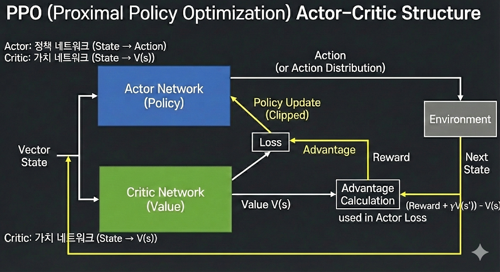
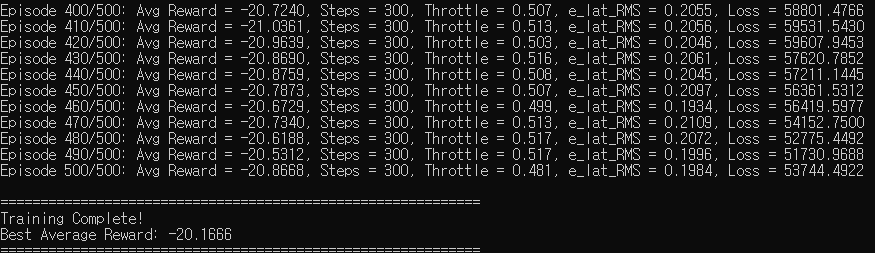
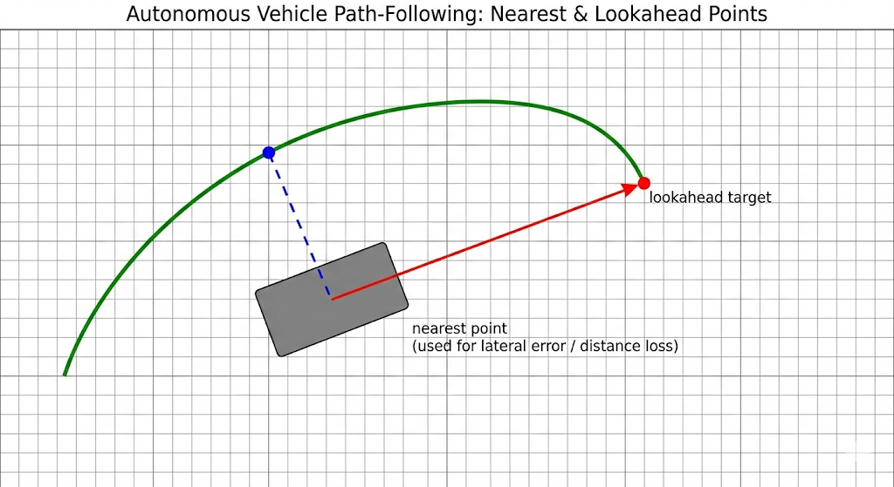
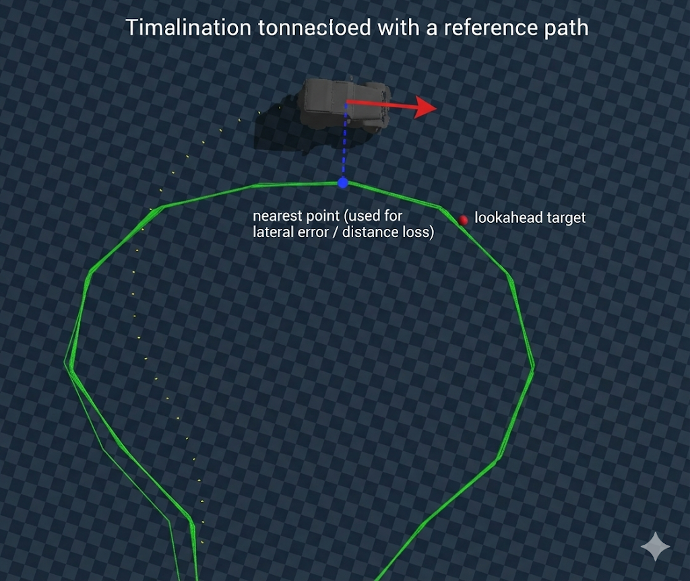
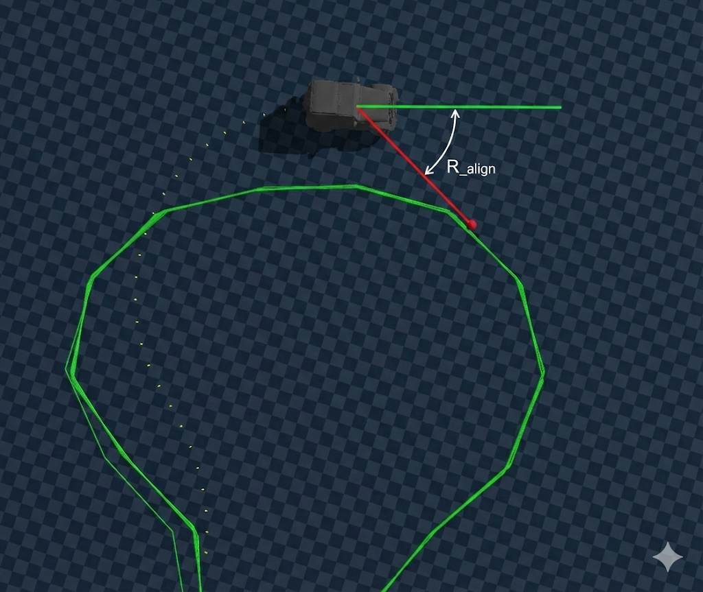
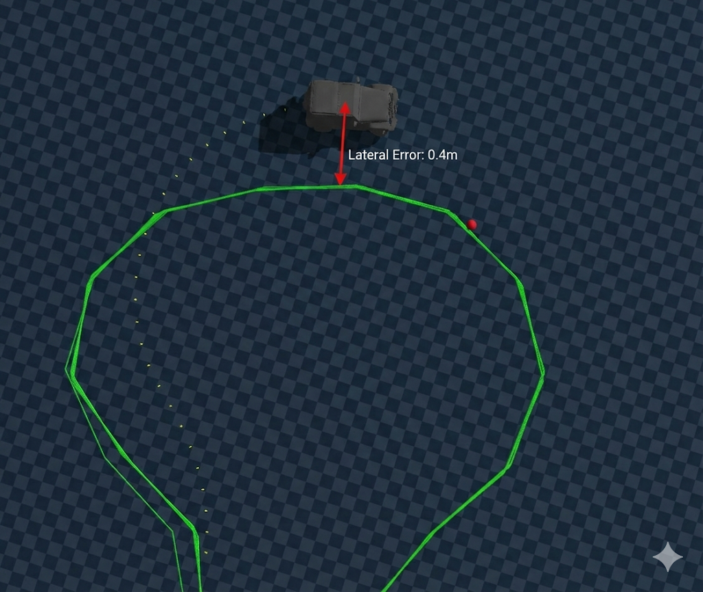
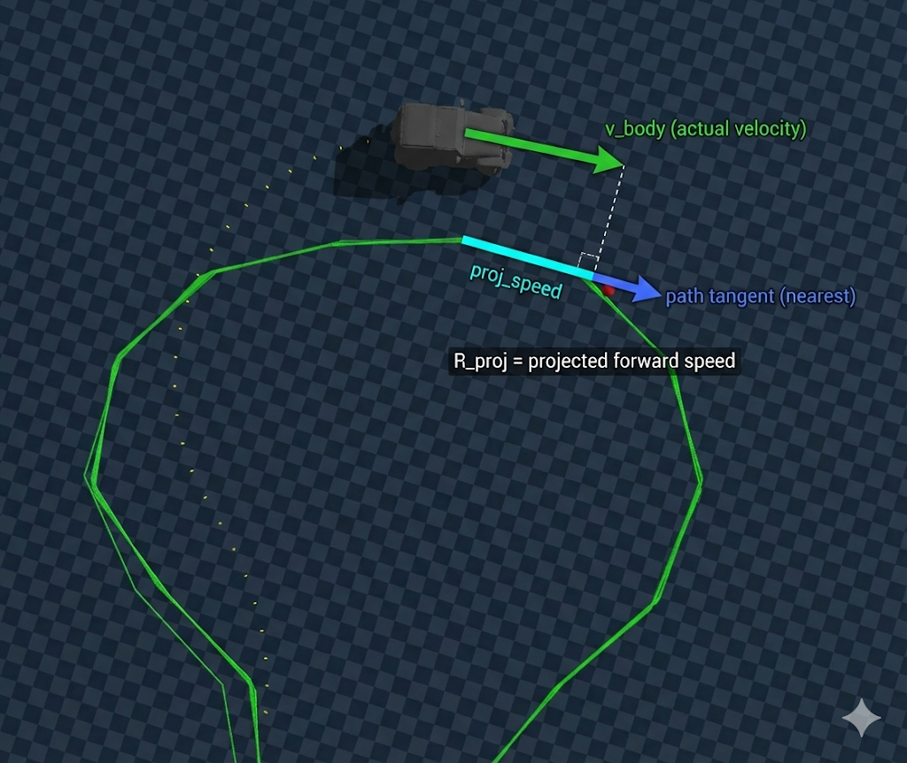
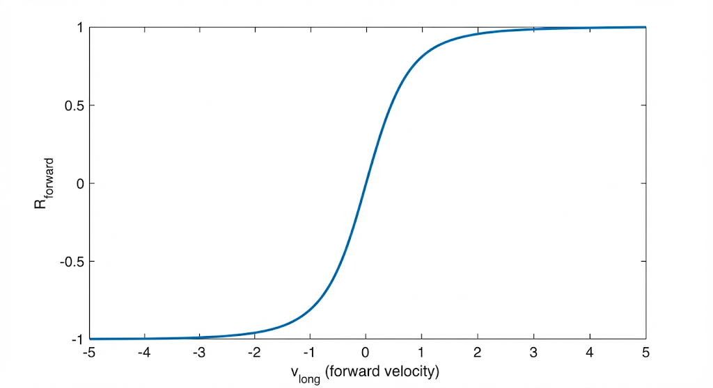
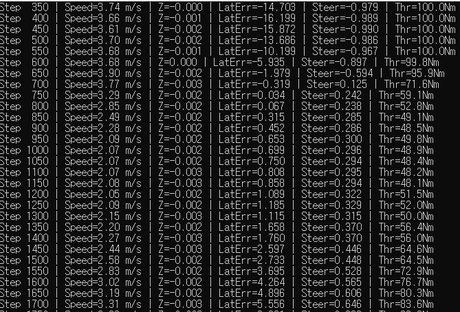
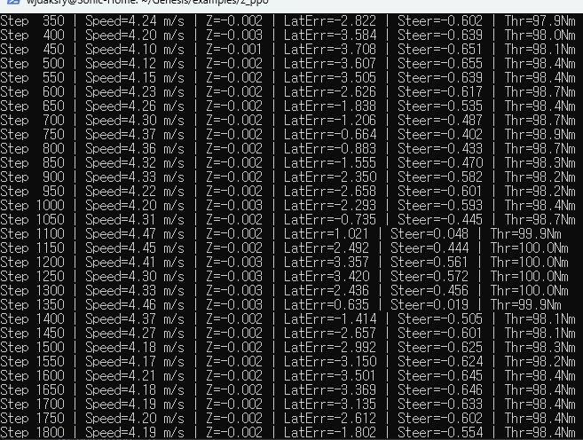

# Reinforced Learing : PPO(proximal policy optimization) 설계 


## PPO 학습
> * Residual 만을 강화학습으로 보정
* proximal policy optimization
    * 이전 정책과 너무 멀어지지 않도록 제한(clipping)하면서 정책을 점진적으로 개선하는 강화학습 알고리즘
    

#### about 



> PPO(Proximal Policy Optimization)는 Actor–Critic 구조를 기반으로,
정책(policy)이 한 번의 업데이트에서 과도하게 변하지 않도록 제한하면서
Policy Gradient를 안정적으로 수행하는 강화학습 알고리즘이다.

### Actor network
vector state를 입력으로 받아 action(또는 action 분포)을 출력하는 정책 네트워크
### Critic network
Critic network는 같은 state를 입력으로 받아 해당 상태의 기대 누적 보상 V(s)를 예측한다.

* critic 에서 얻은 V(s)를 critic이 예측한 다음 step 의 V(s+1) 에서 빼고, reward(s)를 더해서 advantage 계산
* PPO에서 계산한 Advantage가 Actor의 loss에 반영되어 다음 업데이트에서 더 좋은 행동을 낼 확률이 증가하도록 정책이 조정된다.

### Terminology
* rollout = 데이터 수집 단위
* batch = gradient 계산 단위
* batch가 작다고 rollout이 쪼개지는 게 아님
* rollout은 policy update 전까지 고정

---
### mlp 입력변수 
*  Throttle, Steer 마다 각각 MLP를 두어 담당 제어를 했음
* 단일 MLP 제어 : 

| 구분 | 사용되는 CSV 컬럼 변수 | 만들어지는 변수 | 의미 |
|------|------------------------|----------------|------|
| **Steer MLP** | `g_pos_x`, `g_pos_y` (전역 위치) <br> `g_qw·g_qx·g_qy·g_qz` (Quaternion) <br> `v_long` (전진 속도) <br> `steer` (레퍼런스 조향) <br> `throttle_norm` (레퍼런스 쓰로틀) | `steer_pp` – Pure Pursuit 로부터 계산된 기본 조향 <br> `e_lat` – 횡오차 (차량이 경로에서 옆으로 얼마나 벗어났는가) <br> `e_head` – 방위오차 (차량이 경로와 얼마나 다른 방향을 바라보는가) <br> `speed` – 현재 차량 속도 (`v_long`) | `steer_pp` 은 Pure Pursuit 가 목표점(look‑ahead)으로부터 구한 조향값이며, `e_lat`, `e_head`, `speed` 은 오차(state) 로서 PPO MLP에 전달됩니다. Steer MLP 은 이 4‑차원 텐서를 받아 Δsteer(조향 보정값)를 출력하고, 최종 조향은 `steer = steer_pp + Δsteer` 로 적용됩니다. |
| **Throttle MLP** | `g_pos_x`, `g_pos_y` (전역 위치) <br> `g_qw·g_qx·g_qy·g_qz` (Quaternion) <br> `v_long` (전진 속도) <br> `throttle_norm` (레퍼런스 쓰로틀) | `e_lat` – 위와 동일한 횡오차 <br> `e_head` – 위와 동일한 방위오차 <br> `speed` – 현재 차량 속도 (`v_long`) <br> `κ` – 보조 변수 (현재 구현에서는 0 으로 고정, 곡률·가속도 등으로 교체 가능) | Throttle MLP 은 `[e_lat, e_head, speed, κ]` 를 입력으로 보정된 쓰로틀 값을 직접 출력합니다. 레퍼런스 `throttle_norm` 은 학습 시 목표값으로 사용되지만, inference 에서는 MLP 출력이 최종 쓰로틀이 됩니다. |


## 현재 steering loss 

```python
L_path = w_lat * e_lat² + w_head * e_head² #steering
```
#### 다음을 개선
* - **속도 변화에 따른 곡률 추종 오차**: Pure Pursuit 의 look‑ahead 거리 \(L\) 은 속도에 비례해 조정하지만, 급가속/감속 시 실제 곡률 \(κ\) 와 \(L\) 의 불일치가 오차를 유발.
* - **steering 보정**: 토크 한계·조향 rate‑limit \(max\ Δsteer\) 로 급격한 명령을 제한, MLP는 제한을 고려해 부드러운 보정값을 출력.

#### 미구현 요소 (steering)
- **타이어 슬립·마찰 변화**: 슬립 비율과 마찰 계수 \(μ\) 가 속도·조향에 따라 비선형적으로 변함. 시뮬에서는 고속·코너링 시 마찰 감소를 모델링해 보정 보상에 포함.
- **센서 노이즈·상태추정 오차**: 센서 정보 위치·속도·heading 에 Gaussian noise \(σ≈0.01 m, 0.5°\) 를 주입하고, mlp 추정된 상태와 실제 사이의 차이를 고려.
- **모델링 불일치 (Genesis ↔ Blender)**: 질량·관성·타이어 파라미터·마찰계수 차이, 좌표계·단위 차이 등으로 동일 CSV 로도 동작이 달라짐. 이 차이를 보정하기 위한 보상 항목을 설계에 포함.

## 현재 throttle loss 
```python
e_speed = speed - ref_speed #throttle

if e_speed < 0:  # 목표보다 느림 → 강한 penalty
    L_speed = w_slow * e_speed²
else:            # 목표보다 빠름 → 약한 penalty
    L_speed = w_fast * e_speed²

L_throttle = L_speed + w_smooth * Δthrottle²
```
* **"느린 건 실패, 빠른 건 허용 가능"**


**SteerCorrectionMLP (4D)**:
| Index | 변수 | 설명 |
|:---:|:---|:---|
| 0 | `steer_pp` | Pure Pursuit 기본 조향값 |
| 1 | `e_lat` | 횡방향 오차 |
| 2 | `e_head` | 헤딩 오차 |
| 3 | `speed` | 현재 속도 |

**ThrottleMLP (4D)**:
| Index | 변수 | 설명 |
|:---:|:---|:---|
| 0 | `e_lat` | 횡방향 오차 |
| 1 | `e_head` | 헤딩 오차 |
| 2 | `speed` | 현재 속도 |
| 3 | `κ` | 곡률 (미구현, 0.0) |
---

* steering 은 pure pursuit 가 너무 좋아서 거의 개선 x
* throttle 은 개선보다는 안정성 있는 수치에 수렴함
    * 체감상 느린데 어떻게 개선해야 할지 고민해봐야 함


<video controls src="../res/0106/0106_ppo_trained.mp4" title="ppo trained control"></video>

https://drive.google.com/file/d/1_Cx-tLFzT3iqk14C9zzF8wkb-LZU2ZRn/view?usp=sharing
## next step

* 구동계 동기화 어떤 방식으로 할건지
* env, train, eval (환경, 학습, 실행/평가) 분리
* throttle 속도 보정(blender랑 비슷하게)


------
## 개요

PPO Direct Control 시스템에서 사용되는 보상 함수 설계를 정리합니다.

### 설계 철학
- **브레이크는 보상 대상이 아님**: 브레이크는 과속 페널티 및 회복 불가능 상태를 피하기 위한 수단으로 간접적으로 학습됨
- **후진은 금지 상태**: 후진 동작은 목표 행동이 아닌 무효 상태로 처리 (에피소드 종료)

---

## 보상 가중치 (Config)

| 변수 | 값 | 설명 | 의미 |
|------|------|------|------|
| `w_track` | **1.5** | 횡방향 오차 (P_lat², with curriculum) | 경로 이탈을 ‘규칙 위반’으로 만드는 핵심 |
| `w_progress` | 1.0 | 진행 보상 (v_long > 0일 때만, Projection) | 경로 방향으로 속도를 내게 만드는 성능 보상 |
| `w_arc` | 1.0 | 절대 arc-length 진행 | 정지/빙글빙글/제자리 최적해를 막는 ‘진행량’ 보상 |
| `w_forward` | 0.3 | 전진 보상 (v_long > 0일 때만) | 일단 굴러라 보조 추진 |
| `w_steer` | -0.2 | 스티어링 크기 페널티 |불필요한 큰 조향 억제 |
| `w_rate` | -0.1 | 스티어링 변화율 페널티 | 조향의 진동 억제 |
| `w_speed` | -0.3 | 목표 속도 초과 시 페널티 | 목표 속도 초과 억제 |
| `w_stuck` | -1.0 | 정체 페널티 (v_long < 0.1) | 정체(멈춤) 페널티 |


---

## 커리큘럼 학습 (CurriculumScheduler)

학습 초기에는 일부 보상/페널티를 비활성화하고, iteration이 진행됨에 따라 점진적으로 활성화합니다.

### 주요 메서드

| 메서드 | 동작 |
|--------|------|
| `get_w_dir(iteration)` | 방향 보상 가중치: `0.1 → 0.3` (100 iteration에 걸쳐) |
| `get_progress_weight(iteration)` | warmup 기간(30 iter) 동안 0, 이후 1.0까지 ramp-up |
| `get_rate_weight(iteration)` | warmup 기간(30 iter) 동안 0, 이후 1.0까지 ramp-up |
| `get_track_weight(iteration)` | **w_track 커리큘럼: `0.5 → 1.0`** |
| `get_brake_multiplier(iteration)` | 브레이크 토크: `0.5 → 1.0` (60 iter에 걸쳐) |

### 브레이크
* "속도"를 직접 출력 (speed_ratio ∈ [0, 1]), throttle/brake가 아님.
* min_speed=0.5 m/s가 항상 적용되므로, 완전 정지 명령은 불가능.
* Genesis Velocity Controller가 현재 휠 속도와 목표 속도 차이를 보고 알아서 가속/감속.
목표 속도 < 현재 속도 → 내부적으로 "브레이크" 효과 발생 (감속 토크)
* 명시적으로 "브레이크를 밟아라"라는 출력을 내지는 않음.
* 역방향 토크(Reverse)는 구조적으로 차단됨 (max(target_omega, 0)).

---

## 기준점 


* lookahead point : steering 을 lookahead point를 기준으로 미리 조절하여 부드러운 steering 을 만듦
    * 3m 앞의 경로 지점
* nearest point : 차량과 가장 가까운 경로 지점


## 총 보상 함수 구조

### `compute_total_reward_batch()` 

```
Total Reward = R_align 
             + w_recover × R_recover 
             + w_progress × R_proj 
             + w_arc × R_arc
             + w_forward × R_forward
             - w_track × P_lat²       ← NEW (squared lateral error)
             - w_steer × P_steer
             - w_rate × P_rate  
             - w_speed × P_speed
             - w_stuck × P_stuck
```

---

## 개별 보상 항목

### 1. Alignment Reward (R_align) - 조향 의도 보상



> **"목표 방향으로 조향하라"**
* target_point(빨간 공)가 있는 방향으로 steering이 일어나는가?


```python
R_align = clamp(target_rel.y × steer, -1.0, 1.0)
```

- `target_rel.y`: Body Frame 기준 목표점의 y 좌표 (좌/우 편차)
- 목표가 왼쪽(y > 0)이면 왼쪽 조향(steer > 0) → 양의 보상
- 목표가 오른쪽(y < 0)이면 오른쪽 조향(steer < 0) → 양의 보상
##### 목표 방향에 맞는 조향을 하면 보상을 줌

---
### 2. Recovery Reward (R_recover) - 횡오차 감소 보상



> **"횡방향 오차(e_lat)를 줄였는가?"**
* 좌우 shift err 줄였는가? 
* nearest_point 기준
* 로컬(단기) 가이드 신호


```python
curr_lat_error = |nearest_rel.y|
R_recover = clamp(prev_lat_error - curr_lat_error, -0.2, 0.2)
```

- **가중치**: `w_recover = 2.0` (고정, 가장 중요)
- 현재 프레임에서 횡방향 오차가 감소하면 양의 보상
- `nearest_rel`: 가장 가까운 경로 지점 기준 (true cross-track error)


---
### 3. Projection Reward (R_proj) - 경로 방향 속도 성분 보상



> **"경로 접선 방향으로 속도에 따른 보상"**
* nearest_point의 접선 방향으로 차량이 이동하는가?
* 출력/속도 에 대한 보상
* 가중치 `w_proj = 1.0`

```python
proj_speed = v_body.x × tangent.x + v_body.y × tangent.y
R_proj = clamp(proj_speed / target_speed, -0.2, 0.5)
```

- 차량 속도를 경로 접선(tangent) 방향으로 투영
- Curriculum: 초기에는 비활성화, 점진적으로 활성화
    * 학습 안정성을 위해 점진적으로 활성화 하여 페널티로 인한 느린 학습을 방지


---
### 4. Arc-Length Reward (R_arc) - 누적 경로 거리에 따른 보상

> **"정지하지 말고 전진하라"**
가중치 : `w_arc=1.0`

```python
R_arc = clamp(s_curr - s_prev, 0, 0.5)
```

- `arc_length[progress_idx]`: 누적 경로 거리
- **정지 방지 핵심 보상**: 실제로 경로상에서 얼마나 진행했는지 측정

#### 이게 왜 필요한가?
`위 보상함수들은 다음 조건만 맞추면 된다`

* R_align: lookahead point 방향으로 조향만 맞추면 OK
* R_recover(e_lat): 붙지 않으면 손해
* R_proj: 접선 방향 속도 성분만 있으면 OK

다음과 같은 로컬 최적해에 도달 할 수 있음(움직이지 않음)
> 보상 정의의 빈틈을 메꿔주는 역할
```
아예 거의 멈춰서
방향만 살짝 맞추고
e_lat 줄이는 게 최고다”
```

* R_arc 를 통해 `앞으로 가지 않으면 보상이 0이다`를 명시해서 차량이 계속 움직이게끔 함(정지상태 거부)


### 5. Forward Reward (R_forward) - 전진 보조

#### 차량이 앞으로 움직이면 R_forward를 통해 보상을 주도록 함
- 가중치: `w_forward = 0.3`
- 학습초기 멈춰있는 차량 상태를 방지하기 위해 존재
- 너무 느린 속도를 방지하기 위함
- 그렇다고 빠른 속도 만으로 보상을 얻으면 안됨 &rarr; tanh 함수 사용



```python
R_forward = tanh(v_long)
```
* `tanh` 를 씌우는 이유는 보상을 위해 보조 전진으로 무작정 속도(v_long)을 키우는 것을 방지하기 위해 [-1,1]로 스케일링


---

## 페널티 항목

### 1. Steering Penalty (P_steer)

> **"최소한의 조향을 사용하라"**

```python
P_steer = steer²
```
* P_steer [-1,1] 이므로 steering이 클수록 페널티 큼


##### 무엇을 규제하나?

* 조향 입력의 크기 자체

* 핸들을 얼마나 많이 꺾었는지

##### 어떤 행동을 억제하나?

* 불필요하게 큰 조향 유지
* 경로에 붙었는데도 큰 조향을 계속 주는 습관

##### 어떤 문제를 해결하나?

* steady-state에서의 과도한 조향

* 경로 추종 후에도 조향이 남아 있는 현상

> 경로 이탈이 큰 상황에서 필요한 큰 조향 입력까지 억제하여
경로 복귀를 방해하지 않는가?”

* 조향을 하지 않아 발생하는 손실(P_lat)이 조향을 수행하여 발생하는 손실(P_steer)보다 항상 크도록 설계되어 있음
* (p_steer 가중치 0.05  vs p_lat 가중치 최대 4.0 )


### 2. Rate Penalty (P_rate)

> **"조향 변화를 부드럽게 하라"**

```python
P_rate = |steer - steer_prev|
```
- 급격한 조향 변화 억제 (부드러운 제어 유도)
- Curriculum: 초기에는 비활성화

##### 무엇을 규제하나?
* 조향 입력의 변화량 (시간적 변화)

##### 어떤 행동을 억제하나?

* 좌 ↔ 우로 빠르게 흔드는 조향
* 고주파 진동(wobbling)

##### 어떤 문제를 해결하나?
* 제어 입력의 불연속성
* 실제 차량에서 불안정·비현실적 움직임


### 3. Speed Penalty (P_speed)

```python
P_speed = clamp(v_long - target_speed, 0, ∞)
```
- 목표 속도 초과 시에만 페널티

### 4. Stuck Penalty (P_stuck)

```python
P_stuck = clamp(0.1 - v_long, 0, ∞)
```
- 속도가 0.1 m/s 미만이면 페널티 (정체 방지)

### 5. Lateral Error Penalty (P_lat)

> **"경로에서 벗어나지 마라"**
* 보상 목록 1번 R_recover 과 같은 내용 x

```python
lat_err_clamped = clamp(|nearest_rel.y|, 0.0, 2.0)
P_lat = lat_err_clamped ** 2  # 최대 4.0
```

- **제곱 형태**: 작은 오차 관대, 큰 오차 강력 페널티
- **커리큘럼**: w_track × (0.5 → 1.0) 점진적 증가
- `nearest_rel.y`: nearest_point 기준 횡방향 에러 err_lat
* 글로벌(장기) 가이드 신호: R_recover만으로는 제거되지 않는 장기적 경로 이탈


##### 무엇을 규제하나?

* 차량의 경로 대비 횡방향 위치 오차 (cross-track error)
* 조향 입력이 아니라, 조향의 결과로 나타난 상태(state)

##### 어떤 행동을 억제하나?

* 경로에서 벗어난 채로 조향을 하지 않거나
* 조향 대신 속도를 줄이거나 정체하여 페널티를 회피하는 행동

##### 어떤 문제를 해결하나?

* “멈추거나 느리게 가서 손해를 회피하는” 퇴행적 정책(degenerate policy)
* 조향을 최소화하면서 경로 복귀를 회피하는 under-steering 문제
* 조향 페널티(P_steer, P_rate)만으로는 강제할 수 없는 경로 추종 자체에 대한 필수 동기 부여

### R_recover vs P_lat
> R_recover: “방금 한 조향, 잘했어?”  (단기)  
> P_lat: “지금 위치, 규칙 어겼어?”  (장기)
---

## 에피소드 종료 조건 (Done Conditions)

| 조건 | 기준 | 설명 |
|------|------|------|
| **Goal Reached** | `target_idx >= M - 1` | 목표 도달 |
| **Off-Track** | 경로 최단 거리 > `2.0m` | 2m 이상 경로 벗어남 |
| **Reverse Motion** | `v_long < -0.3 m/s` | 역주행 |
| **Irrecoverable** | 횡오차 > threshold 기준보다 큼 or 바퀴 yaw_rate > threshold | 복구 불가능 |
| **Timeout** | `episode_length >= 500` | 시간 초과 |


### Irrecoverable Thresholds (Curriculum)

```python
y_max = 5.0 - 2.0 × progress    # 5.0m → 3.0m
omega_max = 3.0 - 1.0 × progress  # 3.0 rad/s → 2.0 rad/s
```
- 점진적 적용: 학습 초기에는 관대하게, 후반에는 엄격하게 적용

---
#### 기존 데이터 적용
* 8 env * 200 iter * 500 step
<video controls src="../res/0112/0112.mp4" title="Title"></video>
<video controls src="../res/0112/0112_3.mp4" title="Title"></video>


* 평균 3km 정도

* 4km 대로 올라오긴 했음
<video controls src="../res/0112/bitfaster.mp4" title="Title"></video>

[주행영상](https://drive.google.com/file/d/1m3iCKmoVSMlPJp3iCVUJLlUYwMGki_SZ/view?usp=sharing)  

[주행영상2](https://drive.google.com/file/d/1sXssqDfGHKVzUVojHO61a-mSuYLgYLWQ/view?usp=drive_link)

#### 다른 데이터 적용
* 8 env * 100 iter * 500 step
<video controls src="../res/0112/0112_2.mp4" title="Title"></video>

---
