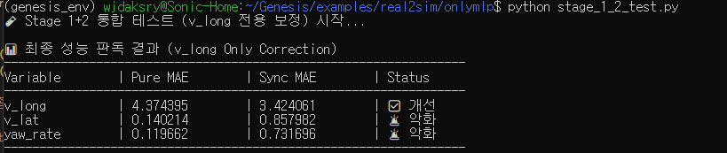

# Supervied Learning 보강

* stage1, stage2 를 통해 만들어진 env sync, dynamics sync 의 성능을 확인하니 오히려 pure genesis 환경보다 낮았음

따라서 stage 1,2 를 사용하지 않기로 함.

### 이유 예측
1. 데이터가 너무 적음(가장 유력)
2. overfitting의 가능성

### scipy.optimize.minimize 를 활용한 gt 값 찾기
* 