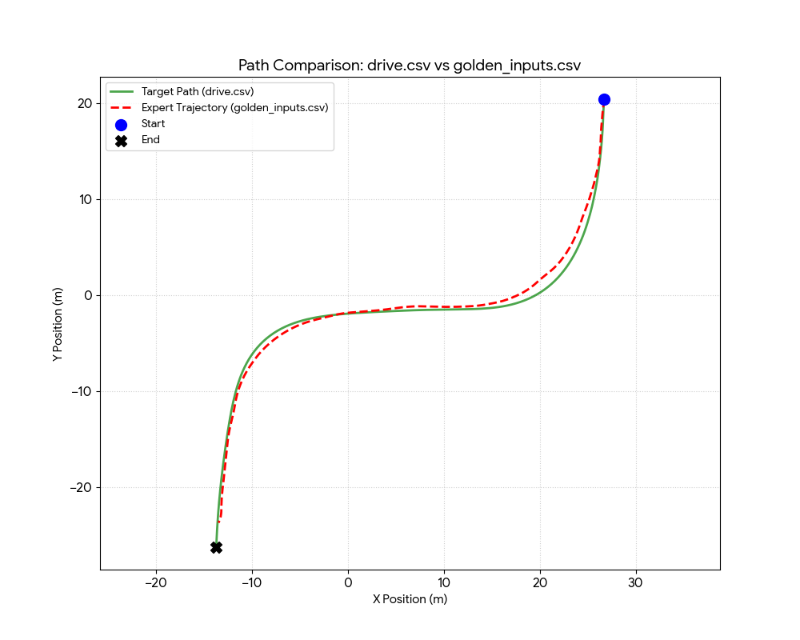

# MPPI Optimization 

## about MPPI
>Sampling 기반 MPC 방법 (GPU 활용)

* MPC(Model Predictive Control)는 비선형 최적화 문제를 CPU에서 순차적으로 해결해야 하므로 계산 복잡도가 높고 파라미터 튜닝에 비용이 너무 높았음(5시간 ~ 36시간)
* GPU를 활용한 MPPI를 사용하여 파라미터 튜닝을 진행하였음

### 실행 로직
1. **병렬 샘플링**: 600대의 '유령 차'가 동시에 미래의 35프레임을 주행 &rarr; `600 env, 35 window size(horizon)`

2. **롤아웃 (Roll-out / Simulation)**: 샘플 추출
3. **비용 계산**: $$J = \sum_{h=1}^{H} \left( C_{dist} + C_{vel} + C_{\kappa} + C_{heading} + C_{accel} + C_{rate} \right)$$

    * 거리, 속도, 곡률, 방향, 가속도, 조향 속도

4. **샘플 선택**: Cost가 가장 낮은 제어 입력을 가중평균으로 선택 ($\lambda$ : 0.01 사용)
    * $\lambda$ (Temperature Parameter)의 역할MPPI에서 $\lambda$는 가중치를 산출할 때 **"최선책을 얼마나 공격적으로 선택할 것인가"**를 결정하는 '온도(Temperature)' 역할
        * $\lambda \to \infty$: 모든 샘플의 가중치가 비슷해짐. 잘 간 길이나 못 간 길이나 공평하게 섞음 (단순 평균에 가까워짐)
        * $\lambda \to 0$: 비용이 가장 낮은 샘플 하나에 가중치가 몰리게 됩니다. (Hard Argmax에 가까워짐)

5. 업데이트 : 600개의 주행 시나리오 중 가장 정답에 가까운 시나리오들의 의견을 많이 반영하여 하나의 최적 제어 명령($T, S$)을 결정

---
## stage 1: bicycle model
Unicycle Kinematic(bicycle) model을 사용하여 주행 경로를 구현

*  $a, k$를 적분하여 경로를 그려본 결과, 원본 좌표와의 오차가 0.10m(10cm) 내외
* 성공적

## stage 2: dynamics model (MPPI)

### Kinematic vs Dynamic Model

| 구분 | Kinematic Model (운동학) | Dynamic Model (동역학) |
| :--- | :--- | :--- |
| **핵심** | 힘을 고려하지 않고 기하학적 운동 관계만 다룸 | 힘, 질량, 타이어 물리가 포함됨 |
| **가정** | 차량이 이상적으로 움직인다고 가정 | 타이어 슬립, 마찰, 하중 이동 등 실제 물리 반영 |
| **대표 모델** | Bicycle Model (Kinematic) | 차량 동역학 모델 |

#### Kinematic Model 수식 (Bicycle Model)

상태 전이: $(a(t), k(t)) \Rightarrow v(t) \Rightarrow (x(t), y(t), \psi(t))$
* (a,k) &rarr; 속도 v &rarr; 경로 : (적분)

> 초기 상태가 같다면, 같은 $a(t)$와 같은 $k(t)$로 경로는 **완전히 동일하게 복원**됨.
> $k = \frac{\dot{\psi}}{v}$ 이므로 yaw rate도 고정되고, $v$도 $a$ 적분으로 고정되어 위치가 유일하게 결정됨.

#### Dynamic Model

> 같은 throttle, steering을 넣어도 실제 생성되는 $a, k$가 다를 수 있음.

> 여러 state 가 존재

> 타이어가 포화(slip)되면 원하는 곡률이 나오지 않음.

| 결론 | Kinematic | Dynamic |
| :--- | :--- | :--- |
| 같은 $a, k$ 입력 시 | 경로 **무조건 동일** | 경로 **달라질 수 있음** |
| 같은 $T, S$ 입력 시 | - | 실제 $a, k$가 **달라질 수 있음** |

### dynamic model 결과 요약
| 초기 | 직접 바꿔가며 test | grid-search 로 찾아낸 best | 
| - | - | - |
|  |  | | 

### 파라미터 튜닝
| 파라미터 | 탐색 범위 | 설명 |
| :--- | :--- | :--- |
| `w_accel` | 1, 5 | 가속도 가중치 |
| `w_kappa` | 10 | 곡률 가중치 |
| `lookahead_step` | 3, 5, 10 | 전방 참조 스텝 수 |
| `w_vel` | 5000, 10000 | 속도 가중치 |
| `w_heading` | 3000, 10000 | 방향 가중치 |
| `w_rate` | 1, 20 | 조향 속도 가중치 |
| `w_dist` | 10000, 50000 | 거리 가중치 |
| `mppi_lambda` | 0.01 | 온도 파라미터 (λ) |

* 96개 (2*1*3*2*2*2*2*1)
* 곡률을 맞추기 위해 lookahead step은 짧은게 좋음

#### best 조합
| 파라미터 | Best 값 |
| :--- | :--- |
| `w_accel` | 1.0 |
| `w_kappa` | 10.0 |
| `lookahead_step` | 2 | 
| `w_vel` | 10,000 |
| `w_heading` | 10,000 |
| `w_dist` | 100,000 |
| `w_rate` | 20.0 |
| `mppi_lambda` | 0.01 |
* 곡률 더 잘맞추기 위해 lookahead step은 2로 설정 (horizon이 길어서 가능할 것이라 생각함)

#### 결과

* dynamics model 을 mppi로 최적화한 경로

| 지표 (Metric) | 평균 오차 (MAE) | 상대 오차 (%) | 평가 |
| :--- | :--- | :--- | :--- |
| Velocity ($v$) | 2.64 m/s | 23.8% | 오차 존재 |
| Heading ($\theta$) | 5.90 deg | - | 보통 |
| Position | 2.30 m | - | 오차 존재 |
| Acceleration ($a$) | 8.97 m/s² | 526.7% | 매우 큼 |
| Curvature ($\kappa$) | 0.007 rad/m | 17.4% | 양호 |

* blender의 비정상적인 가속도: 첫 프레임 (265m/s^2) 때문에 오차가 크게 발생
* 이후 누적 오차로 a,v가 오차가 큼

#### golden T,S (MPPI) 주행 영상
 [golden t,s](https://github.com/user-attachments/assets/f047dc22-03d6-44a7-9f19-f8c835041839)

* mppi 최적화로 뽑아낸 golden t,s 만 사용한 주행

## stage 3: supervised learning
> stage2 golden t,s 를 정답값으로 한 mlp를 학습

 

#### Input Features (7 Dim)

$$\mathbf{X} = [v_{long}, v_{lat}, \omega, CTE, HE, T_{raw}, S_{rad}]$$

| 그룹 | 피처 | 설명 |
| :--- | :--- | :--- |
| **Vehicle Dynamics** | `v_long` | 종속도 |
| | `v_lat` | 횡속도 |
| | `yaw_rate` | 각속도 |
| **Genesis Feedback** | `cte` | 횡방향 오차 |
| | `he` | 헤딩 오차 |
| **Blender FeedForward** | `throttle_ref` | golden throttle 참조 값 |
| | `steer_ref` | golden steer 참조 값 |
* Genesis 의 오차도 반영한 closed-loop 학습
    * (golden t,s 추출 시에도 genesis engine 활용하여 오차 반영했으니 학습에도 똑같이 반영)
    * inference 시에도 feedback 변수들 들어가야함
* Standard Scaler 

#### layers
* Hidden(7,128),Relu() 
* Hidden(128,128),Relu()
* Hidden(128,64),Relu() : layer 줄여서 output mapping 집중
* Hidden(64,2),Linear()

#### Output
$$\mathbf{y} = \begin{bmatrix} T \\ S \end{bmatrix} = \begin{bmatrix} \text{Predicted Throttle} \\ \text{Predicted Steering} \end{bmatrix}$$

#### loss

$$Loss = (1.0 \times MSE_{Throttle}) + (10.0 \times MSE_{Steering})$$
* 150 epoch
* Loss(MSE): 2.091476

#### inference / 주행

[same path, same checkpoint]https://github.com/user-attachments/assets/106783d8-de3c-4866-8ee6-0e26855c193d

* 학습한 경로 주행

[new_path,same checkpoint]https://github.com/user-attachments/assets/8fecd2af-336d-4477-92e9-8e992187b3d8

* 동일 체크포인트, 학습하지 않은 새로운 경로 주행

