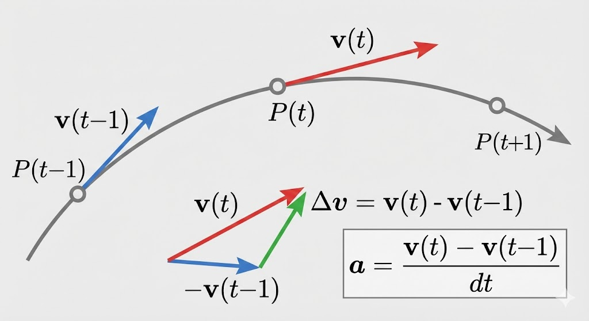
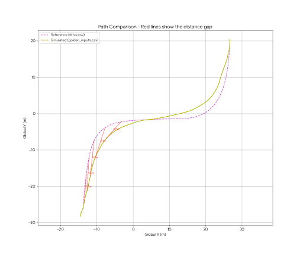
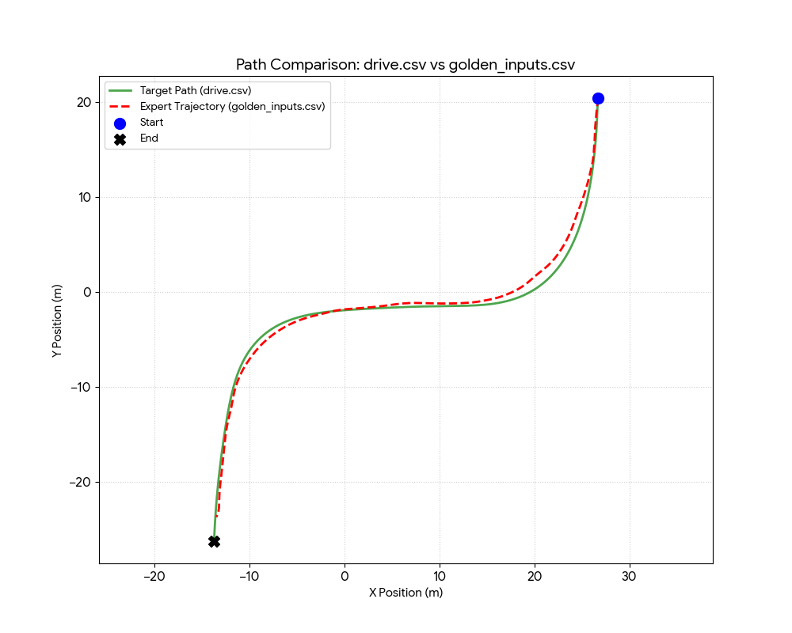
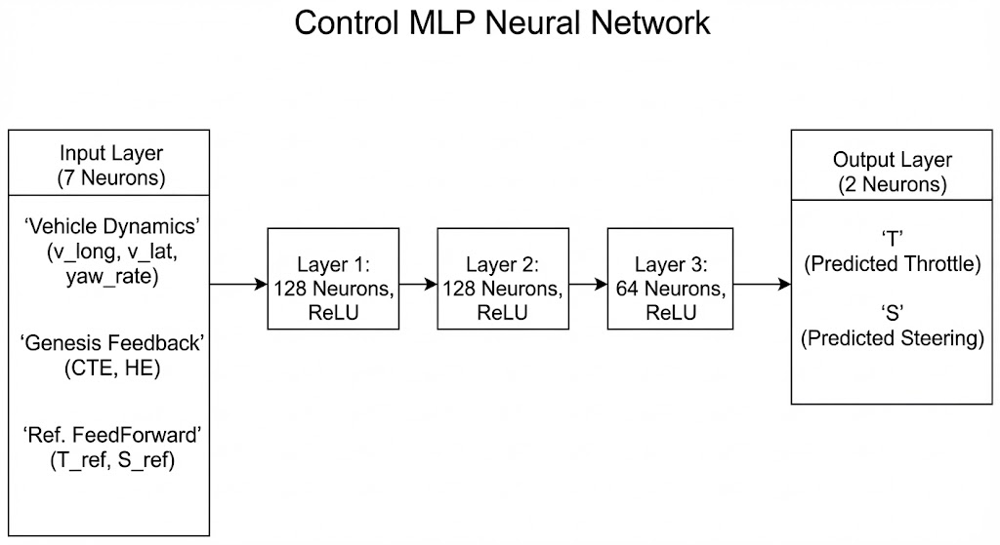

# MPPI Optimization 

## about MPPI
>Sampling 기반 MPC 방법 (GPU 활용)

* MPC(Model Predictive Control)는 비선형 최적화 문제를 CPU에서 순차적으로 해결해야 하므로 계산 복잡도가 높고 파라미터 튜닝에 비용이 너무 높았음(5시간 ~ 36시간)
* GPU를 활용한 MPPI를 사용하여 파라미터 튜닝을 진행하였음

### 실행 로직
1. **병렬 샘플링**: 600대의 '유령 차'가 동시에 미래의 35프레임을 주행 &rarr; `600 env, 35 window size(horizon)`

2. **롤아웃 (Roll-out / Simulation)**: 샘플 추출
3. **비용 계산**: $$J = \sum_{h=1}^{H} \left( C_{dist} + C_{vel} + C_{\kappa} + C_{heading} + C_{accel} + C_{rate} \right)$$

    * 거리, 속도, 곡률, 방향, 가속도, 조향 속도

4. **샘플 선택**: Cost가 가장 낮은 제어 입력을 가중평균으로 선택 ($\lambda$ : 0.01 사용)
    * $\lambda$ (Temperature Parameter)의 역할MPPI에서 $\lambda$는 가중치를 산출할 때 **"최선책을 얼마나 공격적으로 선택할 것인가"**를 결정하는 '온도(Temperature)' 역할
        * $\lambda \to \infty$: 모든 샘플의 가중치가 비슷해짐. 잘 간 길이나 못 간 길이나 공평하게 섞음 (단순 평균에 가까워짐)
        * $\lambda \to 0$: 비용이 가장 낮은 샘플 하나에 가중치가 몰리게 됩니다. (Hard Argmax에 가까워짐)

5. 업데이트 : 600개의 주행 시나리오 중 가장 정답에 가까운 시나리오들의 의견을 많이 반영하여 하나의 최적 제어 명령($T, S$)을 결정

---
## stage 1: bicycle model
Unicycle Kinematic(bicycle) model을 사용하여 주행 경로를 구현

*  $a, k$를 적분하여 경로를 그려본 결과, 원본 좌표와의 오차가 0.10m(10cm) 내외
* 성공적

## stage 2: dynamics model (MPPI)

### Kinematic vs Dynamic Model

| 구분 | Kinematic Model (운동학) | Dynamic Model (동역학) |
| :--- | :--- | :--- |
| **핵심** | 힘을 고려하지 않고 기하학적 운동 관계만 다룸 | 힘, 질량, 타이어 물리가 포함됨 |
| **가정** | 차량이 이상적으로 움직인다고 가정 | 타이어 슬립, 마찰, 하중 이동 등 실제 물리 반영 |
| **대표 모델** | Bicycle Model (Kinematic) | 차량 동역학 모델 |

### Kinematic Model 수식 (Bicycle Model)
 
 

> 가속도 a는 V(t)-V(t-1)/dt 로 이전 프레임에서 계산 &rarr; `결과값`

상태 전이: $(a(t), k(t)) \Rightarrow v(t) \Rightarrow (x(t), y(t), \psi(t))$
* (a,k) &rarr; 속도 v &rarr; 경로 : (적분)

> 초기 상태가 같다면, 같은 $a(t)$와 같은 $k(t)$로 경로는 **완전히 동일하게 복원**됨.
> $k = \frac{\dot{\psi}}{v}$ 이므로 yaw rate도 고정되고, $v$도 $a$ 적분으로 고정되어 위치가 유일하게 결정됨.

### Dynamic Model

> 같은 throttle, steering을 넣어도 실제 생성되는 $a, k$가 다를 수 있음.

> genesis engine은 blackbox 이므로 state를 잘 파악하는게 중요함

> 타이어가 포화(slip)되면 원하는 곡률이 나오지 않음.

#### 비교
| 결론 | Kinematic | Dynamic |
| :--- | :--- | :--- |
| 같은 $a, k$ 입력 시 | 경로 **무조건 동일** | 경로 **달라질 수 있음** |
| 같은 $T, S$ 입력 시 | - | 실제 $a, k$가 **달라질 수 있음** |

### dynamic model 결과 요약
| 초기 | 직접 바꿔가며 test | grid-search 로 찾아낸 best | 
| - | - | - |
|  |  | | 

### 파라미터 튜닝
| 파라미터 | 탐색 범위 | 설명 |
| :--- | :--- | :--- |
| `w_accel` | 1, 5 | 가속도 가중치 |
| `w_kappa` | 10 | 곡률 가중치 |
| `lookahead_step` | 3, 5, 10 | 전방 참조 스텝 수 |
| `w_vel` | 5000, 10000 | 속도 가중치 |
| `w_heading` | 3000, 10000 | 방향 가중치 |
| `w_rate` | 1, 20 | 조향 속도 가중치 |
| `w_dist` | 10000, 50000 | 거리 가중치 |
| `mppi_lambda` | 0.01 | 온도 파라미터 (λ) |

* 96개 조합 탐색 (2*1*3*2*2*2*2*1)
* 곡률을 맞추기 위해 lookahead step은 짧은게 좋음

### best 조합
| 파라미터 | Best 값 |
| :--- | :--- |
| `w_accel` | 1.0 |
| `w_kappa` | 10.0 |
| `lookahead_step` | 2 | 
| `w_vel` | 10,000 |
| `w_heading` | 10,000 |
| `w_dist` | 100,000 |
| `w_rate` | 20.0 |
| `mppi_lambda` | 0.01 |
* 곡률 더 잘맞추기 위해 lookahead step은 2로 설정 (horizon이 길어서 가능할 것이라 생각함)

#### 결과

* dynamics model 을 mppi로 최적화한 경로

| 지표 (Metric) | 평균 오차 (MAE) | 상대 오차 (%) | 평가 |
| :--- | :--- | :--- | :--- |
| Velocity ($v$) | 2.64 m/s | 23.8% | 오차 존재 |
| Heading ($\theta$) | 5.90 deg | - | 보통 |
| Position | 2.30 m | - | 오차 존재 |
| Acceleration ($a$) | 8.97 m/s² | 526.7% | 매우 큼 |
| Curvature ($\kappa$) | 0.007 rad/m | 17.4% | 양호 |

* blender의 비정상적인 가속도: 첫 프레임 (265m/s^2) 때문에 오차가 크게 발생
* 이후 누적 오차로 a,v가 오차가 큼

### golden T,S (MPPI) 주행 영상
 [golden t,s](https://github.com/user-attachments/assets/f047dc22-03d6-44a7-9f19-f8c835041839)

* mppi 최적화로 뽑아낸 golden t,s 만 사용한 주행
* input state 는 (t,s)

--------

## stage 3: supervised learning
> stage2 golden t,s 를 정답값으로 한 mlp를 학습

 

### Input Features (26 Dim)

$$\mathbf{X} = [\underbrace{v_{long\_bl}, k_{bl}, \Delta v, CTE, HE, v_{current}}_{\text{Current State (6D)}}, \underbrace{v_{long\_bl, t+1}, k_{bl, t+1}, \dots, v_{long\_bl, t+10}, k_{bl, t+10}}_{\text{Lookahead (20D)}}]$$

| 그룹 | 피처 | 설명 |
| :--- | :--- | :--- |
| **Feedforward (FF)** | `v_long_bl` | Blender 목표 속도 |
| | `k_bl` | Blender 목표 곡률 |
| **Dynamics** | `delta_v` | 속도 오차 ($v_{long\_bl} - v_{long\_gen}$) |
| | `v_current` | 현재 절대 속도 ($v_{long\_gen}$) |
| **Genesis Feedback (FB)** | `cte` | 횡방향 거리 오차 (Genesis vs Blender) |
| | `he` | 횡방향 헤딩 오차 (Genesis vs Blender) |
| **Lookahead** | `(v_long_bl, k_bl)` | t+1 ~ t+10 스텝의 미래 정보 벡터 (20D) |

* Genesis 의 오차 반영한 closed-loop 학습
* **Lookahead** : 10스텝의 (v_long_bl, k_bl) 미래 궤적을 20차원 벡터로 주입하여 미리 곡률 변화 등을 대응
    * MPPI가 연속적인 미래를 고려하여 학습하듯, 모델에 미래 궤적에 대한 시야(Lookahead) 제공
* **Data Augmentation**: 좌우 횡방향 반전 증강을 통한 데이터 2배 확장 ($k, CTE, HE$, 조향 $S$ 부호 반전)
* **DAgger 효과**: Train 셋에 한해 정규화된 $CTE$ (원본 $\pm0.1\text{m}$ 수준), $HE$ (원본 $\pm0.05\text{rad}$ 수준) 피처에 가우시안 노이즈 주입

#### Layers
* Linear(26, 128), ELU()
* Linear(128, 128), ELU()
* Linear(128, 64), ELU()
* Linear(64, 2), Tanh()

#### Output
$$\mathbf{y} = \begin{bmatrix} T \\ S \end{bmatrix} = \begin{bmatrix} T_{golden} \\ S_{golden} \end{bmatrix}$$
* 최후 출력단에 `Tanh()`를 사용하여 Throttle, Steering 모두 `[-1, 1]` 범위로 출력

#### Loss 함수

$$Loss = (1.0 \times MSE_{Throttle}) + (1.0 \times MSE_{Steering})$$
* Steering 가중치를 1.0으로 수정하여 Throttle과 비중 동일하게 반영

#### inference / 주행

[same path, same checkpoint]https://github.com/user-attachments/assets/02133107-ce91-4b64-bdae-7ebbb78eedcc

* 학습한 경로 주행

[new_path,same checkpoint]https://github.com/user-attachments/assets/8fecd2af-336d-4477-92e9-8e992187b3d8

* 동일 체크포인트, 학습하지 않은 새로운 경로 주행
    * 제대로 추종하지 못하여, 조금 더 많은 데이터가 필요하다고 느꼈음

#### 새로운 데이터 추가하여 통합 데이터 학습 
> 데이터를 추가하여 mlp 학습 진행 : 아래 사진들은 mppi 최적화를 시킨 golden T,S 로 주행한 결과

### Golden T,S 최적화값 주행영상 (클릭시 영상 재생)

* 
* 
* 
* 

* 데이터 증강을 통해 반전된 경로도 "데이터 있음" 으로 간주

----
### 하나의 데이터로 학습 vs 여러 데이터로 학습 비교
*  오른쪽만 영상 있음

| 구분 | overfitting | more data |
| - | - | - |
| omm |  |  |
| curve |   |   |
| left |  |  |

* 1번 예시에서 주행 경로가 오차가 줄어든 것이 보임
* 2번 예시에서 단일 데이터로 오버피팅 된 경로보다 조금 더 나은 성능을 보임

> 하지만 곡률이 크거나 많고, 시작하자마자 곡률을 보이는 경로는 오차가 많음

###  향후 계획 (Stage 3: Next Action Plan)

현재의 BC 모델(Mapper)은 '단일 경로'에 특화되어 있으므로 일반화 능력이 부족하며, Closed-loop 환경에서의 누적된 OOD 오차를 자체적으로 극복하지 못할 위험성이 존재합니다. 따라서 다음 단계를 수행할 예정입니다.

1. **데이터 추가**
   Blender에서 형태가 다른 다양한 궤적(직선, S자, U턴 등)을 추가 생성하고, 통합된 MPPI Golden Data 표본을 통해 범용적인 BC 모델을 재학습합니다.

2. **Residual RL 도입:**
   위 검증 과정에서 발생하는 궤도 이탈 잔여 오차(Residual Drift)만을 실시간으로 `0m`로 보정하는 **잔차 강화학습(Residual RL)** 에이전트를 기존 BC 모델 뼈대 위에 결합하여 완벽한 모방+보정 하이브리드 자율주행 파이프라인을 완성합니다.

------------------

ppt 시각자료: [BC_Trajectory_Control.pdf](./tech/BC_Trajectory_Control.pdf)