# Behavior Cloning: Inverse Dynamics Mapping Pipeline via MLP

> Stage 2의 MPPI golden T,S 를 정답값으로 MLP를 학습 (Real-time inference)

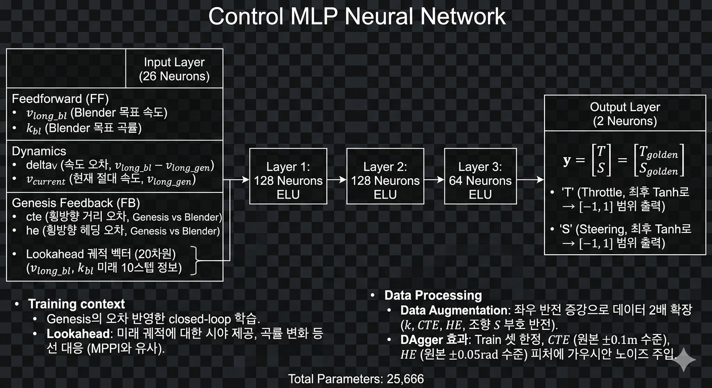

---

## 1. 모델 구조

### Input Features (26 Dim)

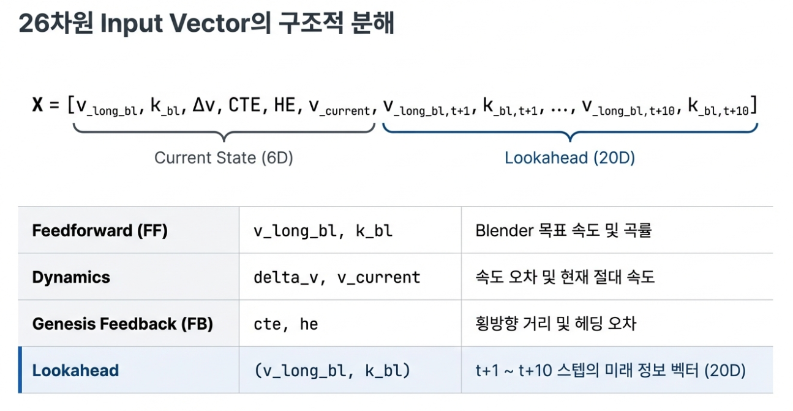

$$\mathbf{X} = [\underbrace{v_{long\_bl}, k_{bl}, \Delta v, CTE, HE, v_{current}}_{\text{Current State (6D)}}, \underbrace{v_{long\_bl, t+1}, k_{bl, t+1}, \dots, v_{long\_bl, t+10}, k_{bl, t+10}}_{\text{Lookahead (20D)}}]$$

| 그룹 | 피처 | 설명 |
| :--- | :--- | :--- |
| **Feedforward (FF)** | `v_long_bl` | Blender 목표 속도 |
| | `k_bl` | Blender 목표 곡률 |
| **Dynamics** | `delta_v` | 속도 오차 ($v_{long\_bl} - v_{long\_gen}$) |
| | `v_current` | 현재 절대 속도 ($v_{long\_gen}$) |
| **Genesis Feedback (FB)** | `cte` | 횡방향 거리 오차 (Genesis vs Blender) |
| | `he` | 횡방향 헤딩 오차 (Genesis vs Blender) |
| **Lookahead** | `(v_long_bl, k_bl)` | t+1 ~ t+10 스텝의 미래 정보 벡터 (20D) |

| 기법 | 내용 |
| :--- | :--- |
| **Closed-loop** | Genesis의 피드백 오차(CTE, HE)를 반영한 학습 |
| **Lookahead** | t+1~t+10의 미래 궤적 $(v_{long\_bl}, k_{bl})$을 20D 벡터로 주입 → 곡률 변화 사전 입력 |
| **Data Augmentation** | 좌우 반전 증강으로 데이터 2배 확장 ($k, CTE, HE$, 조향 $S$ 부호 반전) |
| **DAgger 효과** | Train 셋 한정, $CTE$($\pm0.1\text{m}$)·$HE$($\pm0.05\text{rad}$) 피처에 가우시안 노이즈 주입 |

### Layers

* Linear(26, 128), ELU()
* Linear(128, 128), ELU()
* Linear(128, 64), ELU()
* Linear(64, 2), Tanh()

### Output

$$\mathbf{y} = \begin{bmatrix} T \\ S \end{bmatrix} = \begin{bmatrix} T_{golden} \\ S_{golden} \end{bmatrix}$$

* 최후 출력단에 `Tanh()`를 사용하여 Throttle, Steering 모두 `[-1, 1]` 범위로 출력

### Loss 함수

$$Loss = (w_T \times MSE_{Throttle}) + (w_S \times MSE_{Steering})$$

| Loss 비율 (T:S) | 속도 추종 | 곡률 추종 | 비고 |
| :--- | :---: | :---: | :--- |
| `1:1` | 양호 | 미흡 | 현재 설정 (가장 일반적인 성능) |
| `1:2` | 약간 오차 | 개선됨 | - |
| `1:5` | 발산 (속도 과속) | 양호 | 추론 시 속도가 너무 빨라짐 |

---

## 2. 주행 결과

### 2-1.  Overfitting된 경로

> 1개의 경로에 대해서만 학습한 결과

https://github.com/user-attachments/assets/02133107-ce91-4b64-bdae-7ebbb78eedcc

### 위 체크포인트로 학습하지 않은 새로운 경로 주행

https://github.com/user-attachments/assets/8fecd2af-336d-4477-92e9-8e992187b3d8

* 제대로 경로 추종하지 못하여, 더 많은 데이터가 필요하다고 느꼈음

## 3. 새로운 데이터 추가하여 통합 데이터 학습 
> 데이터를 추가하여 mlp 학습 진행 : 아래 영상들은 mppi 최적화를 시킨 golden T,S 로 주행한 결과

### 3-1. 새로운 데이터 MPPI Golden T,S 최적화값 주행영상 (클릭시 영상 재생)

| 경로 | 클릭 시 영상 재생 |
| :--- | :---: |
| omm | [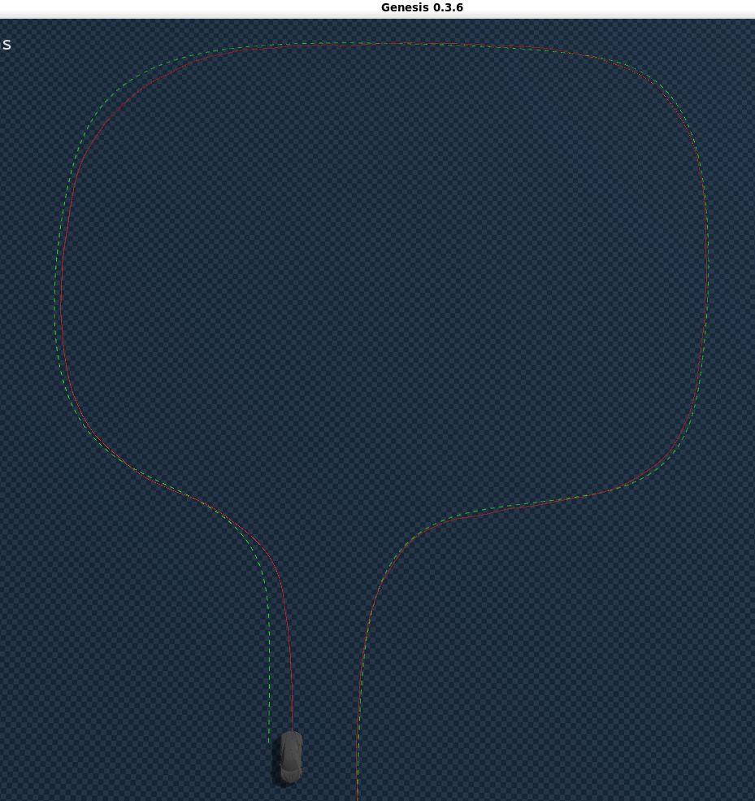](https://github.com/user-attachments/assets/de092948-a099-4ff9-aecc-79a4b4e53b10) |
| curve | [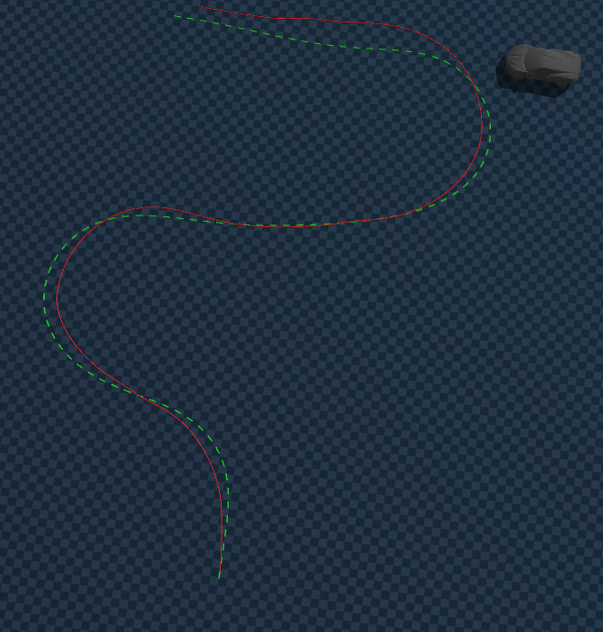](https://github.com/user-attachments/assets/14f37b64-8207-4769-9267-a65f0ed32e82) |
| left | [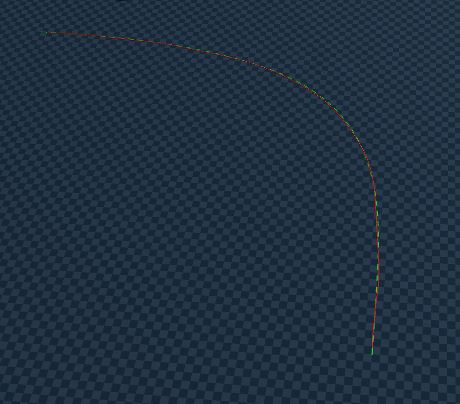](https://github.com/user-attachments/assets/f76b448a-003a-4f81-8264-26dd2874e3f7) |
| any (영상 없음) | 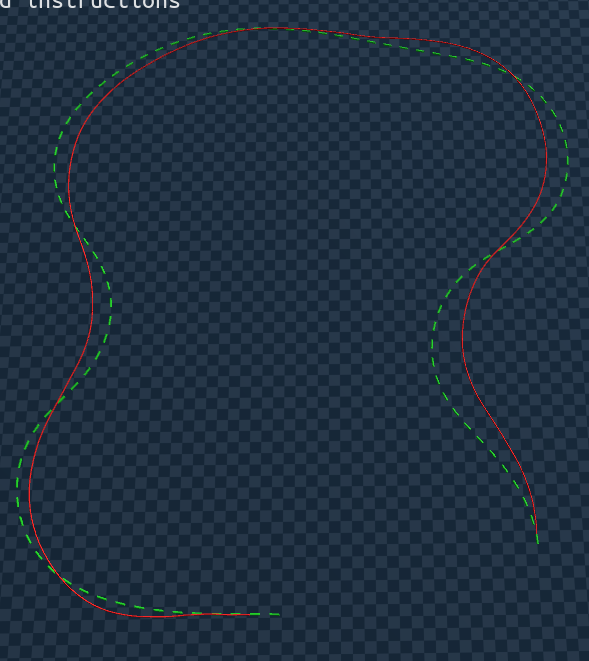 |

* 데이터 증강을 통해 반전된 경로도 "데이터 있음" 으로 간주
* CTE , HE 모두 부호를 주어 오차의 왼/오른쪽 구별하여 학습 &rarr; 복원력 모델이 학습하게 함

### 3-2. Overfitting vs 6개 경로 데이터 통합 학습 비교 (클릭 시 영상 재생)

> 통합 데이터 주행 영상만 있음(오른쪽 사진 클릭)

| 구분 | overfitting 주행 | 통합 데이터 주행(영상) |
| - | - | - |
| omm |  |  |
| curve | 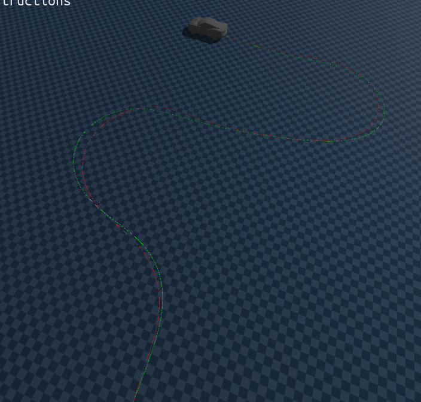 |  |
| curve2 | 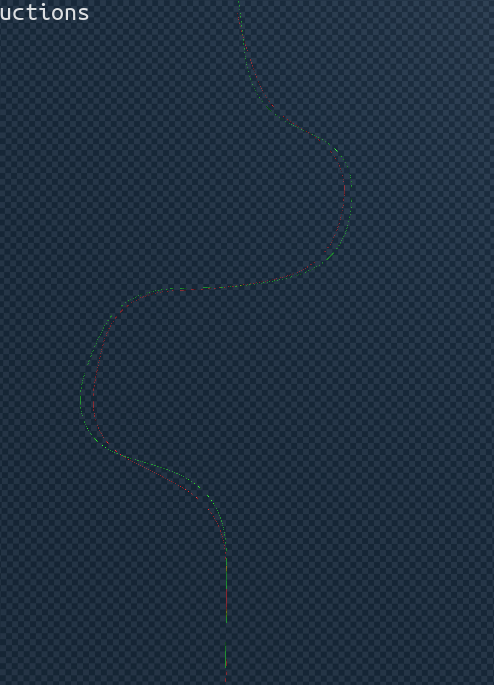 |  |
| left | 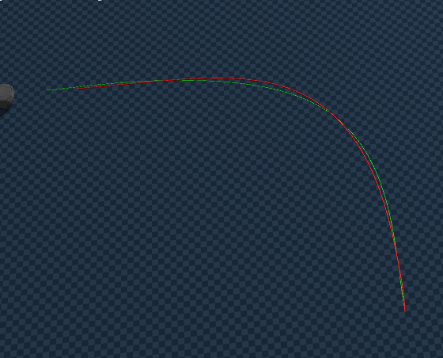 | [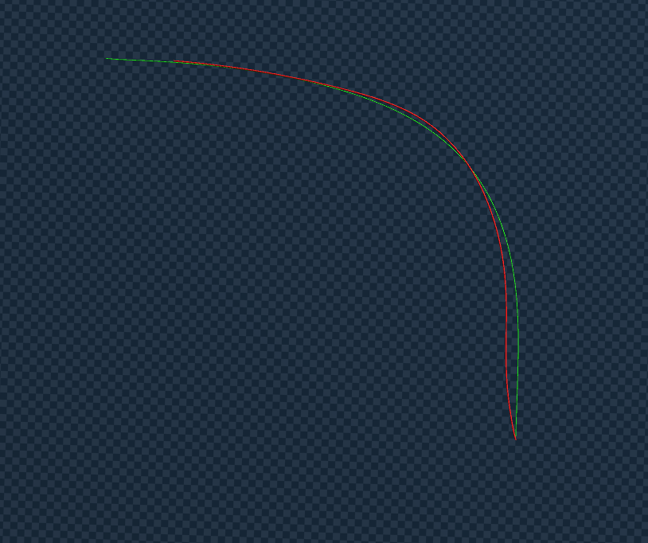](https://github.com/user-attachments/assets/7450a9af-ad45-4c0d-97e6-80d56f813d51) |
| s curve | 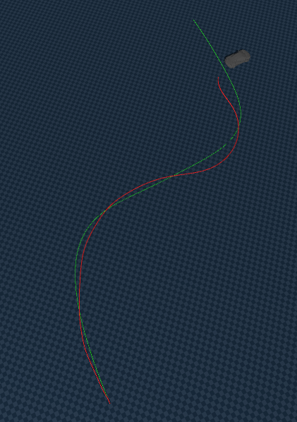 | [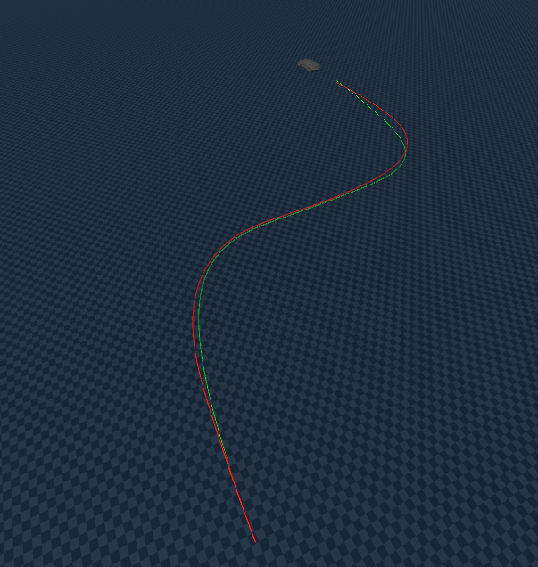](https://github.com/i1uvmango/Genesis_ai_graphicstudy/issues/27#issue-4058185702) |
| any | 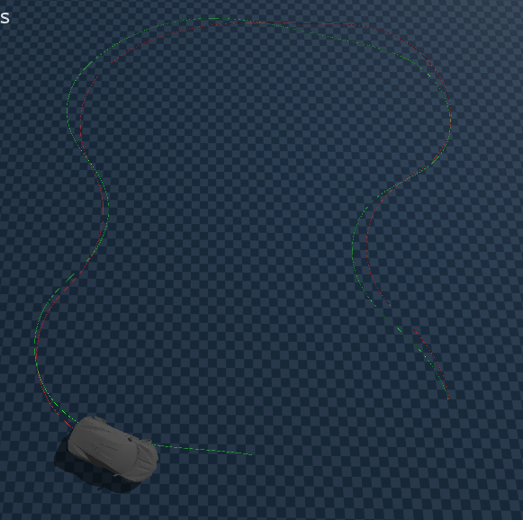 |  |

> 전체적으로 1개의 경로에 대해서 학습한 결과보다, 많은 데이터에 대해 학습한 후, 추론하는 게 결과가 좋았음

---

### 3-3. 학습하지 않은 새로운 경로 추론

[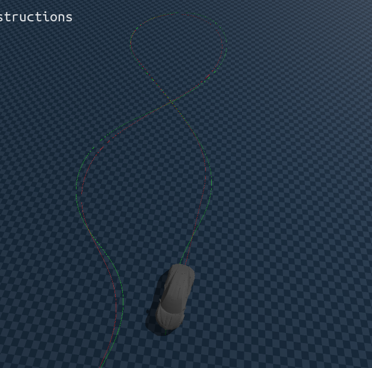](https://github.com/user-attachments/assets/63a83b3d-1214-4fb0-9b9a-8dc2beb2fbee)

> 일반화의 성능을 갖춤

----

## Review
> Blender2Genesis 의 Behavior Cloning 을 mlp를 통한 Inverse Mapping을 근사하여 Sim2Sim Calibration 구현
### 서로 엔진이 다른 Blender & GenesisAI
* Blender: Pybullet Engine (Unicycle Kinemetics)
* GenesisAI: 자체 물리 엔진 (Dynamics) 

### Behavior Cloning
* State 를 동기화 시켰어야함
* 최종 목표는 Real2Sim Calibration 이므로, `Dynamics State` 를 기준으로 잡음
    * 물리적 정합성도 확보해야했음

### Engine 의 차이를 연결
* Blender 의 차량에서 추출한 데이터를 Genesis 솔버에 넣고, `Loss Function`을 정의하여 `미분`하면 최적의 mapping 을 구하는 방식

### 하지만 GenesisAI Engine 은 BlackBox
* non-differentiable(미분불가능)
* 하지만 GenesisAI는 `NN-friendly`
* Neural-Network 를 사용하여 `blender` vs `Genesis` 의 engine/solver 차이를 연결하려 했음

### MPPI 최적화의 한계와 전문가 데이터 생성 
* MPPI의 역할: GenesisAI 환경에서 최적의 제어 시퀀스를 찾기 위해 수백 개의 샘플을 genesis 엔진을 사용하여 시뮬레이션

* 문제: 높은 컴퓨팅 비용으로 `실시간 제어(Real-time Control) 불가`
* 해결책: 오프라인 상태에서 MPPI 최적화를 통해 고순도의 주행 데이터(State - Action)를 선제적으로 추출하여 지도학습을 위한 `정답지(Ground Truth)`로 활용함.

### Inverse Dynamics Mapping
* 차량의 현재 물리 상태(State)와 미래 목표 궤적을 입력
* `제어 입력($T$: Throttle, $S$: Steer)`을 출력으로 하는 `Inverse Dynamics` 모델을 설계

### 지도학습(Supervised Learning)
*  MPPI가 생성한 최적의 `제어 시퀀스`를 정답으로 삼아 MLP(Multi-Layer Perceptron)가  비선형 매핑 관계를 `모방(Imitation Learning)`하도록 학습시킴.

### 실시간 추론 실현 (Real-time Inference)효율성 극대화: 
* 학습된 MLP 모델은  한 번의 순전파(Forward Pass)만으로 제어값을 출력함. 
* 프레임당 수천번 샘플링이 필요한 MPPI에 비해 연산 속도를 비약적으로 향상시킴.

### Blender 2 Genesis 연결: 
* 이를 통해 Blender의 운동학적 명령을 Genesis의 역학적 제어값으로 즉각 변환하여, 지연 시간(Latency) 없는 실시간 Blender to Genesis 추론 및 제어를 구현함.

## 4. 향후 계획

| # | 방법 | 핵심 내용 |
| :---: | :--- | :--- |
| 1 | **일반화 성능: 데이터 추가** | Blender에서 다양한 궤적(직선·S자·U턴 등) 추가 생성 |
| 2 | **Residual RL** | BC 모델 위에 잔차 RL 에이전트를 결합 → 궤도 이탈 잔여 오차를 실시간 보정 |
| 3 | **보강 방법 : DAgger** | 실패 구간 데이터 재수집 → MPPI로 golden (T,S) 재산출 → Dataset 추가 후 반복 재학습 ([참고](./tech/[26-03-05]_DAgger.md)) |

------------------

ppt 시각자료: [BC_Trajectory_Control.pdf](./tech/BC_Trajectory_Control.pdf)  

TroubleShooting : [TroubleShooting_docs](./docs/tech/[26-03-10]_troubleshooting_blender.md)