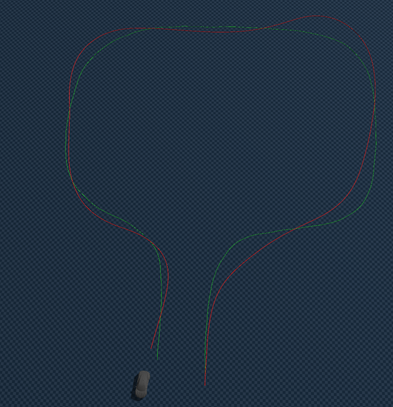
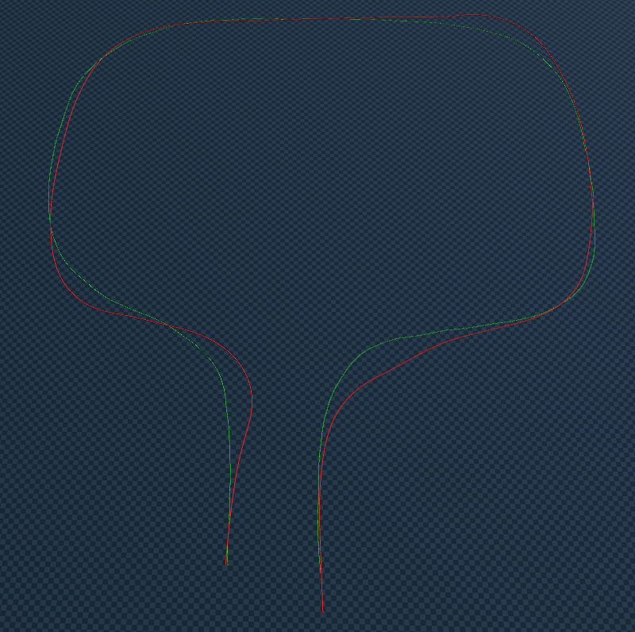
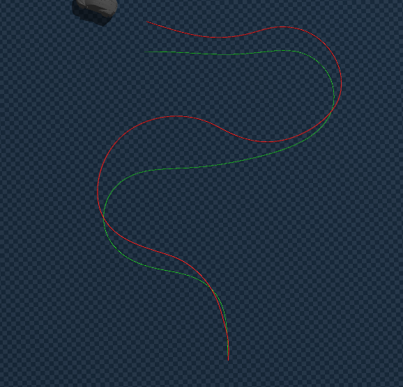
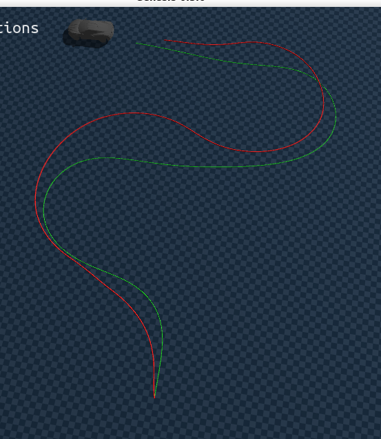

# Behavior Cloning:  Inverse Dynamics Mapping Pipeline via MLP(Real-time inference)
## stage 3: supervised learning
> stage2 golden t,s 를 정답값으로 한 mlp를 학습

 

### Input Features (26 Dim)

$$\mathbf{X} = [\underbrace{v_{long\_bl}, k_{bl}, \Delta v, CTE, HE, v_{current}}_{\text{Current State (6D)}}, \underbrace{v_{long\_bl, t+1}, k_{bl, t+1}, \dots, v_{long\_bl, t+10}, k_{bl, t+10}}_{\text{Lookahead (20D)}}]$$

| 그룹 | 피처 | 설명 |
| :--- | :--- | :--- |
| **Feedforward (FF)** | `v_long_bl` | Blender 목표 속도 |
| | `k_bl` | Blender 목표 곡률 |
| **Dynamics** | `delta_v` | 속도 오차 ($v_{long\_bl} - v_{long\_gen}$) |
| | `v_current` | 현재 절대 속도 ($v_{long\_gen}$) |
| **Genesis Feedback (FB)** | `cte` | 횡방향 거리 오차 (Genesis vs Blender) |
| | `he` | 횡방향 헤딩 오차 (Genesis vs Blender) |
| **Lookahead** | `(v_long_bl, k_bl)` | t+1 ~ t+10 스텝의 미래 정보 벡터 (20D) |

#### Input 특징
| 기법 | 내용 |
| :--- | :--- |
| **Closed-loop** | Genesis의 피드백 오차(CTE, HE)를 반영한 학습 |
| **Lookahead** | t+1~t+10의 미래 궤적 $(v_{long\_bl}, k_{bl})$을 20D 벡터로 주입 → 곡률 변화 사전 입력 |
| **Data Augmentation** | 좌우 반전 증강으로 데이터 2배 확장 ($k, CTE, HE$, 조향 $S$ 부호 반전) |
| **DAgger 효과** | Train 셋 한정, $CTE$($\pm0.1\text{m}$)·$HE$($\pm0.05\text{rad}$) 피처에 가우시안 노이즈 주입 |

#### Layers
* Linear(26, 128), ELU()
* Linear(128, 128), ELU()
* Linear(128, 64), ELU()
* Linear(64, 2), Tanh()

#### Output
$$\mathbf{y} = \begin{bmatrix} T \\ S \end{bmatrix} = \begin{bmatrix} T_{golden} \\ S_{golden} \end{bmatrix}$$
* 최후 출력단에 `Tanh()`를 사용하여 Throttle, Steering 모두 `[-1, 1]` 범위로 출력

#### Loss 함수

$$Loss = (1.0 \times MSE_{Throttle}) + (1.0 \times MSE_{Steering})$$
* Steering 가중치를 1.0으로 수정하여 Throttle과 비중 동일하게 반영
    * 1:2 (T:S) : 위와 동일
    * 1:5 (T:S) : 곡률을 잘 추종하지만 추론 시 속도가 너무 빨라져 발산
    
    

#### inference / 주행

https://github.com/user-attachments/assets/02133107-ce91-4b64-bdae-7ebbb78eedcc

* 학습한 경로 주행

https://github.com/user-attachments/assets/8fecd2af-336d-4477-92e9-8e992187b3d8

* 동일 체크포인트, 학습하지 않은 새로운 경로 주행
    * 제대로 추종하지 못하여, 조금 더 많은 데이터가 필요하다고 느꼈음

#### 새로운 데이터 추가하여 통합 데이터 학습 
> 데이터를 추가하여 mlp 학습 진행 : 아래 영상들은 mppi 최적화를 시킨 golden T,S 로 주행한 결과

### MPPI Golden T,S 최적화값 주행영상 (클릭시 영상 재생)

* 
* 
* 
* 

* 데이터 증강을 통해 반전된 경로도 "데이터 있음" 으로 간주

----
### 하나의 데이터로 학습 vs 여러 데이터로 학습 비교 :(클릭 시 영상 재생)
*  오른쪽만 영상 있음

| 구분 | overfitting | more data |
| - | - | - |
| omm |  |  |
| curve |   |   |
| left |  |  |
| s curve |  |  |

#### 인사이트
> s_curve 의 주행은 단일 경로 데이터 학습보다 전체통합 데이터의 추론이 더 나은 결과를 띄였음

* 더더욱 많은 량의 정교한 golden 데이터가 필요함을 알 수 있음

#### omm 경로 발산 원인 분석

$$Loss = (1.0 \times MSE_{Throttle}) + (1.0 \times MSE_{Steering})$$
> 현재 Loss = 1:1 T:S 비율로 학습 (가장 일반적인 성능을 띔)

**① T:S 손실 비율별 특성**

| Loss 비율 (T:S) | 속도 추종 | 곡률 추종 | 비고 |
| :--- | :---: | :---: | :--- |
| `1:1` | 양호 | 미흡 | 현재 설정 |
| `1:2` | 약간 오차 | 개선됨 | - |
| `1:5` | 발산 (속도 과속) | 양호 | 추론 시 속도가 너무 빨라짐 |

> 곡률이 크거나 시작 직후 곡률이 있는 경로에서는 어떤 비율이든 오차가 많음

**② Overfitting 가능성**
* Input dim(26)에 비해 데이터가 ~2k로 적어 overfitting 우려
    * 데이터를 더 생성하여 `mlp`의 경험을 늘려야 함

###  향후 계획 (Stage 3: Next Action Plan)

> 현재 BC 모델은 단일 경로에 특화 → 일반화 부족, Closed-loop OOD 오차 누적 위험

| # | 방법 | 핵심 내용 |
| :---: | :--- | :--- |
| 1 | **데이터 추가** | Blender에서 다양한 궤적(직선·S자·U턴 등) 추가 생성 → 통합 MPPI Golden Data로 BC 재학습 |
| 2 | **Residual RL** | BC 모델 위에 잔차 RL 에이전트를 결합 → 궤도 이탈 잔여 오차를 실시간 보정 |
| 3 | **DAgger** | 실패 구간 데이터 재수집 → MPPI로 golden (T,S) 재산출 → Dataset 추가 후 반복 재학습 ([참고](./tech/[26-03-05]_DAgger.md)) |

------------------

ppt 시각자료: [BC_Trajectory_Control.pdf](./tech/BC_Trajectory_Control.pdf)