# Blender2Genesis Sim2Sim Calibration

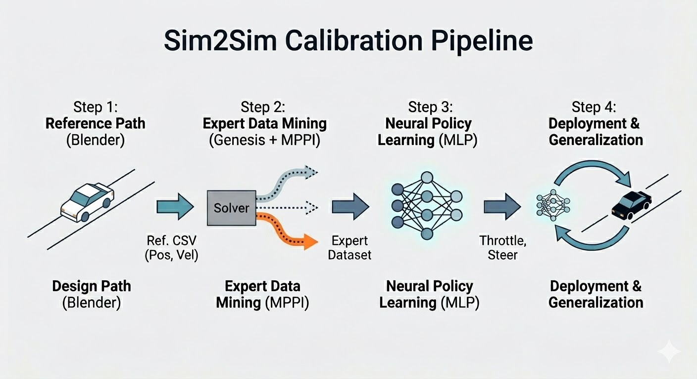

> 본 연구는 자율주행 차량의 Real2Sim &rarr; Real2Sim 확장성을 확보하기 위해, Sim2Sim: 시뮬레이션 환경 간의 제어 최적화 및 매핑 기술을 다룹니다

## 1. 연구 배경 및 목표
## Sim2Real Calibration : 최종 목표
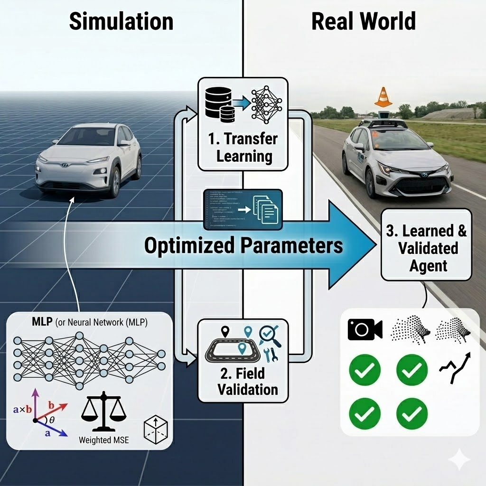

> AI 에이전트가 Genesis에서 학습한 제어 능력을 현실(Real world)에 Zero-shot 또는 최소 튜닝으로 그대로 수행하도록 만드는 것.

장점
* `Real_data` &rarr; `Simulation` 자동 전이
* `현실`에서의 튜닝 비용 급감
* 가상의 테스트의 다양성과 안정성 확보
* `Quality Assurance Test`를 정확하게 시뮬레이션(차량 예시)
    * 고속 회피
    * 급조향 미끄럼
    * 화물 무게 변환
* 위험한 상황도 가상에서 수천 번 생성 가능

> Generative Physics가 있으면 현실-가상을 매우 가깝게 만들고 그 위에서 학습된 정책(policy)은 곧바로 현실에서 동작한다. Zero-Shot Transfer의 핵심 원리.

### Real2Sim : 중간 단계
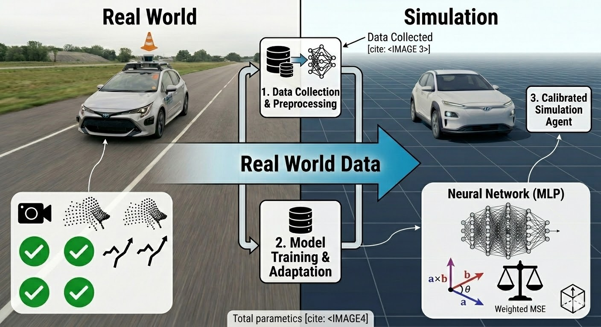
> Sim2Real 이 되려면 Real2Sim Transformation(Calibration)이 완벽하게 되어야함

$RealWorld$ &rarr; $Genesis$

* Genesis: Real-World를 전이 시킬 시뮬레이션 공간

## Sim2Sim : 본 연구 과정
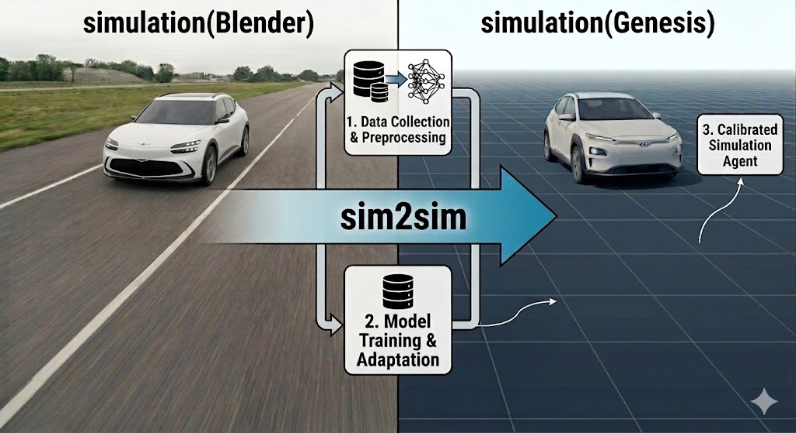

> Real-World 의 데이터를 직접 얻어오는게 제한되어 Sim2Sim calibration 을 진행했고, 이 단계가 된다면 같은 파이프라인으로  Real2Sim calibration 도 적용 가능함

## 2. 시뮬레이션 환경
## Genesis (Simulation)

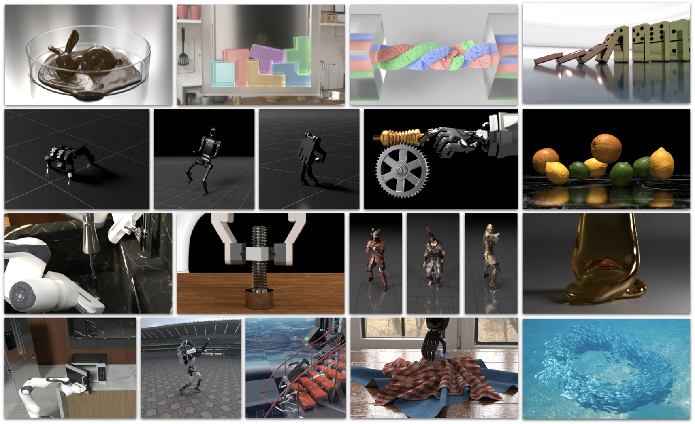

> Neural Network friendly 한 물리 시뮬레이션 환경으로, Blender에서 나타나는 객체의 움직임을 모방&전이하고자 하는 공간

### 특징

* GenesisAI의 자체 엔진(Solver: 다음 step 의 state를 계산)
* 동역학적 거동: 질량, 관성, 원심력 등 현실에서 일어나는 물리 제약 조건 및 오차를 반영한 움직임
* Blackbox Engine 의 성능은 떨어질 수 있지만, Bullet Engine 대비 `43만배 빠른 속도`의 장점으로 NN을 학습시킬 수 있는 환경 제공

[about Genesis](https://genesis-embodied-ai.github.io/)

[performance benchmarking](https://placid-walkover-0cc.notion.site/genesis-performance-benchmarking)

## Blender
https://github.com/user-attachments/assets/e0609422-8a9c-4695-98d5-4110debb4fde

> Blender는 강력한 3D 저작 도구로서 차량의 주행 경로를 시각적으로 정교하게 설계할 수 있는 환경을 제공합니다. 이는 Real2Sim Calibration 전 우리가 완벽히 전이하고자 하는 `Real-World`의 대체 시뮬레이션 공간이 되었습니다.

### 특징

* Bullet Physics 기반의 운동학(Unicycle Kinematics) 기반 시뮬레이션
* 이상적 거동: 질량이나 관성, 엔진 성능의 한계 등 '현실의 제약'이 배제된 상태에서 수학적으로 완벽하게 경로를 추종하는 움직임

### Kinematics vs Dynamics Models

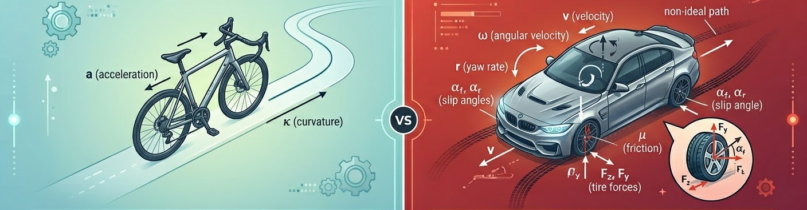

| 구분 | Blender (Kinematics) | Genesis (Dynamics) |
| - | - | - |
| **동일 control input** 주행 비교 | 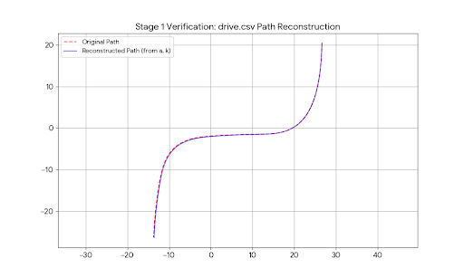 |  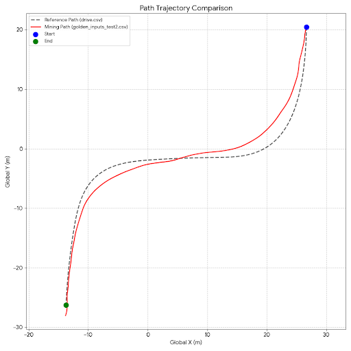 |
| 설명 | 이상적 주행, 수학적 일치 | 오차 존재, 물리적 현상 |

### Kinematics Model : Blender (UKMAC)
* acceleration
* curvature
    > 위 두개의 변수로 차량의 움직임을 수학적으로 완벽하게 모사할 수 있지만, 실제 차량의 **slip 현상** 마찰력, 원심력 등 동역학적 상태를 고려하지 못함

### Dynamics Model : Genesis (물리적 현상)
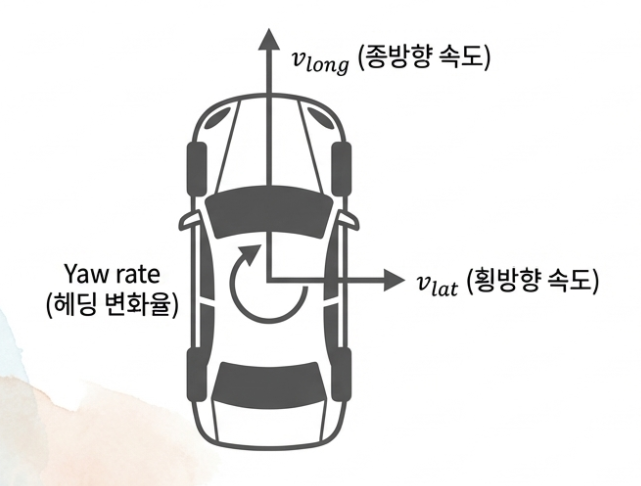
* velocity
* angular velocity
* yaw rate
* slip angle
* friction
> 많은 동역학적 state 존재

* 초기 두 시뮬레이션을 연결하는 state로 `acceleration`, `curvature` 를 사용하려 했지만, Genesis 와 Blender 의 움직임 불일치에서 인사이트를 얻어 여러 **동역학 데이터** 사용

## Environment Synchronization
> Blender 에서의 차량 움직임을 완벽하게 모사하기 위해 환경 맞추기

주요 작업

1. 좌표계 transformation
2. 차량 URDF(뼈대 + mesh)

### 좌표계 설정

$R_{genesis} = M \cdot R_{blender} \cdot M^{-1}$

* Basis Transformation 을 통해 데이터 손실 없이 좌표계 변환

| 좌표계 | GenesisAI (Physics Engine) | Blender (Modeling/Animation)|
| - | - | - |
|시스템 종류| 오른손 좌표계 (RHS) | 오른손 좌표계 (RHS) |
|정면 (Forward)| +X 축 | +Y 축 |
|위 (Up)| +Z 축 | +Z 축 |
|왼쪽/오른쪽| +Y (Left) | +X (Right) |

하지만 RBC Car Addon이 -y 방향을 바라보고 있음

* URDF 로딩 / 데이터 추출 시 좌표계 변환이 매우 중요

### URDF 차체
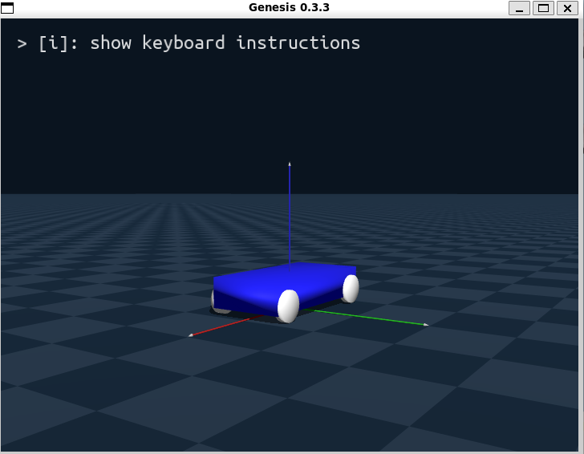

Blender의 차체를 로봇 설계에 쓰이는 URDF(Unified Robot Description Format) 으로 정의

* Link(뼈대) + Joint(관절) 로 구성
* 동역학적 속성: 차량의 각 부품(Chassis, Wheels)에 실제 질량과 관성 값을 입력
* **Steering Joint**: 앞바퀴의 조향각 한계($-0.35 ~ 0.35$ rad), 강성($K_p, K_v$)을 설정
    * kp: 관절 gain
    * kv: 관절 damping
* **Wheel Joints**: 뒷바퀴의 구동을 위해 각속도 제어가 가능한 continuous 타입으로 정의
* 물리적 상호작용: 바퀴 링크의 마찰 계수(Friction) 등을 설정

#### URDF Development
| Blender | 초기 urdf | developed URDF |
| - | - | - |
| 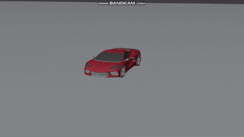 | | 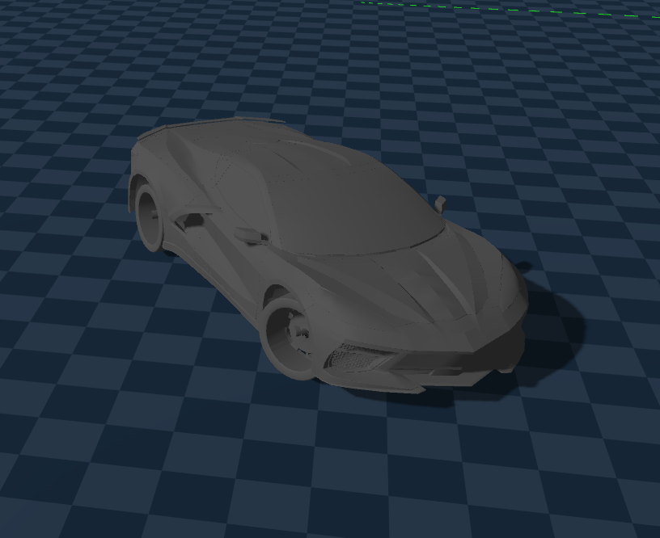 |

---

## 3. Sim2Sim Calibration
## Behavior Cloning (행동 모사)

> Blender 에서 움직이는 차량의 데이터를 추출하여, Genesis 에서 동일한 움직임 구현

### Control State (Throttle , Steer)

> Simulation 을 연결 지을때의 공통 `interface`로 `Throttle`,` Steer`을 사용. 즉, Blender와 Genesis 를 연결짓는 공통의 `state`

* Throttle : 차량의 전진 및 후진 속도를 결정하는 제어 요소 [-1,1]
    * 물리적 현상은 가속도 및 토크
* Steer : 차량의 조향각을 결정하는 제어 요소 [-1,1]
    * 물리적 현상은 조향각

minmax Scaler 사용

  | 구분 | + | 0 | - | 
  | - | - | - | - |
  | Throttle | 가속 | 속도 유지 | 감속 |
  | Steer | 좌회전 | 직진 | 우회전 |

동역학적 정보를 `Throttle` , `Steer` 에 녹여내는 것이 중요함

---

### Data Extraction & Processing

> Blender 차량에 센서를 두어 `dynamics state`를 직접 계산 및 추출
$$R_{genesis} = M \cdot R_{blender} \cdot M^{-1}$$

$$Blender to Genesis$$
* 모든 데이터는 다음 basis transformation 을 통해 좌표계 일치

### Blender Car Data
| 분류|변수명| 단위| 설명|
| - | - | - | - |
|기본 정보|frame|-|시뮬레이션 프레임 번호|
| |time||s|경과 시간 (Frame / FPS)|
|위치 (Pose)|g_pos_x, y, z|m|Genesis 좌표계 기준 차량의 전역 위치|
|  |g_qw, x, y, z|Quat|Genesis 좌표계 기준 차량의 전역 회전(쿼터니언)|
| 속도(Velocity)|g_lin_vx, y, z|m/s|Genesis 좌표계 기준 차량의 전역 선속도|
|  |g_ang_vx, y, z|rad/s|Genesis 좌표계 기준 차량의 전역 각속도|
|동역학 (Dynamics)|v_long|m/s|차량 로컬 좌표계 기준 종방향 속도 (Forward Speed)|
|  |v_lat|m/s|차량 로컬 좌표계 기준 횡방향 속도 (Side Slip)|
|  |yaw_rate|rad/s|초당 헤딩(Yaw) 변화량|
|  |a|m/s2|종방향 가속도 (Δv_long/Δt)|
|  |k (Curvature)|1/m|경로의 곡률 |
| 제어량 (Raw)|steer_rad|rad|앞바퀴의 평균 조향각 (+: 좌회전 / −: 우회전)|
|  |spin_R|rad/s|뒷바퀴의 평균 회전 각속도|
|  |throttle_raw|-|spin_R 기반의 스로틀 입력값 (각속도 제어용)

----

## 4.
## Blackbox Genesis Engine

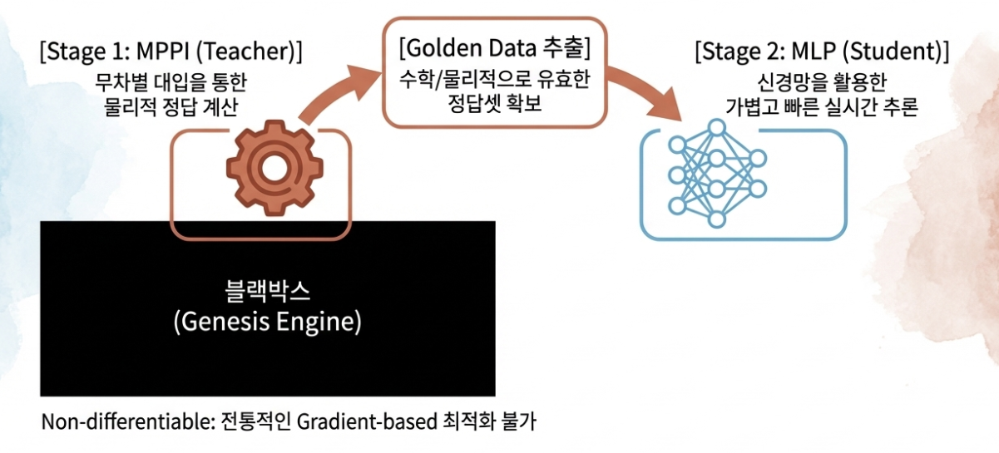

> Blender 와 Genesis는 물리 엔진이 다르므로, 같은 입력값을 넣어도 결과가 다름, Inverse Dynamics 를 통해 Blender 데이터를 넣었을때 Genesis 세상에서 같은 움직임이 나오도록 `real-time` 변환이 필요함

### 블랙박스 엔진(Genesis)와 MPPI 도입

> Genesis 엔진은 `Non-differentiable` 하므로, 전통적인 Gradient Based Optimization이 불가능함.  
Genesis World 에서 경로를 완벽하게 추종하는 데이터(**MPPI**)를 만들어내고, NN을 통해 데이터를 기반으로 `지도학습`하는 방향으로 설계

* Genesis Solver 는 여러가지가 있지만 동역학을 계산하는 rigid solver 는 미분이 지원되지 않음

---

## Stage 1 : MPPI (정답값 데이터 생성: Genesis Car Data)
### MPPI란?
Model Predictive Path Integral 으로, 샘플링 기반의 모델 예측 제어(MPC) 기법으로, 여러 경로를 확률적으로 샘플링하여 최적의 제어 입력을 도출하는 알고리즘

#### 의의
> NN(MLP)를 학습하기 위한 Genesis Engine과 GPU를 사용한 정답 데이터 생성과정

* `수학/물리적으로 feasible 한 데이터` 생성 : Genesis Engine 을 거쳐 나온 데이터
    * Genesis Engine 은 관성/질량 등 동역학 state 반영하는 물리 엔진

*  `GPU`의 병렬 연산 능력을 활용하여 수백개의 가상 시나리오를 동시에 `시뮬레이션(Genesis Engine)`하고 확률적 샘플링을 통해 가장 결과가 좋은 시나리오(데이터)를 선택 

MPC 방법 시도 & 실패 정리: [MPC2MPPI](../docs/%5B26-02-16%5D_mpc2mppi.md)

### 원리
#### for every Frame(Receding Horizon : 10 horizon)  
  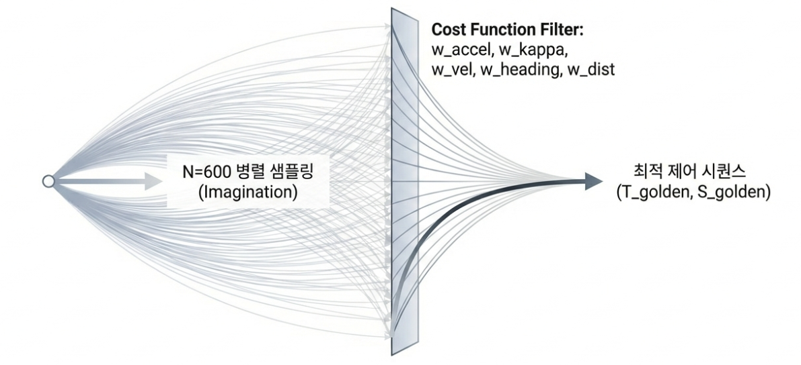

1. 600개의 병렬환경 생성 (`t 시점`)
2. 600개의 환경마다 perturbation 을 주어 서로 다른 제어값 Control(T,S) 세트 생성
3. 10 horizon(10 dt: 약 0.4초) 동안 10개의 제어값(control1 ~ control 10)을 주입 후 결과에 대해 cost 계산
4. 600개의 샘플 중 exp(-cost/lambda) 를 통해 최적의 제어값 `Golden_t_(T,S)` 샘플링
5. 10프레임에 대해 cost 계산 한 `golden_t_(T,S)`를 `t시점`의 제어값으로 지정
6. 1번으로 return: `t+1` 시점 state + `warm-start`(이전 frame 의 golden_(T,S) 근처에서 `golden_t+1_(T,S)`를 탐색 )

#### MPPI cost

?????

#### MPPI 가중치
| 가중치 | 설명 |
| :--- | :--- |
| `w_accel` | 가속도 가중치 |
| `w_kappa` | 곡률 가중치 |
| `lookahead_step` | 전방 참조 스텝 수 |
| `w_vel` | 속도 가중치 |
| `w_heading` | 방향 가중치 |
| `w_rate` | 조향 속도 가중치 |
| `w_dist` | 거리 가중치 |
| `mppi_lambda` | 최적 데이터 샘플링 파라미터 (λ) |

#### 인사이트 
* $w_{dist}$와 $w_{heading}$에 높은 가중치를 부여하여, 고속 주행 시 원심력에 의한 경로 이탈을 억제, 및 경로 추종 강성 확보
* 속도 가중치가 $w_{vel}$가 너무 낮으면 프레임당 이동 거리 차이가 커서  곡선 구간에서 경로를 따라가지 못함(시간 index 기반에 치명적)
* 시간 index VS 위치(공간) index : Behavior Cloning 이란 시간 index에 따른 행동이 중요하여, time index base가 올바름

MPPI insight & trouble shooting docs : [MPPI_troubleshooting](https://github.com/i1uvmango/Genesis_ai_graphicstudy/blob/main/car_test/docs/tech/%5B26-03-15%5D_MPPI_troubleshooting.md)

---

#### 추출된 Golden Data CSV (Blender Car data)
> 전처리/가공 전 raw data 

* 최대한 많은 동역학 state를 포함하고자 raw 한 데이터들을 최대한 많이 추출

* `Blender Car`의 움직임을 모방한 `genesis`에서의 data

| 분류 | 컬럼명 | 단위/타입 | 설명 | 
| :--- | :--- | :--- | :--- | 
| Index | frame | Int | 시뮬레이션 프레임 번호 |
| Pose (Genesis) | g_pos_x, y, z | m | Genesis 환경 내 차량의 3D 전역 위치 |
| | g_qw, qx, qy, qz | Quat | Genesis 환경 내 차량의 전역 회전 (쿼터니언) |
| Dynamics (Genesis) | v_long | m/s | Genesis 차량의 현재 종방향 속도 |
| | v_lat | m/s | Genesis 차량의 현재 횡방향 속도 (미끄러짐) |
| | yaw_rate | rad/s | Genesis 차량의 현재 헤딩 변화율 (ω) |
| | accel | m/s2 | Genesis 차량의 현재 가속도 (Δv/Δt) |
| | kappa | 1/m | Genesis 차량의 현재 주행 곡률 (ω/v) | Genesis State |
| Error Metrics | cte | m | 경로 이탈 오차 (Cross-Track Error) | Calc (Gen vs Bl) |
| | he | rad | 헤딩 오차 (Heading Error) | Calc (Gen vs Bl) |
| Golden Label | T_golden | [−1,1] | MPPI가 찾은 최적 스로틀 (학습 정답) | MPPI Output |
| | S_golden | [−1,1] | MPPI가 찾은 최적 조향 (학습 정답) | MPPI Output |
| Reference (Blender) | throttle_raw | rad/s | Blender의 원본 바퀴 회전 속도 (FF용) | Blender CSV |
| | steer_rad | rad | Blender의 원본 조향 각도 (FF용) | Blender CSV |
| | a_target | m/s2 | Blender의 목표 가속도 | Blender CSV |
| | k_target | 1/m | Blender의 목표 곡률 | Blender CSV |

#### Q&A
* 그냥 Blender 의 데이터를 학습하면 되지 않나? 
    * Blender 의 주행 데이터는 Genesis 엔진에서 작동하지 않음
    * MPPI를 통해 Blender 주행과 동일한 주행을 Genesis 엔진에서 직접 계산하여 데이터를 뽑아내는 것

* Golden data(MPPI 통해 도출된 데이터)에 optimized(Throttle, Steer) 만 있으면 되지 않나?
    * MLP로 지도학습 하려면 저런 동역학 state를 넣어주면 (Throttle, Steer) 가 나온다를 MLP가 학습해야함

* 그럼 Blender 의 csv는 왜 필요한가?
    * MPPI 는 컴퓨팅 비용이 매우 높음 &rarr; MLP로 Inverse Dynamics 를 구현
    * Blender data와 Golden Data를 같이 mlp input으로 넣어줘서 전이 관계를 학습(**Blender CSV의 주행이 Genesis 에선 다음과 같이 작동한다** : Blender CSV &rarr; Genesis CSV)

---

## Stage 2: MLP 학습 (Blender2Genesis Mapper)

> 시간/비용이 높은 MPPI trasformation 대신, MLP를 통해 Real-time 으로 Blender를 넣었을때 Genesis World 에서 동일한 움직임을 구현하자

* MLP : Real-time Blender2Genesis Mapper 를 `differentiable` 한 MLP로 `근사`함  
* method : Supervised Learning  

Pipeline
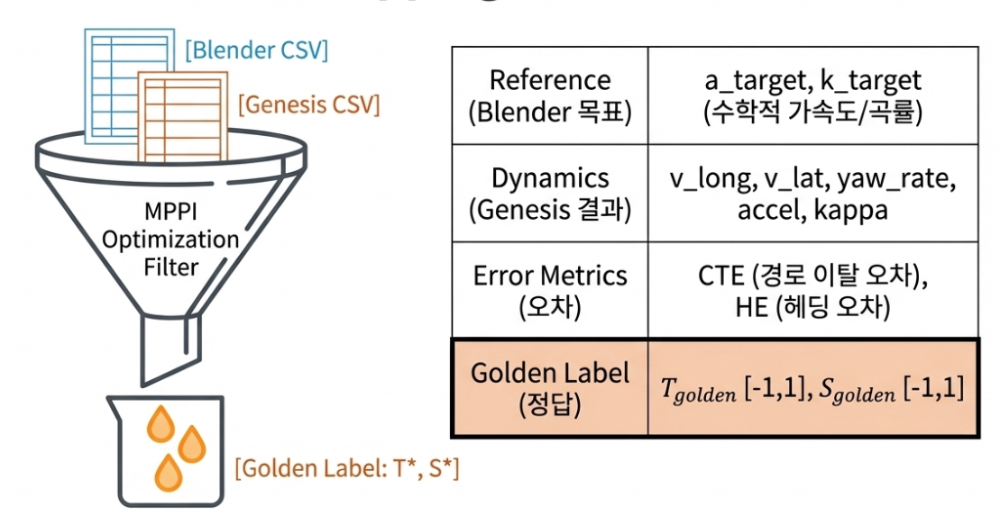
* Input : Blender CSV , Golden CSV
* MLP : Inverse Dynamics Supervised Learning
* Output : Throttle*, Steer* 

> 8개의 서로 다른 주행 데이터를 data augmentation(좌우 반전, 노이즈 증강)하여 학습시킴 (3k CSV lines)

### Input Features (25 Dim)

$$\mathbf{X} = [\underbrace{ v_{current}, k_{current}}_{\text{Current State (2D)}}, \underbrace{\Delta v, CTE, HE, }_{\text{Feedback (3D)}}  \underbrace{v_{long\_bl, t+1}, k_{bl, t+1}, \dots, v_{long\_bl, t+10}, k_{bl, t+10}}_{\text{Lookahead (20D)}}]$$

#### Insight
* 정보 압축 및 학습 안정성을 위해 `delta`값 사용
* 스스로 오차를 고칠 수 있도록 `feedback` 항 명시적으로 부여
* MPPI 의 설계와 동일하게 미래 10 frame의 `(vel, kappa)`을 주어 미래 정보 고려한 제어를 할 수 있도록 함
* 학습 시 train set에만 노이즈 주입하여, 모델이 더 많은 상황을 경험하도록 함(데이터 증강 + 반전)

### MLP input State sheet(input : 25dim)
* MLP input state 정리

| 그룹 | 피처 | 설명 |
| :--- | :--- | :--- |
| **Dynamics(current state)** | `v_current` | 현재 절대 속도 ($v_{long\_gen}$) |
| | `kappa_current` | 현재 곡률 ($k_{current\_gen}$) |
| **Genesis Feedback (FB)** | `cte` | 횡방향 거리 오차(부호 구분) (Genesis vs Blender) |
| | `he` | 횡방향 헤딩 오차 (Genesis vs Blender) |
| | `delta_v` | 속도 오차 ($v_{long\_bl} - v_{long\_gen}$) |
| **Lookahead(FF)** | `(v_long_bl, k_bl)` | 블렌더 경로 t+1 ~ t+10 스텝의 미래 정보 벡터 (20D) |

> 이후 Real2Sim 시, 차량에 부착된 센서에서 동역학적 state를 추출할텐데, 위 MLP 구조를 통해 `dynamic state` &rarr; `(T,S)` mapping 이 가능함

### Layers
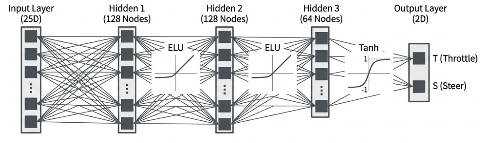

* Linear(25, 128), ELU() &rarr; 오차항(CTE,HE)의 부호 때문에 ELU 사용
* Linear(128, 128), ELU()
* Linear(128, 64), ELU()
* Linear(64, 2), Tanh()

### Output

$$\mathbf{Y} = \begin{bmatrix} T \\ S \end{bmatrix} = \begin{bmatrix} T_{golden} \\ S_{golden} \end{bmatrix}$$

* `Tanh()`를 사용하여 Throttle, Steering 모두 `[-1, 1]` 범위로 출력
* Dynamic States &rarr; (T,S) mapping

> 이제 Blender의 주행 데이터를 넣었을때 해당 움직임을 MPPI 계산 없이, `Real-Time`으로 Genesis World 에서 구현이 됨

---

## Stage 3: 실행 및 추론 (Inference)

### 실행 흐름
1. Blender CSV(state + action)를 입력
2. MLP model 을 통한 `state` + `action`의 `Real-time` convert
3. Genesis World 에서 동일한 움직임 구현

### Inference Samples
(사진 클릭 시 영상 실행)

| Blender | MPPI | Inverse Dynamics Inference(Genesis) |
| :--- | :--- | :--- | 
| [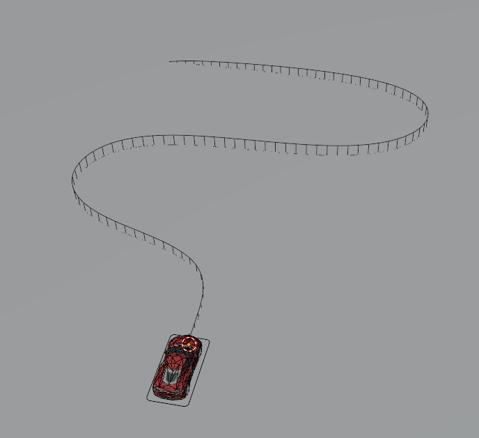](https://github.com/user-attachments/assets/94549c51-5cd4-41d1-a187-f1262d5e1e53)  |  |  |

주행 결과 정리 docs : [BC Inverse Mapper](https://github.com/i1uvmango/Genesis_ai_graphicstudy/blob/main/car_test/docs/%5B26-03-05%5D_BC_inverse_mappper.md)

### Generalization Test (미학습 경로 추론)
(사진 클릭 시 영상 실행)

| 미학습 경로1 | 미학습 경로2 |
| - | - |
| | |

* 일반화 성능 평가를 위해 학습하지 않은 경로를 input 해봄
* 곡률이 많을 수록 MPPI 최적화(정답값 데이터 생성)에 컴퓨팅 비용이 높았음
* 어려운 미학습 경로도 안정적이게 잘 추론하는 성능을 보임

> "학습되지 않은 임의의 경로에서도 안정적인 주행을 보인 것은, 본 모델이 특정 경로를 암기한 것이 아니라 [상태 오차 $\rightarrow$ 최적 제어값]으로 이어지는 물리적 인과관계(Physics Intuition)를 학습했음을 시사한다."

결과 정리 docs : [BC Inverse Mapper](https://github.com/i1uvmango/Genesis_ai_graphicstudy/blob/main/car_test/docs/%5B26-03-05%5D_BC_inverse_mappper.md)

---
ppt : [Blender2Genesis_Sim2Sim_Calibration](https://github.com/i1uvmango/Genesis_ai_graphicstudy/blob/main/car_test/docs/Blender2Genesis_Sim2Sim_Calibration.pdf)