# Adding Z-axis to Data

> Z축의 데이터를 추가하여 경사면에서도 일반화 

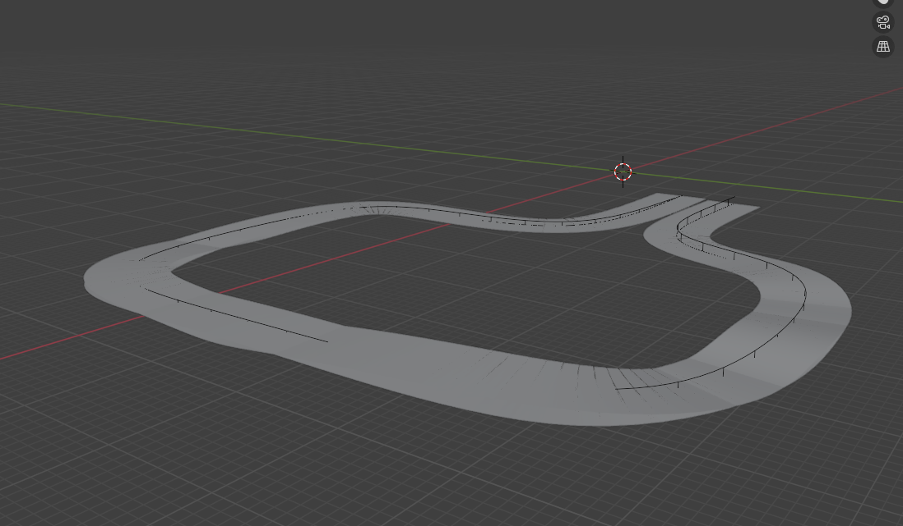
* 기존 2d 경로에서 updown 을 추가하여 데이터 추출
    * 하지만 MPPI 최적화가 오래 걸리므로 조금 더 간단한 data 사용

---

## MPPI Mining 코드 변경사항 요약 (2D → 3D)

기존 2D 평면 주행 기반이었던 로직을 3D 지형(경사로)에 맞춰 개선했습니다. 전체적인 가독성을 위해 핵심 변경 사항만 요약합니다.

## 변경 요약

| 항목 | 기존 (2D) | 변경 (3D) |
| :--- | :--- | :--- |
| **기준 지형** | 단순 평면 (Plane) | 언덕 지형 (HillRoad Mesh) |
| **차량 스폰** | 고정된 높이 / 첫 프레임 | Mesh 높이 및 오프셋 계산 후 동적 스폰 |
| **거리 계산** | XY 평면상의 거리만 사용 | Z축 고도를 포함한 3D 입체 거리 적용 |

---

## 핵심 변경 사항

* **[차량 offset] 통일 및 스폰 보정**
  * Blender와 Genesis 간의 **Z축 기준점 차이(오프셋 0.39m)** 로 MPPI Mining 시 Z축의 차이 발생
  * cost 에 포함시키지 않음

* **[정확도] 3D 주행 거리 및 경사도 연산**
  * 단순히 평면 거리를 넘어, 3D arc length(`dz`)로 **실제 3D 궤적 길이**를 구하도록 공식을 변경했습니다.
  * 언덕 구간 분석을 위해 **경사도(Slope)** 수치를 새롭게 계산해 데이터프레임에 추가했습니다. (정량화 및 계산용)

* **[물리엔진] 지형 Mesh 물리 연산 활성화**
  * 3D 지형을 단순 그래픽이 아닌 밟고 올라갈 수 있는 바닥상태로 만들기 위해, 지형을 고정하고 **차량과의 물리 충돌(Collision) 기능을 활성화**했습니다.

* **[데이터] 경사로 처리를 위한 관측값(State) 확장**
  * 로직이 3차원 상태를 인지할 수 있도록 차량의 Z축(수직) 속도, 전체 3D 좌표, 차체가 기울어지는 **피치(Pitch) 각도**(고개 숙임) 등의 정보를 새롭게 리턴하도록 보강했습니다.

* **[최적화] MPPI 비용(Cost) 함수 설계 원칙**
  * 조향(Steer)과 엑셀레이터(Throttle)만으로는 공중에 뜬 고도를 마음대로 제어할 수 없습니다.
  * 따라서, 최적화 계산 시 목적지와의 거리 오차에서 **Z축 관련 수치를 의도적으로 제외**했습니다.
  * XY 평면 목적지 추종에만 집중하면, 위아래로 움직이는 Z축 변화는 **지형 Mesh와 바퀴의 물리 충돌 연산이 부드럽게 알아서 처리**하도록 설계했습니다.

### Blender Auto drive Interface
| 사용법 | Blender Interface |
| - | - |
|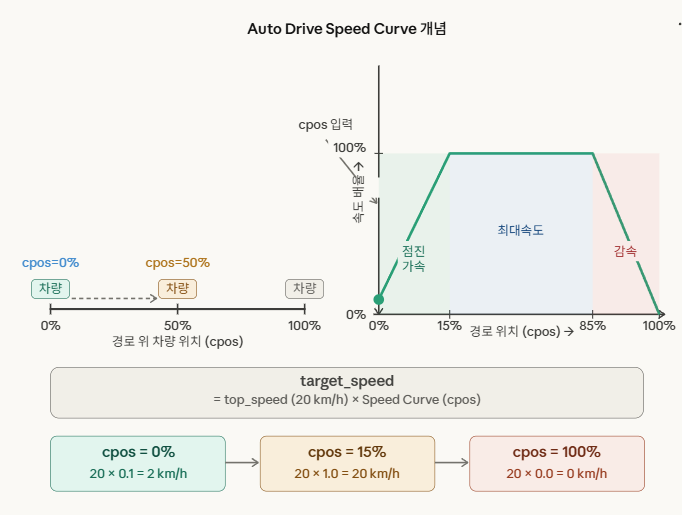| 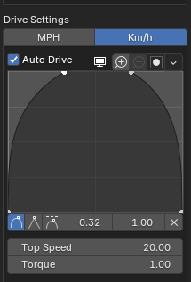|
* auto drive 사용법

RBC의 원본 Speed Curve는 경로 위치(0~1)를 속도 배율로 변환한다.

| 경로 위치 | 속도 배율 |
|-----------|-----------|
| 0% (시작) | 0%        |
| 50% (중간)| 100%      |
| 100% (끝) | 0%        |

* 속도 배율이 0% 이면 데드락이 걸려 출발하지 못함

[troubleshooting](../tech/[26-04-04]_blender_troubleshooting.md)

## Z축 경로 (Blender vs Genesis)

| Scene | z 높이 | 최대 경사 | Blender | Genesis | 경사 유형 |
| :---: | :--- | :--- | :---: | :---: | :--- |
| **p01** | 0.98m | 4.3° (7.6%) | 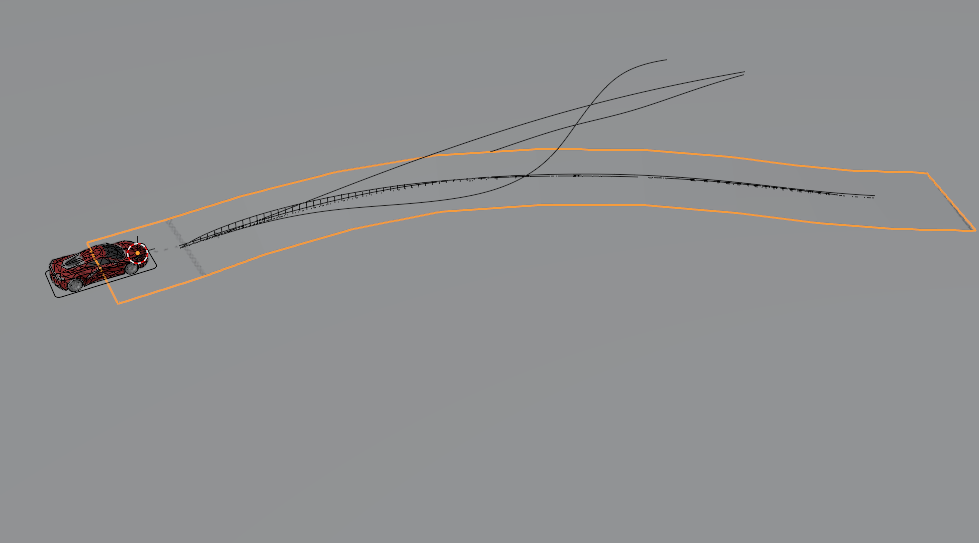 | 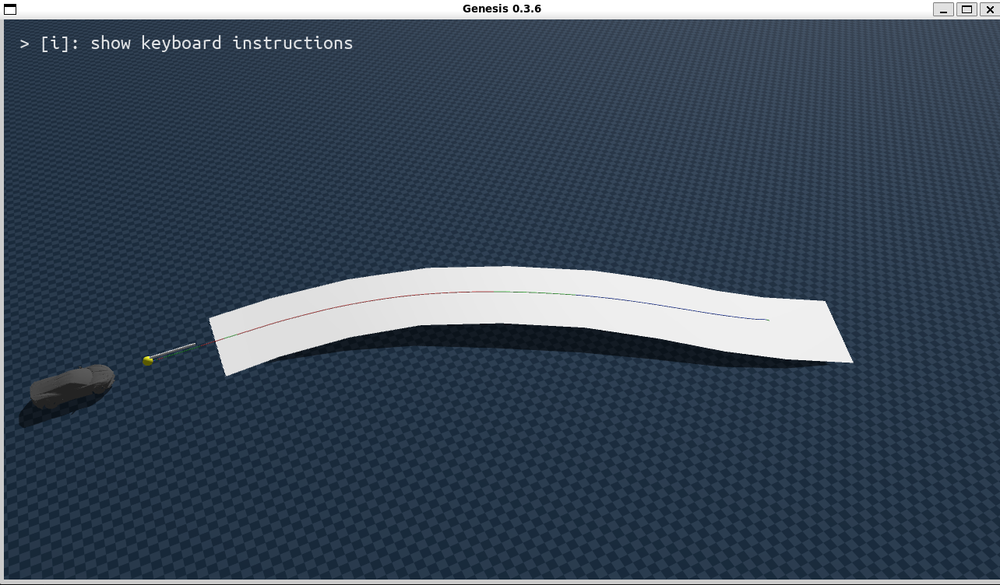 | 완만 좌커브 + 종단 |
| **p02** | 1.50m | 2.7° (4.7%) | 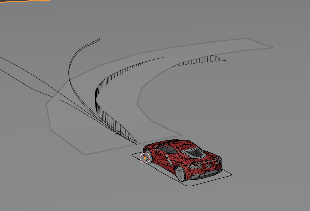 |  | 급커브 + 단조 오르막 |
| **p03** | 1.19m | 5.0° (8.8%) | 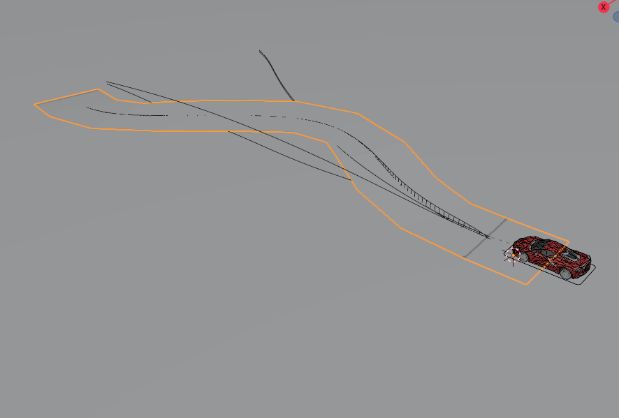 | 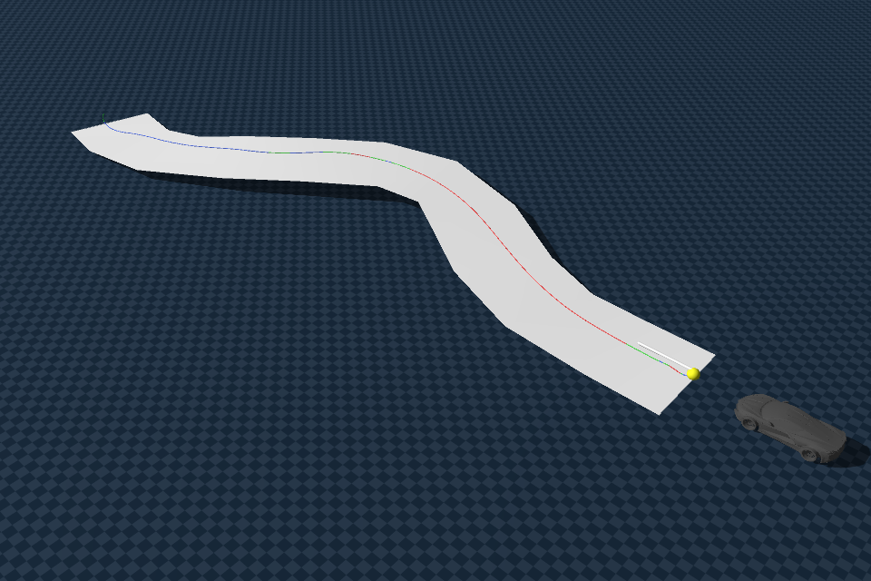 | S커브 + 정상 후 내리막 |
| **p04** | 1.43m | 19.6° (35.7%) ⚠️ | - | - | 우커브 + 단조 내리막 |
| **p05** | 0.40m | 1.7° (2.9%) | 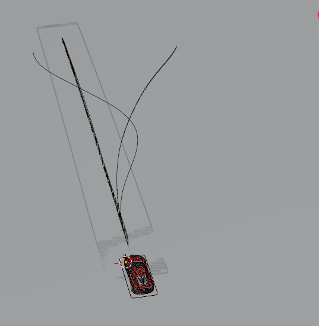 | 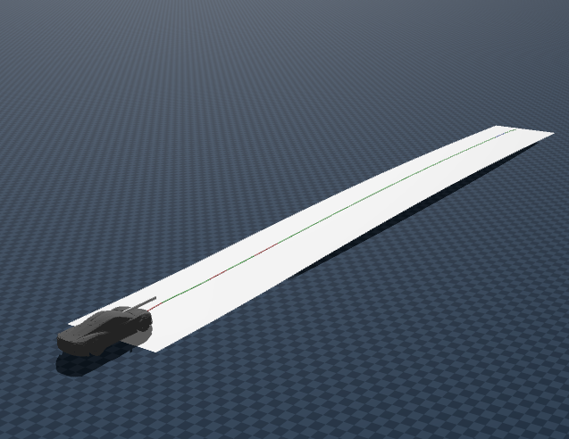 | 가장 완만 (고속도로) |
| **p06** | 1.00m | 4.2° (7.3%) | - | - | 일반 종단 |
| **p07** | 1.99m | 8.3° (14.6%) | - | - | 가장 급경사 (산길) |
| **p08** | 1.50m | 6.3° (11.0%) | 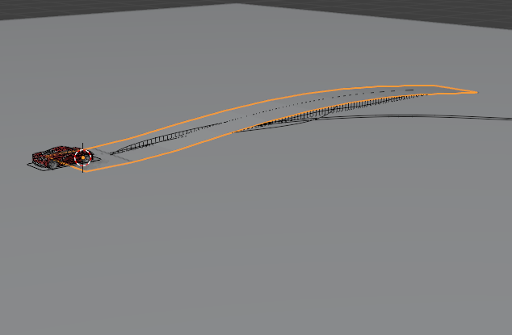 | 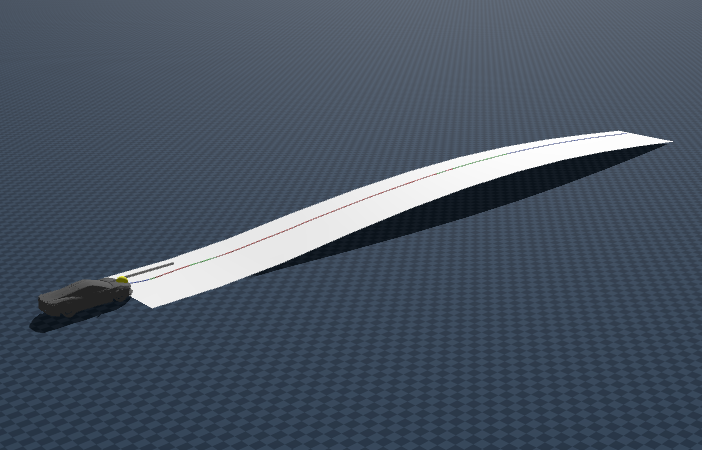 | 오르막→내리막 |
| **p09** | 1.20m | 4.4° (7.6%) | - | - | 내리막→오르막 (골짜기) |
| **p10** | 0.50m | 5.2° (9.0%) | 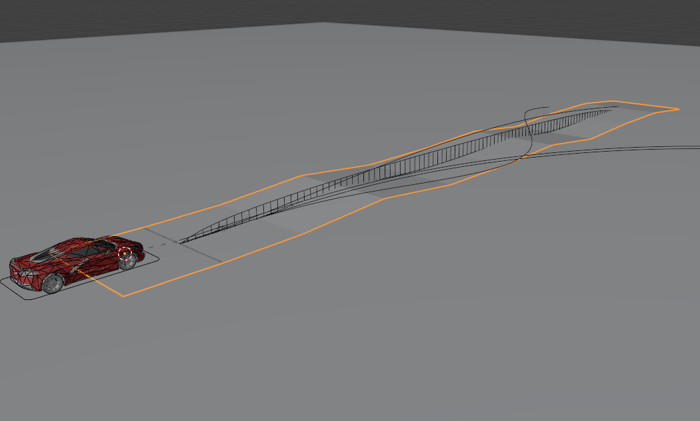 | 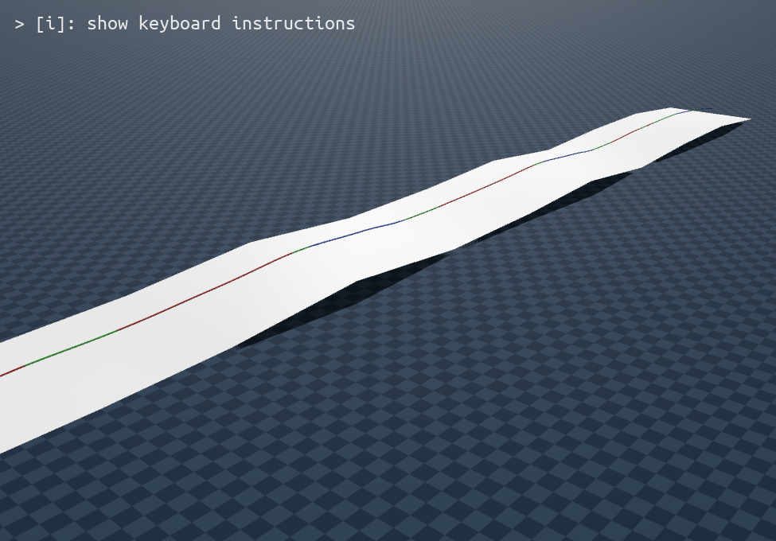 | 연속 파형 |

* mesh 로 로딩

## 최적화 시도

https://github.com/user-attachments/assets/f19ac26d-ada6-4c77-8048-b87507fd59fb

https://github.com/user-attachments/assets/e3819f44-ef25-4540-a968-5b44221cf7e4

* mppi 시도했지만 제대로 최적화가 되지 않음 
* bounding box가 삼각형 형태만 지원 &rarr; 조금 더 잘게 쪼개서 정교하게 만들어봐야할 듯

