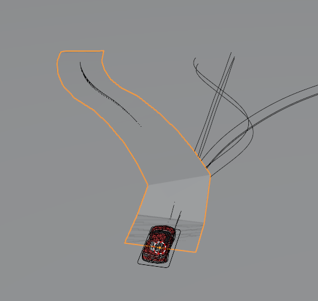
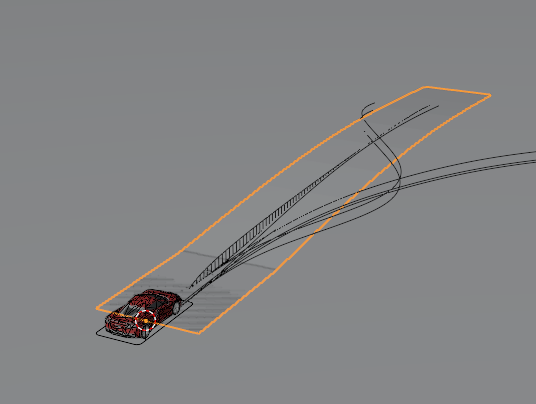
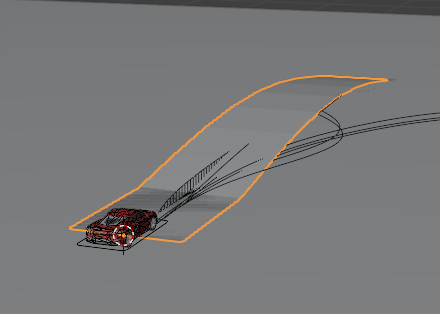
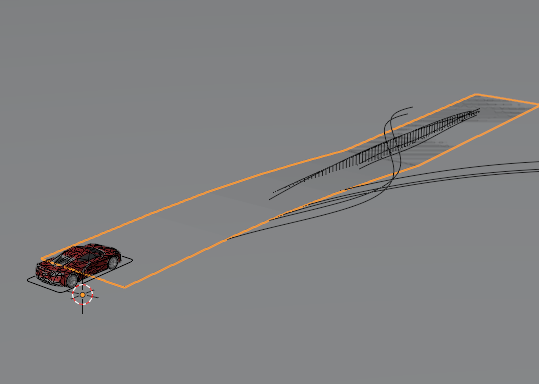

# Adding Z-axis to Data

> Z축의 데이터를 추가하여 경사면에서도 일반화 


* 기존 2d 경로에서 updown 을 추가하여 데이터 추출
    * 하지만 MPPI 최적화가 오래 걸리므로 조금 더 간단한 data 사용

---

## MPPI Mining 코드 변경사항 요약 (2D → 3D)

기존 2D 평면 주행 기반이었던 로직을 3D 지형(경사로)에 맞춰 개선했습니다. 전체적인 가독성을 위해 핵심 변경 사항만 요약합니다.


## 변경 요약

| 항목 | 기존 (2D) | 변경 (3D) |
| :--- | :--- | :--- |
| **기준 지형** | 단순 평면 (Plane) | 언덕 지형 (HillRoad Mesh) |
| **차량 스폰** | 고정된 높이 / 첫 프레임 | Mesh 높이 및 오프셋 계산 후 동적 스폰 |
| **거리 계산** | XY 평면상의 거리만 사용 | Z축 고도를 포함한 3D 입체 거리 적용 |

---

## 핵심 변경 사항

* **[차량 offset] 통일 및 스폰 보정**
  * Blender와 Genesis 간의 **Z축 기준점 차이(오프셋 0.39m)** 로 MPPI Mining 시 Z축의 차이 발생
  * cost 에 포함시키지 않음

* **[정확도] 3D 주행 거리 및 경사도 연산**
  * 단순히 평면 거리를 넘어, 3D arc length(`dz`)로 **실제 3D 궤적 길이**를 구하도록 공식을 변경했습니다.
  * 언덕 구간 분석을 위해 **경사도(Slope)** 수치를 새롭게 계산해 데이터프레임에 추가했습니다. (정량화 및 계산용)

* **[물리엔진] 지형 Mesh 물리 연산 활성화**
  * 3D 지형을 단순 그래픽이 아닌 밟고 올라갈 수 있는 바닥상태로 만들기 위해, 지형을 고정하고 **차량과의 물리 충돌(Collision) 기능을 활성화**했습니다.

* **[데이터] 경사로 처리를 위한 관측값(State) 확장**
  * 로직이 3차원 상태를 인지할 수 있도록 차량의 Z축(수직) 속도, 전체 3D 좌표, 차체가 기울어지는 **롤(Roll)**(좌우 기울어짐), **피치(Pitch) 각도**(앞뒤 기울임) 등의 정보를 새롭게 리턴하도록 보강했습니다.

* **[최적화] MPPI 비용(Cost) 함수 설계 원칙**
  * 조향(Steer)과 엑셀레이터(Throttle)만으로는 공중에 뜬 고도를 마음대로 제어할 수 없습니다.
  * 따라서, 최적화 계산 시 목적지와의 거리 오차에서 **Z축 관련 수치를 의도적으로 제외**했습니다.
  * XY 평면 목적지 추종에만 집중하면, 위아래로 움직이는 Z축 변화는 **지형 Mesh와 바퀴의 물리 충돌 연산이 부드럽게 알아서 처리**하도록 설계했습니다.


---

## Blender Auto drive Interface
| 사용법 | Blender Interface |
| - | - |
|| |
* auto drive 사용법

RBC의 원본 Speed Curve는 경로 위치(0~1)를 속도 배율로 변환한다.

| 경로 위치 | 속도 배율 |
|-----------|-----------|
| 0% (시작) | 0%        |
| 50% (중간)| 100%      |
| 100% (끝) | 0%        |

* 속도 배율이 0% 이면 데드락이 걸려 출발하지 못함

[troubleshooting](../tech/[26-04-04]_blender_troubleshooting.md)


## Z축 경로 (Blender vs Genesis)

| Scene | z 높이 | 최대 경사 | Blender | Genesis | 경사 유형 |
| :---: | :--- | :--- | :---: | :---: | :--- |
| **p01** | 0.98m | 4.3° (7.6%) |  |  | 완만 좌커브 + 종단 |
| **p02** | 1.50m | 2.7° (4.7%) |  |  | 급커브 + 단조 오르막 |
| **p03** | 1.19m | 5.0° (8.8%) |  |  | S커브 + 정상 후 내리막 |
| **p04** | 1.43m | 19.6° (35.7%) ⚠️ |  | - | 우커브 + 단조 내리막 |
| **p05** | 0.40m | 1.7° (2.9%) |  |  | 가장 완만 (고속도로) |
| **p06** | 1.00m | 4.2° (7.3%) |  | - | 일반 종단 |
| **p07** | 1.99m | 8.3° (14.6%) |  | - | 가장 급경사 (산길) |
| **p08** | 1.50m | 6.3° (11.0%) |  |  | 오르막→내리막 |
| **p09** | 1.20m | 4.4° (7.6%) |  | - | 내리막→오르막 (골짜기) |
| **p10** | 0.50m | 5.2° (9.0%) |  |  | 연속 파형 |

* mesh 로 로딩


## 최적화 시도 (실패)

https://github.com/user-attachments/assets/f19ac26d-ada6-4c77-8048-b87507fd59fb


https://github.com/user-attachments/assets/e3819f44-ef25-4540-a968-5b44221cf7e4

* mppi 시도했지만 제대로 최적화가 되지 않음 
* steering oscillation 원인: 메시 제어점 간 z 단차가 0.15~0.36m로 큼 → 차량이 경계 통과 시 충격
* bounding box가 삼각형 형태만 지원 &rarr; 조금 더 잘게 쪼개서 정교하게 만들어봐야할 듯

## mesh to heightfield 변환 실패 원인 분석

```
OBJ 버텍스: 24개  (경로점 12개 × 양쪽 2개)
height field spacing=0.1m → 약 450×100 = 45,000 격자 생성

45,000개 격자 중 24개 버텍스만 존재
→ 대부분의 격자에 지형 데이터 없음 → NaN
→ mesh_to_heightfield의 nanmax() 연산에서 All-NaN slice 경고
→ terrain이 계단 형태로 렌더링됨
→ 차량이 폴리곤 경계마다 충격 → heading 불안정 → 경로 이탈
```
* vertex가 너무 적어서 박스 형태로 mesh 생성 &rarr; oscillation

## Terrain Type vs Mesh Type

| 구분 | Terrain (Heightfield) | Mesh (Triangle Mesh) |
| :--- | :--- | :--- |
| **데이터 구조** | 2D 배열 속 높이값 | 정점(Vertex)과 면(Face)의 집합 |
| **표현 한계** | 2.5D만 가능 (터널, 수직 벽 표현 불가) | 완전한 3D 가능 (다리, 루프, 동굴 가능) |
| **렌더링 속도** | 규칙적인 구조 &rarr; **빠름** | 데이터 효율 떨어져서 **느림** |
| **물리 성능** | 매우 빠름 (단순 높이 샘플링 방식) | 상대적으로 느림 (삼각형 면 교차 검사) |
| **물리 연산 속도** | O(1) | O(log(n)) |
| **물리 안정성** | 매우 높음 (바닥 뚫림 현상이 거의 없음) | 보통 (면이 얇거나 복잡하면 물리적 튕김 발생) |
| **추천 용도** | 넓은 실외 지형, 완만한 언덕 도로 | 복잡한 실내 장애물, 특정 구조물, 루프 트랙 |
| **장점** | 빠름, LOD 적용 용이, GPU 친화적, 단순 | 자유도, 정교한 표현 |
| **단점** | 2.5D만 가능 (터널, 수직 벽 표현 불가) | 느림, 틈새(Crack) 현상|

* `spacing`에 따라 grid resolution 결정됨
* **LOD(Level of Detail)**: Terrain은 카메라에서 먼 곳은 primitive 개수를 줄이고, 가까운 곳은 늘려서 렌더링 최적화
* **틈새(Crack) 현상** — 삼각형과 삼각형이 만나는 모서리(Edge)나 꼭짓점에서 부동 소수점 계산 오차로 미세한 틈이 생깁니다. 충돌 포인트가 이 틈 사이로 빠져버리면 통과됩니다.
  * **예시**: 
    * **수학적 상황**: 두 삼각형 A와 B가 공유하는 꼭짓점의 좌표는 이론적으로 완벽하게 일치해야 합니다.
    * **현실(컴퓨터)**: 아주 미세한 계산 오차 때문에 삼각형 A의 꼭짓점은 $1.0000001$인데, 삼각형 B의 꼭짓점은 $0.9999999$로 인식될 수 있습니다.
    * **결과**: 이 $0.0000002$만큼의 틈새(Crack)가 발생하고, 물리 엔진은 바퀴가 이 미세한 틈에 "끼었다"고 판단하여 차를 멈추게 하거나 튕겨버립니다.
* **Tunneling 현상** -  물리 엔진은 현실처럼 시간이 연속적으로 흐르지 않고, 프레임 단위(예: 0.01초)로 '끊어서' 계산하는데, 물체가 너무 빨라서 얇은 벽(Mesh)이나 바닥을 인지하기도 전에 통과해 버리는 현상
  * **예시**: 
    * **수학적 상황**: 2.5d 라서 substep 계산이 정밀하지 않다면 차량이 단차가 있는 부분을 통과하여 지나가버림
    * **현실(컴퓨터)**: 다음 프레임이 계산 전 차량은 이미 지면 아래로 있는 상태
    * **결과**: 차량이 땅속으로 추락하거나, 끼이는 움직임을 보임

| 방식 | 로직 |
| :--- | :--- |
| **Mesh** | "이 물체가 삼각형 면에 **닿았나?**" → 프레임 사이를 놓치면 통과 |
| **Terrain** | "네 위치의 바닥 높이는 **무조건 여기야**" → 수학적으로 못을 박음 |

| 구분 | 터널링 (Tunneling) | 크랙 (Crack / Ghost Collision) |
| :--- | :--- | :--- |
| **현상** | 지면을 뚫고 통과해 추락함 | 지면 이음새에 걸려 튕겨 오르거나 끼임 |
| **원인** | 높은 속도 + 낮은 계산 빈도 (dt) | 삼각형 조각들이 만나는 경계선의 계산 오차 |
| **취약한 지형** | "얇은 Mesh, 급격한 경사" | 삼각형이 아주 많고 복잡한 Mesh |
| **Terrain의 방어력** | 중간 (속도가 너무 빠르면 여전히 발생) | 매우 강함 (수학적 격자 구조라 이음새 오차가 없음) |
| **해결책** | "substeps를 높임, 바닥을 두껍게 만듦" | "Terrain 타입 사용, Mesh 부드럽게(Smooth) 처리" |

---


→ Mesh 단독은 물리 불안정, Terrain 단독은 디자인 자유도 포기. 두 방식의 장점을 결합한 **하이브리드 전략**을 채택

## Hybrid Method (사용한 방법)

**"Mesh의 디자인 자유도"** 와 **"Terrain의 물리적 안정성"** 을 결합한 하이브리드 전략.

| 단계 | 설명 |
| :---: | :--- |
| **① 입력** (Mesh) | Blender에서 정밀하게 설계된 `.obj` 파일(Mesh)을 불러옵니다 |
| **② 변환** (Conversion) | `mesh_to_heightfield` 함수를 통해 Mesh 데이터를 2D 높이 배열로 변환합니다 |
| **③ 정규화** (Normalization) | Mesh의 원본 $Z$ 오프셋(`h_min`)을 계산해 모든 높이값을 하향 조정, 지형의 최저점을 $Z=0$에 맞춥니다 |
| **④ 물리 적용** (Terrain) | 변환된 데이터를 `gs.morphs.Terrain` 엔티티로 생성하여 시뮬레이션에 배치합니다 |
| **⑤ 안전장치** (Plane) | 지형 밖으로 차가 나갈 경우를 대비해 `gs.morphs.Plane`을 배경에 깔아 무한 낙하를 방지합니다 |

## Terrain Type 내부 구조
> Terrain Type은 가로/세로가 일정한 간격(`spacing`)으로 나뉘기 때문에, 인접한 4개의 꼭짓점이 이루는 단위 셀은 **반드시 직사각형**형태

하지만 렌더링 primitive는 삼각형 이기에 격자를 2개로 쪼개서 아래와 같이 계산
```
사각형 격자 한 칸 (x, y)
        │
        ▼
  ┌─────┐     →    △1 + △2
  │╲    │           (두 개의 삼각형 Primitive)
  │  ╲  │
  │    ╲│
  └─────┘
```

## Height Field 이해

#### 1. 논리적 구조: 사각형 그리드 (Data)

코드에서 설정하는 `spacing=0.25`는 **데이터의 저장 방식**을 결정합니다.

컴퓨터 메모리에는 가로 100줄, 세로 100줄짜리 **2차원 배열 (Excel 시트 같은 구조)** 로 높이 정보가 저장됩니다. 이 시점에서는 말 그대로 **"사각형 격자"** 형태로, 각 꼭짓점(Vertex)의 좌표가 $(x, y, z)$로 정의

| 항목 | 의미 | 비유 |
| :--- | :--- | :--- |
| **Heightfield** | grid 속 높이 map | 울퉁불퉁한 그물망 |
| **`spacing=0.25`** | grid 한 칸의 실제 물리적 길이 ($0.25\text{m}$), resolution | grid를 얼마나 잘게 쪼갤 것이냐? |
| **높이 ($Z$)** | Blender 메쉬의 실제 고도 | 그물망 각 점의 높이 |

#### `spacing=0.25` 의 의미 (해상도)

이것은 블록의 높이가 아니라 **"격자 한 칸의 가로/세로 길이"** 입니다. 즉, 지형의 **해상도(Resolution)** 를 결정합니다.

| `spacing` 값 | 의미 | 특징 |
| :---: | :--- | :--- |
| `0.10m` | 격자 눈 크기 10cm → 세밀한 지형 표현 | 격자 수 ↑, 연산량 ↑ |
| `0.25m` | 격자 눈 크기 25cm → 일반적인 도로 지형 | 균형 잡힌 해상도 |
| `1.00m` | 격자 눈 크기 1m → 거친 지형 표현 | 격자 수 ↓, 연산량 ↓ |

> **핵심**: `spacing`이 작을수록 삼각형이 많아져 지형이 정교해지지만, 물리 연산 비용도 함께 증가합니다.


## MPPI Golden Data 주행
* P03 fail 상태

| | |
|:---:|:---:|
| **P01** | **P02** |
| [](https://github.com/user-attachments/assets/3d3ac954-8ea3-430d-8c7f-1b33e7c49816) | []() |
| **P03** | **P04** |
| [](https://github.com/user-attachments/assets/ca4374ee-5f09-40dd-98e4-81319a9eaabe) |  |
| **P05** | **P06** |
| []() | [](https://github.com/user-attachments/assets/b3995cfb-4b69-4582-90b7-c2a9c2a9f10b) |
| **P07** | **P08** |
| | [](https://github.com/user-attachments/assets/4fed3900-ab37-4829-974e-9c791f376f0e) |
| **P09** | **P10** |
| | [](https://github.com/user-attachments/assets/63690d01-0383-4aa0-a3b1-7548d5adebc8) |


---
### next step
* 현재 z축 및 어려운 지형에 대한 최적화가 잘 되고 있지 않아서 `강화학습` policy로 해당 부분 진행 예정
