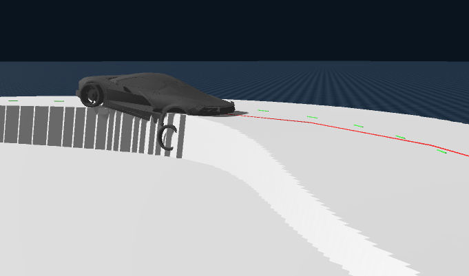
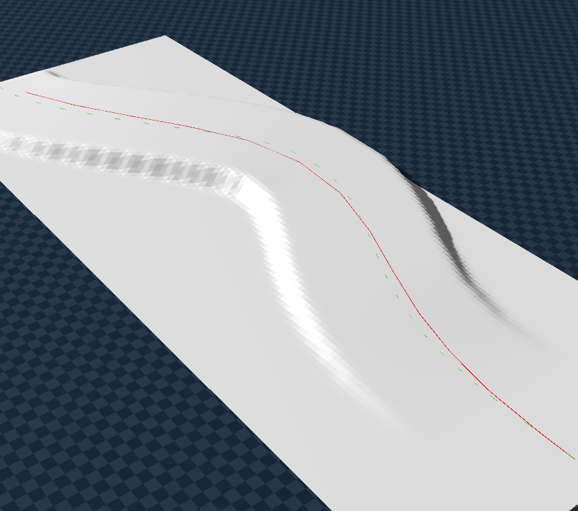
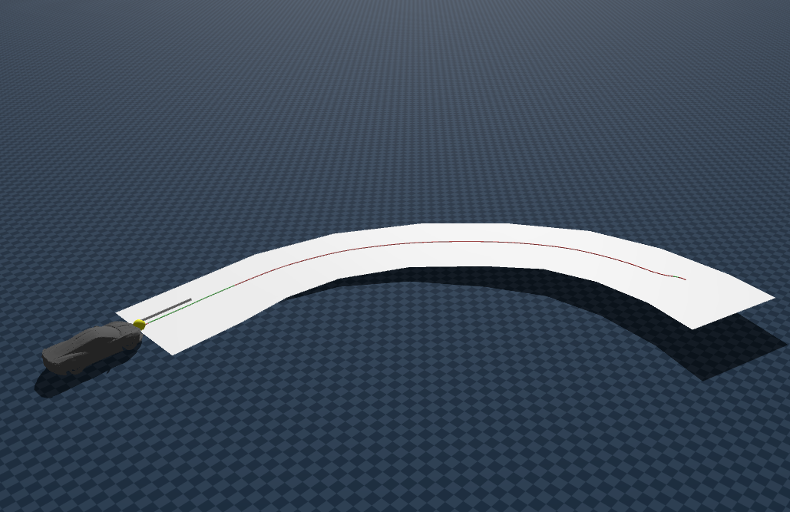
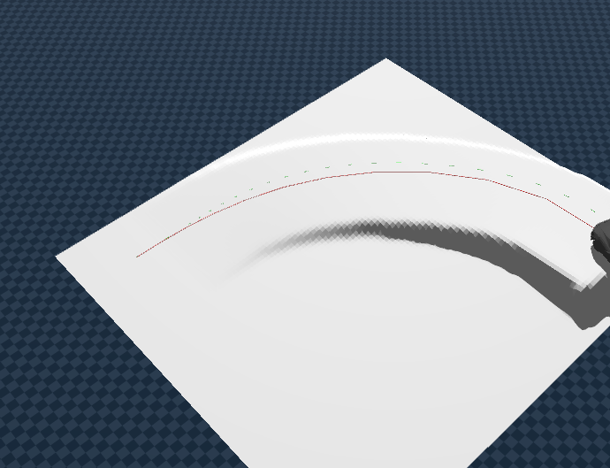

# Z-axis 물리 안정성 분석 (2)

## 1. 물리 솔버 방식 비교 (CCD vs DCD)

>시뮬레이션에서 충돌을 감지하고 계산하는 방식에 따라 물리 안정성과 연산 비용의 트레이드오프가 극명하게 갈립니다.

| 비교 항목 | 완벽하지만 비싼 "CCD" (Continuous Collision Detection) | 빠르고 효율적인 "DCD" (Discrete Collision Detection : substep 사용 방식) |
| :--- | :--- | :--- |
| **특징** | 비싸지만 **정확한** 물리 방정식 연산 | 싸고 **효율적인** 물리 연산 |
| **작동 방식** | 궤적 전체를 파악해 **정확한 충돌 시간(Time of Impact)** 역산 | $dt$만큼 위치 변화 후 **겹친 부피만큼 밖으로 밀어냄** |
| **강점** | 극단적 고속에서도 **터널링 구조적 차단 (수학적 완벽함)** | $dt$ 단위 물리 연산으로 **초고속 연산 처리** |
| **약점** | 방정식 연산(복잡한 조건문)으로 **연산량 폭발** | 프레임 간 벽을 뚫고 지나가버리면 **충돌 누락(터널링)** |
| **적용 사례** | 정밀 기계공학, 고사양 게임 엔진 | **Genesis** |
| **보완책** | - | **Substep**으로 부족한 정확도 보완 |

> discrete collision detection(substep 사용) 단순 덧셈/뺄셈 연산이 GPU의 매시브 병렬 처리(Massive Parallel Processing)에 완벽하게 부합하기 때문입니다. 수만 번의 분기와 조건문을 처리해야 하는 CCD를 피하고, 아주 짧은 Substep으로 DCD를 무식하게 50번 반복하는 것이 GPU 입장에서는 오히려 숨 쉬는 극도로 '가벼운 연산'입니다.

---

## 2. 터널링 현상 (Tunneling) 과 Spacing  분석

> **터널링(Tunneling)**: Terrain Entity를 사용하더라도 차량이 가속되거나 Physics `dt`(substep)가 낮을 경우, 바퀴가 지면의 표면을 감지하지 못하고 뚫려 통과해 버리는 버그 현상.

기존에 단순히 Spacing을 0.1로 올리면 터널링이 발생했던 근본 원인과 최신 최적화 파이프라인의 해결 논리는 다음과 같습니다.

### 2.1. Spacing 0.1과 에서의 붕괴 분석

1. **"밀도 역전"에 의한 계단 현상 (Data Sparsity)**
   * `spacing=0.1`설정은 격자 2D 배열 칸이 $10cm \times 10cm$ 해상도라는 의미입니다. 실제 지형(예: $10m \times 10m$)에는 약 10,000개의 vertex 저장 슬롯이 요구됩니다. (spacing 1.0 이라면 위 조건에서 100칸으로 terrain 표현)
   * **원인**: 그러나 입력된 3D Mesh의 정점(Vertex) 데이터는 고작 1,000개 수준. 1,000개의 데이터로 10,000칸을 메꿀 수 없음
   * **결과**: `nan(Empty)` 데이터들이 무더기로 생겨나며, 내부의 `nanmax` 처리 과정에서 곡선이 사라지고 지형 표면이 아주 뾰족하고 **날카로운 계단 형태**로 찍혀버렸습니다.
   
   * **충돌 반동**: 타이어가 이 모서리(계단형)와 충돌하는 순간, DCD(Discrete Collision Detection)는 비정상적인 충격량을 계산해 되려 바퀴를 땅 아래 방향이나 알 수 없는 공간으로 밀어버렸고, tunneling 현상을 유발했습니다.

2. **Heightfield의 "Zero-Thickness" 물리적 특성**
   * Terrain의 Heightfield는 사실상 부피가 존재하지 않는 **'0mm 두께의 평면 좌표 종이'** 와 동일
   * **원인**: 물리 계산 주기 간격($dt$) 동안 차가 내려가는 하강 거리가 이 종이의 두께인 $0.0mm$ 를 아득히 초과합니다.
   * **결과**: 엔진이 프레임을 점검할 때는 이미 위상 체적을 넘어 완전히 땅 아래로 '순간이동' 해버린 패스스루(Pass-through) 상태가 되어 추락이 확정된 것입니다. 

3. 요약 * 비교

| 구분 | **Tunneling**(heightfield 특성) | **Crack**(mesh 특성) |
| :--- | :--- | :--- |
| **현상** | 지면 충돌없이 그대로 밑으로 관통해 추락(2.5d) | 삼각형 이음새(가장자리 단차)에 걸려 차가 튕겨 오름(곡선 &rarr; 직선 &rarr; vertex) |
| **주동 원인** | 매우 높은 속력 + 물리 계산 빈도(substep) 부족 | DCD Mesh간 삼각형 조각들이 만나는 경계선의 연산 오차. |
| **취약 지형** | 0mm 두께의 Mesh 나 Heightfield 평면 | Vertex가 너무 많고 디테일하게 복잡하게 구성된 Mesh 지대. |
| **해결책** | **Substeps 증설**, 지형 버텍스 보간, 바닥 하부를 두껍게 연장 | 복잡한 Mesh 환경을 `Terrain type` 으로 이식, 스무딩 적용 |

### 2.2. Tunneling 해결을 위한 3단계 

1. **Step 1: Spacing 밀도 조율 (`0.1` → `0.25`)**
   * **내용**: 격자 칸의 크기를 키워 vertex와 격자의 비율 조정, 노이즈 축소
   * **효과**: 빈 공간(NaN)의 광범위한 발생을 억제 & 노이즈 축소

2. **Step 2: Cubic Interpolation (3차 다항 보간)**
   * **내용**: 그럼에도 불구하고 남겨지는 NaN 구멍 구간을 $Z$축 주변 데이터값을 참조해 부드러운 3차 곡선(C1: 미분가능)으로 채워 넣었습니다.
   * **설명**: height sample을 활용해서 미분가능한 연속적인 surface 재구성합니다.
   * **효과**: "지형 밀도 역전"으로 자글자글 생겼던 계단 현상을 제거하고 매우 매끄럽고 기하학적인 도로 표면으로 복원합니다.

3. **Step 3: Gaussian Smoothing (스무딩)**
   * **내용**: 불균일한 샘플이나, mesh &rarr; terrain 변환 시 aliasing 등 노이즈 제거 및 스무딩 효과를 줍니다.
   * **효과**: MPPI가 조향 떨림이나 Oscillation 없이 안정적인 자세 제어 가능(이전 oscillation 현상 개선)

---

## 3. 3D 지형 (Z축) MPPI 제어 변화

기존 2D 평면 주행과 달리 3D 지형은 Sim Pos(X,Y)가 맞아도 실제로는 어긋나는 현상 발생이 가능하다. 경로에 Roll 변화(+x forward)가 발생하면, (X,Y)는 동일하지만, 차량이 기울어져 있는 상태를 인지 못한 후 MPPI가 사후(ex 차량 전복 후) 감지할 가능성이 높다. 

> distance_error 계산 시 z축 포함 보단, Roll, Pitch 에 대한 penalty로 제어하는 것이 옳다

### 3.1. 3D 확장에 따른 Hyperparameter 변경

#### changes
* **Horizon**: 기존 10 &rarr; 20 (20 * 0.04초 = 0.8초)
* **Samples**: 기존 1000 &rarr; 2000
* **W_vel**: 기존 3000 &rarr; 2500 : 속도 중요도보다 정교한 경로추종을 우선

#### new (자세 안정 cost 추가: tuning 중)
* **Roll Cost**: 800
* **Pitch Cost**: 600
* **vz Cost**: 250

### 3.2. 자세 안정성 확보 (Pitch & Roll Regularization : 현재 진행중)

> 3D 지형에서는 중력에 의한 자세 변화를 제어하지 못해 오차가 발생합니다. 이를 방지하기 위해 차체의 자세 변화율을 페널티로 부과합니다.

$$Cost_{stability} = w_{roll} \cdot |\phi_{sim} - \phi_{ref}| + w_{pitch} \cdot |\theta_{sim} - \theta_{ref}| + w_{vz} \cdot |v_z|$$

* **$\phi$ (Roll, 좌우 기울기)**
  * **목적**: 측면 전복 방지, 중력에 의한 slip 사전 방지
  * **원리**: 좌우로 기울어짐에 비례하여 페널티($|\phi_{sim} - \phi_{ref}|$)를 부여해, 오직 0 도 수평 상태를 유지하도록 억제합니다.

* **$\theta$ (Pitch, 앞뒤 끄덕임)**
  * **목적**: 급격한 언덕 진입 충격 방지 , 중력에 의한 slip 고려한 선제적 속도 제어
  * **원리**: 오르막 표면의 자연스러운 피치 각도($\theta$)엔 벌점을 주지 않습니다. 하지만 휙 솟구치거나 처박히는 **회전 속도($\dot{\theta}_{sim}$)**를 억제하여 차가 지면을 천천히 타고 넘게 만듭니다.

* **$v_z$ (Z축 수직 속도)**
  * **목적**: 지면(Terrain) 이탈 및 튕김 현상 방지
  * **원리**: 차체가 경사면을 정상적으로 주행(접지)할 때는 차체 기준 수직 속도($v_z$)는 0에 가깝습니다. 하지만 $v_z$가 크다는 것은 차량이 관성에 의해 공중에 뜨거나 충격으로 튕겨 올랐음을 의미합니다. 따라서 MPPI가 지면에 안정적으로 밀착된 제어 명령을 선별하도록 유도합니다.

### 3.3. Z Alignment (고도 동기화 파이프라인)

매 시뮬레이션 시행마다 Genesis와 Blender mesh 별로 상이한 Z축 기준점을 일치시키고, 서스펜션 압축량을 물리적으로 보정하기 위한 4단계 파이프라인입니다.

#### 1단계: 차량 기하학적 기본 고도 산출
* **기본 고도 ($Z_{base}$)**: 타이어 반지름($R_{tire}$ : 지면 이격 거리)에서 중립 상태 서스펜션 오프셋($L_{suspension}$ : 차체 하단부와 지면 이격 거리)을 차감 &rarr; 차량이 달라져도 동일한 기본 고도 확보
$$Z_{base} = R_{tire} - L_{suspension}$$
* **상수 오프셋 ($\Delta Z_{offset}$)**: Blender 모형 원점과 Genesis 모델 기본 고도 사이의 절대적 이격 거리
$$\Delta Z_{offset} = Z_{Blender\_RBO} - Z_{base}$$

#### 2단계: 지형(Terrain) 영점 정규화

Blender Mesh의 절대 고도를 그대로 불러오면 공중에 뜨거나 땅에 박히게 됩니다.

* **정규화 로직**: 지형 내 모든 정점 중 최저점($h_{min}$)을 찾아 전체 고도에서 일괄 차감합니다.
$$Z_{Genesis\_Terrain} = Z_{Blender\_Mesh} - h_{min}$$
* *이후 Cubic Interpolation과 Gaussian Smoothing이 적용되어 정규화된 바닥면 위로 매끄러운 주행 곡면이 생성됩니다.*

#### 3단계: 서스펜션 동적 보정 (Drop-spawn)
서스펜션의 미세한 수축을 수식만으로 완벽히 예측하기는 힘듭니다. 이를 위해 실제 물리 환경에 차를 던져서 역으로 답을 얻어냅니다.
* **보정치 ($z_{corr}$) 산출**: 차량을 0.5m 지점에서 낙하시켜 안착시킨 후, 계측된 실제 고도($z_{settled}$)와 이론상 기대 고도($z_{expected}$)의 오차를 구합니다.
$$z_{corr} = z_{settled} - (Z_{terrain} + Z_{base})$$

#### 4단계: 최종 변환 공식 (참조 궤적 생성)
위의 모든 보정 계수를 합쳐 Z축에 대한 보정  

$$Z_{ref} = Z_{blender} - \Delta Z_{offset} - h_{min} + z_{corr}$$

| 항목 | 의미 | 역할 |
| :--- | :--- | :--- |
| **$Z_{blender}$** | Blender 원본 데이터 | 기준 경로 정보 |
| **$\Delta Z_{offset}$** | 차량 기하학적 보정 | 모델링-물리 엔진 간 규격 일치 |
| **$h_{min}$** | 지형 영점 보정 | 공중에 뜬 지형을 바닥으로 밀착 |
| **$z_{corr}$** | 서스펜션 압축 보정 | 경사로/중력에 의한 실제 접지 오차 해결 |

> 하지만 terrain 위에서 안착하면 안정화 시간 동안 중력에의해 미끌어지거나, suspension의 차이로 인해 완벽하게 일치할 수는 없음

### 4. 최적화 성능 향상
이미지 클릭 시 영상 재생

| before | after |
|-|-|
||
|  |  |

### 5. terrain/mesh type 별 성능 비교
| mesh | terrain_raw | hybrid(terrain+mesh) | terrain_cubic_gaussian(현재 사용) |
| - | - | - | - |
| -| - | - | - |

* 현재 유의미한 실험 결과가 나오지 않아서 보류

----

### next step
1. terrain 별 성능 비교
2. roll pitch cost 추가 후 성능 비교
3. 2d MPPI 에서 진행했던 어려운 경로들 mesh 적용 후 최적화 &rarr; 학습 후 추론 까지
4. 경사, 곡률에 따라 구간을 분리 후 RMSE로 최적화 정량 평가 (진행중)