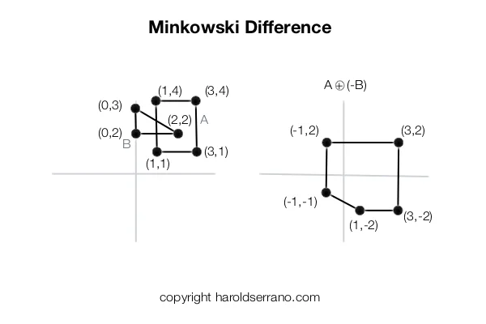
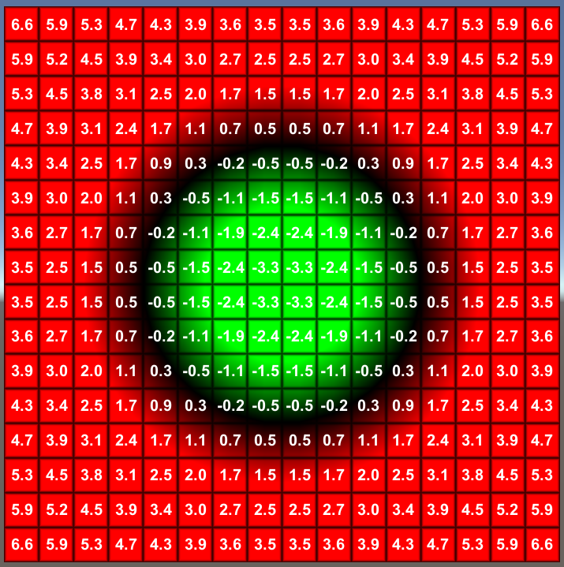
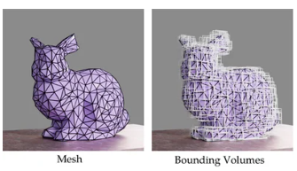
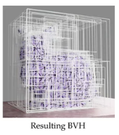

# Ray+BVH를 활용한 충돌로의 전환

## Genesis 충돌 처리 방식 정리

### CCD vs DCD
``` 
CCD (Continuous Collision Detection):
  물체가 t=0 → t=dt 이동하는 "궤적 전체"를 수식으로 계산
  → 충돌이 발생한 정확한 시간(Time of Impact) 역산
  → 아무리 빠르게 이동해도 터널링 구조적 차단
  → 단점: 방정식 풀어야 해서 연산량 폭발, GPU 비친화적

DCD (Discrete Collision Detection):
  t=dt 이동 후 "지금 겹쳐있냐"만 판단
  → 겹쳐있으면 그 깊이만큼 밀어냄
  → 단순 덧셈/뺄셈 → GPU 병렬 처리에 최적
  → 단점: dt가 크면 이동거리가 커져서 터널링 발생 가능

Genesis 방식:
  DCD 기반 + substep으로 보완
  내부적으로는 GJK/MPR/SDF로 penetration depth 정확히 계산
  substep=50 → dt를 50등분해서 DCD를 50번 반복
  → 각 스텝의 이동거리가 작아져서 터널링 억제
```

#### GJK / MPR / SDF — penetration depth 계산 방법

 

* GJK (Gilbert-Johnson-Keerthi): 두 convex 물체의 최단거리/충돌여부를 minkowski(vertex 집합)의 차집합으로 판정 (관통 시 depth는 별도)
* MPR (Minkowski Portal Refinement): GJK 보완 — 관통 상태에서도 penetration(관통) depth와 normal(방향)을 한 번에 산출, GPU 친화적



* SDF (Signed Distance Field): 공간 각 점의 "부호 있는 거리"를 미리 저장 → query 한 번에 거리·관통깊이·normal 즉시 획득 (주로 정적 환경에 사용)
> 바퀴 4개 × substep 50 × GJK/MPR &rarr; 무거움 &rarr; Ray 연산으로 대체하자


### 1. 깍두기(렌더링) vs heightmap 불연속(충돌) 구분

| 항목 | 깍두기 (시각적 계단) | heightmap 불연속 |
|------|---------------------|-----------------|
| 발생 원인 | heightmap을 렌더링할 때 셀 경계가 시각적으로 계단처럼 보임 | heightmap 셀 간 h값이 뚝뚝 끊김 |
| 충돌에 영향 | 없음 (렌더링 표현일 뿐) | 있음 (contact normal이 갑자기 꺾임) |
| 실제 문제 | 없음 | 바퀴가 덜컹거리거나 튕기는 현상 유발 |

---

### 2. Cubic Interpolation + Gaussian Smoothing 적용 효과

| 항목 | 원본 heightmap | Cubic Interpolation 적용 후 | + Gaussian Smoothing 적용 후 |
|------|---------------|----------------------------|------------------------------|
| h값 연속성 | 불연속 (셀 경계에서 계단) | 연속 + 미분 가능 (C1 곡선) | 연속 + 더 완만 |
| contact normal | 셀 경계에서 갑자기 꺾임 | 부드럽게 변함 | 더 부드럽게 변함 |
| NaN 처리 | 빈 셀 존재 | 3차 곡선으로 채움 | 잔여 노이즈 제거 |
| 뾰족한 노이즈 | 존재 | 완화 | 제거 |
| 충돌 품질 | 불안정 | 개선 | 현재 방식 최선 |

* height map = collision 이지만, terrain type은 샘플링 문제 때문에  contact normal이 튀어서 차가 terrain을 뚫음
---

### 3. Cubic + Gaussian으로 해결되는 것 vs 안 되는 것

| 항목 | 해결 여부 | 이유 |
|------|-----------|------|
| contact normal 불연속 | 해결 | cubic으로 h값이 C1 연속이 되어 normal이 부드럽게 변함 |
| NaN 빈 셀 | 해결 | cubic interpolation으로 채움 |
| 뾰족한 노이즈 | 미해결 | 완화하지만 완전 해결은 아님 |
| 2.5D 제약 | 미해결 | terrain은 (x,y) -> h 함수, 같은 (x,y)에 높이 두 개 불가 |
| resolution 제약 | 미해결 | spacing=0.25m 격자 이하 디테일 표현 불가, 보간해도 없는 정보는 생성 불가 |
| 수직 경사 | 미해결 | slope=90도에 가까우면 contact normal 여전히 불안정 |
| tunneling | 미해결 | dt/substep 문제, interpolation과 무관 |

---
## Ray Wheel + BVH

* `Carla` 의 ray-wheel 에서 아이디어

### Ray Wheel

* 현재 방식:
  * 바퀴(cylinder) ↔ terrain(mesh)
  * 3D 볼륨 대 3D 볼륨 충돌
  * GJK/SDF로 penetration 계산
  * 복잡한 지형에서 불안정


* Ray-Wheel 방식:
  * 바퀴 중심에서 -z 방향 Ray 1개 발사
  * Ray ↔ terrain mesh(BVH) 교차 계산
  * hit_distance < tire_radius 이면 충돌 판정
  * compression = tire_radius - hit_distance
  * 그만큼 위로 밀어내는 force 적용


### ray 방식의 연산 최적화

* cylinder ↔ mesh SDF:
  * mesh vertex 수에 비례한 SDF 샘플링
  * 모든 contact point 계산 (최대 5개/쌍)
  * substep마다 반복 → 무거움

* Ray ↔ BVH:
  BVH 트리 순회: mesh 100만 개도 log2(100만) ≈ 20스텝
  Ray 1개당 연산 극히 적음
  바퀴 4개 = Ray 4개 = 매우 가벼움
 

### Ray-wheel 구현 : Genesis 의 Lidar 센서를 활용

#### Lidar(Raycaster) self-ignore 동작 확인 실험

Lidar sensor 를 바퀴의 continuous joint 연결 부분부터 바닥까지 쏘아 거리 측정

차량을 `z = 1.0 m` 에 스폰하고 Lidar 측정값을 확인:

| 항목 | z 좌표 |
|------|--------|
| Ray 발사점 | `1.0 + 0.34 = 1.34 m` |
| 바퀴 하단 | `1.0 - 0.018 = 0.982 m` ← Ray 경로 중간 |
| terrain | `0.0 m` |

- 측정값: `dist = 1.3218 m ≈ 1.34 m` (terrain까지 거리)
- self-ignore가 없었다면 `dist ≈ 0.358 m` (tire_radius)가 측정됐을 것

→ **Genesis Raycaster 는 attach된 entity를 자동 self-ignore** 하도록 설계됨
  - Ray가 자기 바퀴를 통과하는 게 버그가 아니라 의도된 동작
  - wheel collision 비활성화 없이도 terrain까지 정확히 측정 가능


#### code snippet(Ray 구현)
* Lidar sensor 생성
```
lidar = scene.add_sensor(
    gs.sensors.Lidar(
        pattern=gs.sensors.GridPattern(res=(1,1)),  # Ray 1개
        entity_idx=car.idx,
        pos_offset=(wheel_x, wheel_y, 0),  # 바퀴 위치
    )
)
```


* 매 스텝 compression(지면에 ray가 들어간 정도) 계산 및 적용
  * compression에 따라 spring force 적용
```
# 매 스텝
hit_dist = lidar.read().distances[0]
compression = tire_radius - hit_dist

if compression > 0:
    spring_force = k_spring * compression
    damper_force = c_damper * v_z
    total_force = spring_force - damper_force
    car.apply_force([0, 0, total_force], pos=wheel_pos)
```


### BVH




BVH = Bounding Volume Hierarchy (경계 볼륨 계층 트리)

메시가 아무리 복잡해도 빠르게 Ray 교차 계산하기 위한 자료구조.

*  Ray가 날아올 때 삼각형 N개를 전부 검사하는 게 아니라 트리를 타고 내려가면서 교차하는 박스만 확인해. 
* 교차 안 하면 자식 노드들 스킵 &rarr; O(log N)
* 오브젝트 클릭할 때 마우스 Ray가 해당 메시를 정확히 잡는 방식도 이와 동일


### Ray 방식으로 했을때 성능 높일 수 있는가?
* Ray 4개 × BVH 교차 = 극히 가벼운 연산
  * 같은 연산 예산으로 substep을 더 늘릴 수 있음
  * 2000개 env도 GPU 배치로 처리 가능(실험 통해 확인)
  


---

## CARLA Ray-Wheel 물리 모델

### 서스펜션 공식

CARLA는 Ray `hit_distance`를 기반으로 현재 서스펜션 길이를 계산하고, 이를 통해 compression을 산출한다.

### CARLA 비대칭 damper
> 주는 힘 비대칭
* 압축 시 (낙하): `C_comp` (높게) → 충격 흡수
* 신장 시 (반발): `C_ext` (낮게) → 반동 억제하여 차량이 튀지 않게함

### 매 스텝 바퀴당 3가지 force 적용

1. **Suspension force** — 수직 지지력. Ray hit point에서 chassis(차체)에 적용
2. **Side force** — 횡방향 미끄럼 방지. 바퀴 rolling 방향 수직 벡터로 계산
3. **Forward force** — 종방향 traction. 가속/제동 force

---
## Bug Report & Fixes
### 버그 1: Genesis Lidar 다중 센서 캐시 오프셋 버그

```
증상: Lidar 4개 동시 사용 시 3, 4번째 센서가 항상 0.0 반환

원인: genesis/engine/sensors/raycaster.py
      sensor_cache_offsets 누적합 계산 오류
      올바른 값: [0, 4, 8, 12, 16]
      실제 값:   [0, 4, 4,  4,  4]  ← 누적 아님

해결: raycaster.py 직접 패치
```

### 버그 2: link.idx global/local 불일치

```
증상: force가 엉뚱한 link에 적용됨

원인: link.idx       = global index (1~11)
      force_tensor   = local index (0~10) 기준
      → front_right_wheel.idx=11이 tensor 범위 초과

해결:
  links_idx = [l.idx for l in car.links]
  local_pos = links_idx.index(global_idx)
  force_tensor[local_pos, 2] = force_mag
```

### 버그 3: 첫 스텝 Lidar 미초기화

```
증상: step 0에서 distances = 0.0 반환

해결:
  prev_d = [TIRE_RADIUS * 2] * 4
  if hit_dist <= 1e-6:
      hit_dist = prev_d[i]
  prev_d[i] = hit_dist
```

---

## URDF 수정 사항
### test_v1_raywheel.urdf 변경 내역

| 항목 | 원본 | Ray-Wheel |
|------|------|-----------|
| wheel collision | cylinder 있음 | **제거** → **Ray가 대체** |
| suspension joint | prismatic (stiffness=35000) | **fixed (고정)** |
| suspension dynamics | damping=5000, stiffness=35000 | **제거** |


### suspension을 fixed로 바꾼 이유

* prismatic joint에 stiffness=0 설정 시:
  * 저항 없는 자유 조인트
  * 중력으로 바퀴가 무한정 늘어남
  * 차체가 공중으로 올라가는 현상 발생
* ray의 compression 계산 + spring force 계산과 중복되어 이중 force 적용

fixed로 고정하고 Ray force가 서스펜션 역할 대체


---

## CARLA Ray-Wheel 모방 구현
### 1. CARLA (Unreal Engine + PhysX) 방식

CARLA는 Ray-Wheel을 엔진 레벨에서 완전히 지원

구조:
  * 차체(chassis): rigid body + collision 있음
  * 바퀴:          시각적 mesh만 **(collision 없음)**
  * 접지:          바퀴 축에서 -z Ray 발사 → hit_distance 측정
  * 서스펜션:      내장 suspension model (spring/damper 자동)
  * 마찰:          내장 tire force 모델 자동 계산 

**PhysX constraint의 핵심 역할**

* Ray hit point에서 constraint 자동 생성
  * 바퀴가 terrain 이하로 내려가지 못하게 물리적으로 차단
  * terrain 관통 자체가 구조적으로 불가능
  * 개발자는 파라미터 튜닝만 하면 됨

**PhysX constraint vs Genesis**

| 항목 | CARLA (PhysX) | Genesis |
|------|--------------|---------|
| 바퀴 collision | 없음 (Ray 전용) | 없음 (URDF 수정) |
| 수직력 | PhysX 자동 | 수동 (apply_force) |
| 마찰력 (traction) | PhysX 자동 | 수동 구현 필요 |
| 지면 관통 방지 | **constraint 자동 생성** | **없음 ← 핵심 문제** |
| suspension | PhysX 내장 | 수동 (fixed joint + Ray force) |


### 2. Genesis에서 구현 제한사항

Genesis는 Ray-Wheel을 엔진 레벨에서 지원하지 않아 직접 constraint를 만들어야 했음

**구조적 문제**

https://github.com/user-attachments/assets/2af9647b-16fb-4985-96de-53426412c917


위 현상 설명 : 
* cylinder collision 없음
  * 바퀴가 terrain을 통과해서 내려감 
  * hit_distance < tire_radius
  * compression 발생 
  * suspension 작동으로 인식→ 위로 spring force
  * 위로 올라감 → compression 감소 → force 감소
  * 중력으로 다시 내려감 → 다시 통과
  * 무한 반복 → 튕김


**시도한 우회 방법들과 한계**


* 방법 1: spring force (K × compression)
  * force는 관통 후 밀어내는 것
  * constraint처럼 관통 자체를 막지 못함
  * 무한 진동 구조

* 방법 2: K값 대폭 증가 (K=500000)
  * 관통을 "줄이는" 것이지 "막는" 것 아님
  * 진동 크기만 줄어들 뿐 구조적 해결 안됨


### 3. 안착 테스트 방식별 결과

| 방식 | 결과 | 비고 |
|------|------|------|
| Spring force | X | 관통 후 폭발적 force → 튕김 |
| Constraint 근사 | O | z_std=0.000, 즉각 수렴 |
| Constraint + Traction | △ | collision이 없어 마찰력 적용이 안되는 중 |


### 4. Constraint 근사 구현

https://github.com/user-attachments/assets/d8fb2f93-3cf4-4782-b542-8cd7630b4434


> 요약: 
매 `scene.step()` 후:

1. Lidar로 바퀴 관통 깊이(`max_comp`) 측정
2. 관통 시 `set_pos`로 차체를 `max_comp`만큼 위로 보정(사후 보정: dcd 원리)
3. 하향 속도 제거 (`set_dofs_velocity`, DOF2=0)

결과:
- `z_mean = 0.018 m`, `z_std = 0.000 m` → 완벽 안착
- spring force 대비 2스텝 만에 즉각 수렴

한계:
- 정적 지지만 가능 (traction 없음)
- traction 이 되지 않아 차량 제어가 불가함 &rarr; 현재 디버깅 중
- 연산 성능/효율성 미확인


#### 내부 연산 비교

| 항목 | PhysX (CARLA) | Genesis 근사 방식 |
|------|--------------|------------------|
| 적용 시점 | step 내부 (연속) | step 종료 후 (이산) |
| 물리 정확도 | 정확 | 1 step 지연 |
| 속도 처리 | 자동 | 수동으로 z 성분만 제거 |
| 수평 속도 영향 | 없음 | set_pos 리셋을 **수동 복원** |

> 현재 post-step geometric constraint correction 방식으로 constraint 근사: 매 스텝 lidar 로 penetration 측정 후 setpos 로 위치 보정


### 5. Traction 추가
**Constraint + Traction (Step 7) 진행 중**

```
수직력: K × compression - C × vel_z (base_link에 합산)
수평력:
  traction = (wheel_omega × tire_radius - v_long) × friction_long
  lateral  = -v_lat × friction_lat
```

현재 상태: 오류 수정 중

### 정리

Genesis에서 CARLA 방식 Ray-Wheel **완전** 구현은 불가능.

```
근본 이유:
  PhysX는 Ray hit point → terrain 관통 방지 constraint 자동 생성
  Genesis는 이 constraint 기능이 없음
  → Ray force만으로는 terrain 관통을 물리적으로 막을 수 없음
  → cylinder collision 없이는 구조적으로 진동/튕김 불가피

우회 방법:
  set_pos(위치 직접 수정) + set_dofs_velocity(속도 지정)으로 PhysX constraint 근사
  → 정적 안착은 성공
  → traction 추가 시 실제 주행 가능 여부 검증 중
```


### 검증된 내용

- O: Genesis Lidar API 작동 확인 (GridPattern -z, self-ignore 포함)
- O: `apply_links_external_force` API 작동 확인
- O: Lidar 배치 (n_envs=2001) 지원 확인
- O: Genesis raycaster.py 버그 발견 및 패치
- O: Constraint 근사 방식으로 Plane terrain 안착 성공
- △: Constraint + Traction 주행 테스트 진행 중
- X: Mesh terrain 안착 미검증