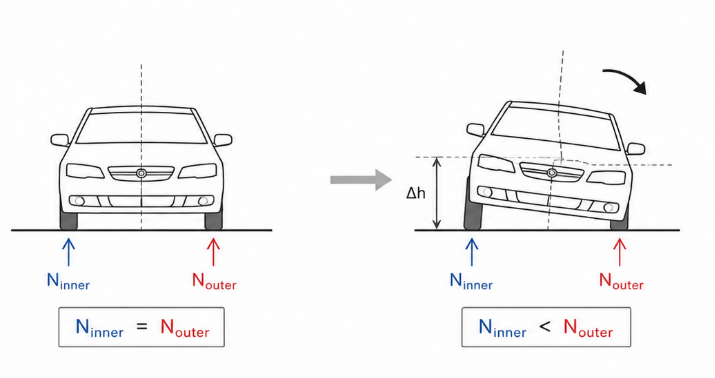
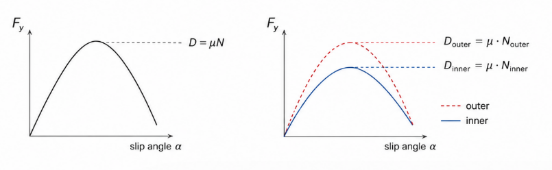
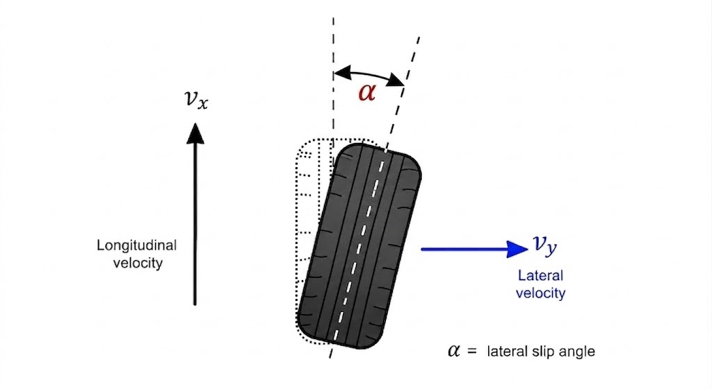
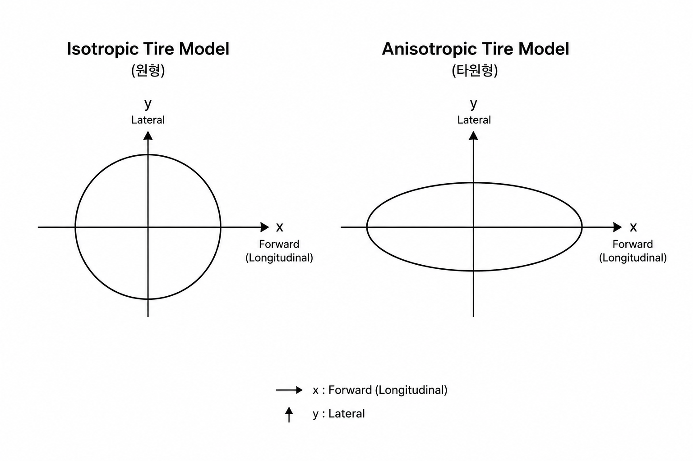
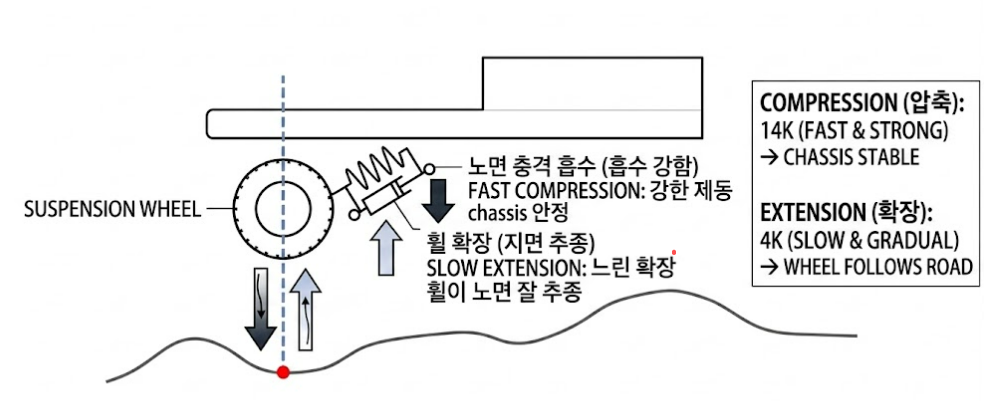

# Dynamic Ray Car: Pacejka Anistropic Tire Model

## 개요

Genesis의 `cylinder ↔ terrain 3D` collision은 

contact normal 불안정, heightfield 변환 손실, substep=50 

부담 등 한계가 있어, 바퀴 collision을 제거하고 raycast hit point를 충돌 판정에 사용하는 `ray-wheel 구조`를 도입했다. 

> 본 보고서는 그 ray-car의 `Pacejka anistropic tire model`을 다룬다:

* 수직력 — ray로 측정한 compression에 spring + 비대칭 damper 적용 (per-wheel 독립)
* 수평력 — Pacejka anistropic 모델로 종/횡 slip별 friction 계산 분리

## Tire Model Overview

타이어는 단순 Coulomb friction이 아니라,
종방향(가속/제동)과 횡방향(코너링)의 응답이 서로 다르다.

실제 타이어는:
- 회전 방향으로는 강한 traction
- 횡방향으로는 slip angle 기반 deformation

을 가지므로 isotropic friction으로는 재현이 어렵다.

따라서:
- 수직력은 suspension/damper
- 수평력은 anisotropic Pacejka tire model

로 분리한다.

### 수직-수평 분리 전략

 

**수직 force**는 ray-wheel suspension/damper가 담당
* $D$(최대 마찰계수) $= \mu$(노면 마찰계수)$ \cdot N$

**수평 force**는 Pacejka Magic Formula가 담당

*  각 바퀴의 contact velocity `v_hit`로부터 slip ratio `κ`(종방향)와 slip angle `α`(횡방향)를 계산
*  `F = D · sin(C · atan(B·s − E·(B·s − atan(B·s))))` 형식의 비선형 friction force를 생성

#### connection interface N (수직항력)
두 채널은 ***N(수직항력)을 매개로*** 결합

* 마찰력: 수직 채널이 출력한 N이 Pacejka의 마찰원 한계 `D = μ · N`을 결정
* 수직력: suspension compression 정도가 그 바퀴가 낼 수 있는 *최대 horizontal force*를 직접 통제

즉, 코너에서 차체가 한쪽으로 쏠리면 외측 바퀴의 N이 증가하고 그 바퀴의 그립 한계가 커져 더 큰 코너링 force를 낼 수 있는 자연스러운 weight transfer 거동이 자연스럽게 연결

## Slip Definition

Pacejka는:

현재 차량의 상태에서 얼마나 force를 낼지

를 모델링하는 함수다.

### Londitual Slip : Kappa(종방향 슬립)

κ=∣vlong​∣Rω−vlong​​

| 상태    | 의미  |
| ----- | ------------ |
| κ > 0 | wheel spin   |
| κ = 0 | pure rolling |
| κ < 0 | braking slip |

K에 따른 Force 의 Pacejka 모델링 :

$$
F_x = D_x \cdot \sin\!\left(
C_x \cdot \tan^{-1}\!\left(
B_x \kappa
- E_x \left(
B_x \kappa - \tan^{-1}(B_x \kappa)
\right)
\right)
\right)
$$

### Lateral Slip

slip angle $\alpha$: 타이어의 lateral slip angle (α) 는 “타이어가 실제로 향하고 있는 방향”과 “타이어가 실제로 이동하는 속도 벡터 방향” 사이의 각도

$$
\alpha = \tan^{-1}\left(\frac{v_{\mathrm{lat}}}{\left|v_{\mathrm{long}}\right|}\right)
$$

$$
F_y = D \cdot \sin\left( C \cdot \arctan\left( B\alpha - E\left(B\alpha - \arctan(B\alpha)\right) \right) \right)
$$

$F_y$ : 횡방향 접지력

### 바퀴의 collision off

>  friction/slip을 제대로 계산 가능. 입체-입체 충돌은 Coulomb isotropic(등방성) 마찰밖에 못 다루지만, raycast hit point + 차량 속도로부터 우리가 직접 종/횡 slip을 계산해 Pacejka 같은 anisotropic tire(비등방성) 모델을 적용

## Anisotropic Tire Model(비등방성 타이어 모델) : Pacejka 

> 종방향과 횡방향은 서로 다른 rubber deformation mechanism을 가진다.
따라서 서로 다른 Pacejka parameter set을 사용한다.

$$F = D \cdot \sin\!\Big(C \cdot \arctan\big(B \cdot s - E \cdot (B \cdot s - \arctan(B \cdot s))\big)\Big)$$

**파라미터 s**
* s: kappa 라면 longitudinal 방향
* s: alpha 라면 lateral 방향

> 실제 타이어는 회전 방향(종방향)과 옆으로 미끄러지는 방향(횡방향)의 물리적 특성의 차이를 Pacejka Anistropic Model 을 통해 모델링 

---

### Parameter Interpretation : 파라미터 설명

#### B: Initial Stiffness (초기 반응 민감도)
* 의미: 슬립이 시작되는 초기 단계에서의 힘의 기울기(Stiffness)를 결정
* 영향: $B$가 클수록 핸들을 살짝만 꺾어도 steering이 민감해짐, 작을수록 둔해짐

  
  
  살짝만 슬립해도 힘이 크게 주어짐
  

  어느정도 슬립이 되어야 steering에 의한 마찰력이 붙기시작함

#### C: Shape Factor (형상 계수: 전체 곡선 모양)
> 부드럽게 한계까지 가느냐? vs 급격히 버티다가 한번에 터지냐
* 의미: 타이어의 **전반적인** 힘의 유지력/capability를 결정

   
  * 낮은 C : 접지력이 유지되며 **드리프트 현상** 지속 (부드럽게 한계까지)

   
  * 높은 C : 접지력 유지되며 **높은 제어력 유지**, 하지만 한계 초과 시 **스핀**(버티다 터짐)

#### D: Peak Factor (정점 계수)

* 의미: 타이어의 최대 마찰력

  

* 물리적 관계: $D = \mu \cdot N$ (최대마찰계수)
* (마찰계수 $\times$ 수직항력).영향: 값이 높을수록 '그립이 좋은 타이어'

$F = D \cdot \sin\_{..}$

범위: -D ~ D

#### E: Curvature Factor (곡률 계수: 피크 이후 힘의 감소)
* 의미: 정점(Peak) 근처의 곡률과 정점 이후의 '힘의 빠짐(Drop-off)' 정도를 조절
* 영향: $E$ 가 높다면 접지력이 빨리 풀리고, 낮다면 접지력 유지

### Combined Slip

$$
F_x^2 + F_y^2 \leq (\mu N)^2
$$

* longitudinal force  $Fx$
* lateral force $Fy$
	

타이어가 낼 수 있는 grip 은 한계가 있음

**braking case** : 강한 brake 시 lateral grip 감소
* longitudinal force budget을 많이 사용하면
* lateral force 여유가 감소한다

**cornering case** : 강한 코너링 중 acceleration grip 감소
* lateral force budget을 많이 사용하면
* longitudinal traction 여유가 감소한다

---

### Wheel Torque dynamics (휠 토크 생성)

> Throttle 이 입력되면 차량의 엔진 토크가 증가하고, 바퀴회전이 증가하고, slip이 생성되고, tire force가 만들어지고, 차량이 가속한다.

**구동 토크**(후륜)

$$T_{\text{drive}} = \text{throttle} \cdot \frac{T_{\max}}{2} \cdot \mathbf{m}_{\text{drive}}$$

* throttle 입력에 비례하는 토크를 마스크 $\mathbf{m}_{\text{drive}} = [0,0,1,1]$ 로 후륜 2개에만 분배
* `T_MAX / 2` 는 전체 토크를 두 구동륜에 나눠 주는 의미

**제동 토크**

$$T_{\text{brake}} = \text{brake} \cdot T_{\max} \cdot \tanh\!\left(\frac{\omega}{\omega_\varepsilon}\right)$$

* 브레이크 강도(`brake`)에 비례하는 토크에, 바퀴 회전 방향에 따른 **부호**를 `tanh`로 부여
* $|\omega| \gg \omega_\varepsilon$ 이면 $\tanh \approx \pm 1$ → 회전 반대 방향으로 최대 제동
  * $\omega_\varepsilon$: divide by zero 방지
* $\omega \to 0$ 근처에서는 $\tanh \to 0$ → 제동 토크가 부드럽게 사라져 **lock-up(역회전) 방지**

**마찰 반작용 토크**

$$T_{\text{fric}} = Radius_{\text{tire}} \cdot F_{\text{long}}$$

* 지면이 바퀴에 가하는 Pacejka 종방향 마찰력 $F_{\text{long}}$ × 바퀴 반지름 = 회전축에 작용하는 반작용 토크
* **가속 중에는 바퀴 회전을 늦추는 방향, 제동 중에는 회전 유지 방향으로 작용** : MPPI 시 csv data 의 `a`항 참조

**바퀴 각가속도** (Omega: Newton-Euler 회전 운동방정식)

$$\dot{\omega} = \frac{T_{\text{drive}} - T_{\text{brake}} - T_{\text{fric}}}{I_{\text{wheel}}}$$

* $I_{wheel}$: 바퀴의 관성 모먼트 inertia 
  * genesis 좌표계에선 +x forward, +z up이므로 iyy
* $T_{drive}$: 엔진이 바퀴를 돌리는 힘 : 토크
* $T_{brake}$: 브레이크가 회전을 막는 힘
* $T_{fric}$: 노면이 타이어를 붙잡으며 생기는 반작용 토크
  * $T_{fric}$이 충분해야 타이어가 미끌어지지 않고 속도를 낼 수 있다

#### Wheel dynamic Closed Loop

1. 토크 &rarr; ${\omega}$ 변화
2. 슬립 $K$ 변화
3. tire force 변화
4. $T_{fric}$ 변화
5. 토크 &rarr; ${\omega}$ 변화

$\omega$ 가 다음 스텝의 Pacejka slip 계산($\kappa = \frac{R\omega - v_{\text{long}}}{|v_{\text{long}}|}$)에 다시 입력 → 토크-마찰 closed-loop 완성

### Suspension / Damper

#### 비대칭댐퍼

| 항목 | 일반차량 세팅 | **현재 세팅** |
| - | - | - |
| 압축 감쇠 (Compression) | 4k | 14k |
| 신장 감쇠 (Rebound / Extension) | 14k | 4k |
| 비대칭 방향 | 신장 > 압축 | 압축 > 신장 |
| 기본 목적 | 승차감 / 안정성 | 타이어 접지 유지 / 롤 제어 |
| 노면 충격 흡수 | 부드러움 (초기 충격 흡수 큼) | 단단함 (**진동 선제 방지**) |
| 차체 복원 속도 | 느림 (리바운드 강함 &rarr; **진동가능성**) | 빠른 복원 |
| 타이어 접지 유지 | 중간 | 높음 (빠른 하중 전달) |
| 코너링 응답성 | 느림 | 빠름 |
| 고속 안정성 | 안정적 | 매우 안정적 (세팅에 따라 과도하게 하드 가능) |
| 대표 적용 | 승용차, SUV | 레이싱카: 시뮬 안정성 |

