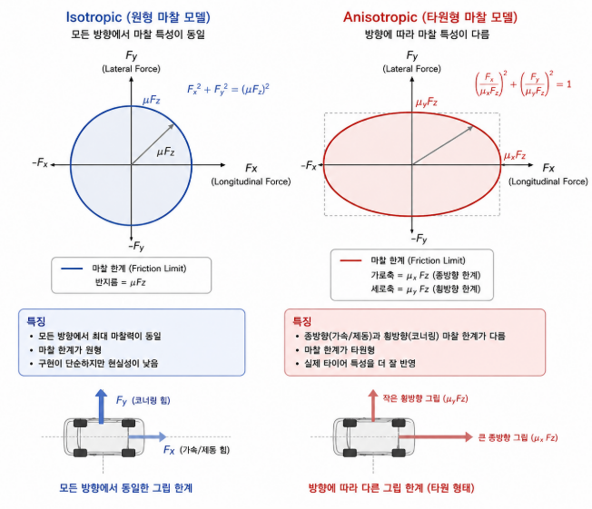
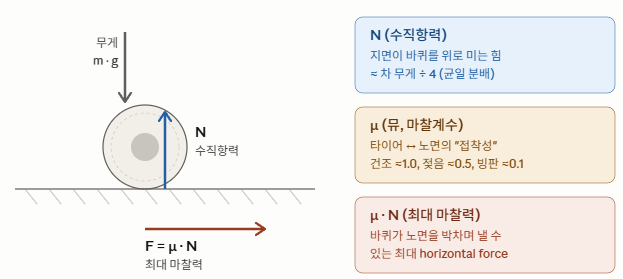
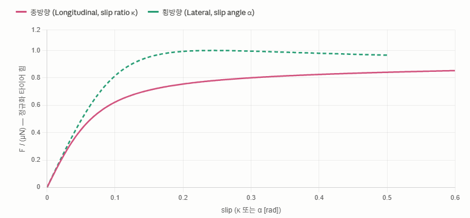
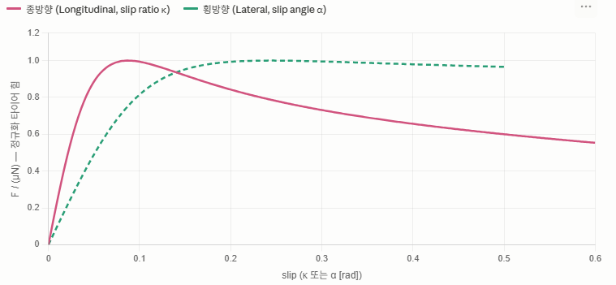
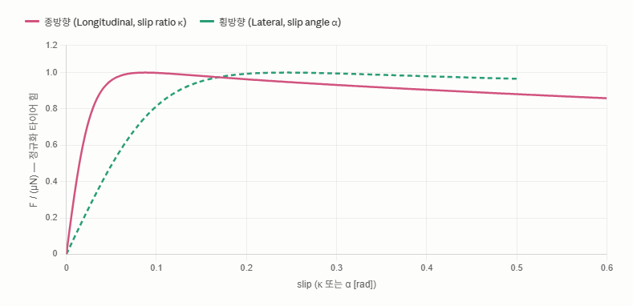
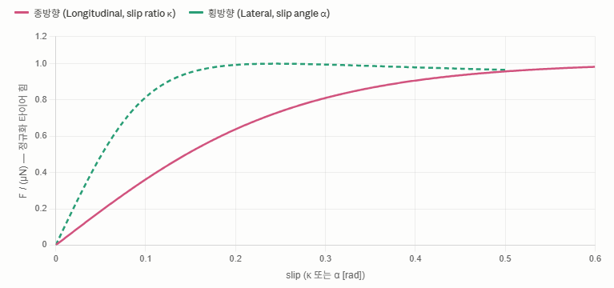
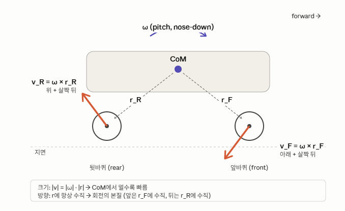
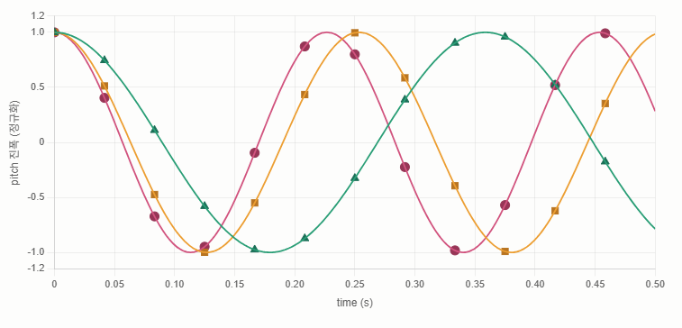

# Dynamic Ray Car


----

## 개요

ray_bvh에서 Genesis의 cylinder ↔ terrain 3D collision은 contact normal 불안정 / heightfield 변환 손실 / substep=50 부담 등 한계가 있어, 바퀴 collision을 제거하고 raycast hit point를 충돌 판정에 사용하는 ray-wheel 구조를 도입했다. 

다만 ray_wheel에서는 "정적 안착"만 검증된 상태였고, 실제 주행에 필요한 spring/damper/traction 동역학은 미해결 상태였다.

본 보고서는 그 ray-wheel 위에 수직/수평 force를 분리한 dynamic 모델을 구현한 결과를 다룬다:

* 수직력 — ray로 측정한 compression에 spring + 비대칭 damper 적용 (per-wheel 독립)
* 수평력 — Pacejka anistropic 모델로 종/횡 slip별 friction 계산 분리

구현 과정에서 외부 force 인가 주기(24Hz)와 spring 진동수의 mismatch로 인한 ZOH 발진 / K-dt aliasing 문제가 드러났고, K값과 dt 조합 분석을 통해 안정 영역을 확보했다. 최종적으로 mesh terrain 위 주행까지 검증되었다.


## 수직-수평 분리 전략

**수직 force**는 ray-wheel suspension/damper가 담당

**수평 force**는 Pacejka Magic Formula가 담당
*  각 바퀴의 contact velocity `v_hit`로부터 slip ratio `κ`(종방향)와 slip angle `α`(횡방향)를 계산
*  `F = D · sin(C · atan(B·s − E·(B·s − atan(B·s))))` 형식의 비선형 friction force를 생성

두 채널은 ***N(수직항력)을 매개로*** 결합
* 마찰력: 수직 채널이 출력한 N이 Pacejka의 마찰원 한계 `D = μ · N`을 결정
* 수직력: suspension compression 정도가 그 바퀴가 낼 수 있는 *최대 horizontal force*를 직접 통제한다.

즉, 코너에서 차체가 한쪽으로 쏠리면 그쪽 바퀴의 N이 증가하고 그 바퀴의 그립 한계가 커져 더 큰 코너링 force를 낼 수 있는 자연스러운 weight transfer 거동이 자연스럽게 연결

**이 분리의 이점**: 
(a) 각 메커니즘을 독립적으로 튜닝하여 더 정확한 계산 가능하다
(b) 수직의 ZOH(Zero Order Hold) 발산 문제와 수평의 slip 비선형성을 분리해 원인 분석 단순화
(c) CARLA의 raywheel 방식으로 연산 최적화가 가능하다

### 바퀴의 collision off

>  friction/slip을 제대로 계산 가능. 입체-입체 충돌은 Coulomb isotropic(등방성) 마찰밖에 못 다루지만, raycast hit point + 차량 속도로부터 우리가 직접 종/횡 slip을 계산해 Pacejka 같은 anisotropic tire(비등방성) 모델을 적용


## 수평력 처리 (Pacejka)

### Anisotropic Tire Model(비등방성 타이어 모델) : Pacejka 



$$F = D \cdot \sin\!\Big(C \cdot \arctan\big(B \cdot s - E \cdot (B \cdot s - \arctan(B \cdot s))\big)\Big)$$

```
    # --- 타이어 마찰 (Pacejka Magic Formula) ---
    mu        = 1.0         # 최대 마찰계수 D = mu*N
    B_x, C_x, E_x = 10.0, 1.9,  0.97   # 종방향: Stiffness, Shape, Curvature
    B_y, C_y, E_y =  8.0, 1.3, -0.80   # 횡방향: Stiffness, Shape, Curvature
```

> 타이어는 구조적으로 회전 방향(종방향)과 옆으로 미끄러지는 방향(횡방향)의 물리적 특성이 다르게 적용


#### D: Peak Factor (정점 계수)의미: 최대 마찰력

  

* 물리적 관계: $D = \mu \cdot N$ (최대마찰계수)
* (마찰계수 $\times$ 수직항력).영향: 그래프의 세로축 최대 높이를 결정합니다. 이 값이 높을수록 '그립이 좋은 타이어'


#### C: Shape Factor (형상 계수: 접지 유지력)
* 의미: 타이어의 힘의 유지력을 결정

   
  * 낮은 C : 접지력이 유지되며 **드리프트 현상** 지속

   
  * 높은 C : 접지력 유지되며 **높은 제어력 유지**, 하지만 한계 초과 시 **스핀**

#### C의 영향
* 종방향(Longitudinal)은 1.5~1.6 &rarr; 타이어의 접지력은 좋지만 한계 초과 시 스핀 현상 발생
* 횡방향(Lateral)은 1.3 내외 &rarr; 코너링 시 타이어가 미끄러져도 최대 그립에 가깝게 힘을 계속 지면에 전달하며 드리프트


#### B: Stiffness Factor (강성 계수: steering response)
* 의미: 슬립이 시작되는 초기 단계에서의 힘의 기울기(Stiffness)를 결정
* 영향: $B$가 클수록 핸들을 살짝만 꺾어도 steering이 민감해짐, 작을수록 둔해짐

  
  
  살짝만 슬립해도 힘이 크게 주어짐
  

  어느정도 슬립이 되어야 steering에 의한 마찰력이 붙기시작함


#### E: Curvature Factor (곡률 계수: 피크 이후 힘의 감소)
* 의미: 정점(Peak) 근처의 곡률과 정점 이후의 '힘의 빠짐(Drop-off)' 정도를 조절
* 영향: $E$ 가 높다면 접지력이 빨리 풀리고, 낮다면 접지력 유지


### 휠 토크 dynamics (Throttle / Brake)

> Pacejka는 slip → friction을 다루고, 여기서는 그 slip을 만드는 throttle/brake → wheel omega 체인을 다룬다.

**구동 토크**

$$T_{\text{drive}} = \text{throttle} \cdot \frac{T_{\max}}{2} \cdot \mathbf{m}_{\text{drive}}$$

* throttle 입력에 비례하는 토크를 마스크 $\mathbf{m}_{\text{drive}} = [0,0,1,1]$ 로 후륜 2개에만 분배
* `T_MAX / 2` 는 전체 토크를 두 구동륜에 나눠 주는 의미

**제동 토크**

$$T_{\text{brake}} = \text{brake} \cdot T_{\max} \cdot \tanh\!\left(\frac{\omega}{\omega_\varepsilon}\right)$$

* 브레이크 강도(`brake`)에 비례하는 토크에, 바퀴 회전 방향에 따른 **부호**를 `tanh`로 부여
* $|\omega| \gg \omega_\varepsilon$ 이면 $\tanh \approx \pm 1$ → 회전 반대 방향으로 최대 제동
  * $\omega_\varepsilon$: divide by zero 방지
* $\omega \to 0$ 근처에서는 $\tanh \to 0$ → 제동 토크가 부드럽게 사라져 **lock-up(역회전) 방지**

**마찰 반작용 토크**

$$T_{\text{fric}} = R_{\text{tire}} \cdot F_{\text{long}}$$

* 지면이 바퀴에 가하는 Pacejka 종방향 마찰력 $F_{\text{long}}$ × 바퀴 반지름 = 회전축에 작용하는 반작용 토크
* **가속 중에는 바퀴 회전을 늦추는 방향, 제동 중에는 회전 유지 방향으로 작용** : MPPI 시 csv data 의 `a`항 참조

**바퀴 각가속도** (Newton-Euler 회전 운동방정식)

$$\dot{\omega} = \frac{T_{\text{drive}} - T_{\text{brake}} - T_{\text{fric}}}{I_{\text{wheel}}}$$

* 세 토크의 알짜합을 바퀴 관성 $I_{\text{wheel}}$ 로 나눠 각가속도 산출
* 이 $\omega$ 가 다음 스텝의 Pacejka slip 계산($\kappa = \frac{R\omega - v_{\text{long}}}{|v_{\text{long}}|}$)에 다시 입력 → 토크-마찰 closed-loop 완성

**주요 파라미터**

| 변수 | 값 | 의미 |
|------|------|------|
| `T_MAX` | 1500 N·m | 최대 토크 |
| `OMEGA_EPS` | 1.0 rad/s | tanh 스무딩 기준 속도 |
| `I_WHEEL` | 2.0 kg·m² | 바퀴 관성 모멘트 |

#### 설계 특징

* **4륜 제동**: `T_DRIVE_MASK = [0,0,1,1]` (후륜 구동)이지만, `T_brake`는 마스크 없이 4개 바퀴 모두 적용
* **tanh 스무딩**: `tanh(omega / OMEGA_EPS)` 덕분에 바퀴 속도가 낮을 때(`omega ≈ 0`) 제동 토크가 0에 수렴 → 역방향 잠금(lock-up) 방지
* **간접 차체 제동**: 토크는 바퀴 `omega` 감속에만 직접 작용하고, 차체 감속은 Pacejka 마찰력(`F_long_w`)을 통해 간접 전달
* **공중 바퀴 처리**: 지면 미접촉 시 `omega *= (1 - 5·DT)` 로 자연 감쇠 (line 334)


## 수직력 처리 (Suspension/Damper)

### 비대칭 suspension/damper 설계


#### 시도 방법1: chassis 중심 속도 반영 서스펜션/댐핑

* 차체의 updown(z축 속도)을 damping에 : vel[2] 방식 (chassis 중심 속도)

문제점

* 4바퀴가 동일한 vel[2] 공유
* pitch 운동 시 앞뒤 구분 불가
* 가속 → pitch → vel[2] 양수 누적 → 발산 (양성 피드백 루프 현상 발생)


#### 시도 방법2: 바퀴별 독립 서스펜션/댐핑 (현재 사용)



> 차체가 서스펜션에 의해 기울여졌을때의 그림

* 타이어 접지점 속도 v_R = w(각속도) * r(거리)
* 의미: 같은 바퀴여도 CoM(중심)까지의 거리에 따라 damper에 가해지는 힘이 달라짐

**핵심 아이디어**: 4바퀴 각각의 raycaster 측정값으로 독립적인 vertical force를 계산 → pitch 운동 시 앞뒤 댐퍼가 반대 방향으로 작용해 평균 알짜력이 0이 되므로 pitch 감쇠 가능.

##### 알고리즘 4단계

**거리 측정 → compression**

```
REST_D         = TIRE_RADIUS + L_SUSP = 0.335 + 0.07 = 0.405 m
d[i]           = raycaster 측정 (각 바퀴, shape [1,4])
compression[i] = clamp(REST_D - d[i], 0, L_SUSP)
```

- 바퀴가 지면에 가까울수록 compression 커짐
- `d > REST_D` → `compression = 0` (접지 없음)
- 4바퀴 모두 독립된 값

**스프링 힘**

```
F_spring[i] = K × compression[i]      (K = 80,000)
```

**비대칭 댐핑**

```
comp_rate[i] = (compression[현재] - compression[이전]) / DT
C_damp[i]    = C_COMP (4,000)  if comp_rate > 0   ← 압축 중 (스프링 수축 빠르게)
               C_EXT  (14,000) otherwise          ← 신장 중 (스프링 팽창 느리게)
```

> 실제 차량도 rebound(신장) 댐핑이 bump(압축)보다 강함 — **차체가 튀어오르는 걸 억제**하기 위해.


##### 통합 코드 (벡터화, shape [1, 4])

```python
compression = (REST_D - dists_t).clamp(0, L_SUSP)
comp_rate   = (compression - prev_comp_t) / DT
C_damp      = where(comp_rate > 0, C_COMP, C_EXT)
F_vert      = K * compression + C_damp * comp_rate
```

각 바퀴마다 측정 / 변화율 / 댐퍼 부호 / force가 모두 독립.

##### Pitch 운동 시 동작

| 위치 | v_hit_z | 적용 댐퍼 |
|------|---------|----------|
| 앞바퀴 | > 0 (올라옴) | C_EXT |
| 뒷바퀴 | < 0 (내려감) | C_COMP |

> 목표: 사이클 평균 알짜력 ≈ 0 이 목표지만 비대칭 이기 때문에 편향이 존재하므로 K(스프링)의 진동수 와의 관계가 중요


## Troubleshooting : K 진동수, Zero Order Hold instability
### K 값과 dt의 진동 주기 

K(스프링 상수)와 dt(타임스텝)와의 관계성

https://github.com/user-attachments/assets/3ce2396e-03f8-4a94-802d-c866eba51c28

![[../res_wjdaksry/0512/aliasing.mp4]]

### Outer-loop ZOH (Zero-Order Hold) Instability

#### 1. 외부 힘(Force) 인가 주기가 너무 느림 (24Hz의 한계)

*  DT = 0.04167 (약 24Hz)
   * 물리엔진의 **물리량 계산 주기**: (24hz * 10substep) -> 0.004167 (**240hz**)
   * suspension/damper **제어 주기**: 그런데 힘을 계산하는 python loop는 0.04167(**24hz**)

* 문제: 서스펜션 힘($F_{vert}$)이 한 번 계산되면 다음 0.0416초 동안 값이 고정
* 현상: 물리 엔진 내부에서는 10번의 substep이 도는 동안 지면 거리가 계속 변하는데, 외부에서 가해주는 힘은 "과거의 거리"를 기준으로 고정 &rarr; 에너지가 감쇄되지 않고 증폭되어 차체가 튀어 오름


#### 2. comp_rate 계산의 lag

 댐핑(Damping)은 속도에 비례하는 저항력입니다. 
 
 $$comp\_rate = \frac{compression_{now} - compression_{prev}}{DT}$$

  * 오류: 여기서 DT는 0.04167입니다. 
  * 매우 긴 시간 동안의 "평균 속도"를 댐핑에 사용하고 있습니다.
  * 결과: 바퀴가 미세하게 떨릴 때 즉각적인 저항(댐핑)이 생겨야 하는데, 1 dt 전의 상태를 참조하여 오차 발생


#### 3. 비대칭 댐퍼의 불연속성 (Discontinuity)

* 문제: comp_rate가 $0$을 지나는 순간 댐핑 계수가 4,000에서 14,000으로 급격히(Step) 점프
* 현상: 불연속적인 값의 변화는 차량에 충격을 줌 + 낮은 dt &rarr; 진동 증폭


#### 4. Spring-dt Aliasing으로 인한 오차 누적 현상

suspension/damper 의 진동 현상 해결 중 substep을 낮춤에 따라 오차가 줄어드는 현상을 발견

* dt와 K의 aliasing으로 인한 오차가 substep을 잘게 나누면서 더 증폭 된 현상

https://github.com/user-attachments/assets/8b2e6729-9586-45b9-9d59-0cb6c664964a

substep 10

![[../res_wjdaksry/0512/substep10.mp4]]


https://github.com/user-attachments/assets/1f219cf2-632f-4531-86dc-afd919cafacd

substep 50 

![[../res_wjdaksry/0512/substep50.mp4]]

$$F_{\text{spring}} = K \cdot x$$


**K**: 얼마나 강한 스프링인지를 나타내는 비율 상수 (스프링 강성, N/m)
**dt**: 시간간격

* 눌린 길이 만큼 힘의 압축

> dt 랑 무슨 상관인가?

* K가 클수록 스프링이 빨리 진동하는데, **dt**는 그대로니까 한 주기당 샘플 수가 줄어들어 suspension/damper 특성이 이상해짐


### K 스프링 상수 값 평가


* 초록: 40k
* 노랑: 80k
* 빨강: 100k


Nyquist 샘플링 — 시뮬레이션 한계수치

시뮬레이션이 안정하려면:

| 조건식 | 의미 |
|---|---|
| `DT < T / 2` | 최소 조건 (Nyquist) |
| `DT < T / 10` | 정확도 확보 |
| `DT < T / 50` | 안전한 안정성 |

**정량 지표 (DT=24Hz 기준)**

| K 값 | ω·DT/2 | 위상 지연 | cos(지연) | 댐핑 손실 | 정적 sag |
|------|--------|----------|-----------|----------|---------|
| **40,000** | 0.365 rad | 21° | 0.934 | **6.6%** | 82 mm |
| **80,000** | 0.516 rad | 30° | 0.866 | **13.4%** | 41 mm |
| **100,000** | 0.577 rad | 33° | 0.838 | **16.2%** | 33 mm |

* 이 정도면 셋 다 모두 안전 지대이지만, 1 step 늦은 댐핑제어 + 낮은 dt(24hz)로 인해 오차가 증폭되어 진동 한 것으로 예상됨

**정성 평가**

| K 값 | 성격 | 장점 | 단점 |
|------|------|------|------|
| **40,000** | 부드러움 / 안전 | 24Hz에서 안정, 감쇠비 0.55 → 부드러운 댐핑 | 진동수 낮아 bump 회복 느림, nose-dive/squat(앞뒤 차체 기울기) 큼, 헤드룸 부족(chassis, tire 사이 공간) |
| **80,000** | 균형형 / 경계 | 일반 sedan 수준의 stiffness(reaction) | 24Hz 경계선 — ZOH 발진 위험 (비선형 결합 시 발산), 기존 코드 발진 원인 |
| **100,000** | 단단 / 위험 | 헤드룸 충분, 빠른 응답  | (샘플/주기) — 임계점(90°) 근접, bump 충격, MPPI 학습 어려움 |


**해결법**
* dt 를 더 작게 하여 sampling 주기를 늘림
* K값을 낮춰 진동수 자체를 낮춤

현재 계산의 안정성을 위해 dt = 0.04167 &rarr; 0.02 사용하고, K값은 80000을 사용(곡률 큰 주행을 위해 k 증가)


## 주행 안정성 검증 결과

### 일반 평지 주행

https://github.com/user-attachments/assets/87e31e28-3406-4264-a0f2-0517f9b58014

![[../res_wjdaksry/0512/plane.mp4]]

* 진동 없이 주행 되는 것을 검증


### mesh 위 주행

* mesh 위 주행까지 안정적으로 진행 되는 것을 확인

https://github.com/user-attachments/assets/8f082d18-9b44-40ac-9f41-67ab1bbe2e99

[](../res_wjdaksry/0512/terrain_hud.mp4)  
[](../res_wjdaksry/0512/terrain.mp4)  

### Next Step
* path to ST mapper 구조 변경 및 재학습 


## 부록: 구현 파라미터

### 비대칭 댐퍼
    # --- 비대칭 댐퍼 ---
    C_COMP    = 4_000.0    # bump 댐핑 (N·s/m) — 압축 시 강하게
    C_EXT     = 14_000.0   # rebound 댐핑 (N·s/m) — 신장 시 부드럽게
    L_SUSP    = 0.07 # 최대 stroke (m) — compression 상한 클램프

### 휠 동역학
    # --- 휠 동역학 ---
    I_WHEEL   = 2.0         # 바퀴 회전 관성 모멘트 (kg·m²)
    T_MAX     = 1500.0      # 최대 구동/제동 토크 (N·m) — throttle/brake 스케일 기준
    OMEGA_MAX = 80.0        # 바퀴 최대 각속도 클램프 (rad/s) ≈ 250 km/h @ r=0.358m
    OMEGA_EPS = 1.0         # T_brake tanh 연속화 — |ω| < OMEGA_EPS 구간에서 선형 근사


    # --- 내부 텐서 (shape 고정) ---
    WHEEL_OFF_T  = torch.tensor(WHEEL_OFFSETS, device='cuda')           # (4,3) 바퀴 오프셋
    T_DRIVE_MASK = torch.tensor([[0., 0., 1., 1.]], device='cuda')      # 구동륜 마스크 (후륜만)
