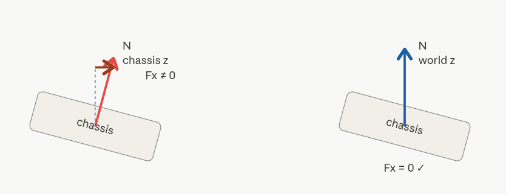

* 진동 원인 분석 : compression force 가 chassis 방향으로 적용 될때의 문제점


 spring force 모델에선 맞아요. 근데 지금은 wheel kinematic override 로 wheel 을 강제로 잡고 있어서 spring 이 아니라 tire-ground normal reaction 모델

 ### Spring force 모델 (진짜 물리)

 3개의 분리된 객체 가 있어요:
Chassis — 차체. 무겁고 (1330kg) 위아래로 움직임.
Wheel — 바퀴. 가볍고 (35kg) chassis 와 spring 으로 연결. 독립적으로 위아래로 움직일 수 있음.
지면 — 고정.
각 객체 사이의 힘:
Chassis ↔ Wheel: spring force (F = K × compression). chassis 가 누르면 wheel 이 위로 밀려나려고 하고, spring 이 둘 사이를 잡아줌.
Wheel ↔ 지면: contact force (지면 normal 방향). 지면이 wheel 을 위로 받쳐줌.

* 지면 normal force 는 wheel 만 받음 (chassis 에 직접 안 옴)
* chassis 에 오는 건 spring force 뿐 (방향 = chassis z)

### Wheel Kinematics Model(Raycaster suspension)
> 그럼 왜 지금 모델은 다른가?
**문제**: Wheel 이 "진짜 물체" 면 시뮬레이션이 깨짐 

Wheel 이 `collision off` 이면 힘의 중간 다리가 없음
→  어떻게 지면 reaction force 를 받죠?

**해결**
* Wheel 은 3D collision 을 꺼버림
* 대신 각 바퀴 위치에 ray 를 쏘아서 지면과 직접 닿는 거리(compression)를 계산
* 그 길이로 spring/damper force 를 계산하고 chassis 에 직접 인가

즉, 지금 구현은 
**Chassis - Spring - 지면(Ray Hit)**

으로 연결된 구조입니다.

```
chassis ━━━ 직접 ━━━ 지면
         ↑
```

    이 force 방향이 뭐여야 할까?
그러면 이 force 의 방향은 뭐가 맞나
지면 normal 방향이 맞음


#### 검증 결과

| 지표 | 수정 전 (chassis z) | 수정 후 (world z)|
|---|---|---|
| pitch (step 200)|15.74°|7.57°|
|v_horiz (step 200)|4.59 m/s|0.08 m/s|
|x 변위|+6.84 m|-0.05 m|
|F_vert horizontal|1820~2400 N|0|
|Nz_std|1.227 cm|0.046 cm|

#### 정리
이 버그의 본질은 두 가지 다른 simplification 의 가정을 한 코드 안에 섞어둔 것이었습니다.

* Wheel kinematic override 는 시뮬레이션 안정성을 위해 wheel dynamics 를 포기하는 trade-off
* 그 trade-off 를 받아들였으면 force 모델도 거기에 맞게 단순화 (tire-ground reaction) 해야 일관성 유지
* 한쪽만 단순화하고 다른 쪽은 실차 모델의 직관 (chassis up 방향) 을 그대로 두면 비물리적 동작 발생


### 가속 시 wheel omega 진동

* **현상**: 평지에서의 settling은 정상적으로 작동하지만, throttle을 가하면 **새로운 진동**이 발생합니다.
* **시뮬레이션 조건**: `throttle = 0.5`, `brake = 0`, `steer = 0` 로 10 step 가속

#### 가속 단계별 데이터
```text
step | F_x (N) | RL ω (rad/s) | RR ω (rad/s) | v_long (m/s)
-----|--------|--------------|--------------|-------------
1    | +4485  | 9.00         | 0.07         | 0.156
2    | -4341  | 8.28         | 0.80         | 0.092
3    | +6218  | 6.97         | 0.50         | 0.190
4    | +5055  | 1.72         | 0.60         | 0.265
5    | +233   | -1.7         | -0.60        | 0.270
6    | -4536  | 7.68         | 0.90         | 0.202
```
* **특징**: `F_x`가 step마다 `+6000 N ↔ -4500 N` 로 부호가 반전하고, wheel omega도 `+9 rad/s ↔ -1.7 rad/s` 사이 진동합니다. `v_long`은 단조 가속이 아니라 노이즈하게 진행합니다.

#### 진동 원인
1. **Pacejka stiffness (포화 비선형성)**
   * Pacejka 매직 포뮬러는 slip ratio `kappa`에 대해 S자 곡선을 가집니다.
   * `kappa < 0.1` : 거의 선형 (정상 동작 영역)
   * `kappa > 0.2` : 포화 (슬라이딩 영역, `F_long`이 ±μN 사이로 튐)
   * `kappa`가 peak 근처에서 `dF/dκ`가 크게 증가 → **stiff system**
2. **Zero‑Order Hold (ZOH) 가정**
   * Explicit Euler는 "현재 step의 force가 다음 step까지 일정"이라고 가정합니다.
   * 실제로는 `omega`가 변하면 force도 즉시 변하지만, 이를 무시하면 stiff 시스템에서 오버샷이 발생합니다.
3. **시간 단계 `dt`가 지나치게 큼**
   * 안정성 조건: 한 step의 `omega` 변화량 ≈ `dt·T_max / I_wheel` ≈ **3.2 rad/s**
   * 이를 `kappa` 변화량으로 환산하면 `Δkappa ≈ 2.1` (stable region인 0.1의 20배)
   * 결과: **진동 불가피** (특히 저속 `v_eff ≈ 0.5` 영역에서 심각)

#### 해결 방안 – Semi‑implicit Euler
```math
T_{fric}(\omega_{n+1}) \approx T_{fric}(\omega_n) + k_n \Delta \omega
\quad\text{where } k_n = \frac{dT_{fric}}{d\omega}=\frac{R^2}{v_{eff}}\frac{dF_{long}}{d\kappa}
```

**업데이트 식**
```math
\Delta \omega = \frac{dt\, (T_{drive} - T_{brake} - T_{fric,n})}{I_{wheel} + dt\, k_n}
\omega_{n+1} = \omega_n + \Delta \omega
```
* 차이점: 분모에 `+ dt·k_n` 항이 추가되어 **stiff 영역**에서 자동으로 step size를 축소합니다.
   * `k_n`이 클수록 분모가 커져 `Δω`가 작아지고, 진동이 억제됩니다.
   * 선형 영역(`k_n` 작음)에서는 `I_{wheel}`에 거의 영향이 없어 explicit과 동일하게 동작합니다.

#### 수학적 특성
* **A‑stable**: 어떤 `dt`에서도 발산하지 않음.
* **Implicit Euler 트레이드‑오프**
  * **안정성**: A‑stable, `dt`에 무관
  * **계산 비용**: 거의 동일 (cos, atan 호출 몇 개 추가)
  * **정확도**: 물리와 동일, 선형화 오차는 `dt²` 차수

#### Genesis Solver 와의 충돌 가능성?

> Genesis Solver는 솔버의 연산 수치 안정성을 위해 substep을 잘게 쪼개서 연산하는 방법을 쓰는데 해당 내용과 충돌하지는 않는가?

* **Genesis sub‑step과 충돌 가능성**: `Genesis`의 rigid‑body solver는 별도의 sub‑step을 사용합니다. wheel omega를 torch tensor로 관리하는 manual integration이므로, 두 시스템은 **force apply 단계**(`apply_links_external_force`)에서만 연결됩니다.
* **Implicit 업데이트**가 안정화되면 `Genesis`가 받는 force 신호가 부드러워져 **sub‑step 부담이 감소**하는 부수 효과가 있습니다.
* **Imagination 경로 동기화**: MPPI의 imagination 경로(`1_find_gt.py`에서 별도 omega 업데이트)도 동일하게 implicit으로 바꿔야 합니다. 한쪽만 바꾸면 ground‑truth와 imagination dynamics가 mismatch되어 MPPI 비용이 왜곡됩니다.

kappa 가 peak 부근에서 dF/dκ 가 매우 큼 → stiff system

2. ZOH (Zero-Order Hold) 가정
Explicit Euler 는 "현재 step 의 force 가 다음 step 까지 일정" 으로 가정. 실제로는 omega 가 변하면 force 도 즉시 변하는데, 이 변화를 무시하기 때문에 stiff system 에서 over-shoot 발생.
3. dt 가 너무 큼
안정성 조건을 분석하면:
한 step 의 omega 변화량 ≈ dt · T_max / I_wheel ≈ 3.2 rad/s
이를 kappa 변화량으로 환산: Δkappa ≈ R · Δω / v_eff ≈ 2.1

Pacejka peak 폭은 약 0.1 (stable region)
→ 한 step 이동량 (2.1) 이 stable region (0.1) 의 20 배
→ 진동 불가피
저속 (v_eff floor 0.5 에 걸리는 영역) 에서 특히 심해집니다. 고속 (v > 1 m/s) 에서는 분모가 커져 자연스럽게 안정화되는데, 가속 transient 동안에는 그 영역을 통과하는 시간이 짧지 않아 문제가 됩니다.
처방: Semi-implicit Euler
T_fric 을 omega_{n+1} (미래값) 의 함수로 다루고, omega 주위에서 1차 Taylor 전개:
T_fric(omega_{n+1}) ≈ T_fric(omega_n) + k_n · Δω
                       여기서 k_n = dT_fric/dω = (R² / v_eff) · dF_long/dκ
대입하여 정리하면:
Δω = dt · (T_drive - T_brake - T_fric_n) / (I_wheel + dt · k_n)
omega_{n+1} = omega_n + Δω
Explicit 과 차이는 분모의 + dt·k_n 한 항. 이게 stiff 영역에서 자동으로 step size 를 줄여주는 효과를 만듭니다:

Pacejka peak 근처 (k_n 큼): 분모 커짐 → Δω 작아짐 → 안 튐
선형 영역 (k_n 작음): 분모 ≈ I_wheel → explicit 과 거의 동일

수학적으로 A-stable (어떤 dt 에서도 발산 안 함).
Implicit Euler 의 트레이드오프
측면평가수치 안정성A-stable, dt 영향 받지 않음계산 비용거의 동일 (cos, atan 추가 호출 몇 개)정확도physics 동일. Linearization 오차는 dt² 차수코드 복잡도omega update 블록에 + 5줄 정도미래 유지Pacejka 수식 바뀌면 도함수도 다시 derive 필요 → docstring 으로 표시
Genesis substep 과의 충돌 우려
Genesis 의 rigid body solver 가 simplified 라 substep 으로 정확도를 보완하는 것은 사실이지만, 그것은 rigid body dynamics (chassis pos, vel, joint constraint) 영역에 해당합니다. 우리가 implicit 으로 바꾸는 wheel omega 는 별도의 torch tensor 로 관리되는 manual integration 이라 Genesis solver 와 분리되어 있습니다.
두 시스템은 매 step 의 끝에서 force apply (apply_links_external_force) 지점에서만 만나며, 이는 operator splitting 의 정상적인 사례입니다. 오히려 implicit 으로 omega update 가 안정화되면 Genesis 가 받는 force 시그널이 부드러워져서 substep 의 부담이 줄어드는 부수 효과까지 있습니다.
일관성 — Imagination 경로도 동기화
MPPI 의 imagination 경로 (1_find_gt.py 의 별도 omega update) 도 동일하게 implicit 으로 변경해야 합니다. 한쪽만 바꾸면 ground truth (env0) 와 imagination 의 dynamics 가 mismatch 되어 MPPI cost 가 왜곡됩니다. 이는 단일 source of truth 원칙 의 연장선이며, 앞서 I_WHEEL 을 URDF 에서 derive 한 것과 같은 맥락입니다.


#### 진동흐름

> F_long → chassis 에 작용하는 선형 힘 (앞/뒤로 미는 힘)
> T_fric → wheel 에 작용하는 회전 토크 (회전을 가속/감속)

* throttle 0.5 : ω 폭증 → κ 큰 양수 (sliding)
    * 하지만 1step 만에 너무 큰 w의 변화 (바퀴가 슬라이딩하며 헛돎)
* 다음 step 마찰력에 의한 전진 토크로의 변환 : T_fric > T_drive → ω 감소 (마찰이 wheel 의 과회전을 빼앗아 chassis 가속으로 전환)
    * 마찬가지로 1step(substep=10)과 python loop(1 dt) 의 오차가 큼: ω 가 너무 빨리 감소 → κ 가 다시 작아짐
    
* stable region(그립력이 잘 작동하는 구간) 통과하면서 F_long 폭증 (빨간 곡선 peak)
* 그 결과 T_fric 폭증 → ω 더 감소 (T_fric = R(tire radius) · F_long)
* stable region 반ㄴ대편으로 over-shoot → κ 음수로 → F_long 음수로 (T_net = T_drive - T_fric, T_net = R(tire radius) · F_long 음수) 
* T_fric 음수 → T_net 폭증(다시 급가속) → ω 다시 폭증


### low speed stability
4. Stability hook 으로 분리 (§6)
LowSpeedRegularizer, StaticFrictionLock 은 NUMERICAL stabilizers, 
not physical forces

For strict parameter identification or Real2Sim fitting, disable stability 
hooks so their numerical biases do not leak into your physical parameters.
우리가 단계 2.9, 2.10 에서 추가하려던 rate limiter / throttle ramp / 저속 처리가 정확히 이 hook 들의 영역이에요. 더 좋은 건 교수님 API 는 이미 production-tested 라는 것.
특히 StaticFrictionLock 이 우리 진동 문제의 진짜 처방이에요:
pythonclass StaticFrictionLock(StabilityHook):
    # When brake > brake_thr AND |v_long| < v_thr:
    #   F_long := clamp(-hold_k * v_long, ±mu_long * N)
    #   omega := 0  (forced via ctx.omega_override)
저속에서 omega 를 강제로 0 으로 잡아버리는 hook. 우리가 헤맸던 "Pacejka 가 저속에서 stiff" 문제를 완전히 우회.


2. 우리 V_sim 정체 문제 = SDK v0.5.1 의 reverted bug ★
[SDK changelog]
  v0.5.1: "revert LowSpeedRegularizer default — vehicle was stuck at rest under throttle"

[우리가 겪은 문제]
  vx +0.03 정체, throttle=1.0 줘도 안 자람

→ 같은 footgun.
→ SDK 가 이미 fix 해서 release 함 (v0.5.5).
→ disable_when_control_active=True 옵션.
3. 충격적 발견 — c_comp/c_ext 뒤바뀜
[SDK preset HJW 표준]
  c_compression = 14_000    (압축 댐핑 강함)
  c_extension   =  4_000    (신장 댐핑 약함)

[우리 ray_wheel.py]
  C_COMP =  4_000           ← 뒤바뀜!
  C_EXT  = 14_000           ← 뒤바뀜!
이게 우리 settling drift 의 진짜 원인일 수 있어요.
4. SDK 가 우리 디버깅 결과를 이미 모두 가짐
✓ Step11 메커니즘 → VisualSync
✓ Free-rolling → LowSpeedRegularizer
✓ Brake stability → brake_torque_signed
✓ World-frame z_hat → 기본
✓ Pacejka friction-circle clamp → 내장
✓ n_envs=2001 batched → 완전 지원
✓ Partial reset (MPPI 용) → physics.reset(env_ids=...)
우리가 며칠 디버깅한 모든 게 이미 SDK 에 있음.