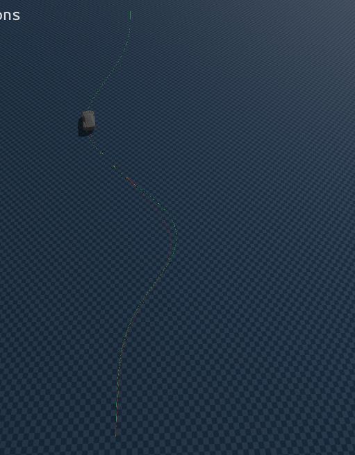

# Finding 3d terrain Golden Data for training ST mapper via MPPI

> MPPI : 강화학습의 병렬환경처럼, 병렬환경에서 1 step 만큼 미리 실행해본 뒤, cost가 낮은 결과를 샘플링하여 채택하는 `predictive path integral estimation`

how MPPI works :  [about MPPI doc](./[26-02-22]_MPPI.md)

### Golden Data optimization

MPPI 를 통해 지도학습의 정답 제어값 label 을 생성

> Reference 공간에서의 움직임을 Genesis 에서 동일한 거동을 만드는 제어값 $Throttle,Steer$를 찾은 후, 이를 지도학습의 정답 라벨로 지정

| 경로 명칭 | Blender 경로 | Genesis 주행 video | 비고 |
| - | - | - | - |
| p01 |  |  |  |
| p03 |  |  |  |
| p06 |  |  |  |
| p07 |  |  |  |
| p13 |  |  |  |
| p16 |  |  |  |
| p17 |  |  |  |
| p18 |  |  |  |
| p19 |  |  |  |
| p20 |  |  |  |

> 전체적으로 1개의 경로에 대해서 학습한 결과보다, 많은 데이터에 대해 학습한 후, 추론하는 게 결과가 좋았음

---

### 3-3. 학습하지 않은 새로운 경로 추론

> 일반화의 성능을 갖춤