# Finding 3d terrain Golden Data for training ST mapper via MPPI

> MPPI : 강화학습의 병렬환경처럼, 병렬환경에서 1 step 만큼 미리 실행해본 뒤, cost가 낮은 결과를 샘플링하여 채택하는 `predictive path integral estimation`

how MPPI works :  [about MPPI doc](./[26-02-22]_MPPI.md)

### Golden Data optimization

MPPI 를 통해 ST Mapper 학습의 정답 제어값 label 을 생성

> Reference 공간에서의 움직임을 Genesis 에서 동일한 거동을 만드는 제어값 $Throttle,Steer$를 찾은 후, 이를 지도학습의 정답 라벨로 지정

#### MPPI cost parameter

매 샘플의 점수는 horizon 20 스텝 동안 아래 항들을 모두 더한 값:

$$
cost = \sum_{h} \big[\, w_{vel}|\Delta v| + w_{heading}|\Delta\theta| + w_{dist}\cdot dist + w_{accel}|\Delta a| + w_{kappa}|\Delta\kappa| + w_{pitch}|\Delta pitch| + w_{roll}|\Delta roll| + w_{vz}|v_z| + w_{rate}|\Delta u| + w_{ff}|u - ff| \,\big]
$$

| 가중치 | 기본값 | 무슨 오차 | 단위 | 역할 |
| - | - | - | - | - |
| `w_dist`    | 6000 | reference 경로와의 거리 | m       | 경로 이탈 ← 최우선 |
| `w_heading` | 4000 | 목표 방향과의 차        | rad     | 차가 향한 방향     |
| `w_vel`     | 2500 | 목표 속도와의 차        | m/s     | 속도 추종          |
| `w_pitch`   |  800 | 목표 pitch와의 차       | rad     | 언덕 자세          |
| `w_roll`    |  600 | 목표 roll과의 차        | rad     | 좌우 기울기        |
| `w_vz`      |  250 | 수직 속도               | m/s     | z방향 vel       |
| `w_rate`    |  150 | 직전 조작과의 차        | 스무딩 | 조작 부드러움      |
| `w_kappa`   |   50 | 목표 곡률과의 차        | 1/m     | 곡률 추종          |
| `w_accel`   |    1 | 목표 가속과의 차        | m/s²    | 가속 프로파일      |
| `w_ff`      |    1 | feedforward 제어와의 차 | 정규화  | ref_csv 추종   |

### 잘못된 이해

> cost 는 $w \cdot |\text{오차}|$ 형태이고, 각 항의 **단위**와 평소 **오차 크기**가 모두 다름

실제 cost 기여량은 **`w × 그 항의 평소 오차`** 로 봐야 함.

| 항 | 가중치 | × 평소 오차 (대략) | = 실제 기여 |
| - | - | - | - |
| 속도     | 2500 | × 0.5 m/s        | ~1250 |
| 경로거리 | 6000 | × 0.2 m          | ~1200 |
| 방향     | 4000 | × 0.07 rad (4°)  |  ~280 |
| pitch    |  800 | × 0.02 rad       |   ~16 |
| 부드러움 |  150 | × 0.1            |   ~15 |
| 곡률 k    |   50 | × 0.05           |  ~2.5 |
| 가속도    |    1 | × 1 m/s²         |    ~1 |

- 방향 오차는 단위(rad)가 작아서 가중치(4000)를 크게 줘야 속도·거리와 견줄 수 있음.
- 가속 오차는 단위(m/s²) 상 숫자가 크므로 `w_accel=1` 처럼 작게 줘도 됨.

## Golden T,S result

| 경로 명칭 | Blender 경로 | Genesis 주행: 클릭시 재생 | max speed(km/h) | K (curvature) | 도로경사(°) | mean drift(m) |
| - | - | - | - | - | - | - |
| p01 | 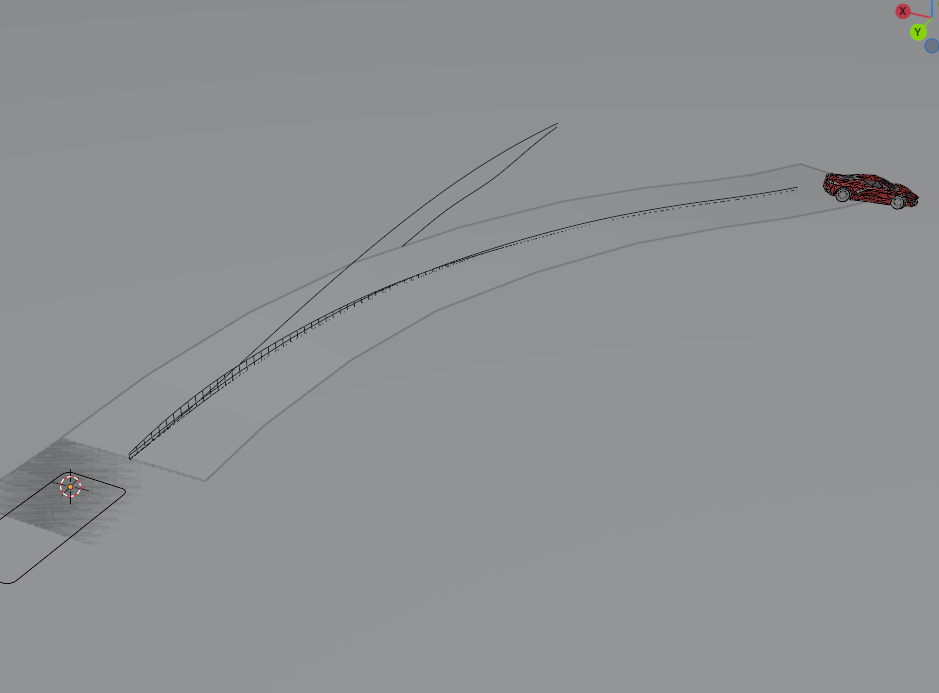 | [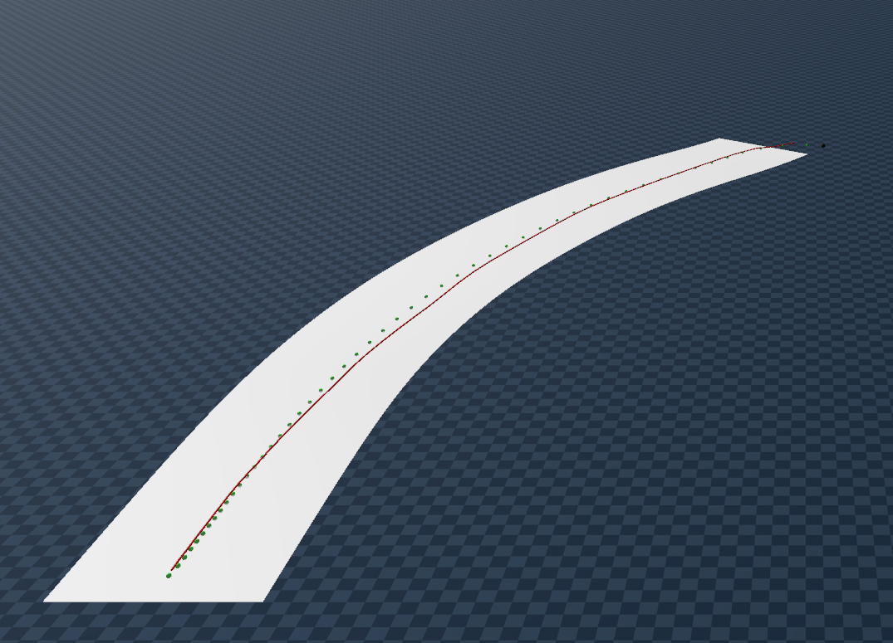](https://github.com/user-attachments/assets/add007d2-4ca6-4aec-81bd-a95e597fe928) <video src="../res_wjdaksry/0601/replay_p01.mp4" controls width="400"></video> | 31.6 km/h | 0.138 (R=7.2 m)  | 4.6° (8%)   | 0.180 m |
| p02 | 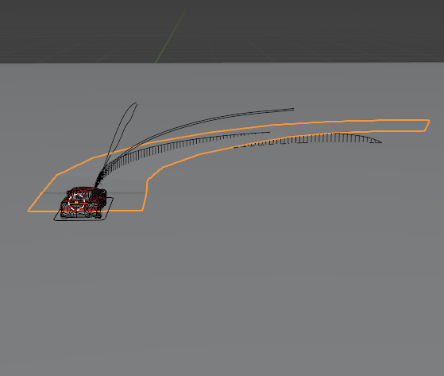 | [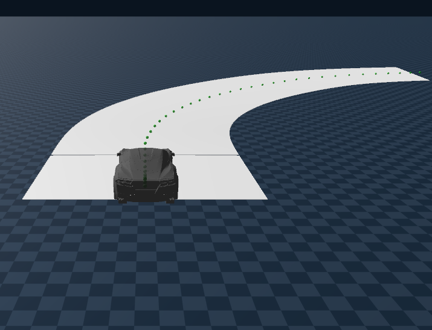](https://github.com/user-attachments/assets/add007d2-4ca6-4aec-81bd-a95e597fe928) <video src="../res_wjdaksry/0601/replay_p02.mp4" controls width="400"></video> | 24.2 km/h | 0.103 (R=9.7 m)  | 3.2° (6%)   | 0.356 m |
| p03 | 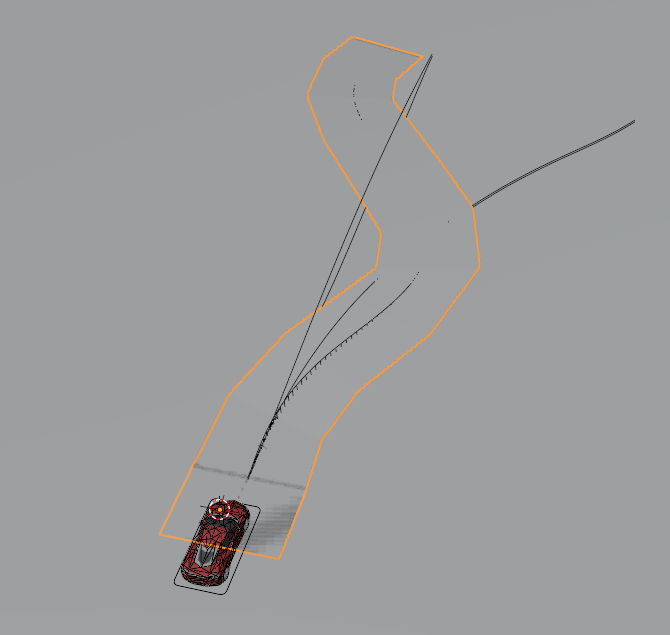 | [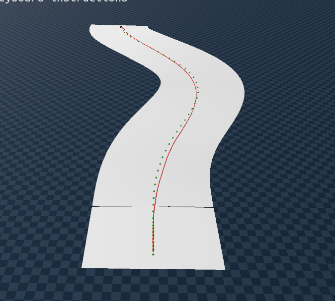](https://github.com/user-attachments/assets/b58fc322-85d6-4284-ae21-ff9d57ab3207) <video src="../res_wjdaksry/0601/replay_p03.mp4" controls width="400"></video> | 25.8 km/h | 0.117 (R=8.6 m)  | 5.7° (10%)  | 0.151 m |
| p06 | 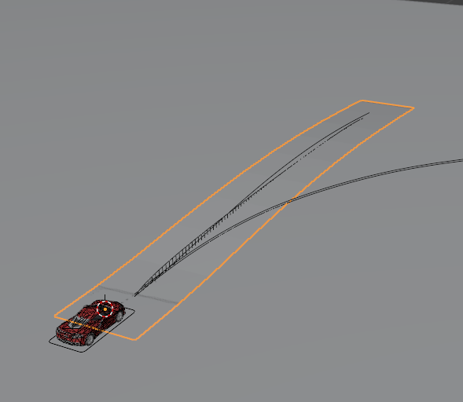 | [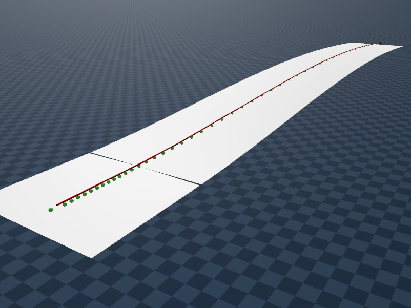](https://github.com/user-attachments/assets/b25eb7c6-d7dc-49e8-b190-6e950fe57fee) <video src="../res_wjdaksry/0601/replay_p06.mp4" controls width="400"></video> | 38.5 km/h | 0.091 (R=11.0 m) | 4.4° (8%)   | 0.048 m |
| p07 | 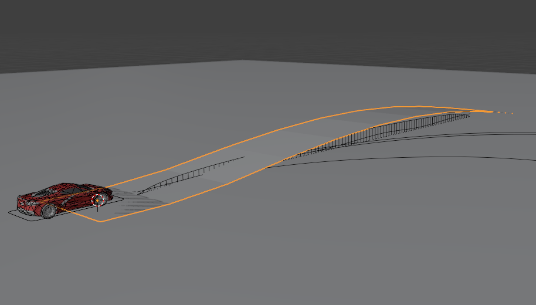 | [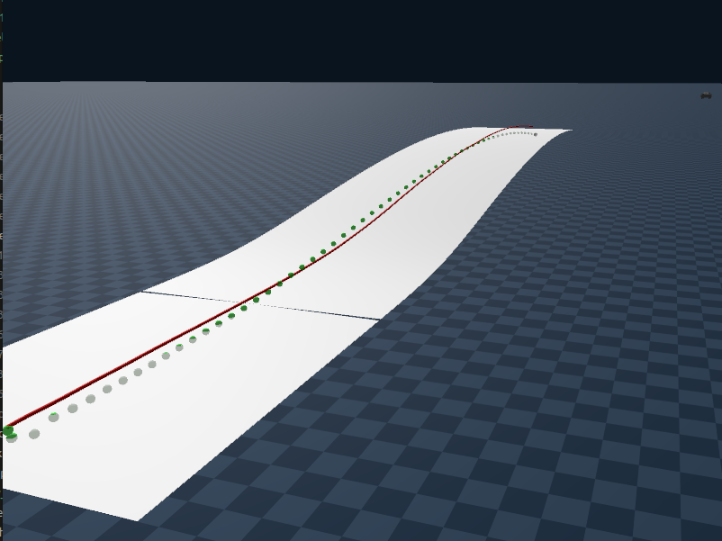](https://github.com/user-attachments/assets/2e2c3488-b06e-417c-9c61-8d8affdc454b) <video src="../res_wjdaksry/0601/replay_p07.mp4" controls width="400"></video> | 23.6 km/h | 0.074 (R=13.6 m) | 8.7° (15%)  | 0.016 m |
| p10 | 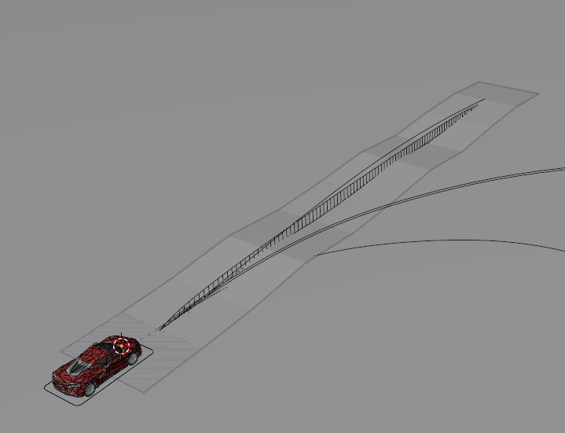 | [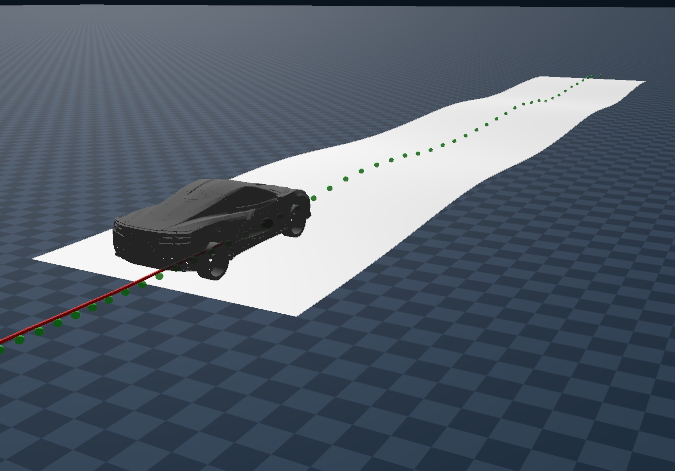](https://github.com/user-attachments/assets/3f095e93-9368-4427-a5a3-d9acbca5d144) <video src="../res_wjdaksry/0601/replay_p10.mp4" controls width="400"></video> | 31.4 km/h | 0.090 (R=11.2 m) | 7.9° (14%)  | 0.034 m |
| p13 | 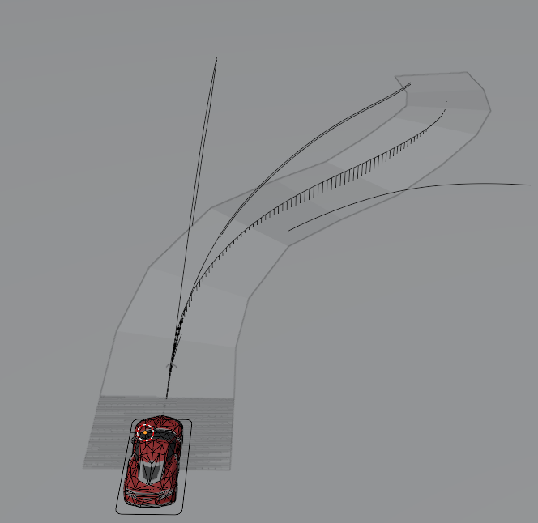 | [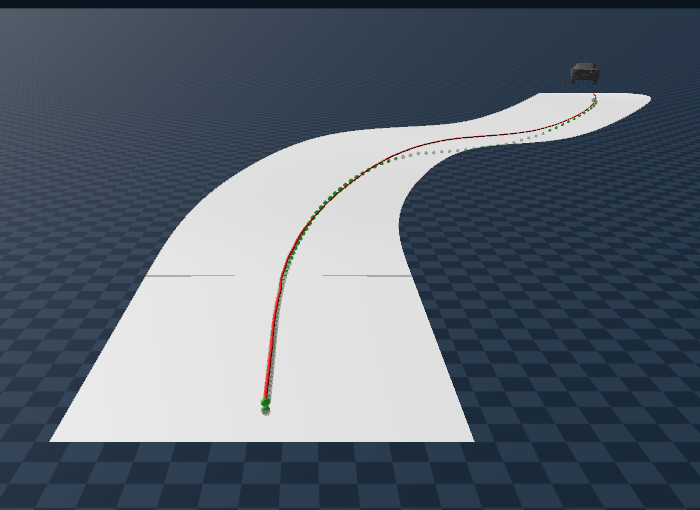](https://github.com/user-attachments/assets/e2589471-1ba7-41e7-8d8b-f271563d0793) <video src="../res_wjdaksry/0601/replay_p13.mp4" controls width="400"></video> | 15.9 km/h | 0.102 (R=9.8 m)  | 13.5° (24%) | 0.010 m |
| p15 | 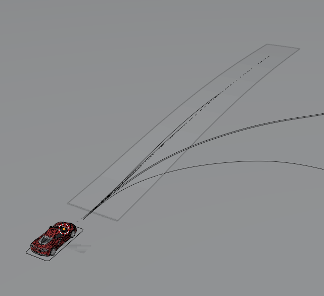 | [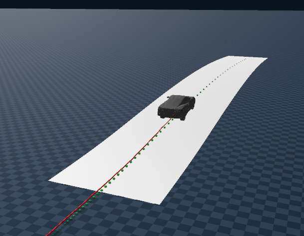](https://github.com/user-attachments/assets/8f6a04a2-8ba7-4177-a595-26090d6a9701) <video src="../res_wjdaksry/0601/replay_p15.mp4" controls width="400"></video> | 39.8 km/h | 0.064 (R=15.6 m) | 14.6° (26%) | 0.009 m |
| p16 | 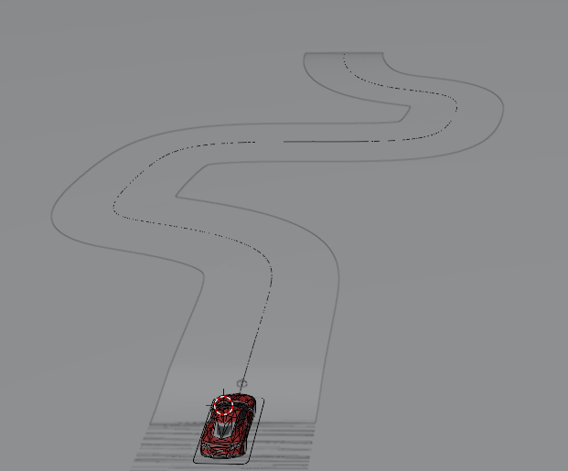 | [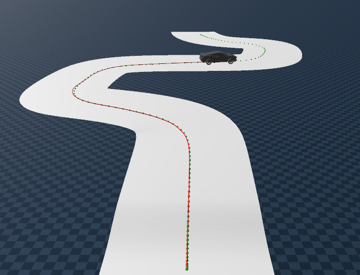](https://github.com/user-attachments/assets/74b8729c-b15e-4f9d-b587-aa07b208af0c) <video src="../res_wjdaksry/0601/replay_p16.mp4" controls width="400"></video> | 17.9 km/h | 0.255 (R=3.9 m)  | 8.4° (15%)  | 0.168 m |

---

## train

### Input Features (30 Dim)

$$\mathbf{X} = [\underbrace{ v_{current}, k_{current}}_{\text{Current State (2D)}}, \underbrace{\Delta v, CTE, HE, }_{\text{Feedback (3D)}}  \underbrace{v_{long\_bl, t+1}, k_{bl, t+1}, \dots, v_{long\_bl, t+10}, k_{bl, t+10}}_{\text{Lookahead (20D)}}]$$

| 그룹 | 피처 | 설명 |
| :--- | :--- | :--- |
| **Dynamics(current state)** | `v_current` | 현재 속도 ($v_{long\_gen}, v_{lat}$) |
| | `kappa_current` | 현재 곡률 ($k_{current\_gen}$) |
| **Genesis Feedback (FB)** | `cte` | 횡방향 거리 오차(부호 구분) (Genesis vs Blender) |
| | `he` | 횡방향 헤딩 오차 (Genesis vs Blender) |
| | `delta_v` | 속도 오차 ($v_{long\_bl} - v_{long\_gen}$) |
| **Lookahead(FF)** | `(v_long_bl, k_bl)` | 블렌더 경로 t+1 ~ t+10 스텝의 미래 정보 벡터 (20D) |

### Layers

* Linear(25, 128), ELU()
* Linear(128, 128), ELU()
* Linear(128, 64), ELU()
* Linear(64, 2), Tanh()

### Output

$$\mathbf{y} = \begin{bmatrix} T \\ S \end{bmatrix} = \begin{bmatrix} T_{golden} \\ S_{golden} \end{bmatrix}$$

* 최후 출력단에 `Tanh()`를 사용하여 Throttle, Steering 모두 `[-1, 1]` 범위로 출력

#### for model Robustness

* 좌우반전 증강 (2배)
* 노이즈 주입 (heading/cte/pitch/roll)
* StandardScaler 정규화
* trajectory 단위 train/val 분할 (80/20, 미래 정보가 선행학습 되는 temporal leakage 방지)
* 학습 방법: Adam lr=5e-4 wd=1e-3, batch=64 (wd: weight decay 가중치가 너무 커지는 것 방지)
* 조기종료: 1000 epoch, early stop(patience=80), best val 저장

## Inference

>Behavior Cloning : 학습된 모델로 Reference 공간의 움직임을 Zero shot 으로 모사하는 policy model(ST mapper)  

model(.pth) + scaler(.pkl) 로드

### input

* blender ref CSV 
* terrain mesh
* car urdf

### workflow

Per-step 루프 (매 ref frame 반복) : closed loop

| 단계 | 동작 |
| :--- | :--- |
| **1. 상태 읽기** (Genesis, Ref space)      | `pos / vel / quat` → `v_long_sim`, `kappa_sim`, `pitch_sim`, `roll_sim`, `heading_sim` |
| **2. Genesis vs Ref 피드백 계산**                     | `delta_v = v_target − v_long_sim`, `delta_heading = wrap(heading_ref − heading_sim)`, `cte = compute_cte(pos, ref경로)` |
| **3. Lookahead 정보 입력(Ref space)**             | `t+1 ~ t+10` 의 `k_target` (10) + `a_target` (10) |
| **4. 추론**                            | 미래 정보를 고려한 제어값 출력 : `model(x)` → forward 1회 → `(T_out, S_out) ∈ [-1, 1]` |
| **5. 적용**                            | `physics.step(throttle=T_out, steer=S_out × 0.7 rad)` → `scene.step()` |
| **6. 피드백 갱신**                     | 현상태를 prev 상태에 추가(state 갱신) : `T_prev ← T_out`, `S_prev ← S_out`, `prev_heading ← heading_sim` |

## 미학습 경로 추론

> 현재는 해당 경로도 학습 데이터로 사용했지만, 당시에는 `미학습 경로`

https://github.com/user-attachments/assets/584f83ea-957e-4821-ab8e-f6c0998e6b27

* **학습**: p01, p03, p06, p07 &rarr; 1,628 (증강 3,256)
* **val**: p10 &rarr; 393 lines  
* early stop at: epoch 252 (patience: 80)
* best: 170 epoch (Best Val: 0.044825)

#### epoch 에 따른 추종 변화
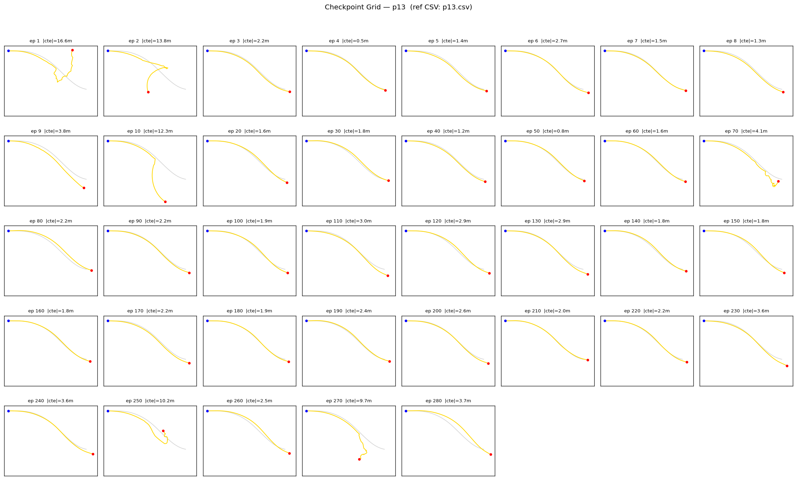

* 학습한 경로와 유사하여 빠르게 수렴

---

### next step
1. 다양한 경로 생성하여 모델 일반화 성능 향상
2. 인터페이스화 
