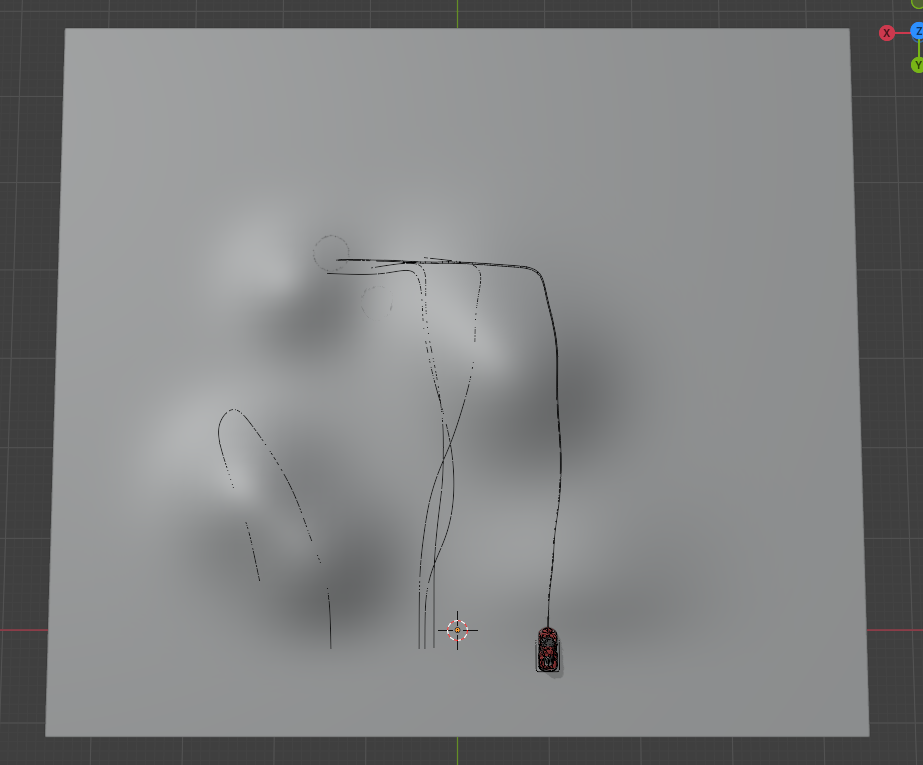
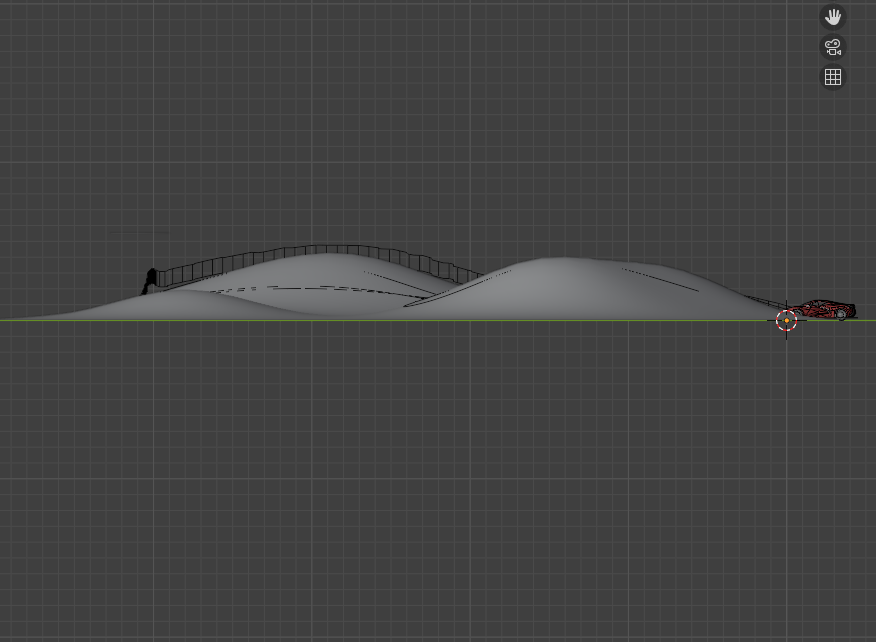
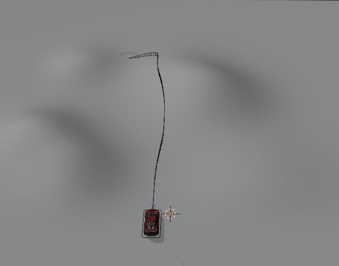
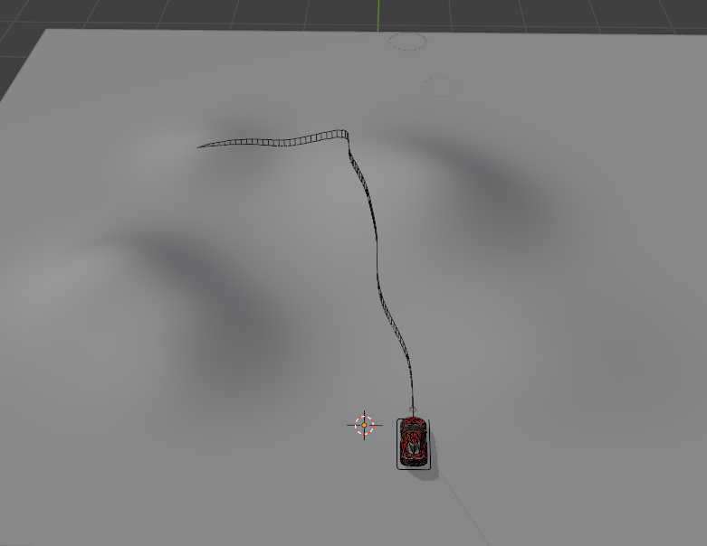
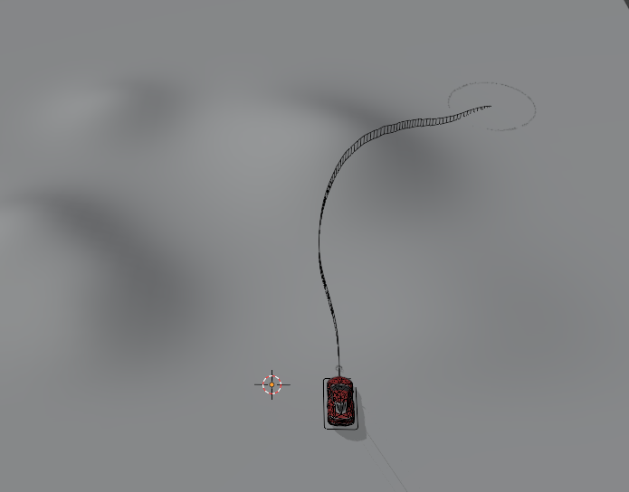
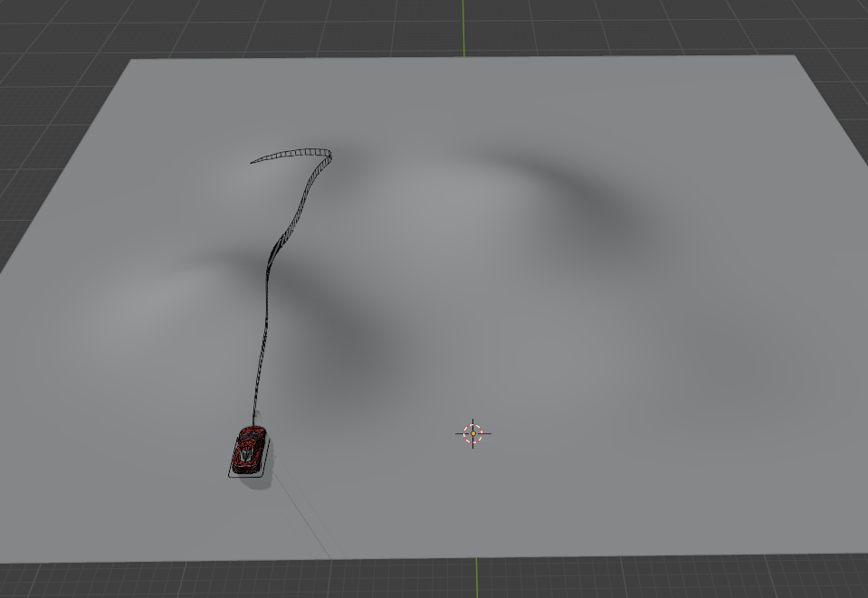
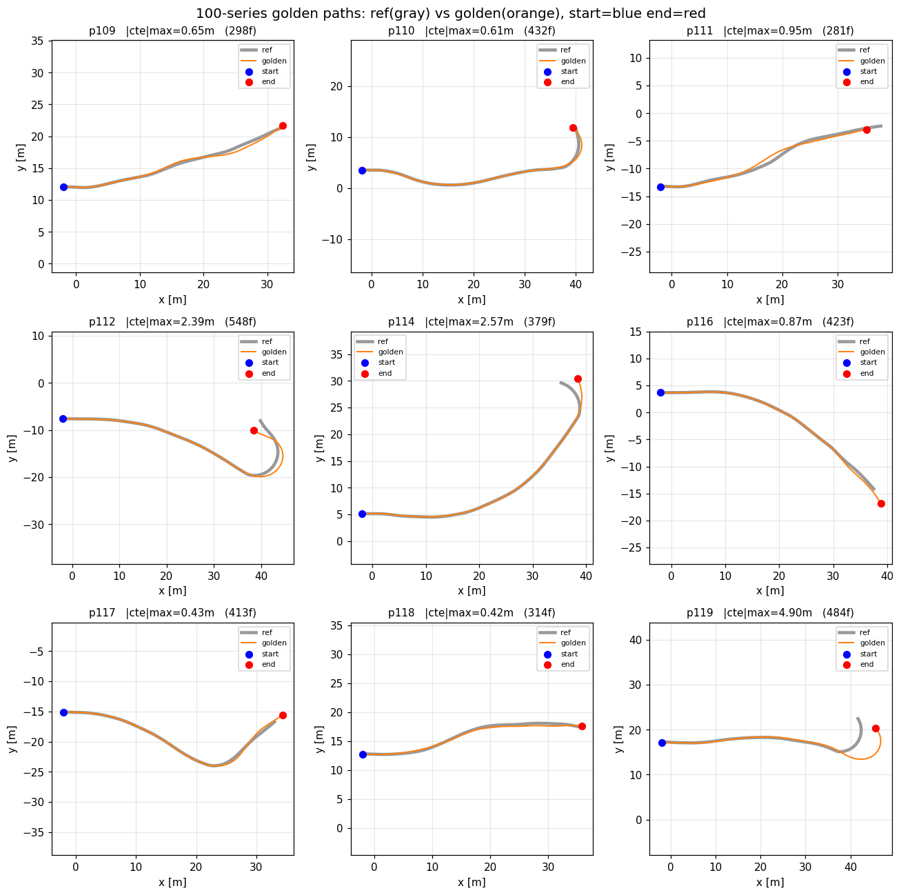
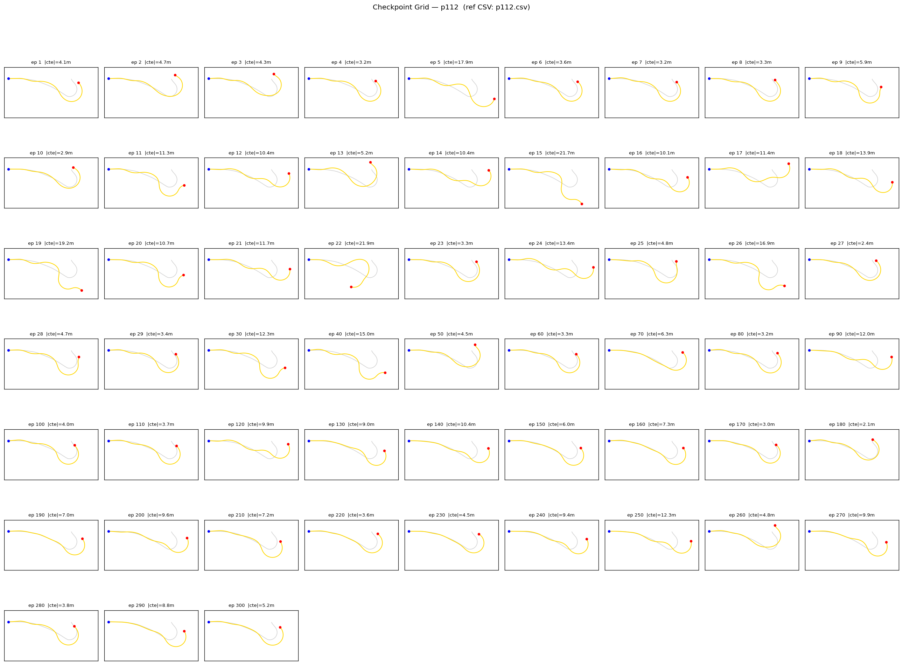
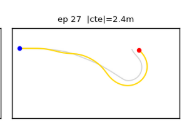

# Scaling MPPI Golden Data on a Single Terrain Mesh

### recap previous feedback
1. 하나의 terrain 에서 차량이 움직이는 $ S,T $ 로 경로 생성
2. 경로 생성 자동화

## 차량이 움직이는 경로
RBC Rig Car의 주행 모드는 딱 두 가지

1. Guide Object (목표 오브젝트 추종)
2. **Guide Path** (경로 커브 추종 : 현재 사용중)

* 둘 다 "무언가를 따라가는" 모드이고, 경로/목표 없이 스스로 주행은 불가

## 데이터 생성 파이프라인

> 하나의 terrain mesh + 여러 reference 경로 &rarr; 경로마다 MPPI 최적화 &rarr; golden $T,S$ 누적

| 단계 | 동작 | 산출물 |
| :--- | :--- | :--- |
| **1. terrain 고정** | 단일 terrain mesh 로드 | `terrain.obj` |
| **2. 경로 샘플링** | 동일 지형 위에 다수의 waypoint 경로 생성 | `p100~.csv` (N개) |
| **3. MPPI 최적화** | 경로별로 cost 최소화하는 $T,S$ 탐색 | `golden_pXX.csv` |
| **4. 주행 검증** | golden $T,S$ replay 하여 정성 평가 | replay 영상·지표 |
| **5. 데이터셋 병합** | 전 경로 golden 데이터를 학습셋으로 통합 | `dataset.parquet` |

#### terrain mesh overview

> 시드에 따라 stochastic 하게 heading perturbation 을 주어 guidepath 생성
* 지형 mesh만 바꿔주면 무한대의 경로 생성 가능(다른 지형 생성 후 진행 중)

| topview | sideview | 
| - | - | 
|  |  | 

#### seed: 20260625 경로 예시

*수집한 golden 데이터의 state-action 분포*

* 단일 terrain 이라 pitch/roll 은 한정된 범위에 모이고, **곡률·속도** 축으로 분포가 넓어짐
* 경로를 추가할수록 빈 구간(저속·고곡률 등)을 메워 학습 데이터의 coverage 향상

| | |
| - | - |
|  |  |
|  |  |

## Golden T,S result

#### 주행 영상

| 경로 명칭 | reference 경로 | Genesis 주행: 클릭시 재생 | max speed(km/h) | K (curvature) | 도로경사(°) | mean drift(m) |
| - | - | - | - | - | - | - |
| p109 |  |  <video src="../res_wjdaksry/0625/replay_p109.mp4" controls width="400"></video> | 30.0 | 0.650 | 19.5 | 0.158 |
| p110 |  |  <video src="../res_wjdaksry/0625/replay_p110.mp4" controls width="400"></video> | 26.0 | 0.263 | 11.3 | 0.091 |
| p112 |  |  <video src="../res_wjdaksry/0625/replay_p112.mp4" controls width="400"></video> | 25.5 | 0.378 | 14.1 | 0.286 |
| p114 |  |  <video src="../res_wjdaksry/0625/replay_p114.mp4" controls width="400"></video> | 35.9 | 0.227 | 14.1 | 0.127 |
| p116 |  |  <video src="../res_wjdaksry/0625/replay_p116.mp4" controls width="400"></video> | 26.1 | 0.093 | 16.0 | 0.114 |
| p117 |  |  <video src="../res_wjdaksry/0625/replay_p117.mp4" controls width="400"></video> | 22.4 | 0.226 | 10.9 | 0.081 |
| p118 |  |  <video src="../res_wjdaksry/0625/replay_p118.mp4" controls width="400"></video> | 30.2 | 0.750 | 20.4 | 0.153 |
| p119 |  |  <video src="../res_wjdaksry/0625/p119.mp4" controls width="400"></video> | 26.2 | 0.269 | 0.6 | 0.966 |
 

#### 요약 

## 데이터 학습

> p112 를 제외한 데이터 학습 후, unlearned p112 경로에 대한 추론

학습 epoch 별 경로 추론 결과 (best: epoch 27)

#### 주행 영상

https://github.com/user-attachments/assets/f491ec04-a1b1-45b5-a858-e8852ae9ccc2

---

### next step
1. DAgger 로 최적화 실패 데이터에 대한 보강
2. 다양한 데이터 일반화 모델 학습 
