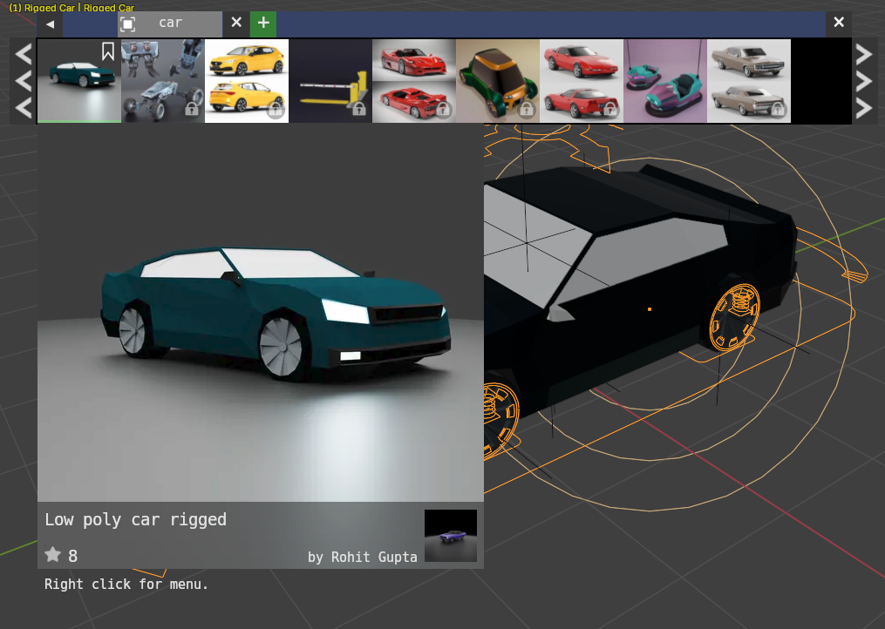
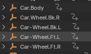
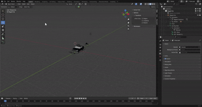

# Blender Car Rigging

   

- Low poly car rigged 사용
- body + 4 wheel 

# Blender Rigacar Wheel Bone 구조 분석

### 1. 개요
바퀴  구조에는  
`Car-Wheel.Ft.L` 과 `MCH-Wheel.rotation.Ft.L` 이라는 이름의 본이 존재한다.  
두 본은 모두 전륜(Front Left) 바퀴를 제어하지만, **역할과 계층 구조**가 다르다.  

**어떤걸 조작해야하나?**

### 2. 본 이름 구조 비교

| 구분 | 본 이름 | 역할 | 조작 여부 | 설명 |
|------|----------|--------|-------------|------|
| **컨트롤 본 (Control Bone)** | `Car-Wheel.Ft.L` | 사용자가 직접 조작하는 주 본 | O | 자동차의 실제 바퀴를 나타내며, 메시(mesh)가 따라다닌다. Path Animation이나 키프레임 설정 시 이 본을 조작한다. |
| **메커니즘 본 (Mechanism Bone)** | `MCH-Wheel.rotation.Ft.L` | 내부 계산 및 제약 처리용 보조 본 | X  | 자동 회전, 서스펜션 반동, 거리-회전 동기화 등 리깅 내부 로직을 담당한다. 사용자가 직접 건드리지 않음 |

---

### 3. 본 이름 접두사별 역할 요약

| 접두사 | 의미 | 주요 역할 | 사용자가 직접 조작? | 설명 |
|---------|--------|--------------|----------------|--------|
| **DEF-** | Deform | 메시(mesh)를 실제로 변형시키는 본 | X (간접 제어) | “Skin Weight”가 연결된 본으로, 애니메이션 시 메시 표면이 이 본의 움직임에 따라 변형된다. |
| **MCH-** | Mechanism | 내부 연산/보조 제어용 본 | X | 회전 계산, 제약(Constraint), 드라이버 연산 등 내부 로직을 담당한다. |
| **ORG-** | Original | 원본 기준 위치/방향을 유지하는 본 | X | 컨트롤러(CTRL)와 메커니즘(MCH) 사이의 중간 레이어. “초기 기준점” 역할을 한다. |
| **CTRL-** | Control | 사용자가 직접 조작하는 제어 본 | O | 키프레임, 경로 애니메이션, 포즈 제어 등 직접 사용되는 본이다. (Rigacar에서는 `Car-`로 대체되는 경우 많음) |
| **Car-** | Controller (Rigacar 전용) | 자동차 각 부품의 메인 제어 본 | O | 예: `Car-Body`, `Car-Wheel.Ft.L`. 실제 운전/회전 등의 주된 컨트롤 역할. |
| **Root / Master** | 기준 본 | 전체 리그의 중심 | X | 모델 전체의 이동·회전·스케일 기준점. |

결론: MCH__ 가 아닌 **휠/차체**(car_/ctrl_) 본체를 제어    
  
  

# Car Animation
* Using Blender Animation vs Real World Constraints
## Blender Animation

* 실제 물리법칙이 아닌 애니메이션

`물리법칙 기반 움직임 구현은 어떻게?`  

---

## Blender 리그의 물리 기반 제약조건(Constraint) 설정 개념

### 1. Root는 계산에 참여하지 않는다
- `Root` 본은 리그 전체의 **좌표 기준점**이므로 **직접 물리 연산에 참여하지 않는다.**
- 즉, Root는 "세계의 원점" 역할만 하고, 실제 물리 움직임(충돌, 회전, 중력 등)은 **하위 본들(Body, Wheel 등)** 에 적용된다.

---

## 2. 물리 제약조건을 적용하는 일반 원리

| 단계 | 대상 | 적용되는 제약 / 시스템 | 설명 |
|-------|-------|----------------|--------|
| 1| **Car-Body** | `Rigid Body` (Active or Passive) | 차체 전체를 물리적으로 인식시킴. 질량, 마찰, 탄성 등 지정 |
| 2 | **Car-Wheel.Ft.L~R** | `Rigid Body` + `Hinge Constraint` | 바퀴를 차체에 회전축으로 연결. 실제 회전 가능 |
| 3 | **MCH-Wheel.rotation.Ft.L~R** | `Copy Rotation` 또는 `Driver` | 실제 바퀴 회전값을 동기화 (속도 = 주행거리 기반 자동 계산) |
| 4 | **DEF-Body, DEF-Wheel** | `Armature Deform` | 메시가 본 움직임에 따라 변형되도록 연결 |

---
- 실제 물리조건들은 MCH 에 적용

