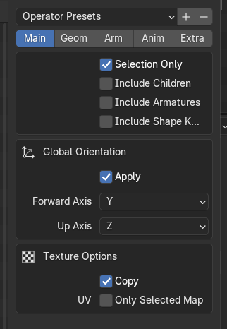
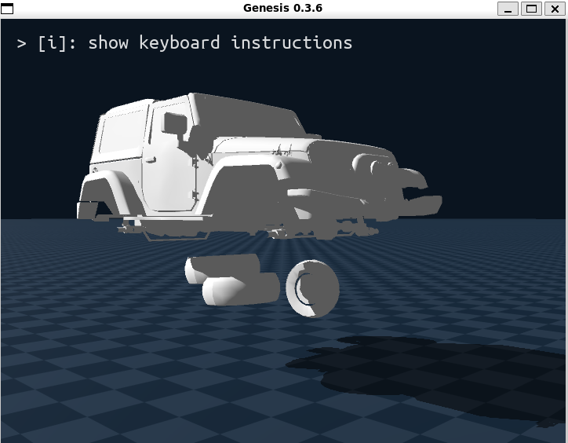

# Adjusting GenesisAI Engine to Blender

## 연구실 terrain blender 적용
[](https://github.com/user-attachments/assets/1bcbc266-c78b-4341-a654-860d5592b4b7)
* terrain: passive collision, mesh 표면
    * convex hull: 직육면체로 표현 &rarr; 단순한 계산
    * mesh: terrain 표현 하나하나를 mesh에 따라 계산 &rarr; 연산량 증가, 정교한 표현
      

## 물리 법칙 모사
Blender는 물리 엔진을 외부에 제공하지 않음
* Bullet Physics Library를 기반함(C++)
* 이를 모사하기 위해 Pybullet을 Genesis에서 사용  


### Bullet Engine 의 문제점
* Pro: Genesis에서도 동일한 움직임을 구현할 수 있다
* Con: CPU 기반 연산이기에 매우 느리고, Genesis에서 돌리는 이유가 사라진다
    * GPU 기반의 빠른 연산 & 렌더링이 필요하기에 PyBullet은 탈락 

## 직접 URDF 만들어서 엔진 학습
#### URDF 변환 하며 생긴 문제 정리
* 시도한 것: blender에서 mesh+bone을 parenting으로 연결하여 한번에 genesis에 import 하려했음  

##### 왜 다음과 같이 하면 안되는가?  

* parenting 해체 필요: Blender에서 Export 시 parenting이 되어있으면 x,y,z 위치가 부모에 종속적이어서 이상한 위치, 회전된 상태로 생성 될 수 있음
    * URDF는 절대 좌표계 기준으로만 동작, Blender의 local transform 정보를 인식하지 못함
* bone 불필요: Genesis에서 URDF안에서 joint를 정의할 수 있어서 bone은 또 다른 rigid body가 됨 &rarr; mesh 만 필요
    * Genesis는 joint로 물리 연결을 정의하기 때문에 bone은 하나의 객체로 인식함, parenting 도 설정되지 않음
* mesh (0,0,0) origin 설정: 원점으로 기본 좌표계를 설정해주지 않으면 joint origin(urdf setting)과 mesh의 offset이 이중으로 적용되어서 멀리 떨어져 생성될 수 있음


## Blender Car to Genesis
https://github.com/user-attachments/assets/1ee96045-1d38-4925-888c-2870c0f73916 

https://github.com/user-attachments/assets/ba70947a-7ed5-459c-bf7f-274ecad34938  

* 아직 미완성 상태  
* body, wheel_fl, wheel_fr, wheel_rl, wheel_rr: 5개의 dae 파일
    * dae 를 사용한 이유: Blender, Genesis 에서 geometry + transform + scale까지 완전 보존
* 모두 parenting 해제 후 (0,0,0)로 좌표 설정 후 `.dae` 로 export
* URDF에서 5개의 `.dae` 파일 읽은 후 Genesis에 로딩

#### Export 시 다음과 같은 설정을 따름

* Selection Only : 마우스 선택한 mesh 만 export
* Include children(x) : children 포함하지 않고 export
* Global Orientation : 위치, 회전, 스케일을 유지하고 export
    * apply transform은 blender 4.0 이후로 global orientation에 포함

* forward: x, up: z 설정 필요(Genesis 좌표계)
    * 수정 필요

#### 현재 오류 정리
* **car_body** : z축 기준으로 180도 회전된 상태로 생성
* **wheel** : dof 가 너무 큼, 뒷바퀴는 dof 0으로 고정 시키기기
* 좌표계 설정 x , z로 재설정해야함
* dae 파일이 URDF에 호환이 잘된다고 하여 사용했지만, 좌표계 꼬임이 많다고 함 &rarr; Export 좌표계 x,z로 변경 후에도 잘 되지않는다면 glb(직접 변환 필요), obj 포맷으로 다시 해볼 예정
    
# blender 차 파일을 Genesis에 적용하는게 오류가 너무 많아 URDF로 우선 테스트

# Genesis 에 URDF 로딩
문제: 
* 공중에 날라감
    * Plane 충돌 방지를 위해 공중 생성
    * constraints 안정되지 않았을때 suspension의 spring을 피거나 or damping이 너무 작을때 스프링에 의해 힘을 위로 받아서 날라감

## 문제 1: 바퀴 회전 축 및 구조 문제
### 문제 상황
- 바퀴가 전혀 회전하지 않음
- 뒷바퀴만 회전 조인트가 있고, 앞바퀴에는 조향 조인트만 있음
- 바퀴 회전 축이 잘못 설정됨 (Y축이 아닌 X축으로 설정되어 있었음)

### 원인
1. **회전 축 문제**: Genesis에서는 Y축(0, 1, 0) 회전이 전방 이동을 의미함 
    * x방향이 전방을 의미 &rarr; y축 방향의 회전이 들어가야 바퀴가 굴러감
    * x축을 돌려서 차가 움직이지 않았음
2. **앞바퀴 회전 조인트 부재**: 앞바퀴에 회전 조인트가 없어서 바퀴가 회전하지 않음
3. **조인트 구조 문제**: 조향과 회전이 하나의 조인트로 결합되어 있음

### 해결 방법
1. 모든 바퀴에 회전 조인트 추가 (Y축 회전)
2. 앞바퀴에 조향 링크 추가하여 조향과 회전 분리
3. 바퀴 회전 조인트를 `continuous` 타입으로 설정
#### 변경된 구조
```
기존: car_body → susp → wheel (조향만 가능)
수정: car_body → susp → steer_link → wheel (조향 + 회전 모두 가능)
```
  
## 문제 2: 차량이 하늘로 솟구치는 문제

### 문제 상황
- 차량이 스폰될 때 하늘로 솟구침
- 초기 위치가 너무 높게 설정되어 있거나, 바퀴가 지면과 겹침
### 원인
1. **초기 위치 계산 오류**: 차체 중심 위치와 바퀴 위치 관계를 정확히 계산하지 못함
2. **바퀴-지면 간섭**: 바퀴가 지면 아래로 들어가서 물리 엔진이 튕김
3. **서스펜션 조인트 범위**: 서스펜션 조인트의 limit이 넓어서 불안정함

### 영향
- 차량이 안정적으로 스폰됨
- 하늘로 살짝 솟구침 (서스펜션 확인을 위해)
- 바퀴가 지면에 안정적으로 닿음

## 문제 3: 서스펜션 튕김 및 뒤집힘 문제

### 문제 상황
- 서스펜션이 튕겨서 차량이 뒤로 뒤집어짐
- 서스펜션 조인트가 너무 자유롭게 움직임

### 원인
1. **서스펜션 링크 질량**: 5.0kg으로 너무 무거워서 불안정
2. **서스펜션 조인트 범위**: -0.15 ~ 0.15로 너무 넓음
3. **서스펜션 조인트 타입**: `prismatic` 타입이 damping이 없어서 튕김
    * `prismatic` 은 축 고정 &rarr; z축으로만 서스펜션이 작동
    * damping 은 충격을 흡수하여 진동을 줄이는 힘(저항) 

### 해결 방법
1. 서스펜션 조인트를 `fixed` 타입으로 변경 (test용)
2. `prismatic`을 z축 고정?

#### 실제 자동차 구조
```
실제 자동차:
┌─────────────┐
│   차체      │
└──────┬──────┘
       │
    [스프링] ← 탄성 (진동)
       │
    [댐퍼]   ← 댐핑 (진동 감쇠) ← 이게 없으면 튕김!
       │
    [바퀴]
```

### test 영상

[](https://github.com/user-attachments/assets/6556f3a5-b75f-49a8-a252-b733c86edb08)
* 직진, 우회전

------

# Blender dae 파일 적용
**dae export 설정(genesis 좌표계와 일치)** 
* forward : x축
* up : z축 
URDF 파일에 각각 파일 로딩
wheel_fl: car_parts/wheel_fl.dae
wheel_fr: car_parts/wheel_fr.dae
wheel_rl: car_parts/wheel_rl.dae
wheel_rr: car_parts/wheel_rr.dae  

`<geometry> ~ </geometry>` 부분을 직접 설정 &rarr; dae 파일
```
<geometry>
<mesh filename="car_parts/car_body.dae"/>
</geometry>
```
#### Collision: car_parts/car_body.dae (기존 box)로 설정하고 test

아래와 같이 나옴
* 일단 pass


### 다음 step
```
genesis 에서 blender 데이터로 시뮬레이션 진행 
urdf 설정
terrain physics in genesis?

Real-to-Sim System Identification
(or Real2Sim Calibration)
```
1. blender data 뽑고
2. mlp를 genesis 에 추가하여 Real-to-Sim system 을 목표함
  
#### 추출 데이터

```
frame	car_x	car_y	car_z	car_yaw	car_vx	car_vy	car_vz	fl_x	fl_y	fl_z	fl_vx	fl_vy	fl_vz	fr_x	fr_y	fr_z	fr_vx	fr_vy	fr_vz	rl_x	rl_y	rl_z	rl_vx	rl_vy	rl_vz	rr_x	rr_y	rr_z	rr_vx	rr_vy	rr_vz
```

## MLP 학습
MLP를 사용하여 Genesis 물리 시뮬레이터의 파라미터를 학습하는 시스템입니다. CSV 데이터를 사용하여 실제 차량의 움직임을 모방하는 물리 파라미터를 찾습니다. 유한 차분법을 사용하여 그래디언트를 계산하고, Adam 옵티마이저로 모델을 업데이트합니다.
---
파일 크기
1. physics_model.pth (MLP 모델)
모델 구조: 입력 7 → [128, 64, 32] → 출력 7
파라미터 개수:
Linear(7, 128): 7×128 + 128(bias) = 1,024
Linear(128, 64): 128×64 + 64(bias) = 8,256
Linear(64, 32): 64×32 + 32(bias) = 2,080
Linear(32, 7): 32×7 + 7(bias) = 231
총 약 11,591개 파라미터
예상 크기:
순수 데이터: 11,591 × 4 bytes (float32) ≈ 45 KB
pickle 오버헤드 포함: 약 50–100 KB
2. best_params.npy (최적 파라미터)
데이터: 7개 float32 값
예상 크기: 약 28–100 bytes (numpy 헤더 포함)
총 저장 공간
약 50–150 KB 수준입니다. 모델이 작고 저장 오버헤드가 적습니다.

#### parameter

* data.csv : 89kb (매우 작음)
* 7개의 parameter, 250프레임의 크기, 20 epoch 학습
* 49kb 의 checkpoint size
```
최적 파라미터:
  friction: 1.005
  car_mass: 500.770
  wheel_mass: 10.681
  kp_drive: 100.597
  kv_drive: 10.629
  kp_steer: 500.716
  kv_steer: 50.683
```
#### checkpoint driving 영상

[](https://github.com/user-attachments/assets/527de8cf-0bec-418e-bd65-dfa65f2ae6f3)
---

