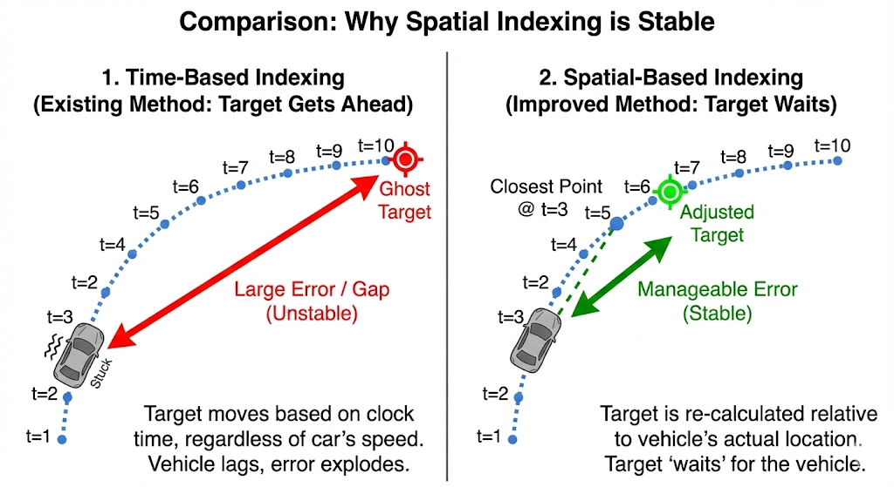
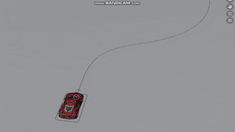
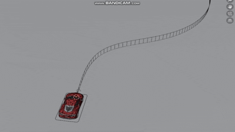
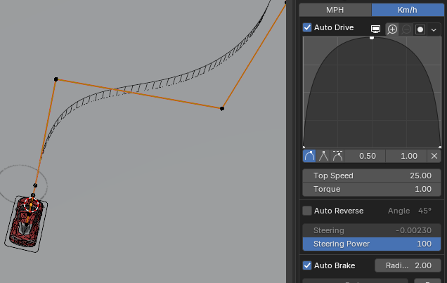
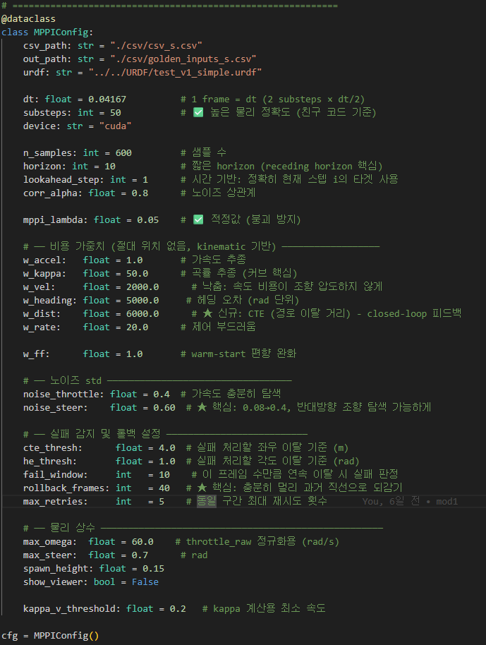
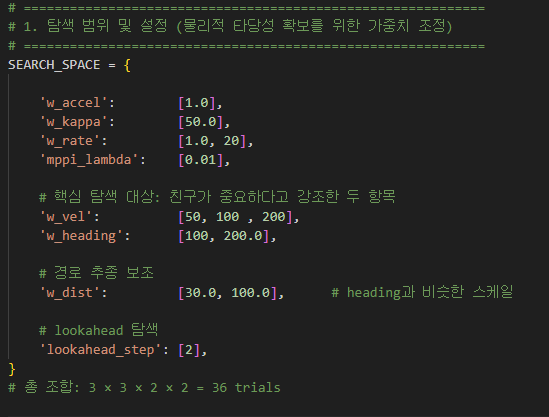

# MPPI trouble shooting & Insight

## MPPI 에서 base index 결정 : Time VS Spacial

| 상황        | **Time-based** | Spatial-based |
| --------- | ---------- | ------------- |
| 차가 느려짐    | 목표는 계속 도망  | 목표 일정 간격 유지    |
| 차가 멈춤     | 목표는 저 멀리   | 목표도 멈춤        |
| 코너에서 미끄러짐 | 오류 폭발      | 오류 제한         |
| 학습 안정성    | 매우 나쁨      | **매우 좋아짐**    |

* 초기에 차량이 blender 만큼 빠르게 가속하지 못하여 Spatial Based 인덱스를 사용
* Behavior Cloning 은 시간에 따라 같은 움직임을 해야하므로, 근본적인 해결이 되지 않음
* Time-based Index 사용해야 하는 이유

## Blender 의 급가속 TroubleShooting

| 기존  | 완만한 가속 |
| --- | --- |
|  | |

* Blender 의 애니메이션 특성때문에 가속이 200m/s^2 정도로 매우 빠르게 가속함
    * MPPI Golden Data 생성 시 데이터 오염 발생 
    * 수학적/물리적으로 Genesis 엔진에서 만들어낼 수 없는 데이터

* Blender RBC addon `Auto Drive` 기능을 사용하여 점진적인 가속
* 데이터 오염 해결

## MPPI 가중치 탐색

* MPPI는 경로마다 최적의 가중치가 다를 수 있음
    * ex: 속도가 중요하면 속도 가중치가 높고
    * ex: 곡률이 많은 경로 &rarr; $w_{dist}$와 $w_{heading}$ 을 높게 줘야함
* 하지만 `어려운 경로`(곡률이 많은 경로) 기준으로 실행하면 일반적으로 잘 따라감

### Grid-Search 를 통한 가중치 탐색(자동화)

* 파라미터를 바꿔가며 경로 별 최적의 가중치 탐색하는 방법 사용
*  `어려운 경로`를 기준으로 두고, 근처 weight를 탐색하여 Loss 가 가장 낮은 parameter 선택함