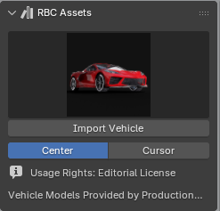
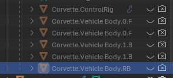
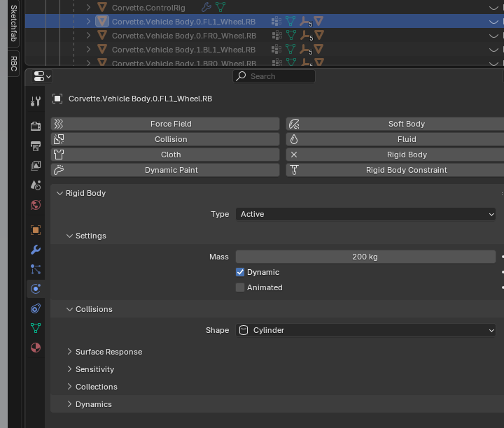
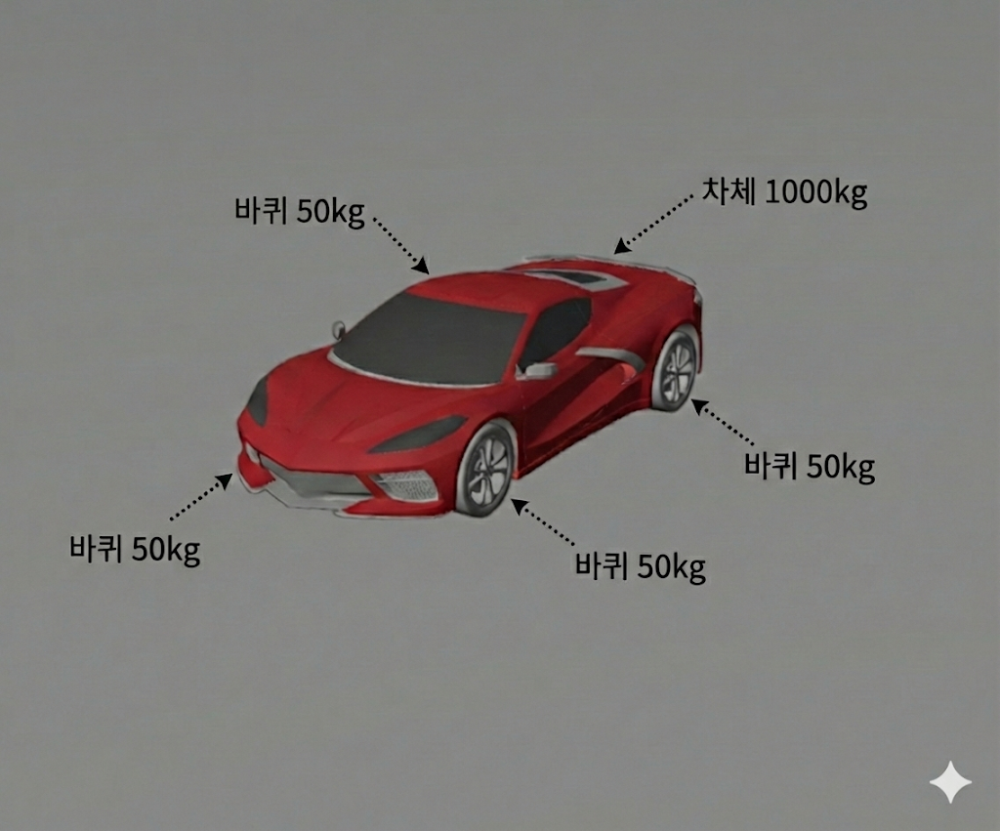
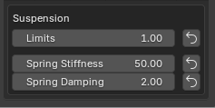
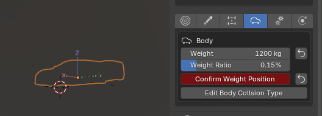
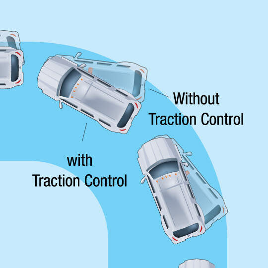
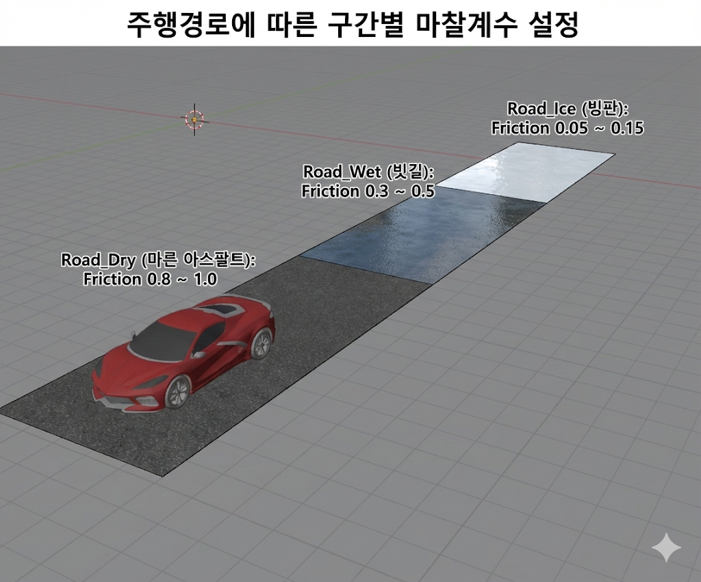
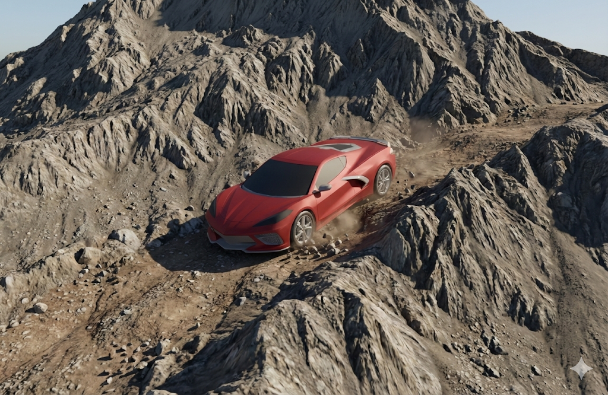
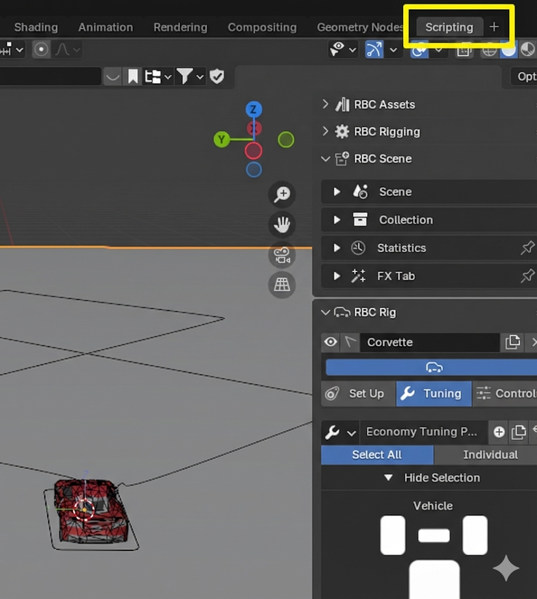

## 1. 차량 설정 (Blender)

### RBC addon rigged car
  
  


* RBC addon rigged car 사용


  
* mesh + armature &rarr; car 형상 + 차량 제어 constraints 로 구성


* bone 에 걸리는 물리력을 python script를 통해 데이터를 추출함



* 자동차 세팅 조절 (bone &rarr; constraints / physics &rarr; 세팅 변경)

## 2. 경로 설정 (Blender)
* bezier curve로 경로를 그린 뒤, path follow 클릭 후 bezier curve 선택

<video controls src="../../res/0115/car.mp4" title="Title"></video>
비디오 링크: https://drive.google.com/file/d/1iwlGOhXwCR_1VFKzuBZLOm6HuUWURWuv/view?usp=sharing 

## 3. 구동계 설정

* 바퀴:50kg * 4개
* 차체: 1000kg
* 총 : 1200kg

### wheel constraints

* 후륜 구동
* 앞바퀴 조향만

### suspension constraints

* 서스펜션 : 1 (interface 기준)
* Spring stiffness: 50 (interface 기준)
* Damping: 2(interface 기준)
### weight / inertia

* 중앙 기준
* weight ratio : 0.15%

### engine constraint

* basic(default setting)

### driving constraint

* traction control : 1 (interface 기준)
    *  바퀴 슬립을 감지해 구동 토크를 제한함으로써 접지력을 유지하는 제어 시스템
    * 마찰을 넘지 않게 토크를 관리하는 시스템
    


## 4. 주행 경로 및 마찰 계수 설정 (Variable Friction)

### 주행경로에 따로 마찰계수를 주는 방법

### 4.1) 도로를 구간별 Mesh로 분할
- 예: `Road_Dry`, `Road_Wet`, `Road_Ice`
- 방법:
  - Edit Mode → Edge 선택
  - `P` → Selection 으로 분리
  - 또는 처음부터 타일형 도로 설계

### 4.2) 각 도로 구간에 Rigid Body 설정
- Type: **Passive** (충돌 x)
- Shape: **Mesh** (입자 하나하나 계산하여 계산량은 증가하지만 정확한 계산)
- Animated: x

### 4.3) 마찰 계수 설정


1. mesh 클릭 후 우측 아래 physics properties 로 이동


2. surface response → friction 로 마찰계수를 조정 가능


#### 마찰계수 예시
| 구간 | Friction | 용도 |
|------|----------|------|
| Dry  | 0.8 ~ 1.0 | 마른 아스팔트 |
| Wet  | 0.3 ~ 0.5 | 빗길 |
| Ice  | 0.05 ~ 0.15 | 빙판 |


#### 하나의 terrain 에서 차량이 움직이는 경우

* 산악 지형: 연속적 &rarr; genesis 에서는 object 로 불러와서 terrain field 로 계산하는 것이 유리하다고 함


### 4.4) 차량 바퀴 설정
- Rigid Body: **Active**(충돌 가능)
- Shape: **Cylinder**
- Friction: **1.0**

## 5 주행 데이터 획득 방법

* scripting 으로 python 을 통한 제어 가능


* import bpy 를 해야 python이 작동함
* 우측 상단 run 버튼을 눌러 실행
* 좌측 하단 콘솔창

아래 코드를 사용하여 데이터 추출
데이터 추출 코드 링크: [data_extracter_blender](../../src/on_off_data_blender_data.py)


## 6 구현 코드 검증
* train 코드 : [train_ppo](../../src/train_ppo.py)
* inference/실행 코드 : [test_ppo](../../src/test_ppo.py)
* blender 데이터 추출 코드 : [data_extracter_blender](../../src/on_off_data_blender_data.py)


## 6.1 PPO Direct Control: MLP 구조 상세

> **목표**: 경로를 따라가는 차량의 **조향(Steer)**과 **가속/제동(Throttle/Brake)**을 MLP가 직접 출력

---

### 6.1.1 전체 파이프라인

```
┌─────────────────────────────────────────────────────────────────────────┐
│  World State (Simulation)                                               │
│  • 차량 위치, 자세, 속도, 각속도                                           │
│  • 경로 Waypoints                                                        │
└─────────────────────────────────────────────────────────────────────────┘
                                    ↓
┌─────────────────────────────────────────────────────────────────────────┐
│  Observation (18차원)                                                    │
│  • 목표점 상대좌표, 속도, 각속도, 중력, 접선방향, 슬립, 이전행동            │
└─────────────────────────────────────────────────────────────────────────┘
                                    ↓
┌─────────────────────────────────────────────────────────────────────────┐
│  Actor Network (Policy MLP)                                             │
│  FC(18→128) → ReLU → FC(128→128) → ReLU → FC(128→2)                     │
│  + log_std (learnable parameter)                                        │
└─────────────────────────────────────────────────────────────────────────┘
                                    ↓
┌─────────────────────────────────────────────────────────────────────────┐
│  Action (2차원)                                                          │
│  • accel_brake ∈ [-1, 1]: 양수=가속, 음수=제동                           │
│  • steer ∈ [-1, 1]: 양수=우회전, 음수=좌회전                              │
└─────────────────────────────────────────────────────────────────────────┘
                                    ↓
┌─────────────────────────────────────────────────────────────────────────┐
│  Physics Simulation → Reward → PPO Update                               │
└─────────────────────────────────────────────────────────────────────────┘
```

---

### 6.1.2 Input: Observation (18차원)

#### 변수 목록

| Index | 변수 | 차원 | 의미 | 좌표계 |
|:---:|:---|:---:|:---|:---|
| 0-2 | `target_rel` | 3 | 목표점 상대위치 $(x_t, y_t, z_t)$ | Body |
| 3-5 | `v_body` | 3 | 속도 $(v_x, v_y, v_z)$ | Body |
| 6-8 | `ω_body` | 3 | 각속도 $(ω_x, ω_y, ω_z)$ | Body |
| 9-11 | `g_body` | 3 | 중력 방향 $(g_x, g_y, g_z)$ | Body |
| 12-14 | `tangent_rel` | 3 | 경로 접선 방향 | Body |
| 15 | `slip_proxy` | 1 | 슬립 지표 | - |
| 16-17 | `prev_action` | 2 | 이전 행동 | - |

#### 주요 변수 수식

**목표점 상대위치** (Arc-Length Lookahead):
$$
\vec{p}_{target}^{body} = R_{car}^T \cdot (\vec{p}_{target}^{world} - \vec{p}_{car}^{world})
$$

- $s_{target} = s_{nearest} + L$ (L = 5.0m)
- target_idx = $\arg\min_i |s_i - s_{target}|$

**속도 변환**:
$$
\vec{v}_{body} = R_{car}^T \cdot \vec{v}_{world}
$$

**슬립 지표**:
$$
\text{slip} = \frac{a_{prev} - v_x}{v_{max}}
$$

---

### 6.1.3 Actor Network (Policy MLP)

#### 구조

```
Input: obs ∈ ℝ^18
        ↓
    ┌───────────────────┐
    │  Linear(18, 128)  │  W₁ ∈ ℝ^(128×18), b₁ ∈ ℝ^128
    └───────────────────┘
        ↓
    ┌───────────────────┐
    │      ReLU         │  max(0, x)
    └───────────────────┘
        ↓
    ┌───────────────────┐
    │  Linear(128, 128) │  W₂ ∈ ℝ^(128×128), b₂ ∈ ℝ^128
    └───────────────────┘
        ↓
    ┌───────────────────┐
    │      ReLU         │
    └───────────────────┘
        ↓
    ┌───────────────────┐
    │  Linear(128, 2)   │  W₃ ∈ ℝ^(2×128), b₃ ∈ ℝ^2
    └───────────────────┘
        ↓
    mean ∈ ℝ^2  (μ_throttle, μ_steer)
        +
    log_std ∈ ℝ^2  (학습 가능한 파라미터)
        ↓
    ┌───────────────────┐
    │  Gaussian Dist    │  π(a|s) = N(μ, σ²)
    └───────────────────┘
        ↓
    ┌───────────────────┐
    │      tanh         │  Squash to [-1, 1]
    └───────────────────┘
        ↓
Output: action ∈ [-1, 1]²
```

#### 수식

**Forward Pass**:
$$
\begin{align}
h_1 &= \text{ReLU}(W_1 \cdot \text{obs} + b_1) \\
h_2 &= \text{ReLU}(W_2 \cdot h_1 + b_2) \\
\mu &= W_3 \cdot h_2 + b_3 \\
\sigma &= \exp(\log\_std)
\end{align}
$$

**Action Sampling (Stochastic)**:
$$
a_{raw} \sim \mathcal{N}(\mu, \sigma^2) \\
a = \tanh(a_{raw})
$$

**Log Probability (Squashed Gaussian)**:
$$
\log \pi(a|s) = \log \mathcal{N}(a_{raw}|\mu, \sigma^2) - \sum_i \log(1 - \tanh^2(a_{raw,i}))
$$

---

### 6.1.4 Critic Network (Value MLP)

#### 구조

```
Input: obs ∈ ℝ^18
        ↓
    Linear(18, 128) → ReLU
        ↓
    Linear(128, 128) → ReLU
        ↓
    Linear(128, 1)
        ↓
Output: V(s) ∈ ℝ  (상태 가치)
```

#### 수식

$$
V(s) = W_v \cdot \text{ReLU}(W_2 \cdot \text{ReLU}(W_1 \cdot \text{obs} + b_1) + b_2) + b_v
$$

---

### 6.1.5 Output: Action (2차원)

| Index | 변수 | 범위 | 물리적 의미 |
|:---:|:---|:---:|:---|
| 0 | `accel_brake` | [-1, 1] | 가속(+) / 제동(-) |
| 1 | `steer` | [-1, 1] | 우(+) / 좌(-) 조향 |

#### Action → 물리 제어 변환

**Throttle/Brake**:
$$
\begin{align}
\tau_{engine} &= \max(a_0, 0) \cdot \tau_{max}^{engine} \\
\tau_{brake} &= \max(-a_0, 0) \cdot \tau_{max}^{brake} \\
\tau_{drive} &= \max(\tau_{engine} - \tau_{brake}, 0) \\
\omega_{target} &= \frac{\tau_{drive} / \tau_{max}^{engine} \cdot v_{target}}{r_{wheel}}
\end{align}
$$

**Steering**:
$$
\delta = a_1 \cdot \delta_{max} \quad \text{(Position Control)}
$$

---

### 6.1.6 Learning: PPO Algorithm

#### Reward Function

$$
R = \underbrace{R_{align} + 2 \cdot R_{recover}}_{\text{Steering}} + \underbrace{R_{proj} + R_{arc}}_{\text{Progress}} + R_{forward} - \underbrace{P_{steer} - P_{rate} - P_{speed} - P_{stuck}}_{\text{Penalties}}
$$

| 항목 | 수식 | 의미 |
|:---|:---|:---|
| $R_{align}$ | $\text{clamp}(y_{target} \cdot steer, -0.5, 0.5)$ | 목표 방향 조향 |
| $R_{recover}$ | $\text{clamp}(\|e_{prev}\| - \|e_{curr}\|, -0.2, 0.2)$ | 오차 감소 |
| $R_{proj}$ | $\text{clamp}(v_x \cdot t_x + v_y \cdot t_y, -0.2, 0.5)$ | 경로 방향 속도 |
| $R_{arc}$ | $\text{clamp}(s_{curr} - s_{prev}, 0, 0.5)$ | 진행 거리 |

#### PPO Update

**Advantage (GAE)**:
$$
\hat{A}_t = \sum_{l=0}^{\infty} (\gamma \lambda)^l \delta_{t+l}, \quad \delta_t = r_t + \gamma V(s_{t+1}) - V(s_t)
$$

**Policy Loss (Clipped)**:
$$
L^{CLIP} = -\mathbb{E}\left[\min\left(\frac{\pi_\theta(a|s)}{\pi_{\theta_{old}}(a|s)} \hat{A}, \text{clip}(\cdot, 1-\epsilon, 1+\epsilon) \hat{A}\right)\right]
$$

**Value Loss**:
$$
L^{VF} = \mathbb{E}\left[(V_\theta(s) - R_t)^2\right]
$$

**Total Loss**:
$$
L = L^{CLIP} + c_1 L^{VF} - c_2 H[\pi_\theta]
$$

---

### 6.1.7 파라미터 요약

| 항목 | 값 |
|:---|:---:|
| Observation Dim | 18 |
| Action Dim | 2 |
| Hidden Layers | [128, 128] |
| Activation | ReLU |
| Output Activation | tanh |
| Learning Rate | 3e-4 |
| Discount (γ) | 0.99 |
| GAE Lambda (λ) | 0.95 |
| Clip Epsilon (ε) | 0.2 |
| Entropy Coef (c₂) | 0.01 |
| Value Coef (c₁) | 0.5 |

---

### 6.1.8 도식 요약

```
┌──────────────────────────────────────────────────────────────────────────────┐
│                         PPO Direct Control Pipeline                          │
├──────────────────────────────────────────────────────────────────────────────┤
│                                                                              │
│  ┌─────────┐    ┌──────────────────┐    ┌─────────────┐    ┌──────────┐     │
│  │ World   │ →  │  Observation     │ →  │ Actor MLP   │ →  │ Action   │     │
│  │ State   │    │  (18-dim)        │    │ (128,128)   │    │ (2-dim)  │     │
│  └─────────┘    └──────────────────┘    └─────────────┘    └──────────┘     │
│       ↑                                        ↓                 ↓          │
│       │                                 ┌─────────────┐    ┌──────────┐     │
│       │                                 │ Critic MLP  │    │ Physics  │     │
│       │                                 │ → V(s)      │    │ Sim      │     │
│       │                                 └─────────────┘    └──────────┘     │
│       │                                        ↓                 ↓          │
│       │                                 ┌─────────────────────────┐         │
│       └─────────────────────────────────│      PPO Update         │         │
│                                         │  (Policy + Value Loss)  │         │
│                                         └─────────────────────────┘         │
│                                                                              │
└──────────────────────────────────────────────────────────────────────────────┘
```
---

## 6.2 보상함수 

### 6.2.1 PPO 보상 함수 설계 (`train_ppo.py`)

#### 개요

PPO Direct Control 시스템에서 사용되는 보상 함수 설계를 정리합니다.

##### 설계 철학
- **브레이크는 보상 대상이 아님**: 브레이크는 과속 페널티 및 회복 불가능 상태를 피하기 위한 수단으로 간접적으로 학습됨
- **후진은 금지 상태**: 후진 동작은 목표 행동이 아닌 무효 상태로 처리 (에피소드 종료)

---

### 6.2.2 보상 가중치 (Config)

| 변수 | 값 | 설명 |
|------|------|------|
| `w_track` | 3.0 | 횡방향 오차 (Lateral Error) |
| `w_progress` | 1.0 | 진행 보상 (v_long > 0일 때만, Projection) |
| `w_arc` | 1.0 | 절대 arc-length 진행 |
| `w_forward` | 0.3 | 전진 보상 (v_long > 0일 때만) |
| `w_steer` | 0.2 | 스티어링 크기 페널티 |
| `w_rate` | 0.1 | 스티어링 변화율 페널티 |
| `w_speed` | 0.3 | 목표 속도 초과 시 페널티 |
| `w_stuck` | 1.0 | 정체 페널티 (v_long < 0.1) |
| `w_heading` | 0.5 | Heading 오차 페널티 |

---

### 6.2.3 커리큘럼 학습 (CurriculumScheduler)

학습 초기에는 일부 보상/페널티를 비활성화하고, iteration이 진행됨에 따라 점진적으로 활성화합니다.

#### 주요 메서드

| 메서드 | 동작 |
|--------|------|
| `get_w_dir(iteration)` | 방향 보상 가중치: `0.1 → 0.3` (100 iteration에 걸쳐) |
| `get_progress_weight(iteration)` | warmup 기간(30 iter) 동안 0, 이후 1.0까지 ramp-up |
| `get_rate_weight(iteration)` | warmup 기간(30 iter) 동안 0, 이후 1.0까지 ramp-up |
| `get_brake_multiplier(iteration)` | 브레이크 토크: `0.5 → 1.0` (60 iter에 걸쳐) |

---

### 6.2.4 총 보상 함수 구조

#### `compute_total_reward_batch()` 

```
Total Reward = R_align 
             + w_recover × R_recover 
             + w_progress × R_proj 
             + w_arc × R_arc
             + w_forward × R_forward
             - w_steer × P_steer
             - w_rate × P_rate  
             - w_speed × P_speed
             - w_stuck × P_stuck
```

---

### 6.2.5 개별 보상 항목

#### 1. Alignment Reward (R_align) - 1차 조향 명령

> **"목표 방향으로 조향하라"**

```python
R_align = clamp(target_rel.y × steer, -0.5, 0.5)
```

- `target_rel.y`: Body Frame 기준 목표점의 y 좌표 (좌/우 편차)
- 목표가 왼쪽(y > 0)이면 왼쪽 조향(steer > 0) → 양의 보상
- 목표가 오른쪽(y < 0)이면 오른쪽 조향(steer < 0) → 양의 보상

#### 2. Recovery Reward (R_recover) - 2차 조향 명령

> **"횡방향 오차를 줄였는가?"**

```python
curr_lat_error = |nearest_rel.y|
R_recover = clamp(prev_lat_error - curr_lat_error, -0.2, 0.2)
```

- **가중치**: `w_recover = 2.0` (고정, 가장 중요)
- 현재 프레임에서 횡방향 오차가 감소하면 양의 보상
- `nearest_rel`: 가장 가까운 경로 지점 기준 (true cross-track error)

#### 3. Projection Reward (R_proj) - 속도/방향 기준 진행

> **"경로 접선 방향으로 이동하라"**

```python
proj_speed = v_body.x × tangent.x + v_body.y × tangent.y
R_proj = clamp(proj_speed / target_speed, -0.2, 0.5)
```

- 차량 속도를 경로 접선(tangent) 방향으로 투영
- Curriculum: 초기에는 비활성화, 점진적으로 활성화

#### 4. Arc-Length Reward (R_arc) - 절대 마일리지

> **"정지하지 말고 전진하라"**

```python
R_arc = clamp(s_curr - s_prev, 0, 0.5)
```

- `arc_length[progress_idx]`: 누적 경로 거리
- **정지 방지 핵심 보상**: 실제로 경로상에서 얼마나 진행했는지 측정

#### 5. Forward Reward (R_forward) - 전진 보조

```python
R_forward = tanh(v_long)
```

- 단순히 전진 속도에 비례하는 보조 보상
- 가중치: `w_forward = 0.3`

---

### 6.2.6 페널티 항목

#### 1. Steering Penalty (P_steer)

```python
P_steer = steer²
```
- 불필요하게 큰 조향 억제

#### 2. Rate Penalty (P_rate)

```python
P_rate = |steer - steer_prev|
```
- 급격한 조향 변화 억제 (부드러운 제어 유도)
- Curriculum: 초기에는 비활성화

#### 3. Speed Penalty (P_speed)

```python
P_speed = clamp(v_long - target_speed, 0, ∞)
```
- 목표 속도 초과 시에만 페널티

#### 4. Stuck Penalty (P_stuck)

```python
P_stuck = clamp(0.1 - v_long, 0, ∞)
```
- 속도가 0.1 m/s 미만이면 페널티 (정체 방지)

---

### 6.2.7 에피소드 종료 조건 (Done Conditions)

| 조건 | 기준 |
|------|------|
| **Goal Reached** | `target_idx >= M - 1` |
| **Off-Track** | 경로 최단 거리 > `2.0m` |
| **Reverse Motion** | `v_long < -0.3 m/s` |
| **Irrecoverable** | 횡오차 > threshold AND yaw_rate > threshold (curriculum) |
| **Timeout** | `episode_length >= 500` |

#### Irrecoverable Thresholds (Curriculum)

```python
y_max = 5.0 - 2.0 × progress    # 5.0m → 3.0m
omega_max = 3.0 - 1.0 × progress  # 3.0 rad/s → 2.0 rad/s
```
- 학습 초기에는 관대하게, 후반에는 엄격하게 적용

---

### 6.2.8 관찰 공간 (Observation) - 18차원

| 변수 | 차원 | 설명 |
|------|------|------|
| `target_rel` | 3 | Body Frame 기준 목표 waypoint 상대 위치 |
| `v_body` | 3 | Body Frame 기준 속도 (vx, vy, vz) |
| `omega_body` | 3 | Body Frame 기준 각속도 |
| `g_body` | 3 | Body Frame 기준 중력 벡터 |
| `tangent_rel` | 3 | Body Frame 기준 경로 접선 방향 |
| `slip_proxy` | 1 | 슬립 근사값 (throttle_prev - v_norm) |
| `prev_action` | 2 | 이전 액션 (throttle, steer) |

---

### 6.2.9 핵심 설계 포인트 요약

1. **2단계 조향 전략**: R_align (목표 방향) + R_recover (오차 감소)
2. **이중 진행 보상**: R_proj (속도 투영) + R_arc (절대 거리)
3. **Curriculum Learning**: warmup 기간 + 점진적 가중치 증가
4. **후진 구조적 차단**: 브레이크는 역토크 생성 불가, 후진 시 에피소드 종료
5. **Idle Creep**: 최소 속도 0.3 m/s 유지로 정지 방지

---


보상함수 구현 코드(미팅 후 보완 예정) : [reward_code](docs\tech\26_0115_reward.md)


---

## 7. Genesis Real2Sim Physics 학습 방법
(내용 작성 예정)

```
Real Data (input)
 (경로 / 마찰 / 지형)
      ↓
Parameter Mapping (AI training)
      ↓
Simulation (Genesis)
      ↓
Policy Output (by trained AI model)
 (steer / throttle)
      ↓
Real Control Interface 

```

## 필요한 데이터
* “그래서 우리가 뭘 주고, 뭘 받으면 되지?”

#### Input (from company side : 현재는 blender 대체)

1. 경로 데이터 (waypoints)

2. 환경 파라미터 (마찰, 경사, 노면 구분)

3. 차량 기본 제원 (wheelbase, limits)


#### Output (from Genesis)

1. Steering command

2. Throttle / acceleration command

3. Optional(아직 미구현): 상태 로그 (lat error, speed, slip)