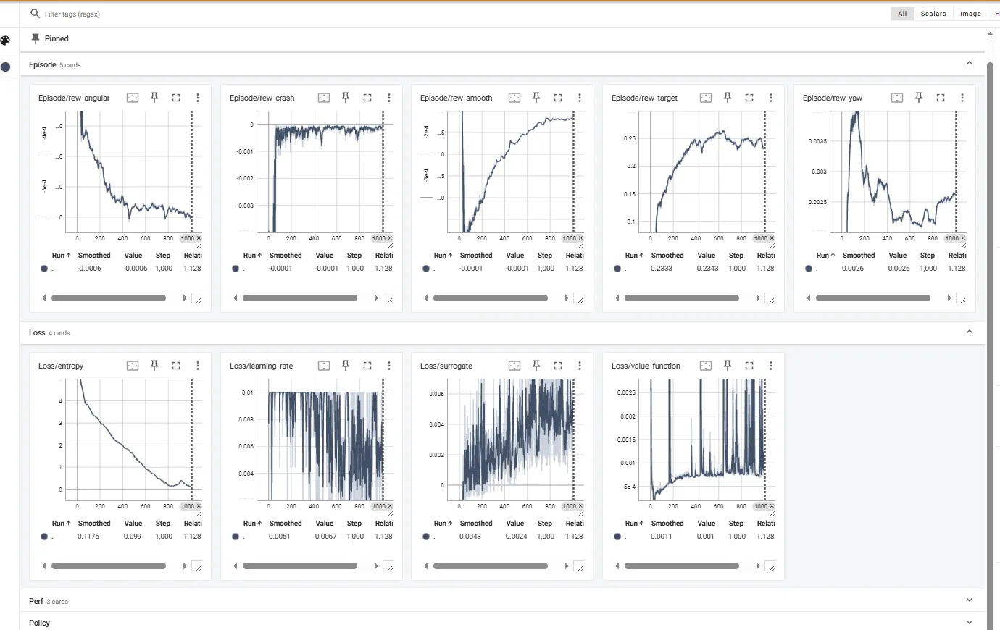
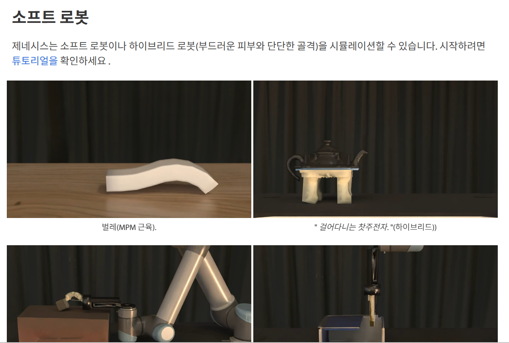
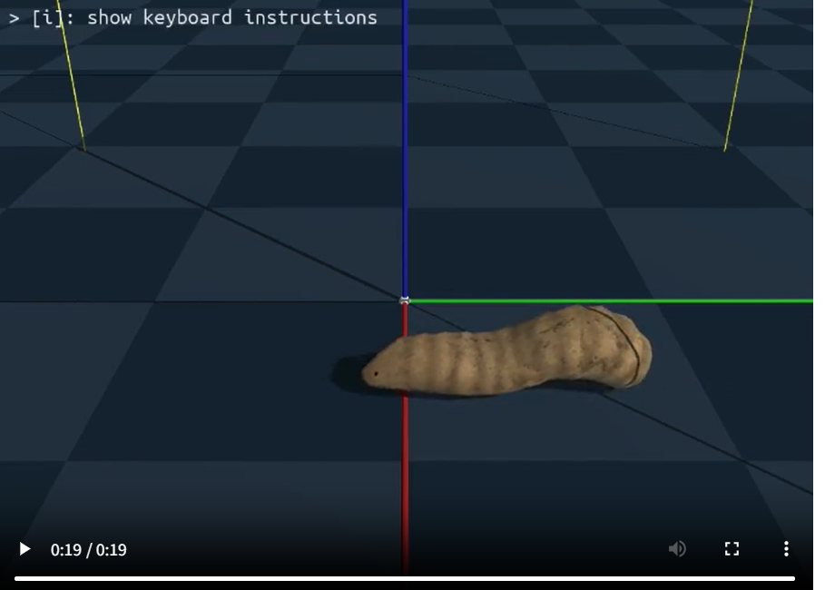

✅Todo-list
```
1. backflip.py 의 basemodel / background models 확인
2. drone.py의 checkpoint reference data 확인
3. drone.py 의 epoch/iteration을 다르게하여 움직임의 변화 확인해보기
4. 기업/기관의 ai모델중 genesis를 활용한 training 사례
```

## backflip.py의 basemodel
결론 : 없음

* 제공되는 checkpoint : backflip 만을 학습
* backflip.py → basemodel/사전학습 모델 없음.

---


## drone.py의 checkpoint reference
* drone 폴더 속 hover_train.py
* hover_env.py : 데이터 생성기
    * 드론의 현재 상태 (위치, 속도, 자세 등 → obs_cfg)
    * 환경에서 생성한 랜덤 target (command_cfg)
    * 보상 함수 계산 값 (reward_cfg)
* hover_env based training: 따라서 **reference data 없음**
* drone 모양, 배경 등은 리소스를 정의해놨음
    ```
    #드론
    self.drone = self.scene.add_entity(
    gs.morphs.Drone(file="urdf/drones/cf2x.urdf")
    )
    ```
    ```
    #배경
    self.scene.add_entity(gs.morphs.Plane())

    ```
 
    
    ### hover_env.py 주요 특징
    - **Gym-style Environment**
    - `reset()`, `step()` 메서드를 통해 학습 루프와 연동
    - **데이터셋 없음** → 환경이 직접 랜덤 target과 시뮬레이션 데이터를 생성
    - **멀티 환경 지원** → `num_envs`로 병렬 시뮬레이션 가능
    - **보상 함수와 종료 조건 내장** → 안정적 호버링 학습 가능


## drone.py 의 학습 iteration에 따른 변화

* 비디오 확인 
* iteration 0 - 1001 까지 실행
* iteration 변화에 따른 비디오 녹화
### iteration 0
[iteration 0 영상 보기](res/drone0.mp4)


### iteration 100
[iteration 100 영상 보기](res/drone100.mp4)

### iteration 450 
[iteration 450 영상 보기](res/drone450.mp4)
### iteration 1000 error
[iteration 1000error 영상 보기](res/drone1000error.mp4)
* 제대로 작동 안함

[iteration 1000 영상 보기](res/drone1000.mp4)
* 제대로 작동  

----

* 성능 그래프 코드
```
source ~/genesis_env/bin/activate
tensorboard --logdir logs/drone-hovering

http://localhost:6006/ 여기에 열림
```




## genesis.ai 를 활용한 기업 / 기관 사례
제가 찾아본 범위 내에서는, 기업/기관이 ‘Genesis’ 시뮬레이터 프레임워크를 실제로 활용해서 학습(training) 사례가 구체적으로 논문 또는 크게 공표된 사례는 아직 확인되지는 않아요.

### genesis github.io 에서 찾은 예시



https://genesis-world.readthedocs.io/en/latest/user_guide/getting_started/soft_robots.html



* 예시 찾은 줄 알았으나 이것 또한 genesis를 사용한 데이터 생성
* 학습시키는 예제가 아니였음


# 결론
1.  backflip만 학습 체크포인트가 있음
2. drone은 체크포인트는 없지만 자체 데이터 생성 + train
3. /manipulation/grasp 는 아래와 같은 이유로 실행 못했음
```
    WSL2에서 Vulkan을 사용할 때의 주요 문제는 GPU 드라이버와 Vulkan 드라이버가 완전히 호환되지 않는 경우가 있다는 점입니다. NVIDIA는 WSL2에서 GPU를 사용할 수 있도록 드라이버를 제공하지만, 그 자체로 Vulkan을 지원하는 데 제한이 있을 수 있습니다.
    ```