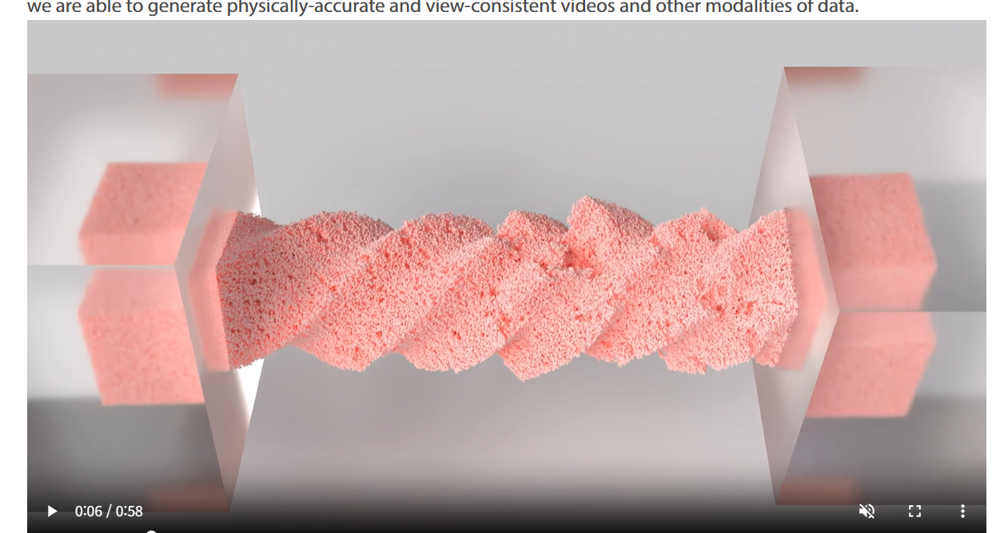
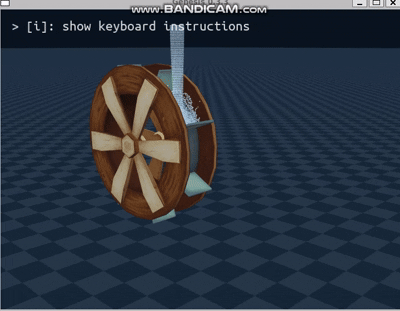
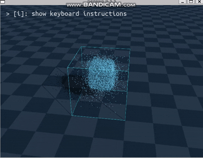

# 0918 면담 요약
### 피드백
```
sandwheel particle 간에 interaction 을 계산하는지 확인

material에 elastic파괴 등 예제

grid_density 이 뭘 의미하는지 0918genesis.md 보강

필요한 부분만 영상 캡쳐할 것
```

----
## ✅Todo-list
```
1. sandwheel particle interaction/calculate 확인

2. elastic destruction 예제 실행 / 분석

3. 0918genesis 피드백 보강


```

## Sandwheel_particle 간 상호작용 확인
```

emitter = scene.add_emitter(
    material=gs.materials.MPM.Sand(),
    max_particles=200000,
    surface=gs.surfaces.Rough(color=(1.0, 0.9, 0.6, 1.0)),
)

```

여기 `gs.materials.MPM.Sand()` 부분이 `MPM 솔버`를 사용한 sand 구현인데 솔버 연산이라 하나하나 다 계산하는게 맞음

### 입자간 상호작용 
* sand particle 각각 (질량/속도/변형상태)를 가지는 객체
* sand particle은 MPM(material point method: 입자 + 격자) 솔버로 계산되는데 particle + grid 방식으로 구현됨
  ##### 입자 + 격자 방식이란?
  * 입자 각각의 힘 + 이걸 묶어서 격자로(구역을 나눠서: 격자별로)계산 
  * step 이 끝나면 particle 객체로 물리량 return

### grid(임시계산판) 이란?
* 모래 알갱이(particle)들이 물리량을 주변 격자점에 분산함
* 그래서 각 grid node에는 “주변 입자들의 평균된 물리량”이 저장
* particle 20만개 1:1 계산이 아닌 grid 별 계산 후 각 particle에 return 
MPM 솔버의 계산 방식


## 그럼 이 상호작용 연산 때문에 느려질 수 있는가?
YES  


1. 입자 : 입자가 많을수록 → 각 step마다 P2G(particle to grid), G2P(grid to particle) 연산이 많아짐

2. Grid 해상도 (Grid Density) : 주어진 공간을 몇개의 grid로 쪼개냐  
    * grid_node마다 힘/속도 계산이 필요하기 때문에 메모리와 연산이 크게 늘어남.

3. dt(step) / substep(step을 또 나눠서 수치 안정성 확보)
    * dt(step)과 substeps가 작으면, 실제 1초를 시뮬레이션하기 위해 더 많은 step을 계산해야 합니다.

4. Constitutive model (재료 물리 모델)
    * sand 모델은 무거운 모델: elastic 보다 개별 마찰력 등 계산 할 물리량이 많음

## CPU 사용 문제


* 이유 여전히 불명

## Elastic Wheel 실행





#### 이게 없어서 다른 MPM/FEM/SPH 솔버 사용하는 예시로 대체
* 파괴 / 변형 예시 못찾아서 위치가 변하는(떨어지면서 퍼지는) 예시로 찾음
----


* SPH 솔버 사용
    * 입자 기반으로 유체를 계산
    * 압력, 점성, 외력을 입자간 상호작용으로 모델링
    * rigid 물레방아랑 충돌하여 충돌(외력), 움직임


---


* SPH 솔버
    * 떨어지며 바닥에 부딪힌 뒤(외력) 퍼짐

----


.gif)
* Rigid 솔버
    * joint, 힘(force), constraint(제약조건)
    * URDF 방식으로 불러옴 -> car_simulation도 URDF로 쓸 수 있지 않을까?? 

--- 
### URDF
* URDF: xml 기반 텍스트 파일 , 로봇의 형태, 정보들을 정의하는 파일
    * Pybullet 등 다른 시뮬레이터에서 지원
    * Genesis 는 `gs.morphs.URDF()` 같은 API로 가져올 수 있다고 함
  
